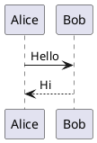
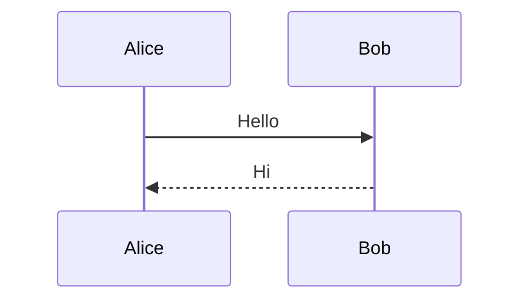

# AxonOps Documentation

Technical documentation for AxonOps, a monitoring, maintenance, and backup platform for Apache Cassandra and Kafka. Built with MkDocs and the Material theme.

## Prerequisites

### System Dependencies

The following system packages must be installed before building the documentation:

#### Python 3.x

```bash
# Ubuntu/Debian
sudo apt-get install python3 python3-pip

# macOS
brew install python3

# RHEL/CentOS
sudo yum install python3 python3-pip
```

#### Pipenv

```bash
pip3 install pipenv
```

#### PlantUML

PlantUML is required for rendering UML diagrams.

```bash
# Ubuntu/Debian
sudo apt-get install plantuml

# macOS
brew install plantuml

# RHEL/CentOS
sudo yum install plantuml
```

PlantUML also requires Java:

```bash
# Ubuntu/Debian
sudo apt-get install default-jre

# macOS
brew install openjdk

# RHEL/CentOS
sudo yum install java-11-openjdk
```

#### Graphviz

Graphviz is required for rendering graph-based diagrams.

```bash
# Ubuntu/Debian
sudo apt-get install graphviz

# macOS
brew install graphviz

# RHEL/CentOS
sudo yum install graphviz
```

## Installation

Install Python dependencies using pipenv:

```bash
make prep
```

This installs the following packages:

- **mkdocs** - Static site generator
- **mkdocs-material** - Material Design theme
- **mkdocs-material-extensions** - Additional Material theme extensions
- **mkdocs-glightbox** - Image lightbox plugin
- **mkdocs-video** - Video embedding plugin
- **pymdown-extensions** - Markdown extensions (superfences, emoji, etc.)
- **plantuml-markdown** - PlantUML diagram support
- **mkdocs-graphviz** - Graphviz diagram support
- **markdown-include** - Include external markdown files

## Usage

### Local Development Server

Start a local development server with live reload:

```bash
make serve
```

The documentation will be available at `http://localhost:8000`.

### Build Static Site

Generate static HTML files:

```bash
make build
```

Output is written to the `site/` directory.

### Deploy to GitHub Pages

Publish documentation to GitHub Pages:

```bash
make publish
```

### Without Pipenv

To run commands without pipenv (using system Python packages):

```bash
PIPENV=false make serve
PIPENV=false make build
```

## Project Structure

```
docs/                    # Documentation content (Markdown files)
├── cassandra/           # Apache Cassandra documentation
├── kafka/               # Apache Kafka documentation
├── authentication/      # SAML/LDAP authentication guides
├── cluster/             # Cluster management
├── configuration/       # Configuration guides
├── get_started/         # Getting started guides
├── installation/        # Installation procedures
├── integrations/        # Third-party integrations
├── monitoring/          # Monitoring features
├── operations/          # Operational procedures
└── pitr/                # Point-in-time restore

overrides/               # Custom theme overrides
mkdocs.yml               # MkDocs configuration
Pipfile                  # Python dependencies
Makefile                 # Build automation
```

## Configuration

The main configuration file is `mkdocs.yml`. Key settings include:

- **Theme**: Material for MkDocs with light/dark mode
- **Markdown Extensions**: Admonitions, code highlighting, tables, Mermaid diagrams
- **Plugins**: Search, video embedding, image lightbox
- **Diagram Support**: PlantUML, Graphviz, Mermaid

## Writing Documentation

### Admonitions

Use admonitions to highlight important information:

```markdown
!!! note "Title"
    Note content here.

!!! warning "Title"
    Warning content here.

!!! tip "Title"
    Tip content here.

!!! danger "Title"
    Danger content here.
```

### Diagrams

#### PlantUML

~~~markdown

~~~

#### Mermaid

~~~markdown

~~~

### Code Blocks

~~~markdown
```sql
SELECT * FROM users WHERE id = 1;
```

```yaml
key: value
nested:
  - item1
  - item2
```
~~~

## License

This documentation is proprietary content owned by AxonOps Limited. All rights reserved.
