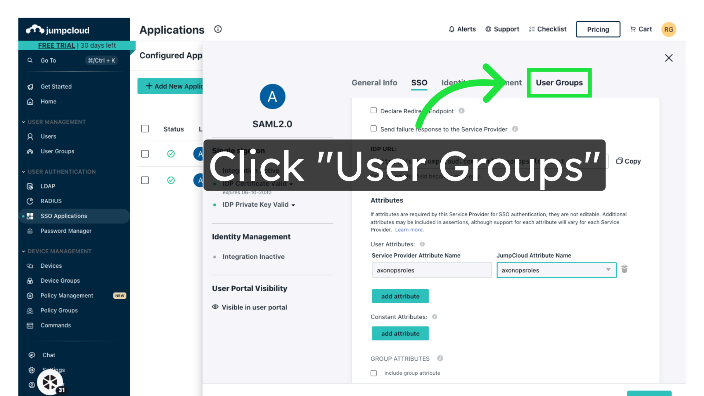

# JumpCloud SAML Configuration

### 1\. Login to JumpCloud as an administrator
Login as an administrator then go to the **SSO Applications** page

### 2\. Click "Add New Application"

Add a new application.

### 3\. Select Custom Application

### 4\. Click "Next"

Proceed to the next step.

### 5\. Click "Manage Single Sign-On (SSO)"

Access Single Sign-On settings.

### 6\. Click "Next"

Move on to the next section.

### 7\. Enter Application Name

Enter a friendly name for the application in the Display Label field

### 8\. Click "Save Application"

Save the application settings.

### 9\. Click "Configure Application"

Configure the application settings.

### 12\. Click "IdP Entity ID"

Enter the IdP Entity ID.

### 10\. Enter the IdP Entity ID

This can be any string as long as the same is used in AxonOps. We recommend setting this to `jumpcloud-axonops`.

### 11\. Enter the SP Entity ID

Enter `https://axonops.com/saml/metadata` in the **SP Entity ID** field

### 12\. Set the ACS URL

Enter `https://orgname.axonops.cloud/login-idp/callback` in the **ACS URL** field (replace `orgname` with your AxonOps organisation name)

### 13\. Click "Replace SP Certificate"

Upload the certificate you generated in the prerequisites

### 14\. Configure Assertion signing

Under the **Sign** option, select `Assertion`

### 15\. Configure user attributes

Under **User Attributes**, click "add attribute"

### 16\. Configure attribute mapping

Enter `axonopsroles` in the "Service Provider Attribute" field

Now select `Custom User or Group Attribute` and enter a custom value of `axonopsroles`

### 17\. Allow groups access to AxonOps

Access the User Groups section.

### 18\. Select groups that can access AxonOps

Tick all groups that you wish to provide access to AxonOps

### 19\. Return to the "SSO" tab

### 20\. Click "Export Metadata"

Export XML metadata from JumpCloud. You will need this to configure AxonOps.

### 21\. Click "save"

Save the changes.

## Next Steps

[Configure roles in JumpCloud](02-jumpcloud-roles.md)

[Configure SAML in AxonOps Cloud](03-axonops-saml-jumpcloud.md)
