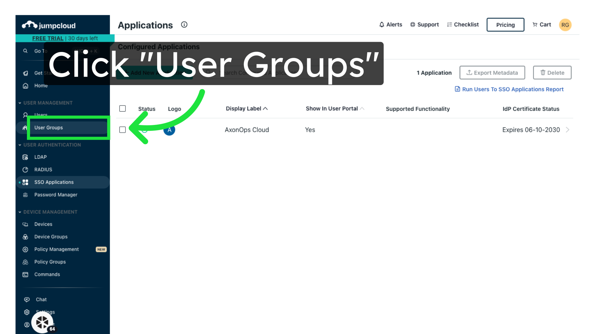
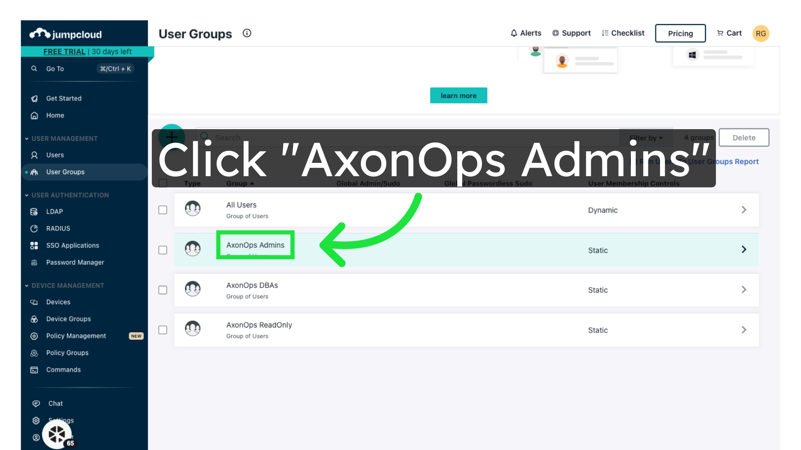
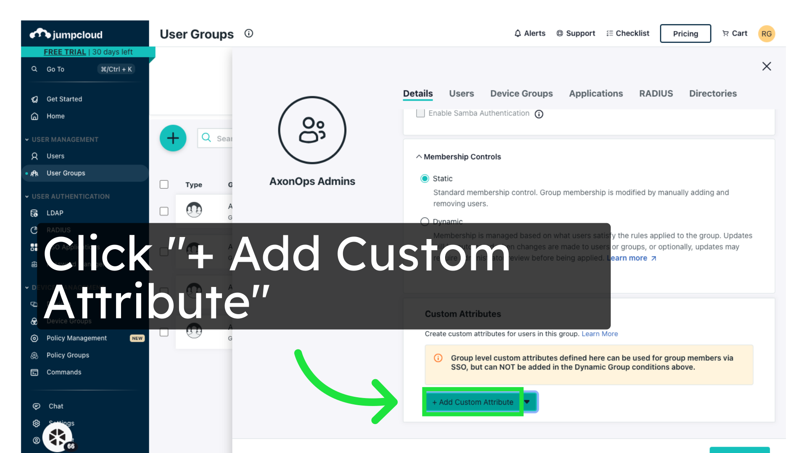
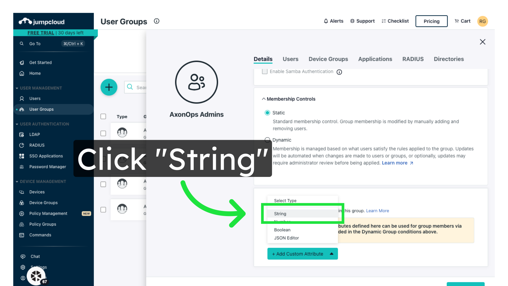
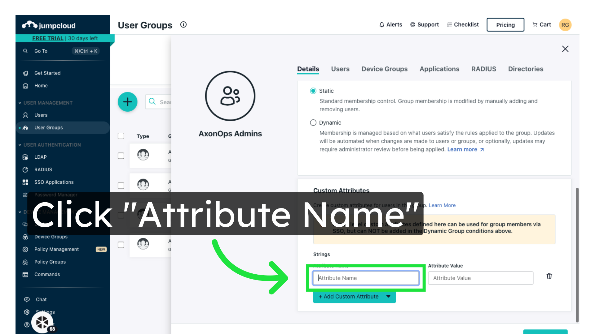
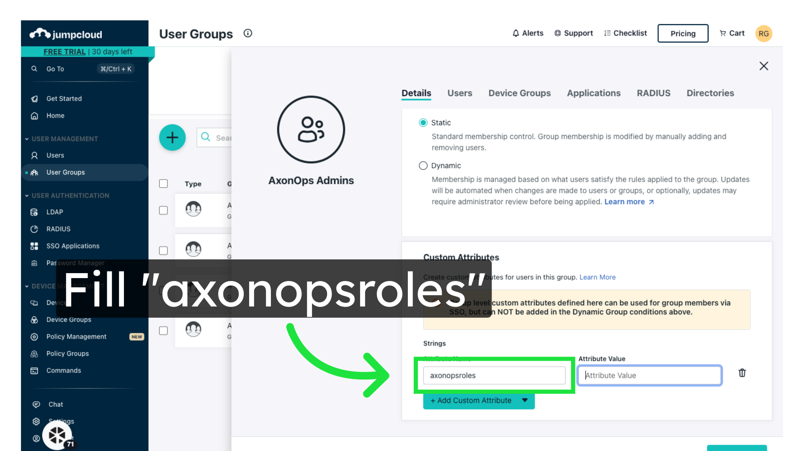
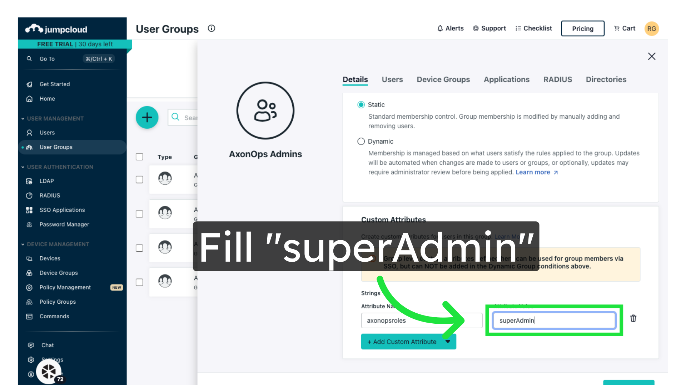
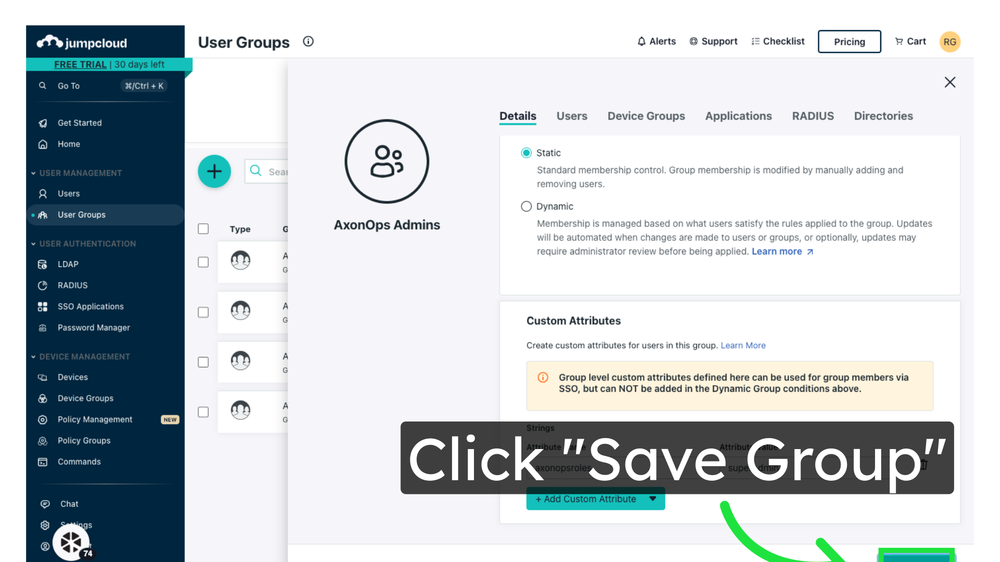

# Configuring AxonOps Roles in JumpCloud

The permissions granted to each user are controlled by a custom group attribute named `axonopsroles`.
The `axonopsroles` attribute can contain a single role or a comma-separated list of roles which will
be assigned to all members of the group.

Global roles that can be assigned to AxonOps users:
- `superAdmin`
- `dba`
- `readonly`

Finer-grained access can be controlled by cluster type or individual cluster, for example:
- `orgname/cassandra/dba` This would give DBA-level access to all Cassandra clusters
- `orgname/kafka/readonly` This would give read-only access to all Kafka clusters
- `orgname/cassandra/cluster1/readonly` This would allow read-only access to Cassandra cluster `cluster1` only.

> replace `orgname` in these examples with your AxonOps organisation.

### 1\. Click "User Groups"

Access the User Groups section.

### 2\. Open a group
The group name could be anything, "AxonOps Admins" is only an example here

### 3\. Click "+ Add Custom Attribute"

Add a custom attribute.

### 4\. Select "String"

Select the data type.

### 5\. Click "Attribute Name"

Enter the attribute name.

### 6\. Enter "axonopsroles"

### 7\. Enter AxonOps roles for the group

Enter the AxonOps role(s) to assign to the members of this group. This could be a single
role or a comma-separated list. See above for allowed values.

### 8\. Click "Save Group"

Save the group settings.

### 9\. Repeat the above steps to configure the roles for other groups

## Next Steps

[Configure SAML in AxonOps Cloud](03-axonops-saml-jumpcloud.md)
