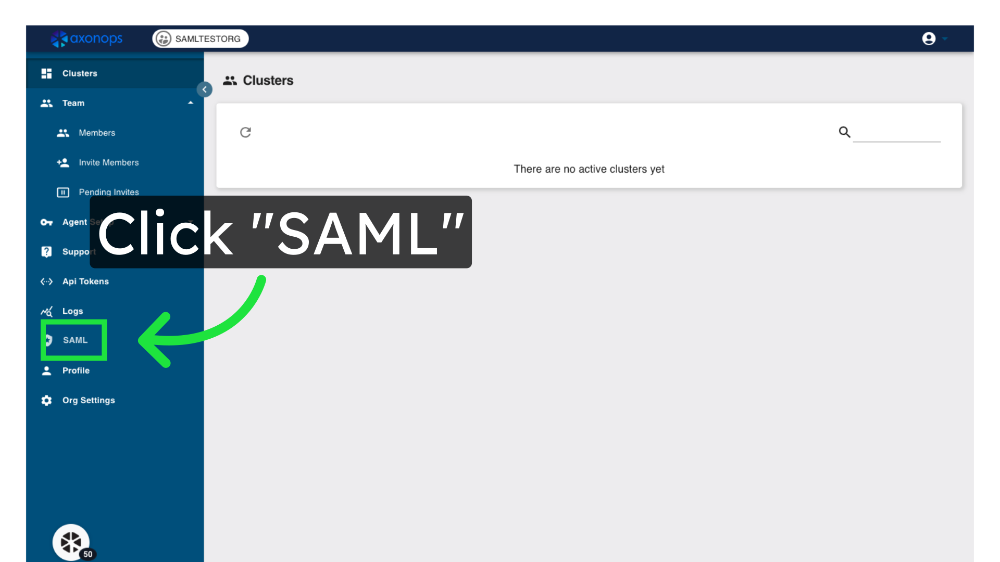
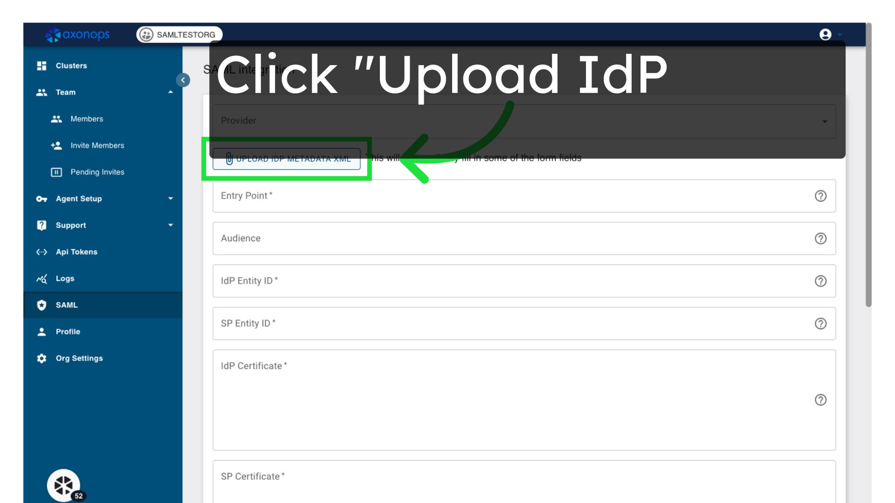
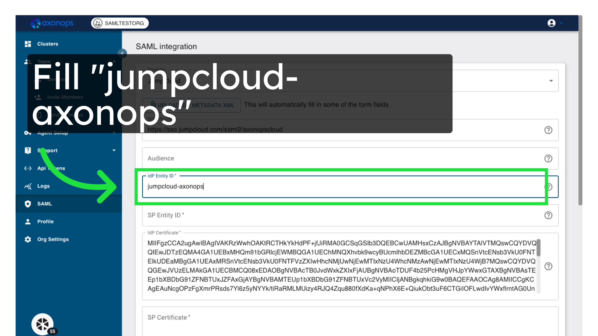
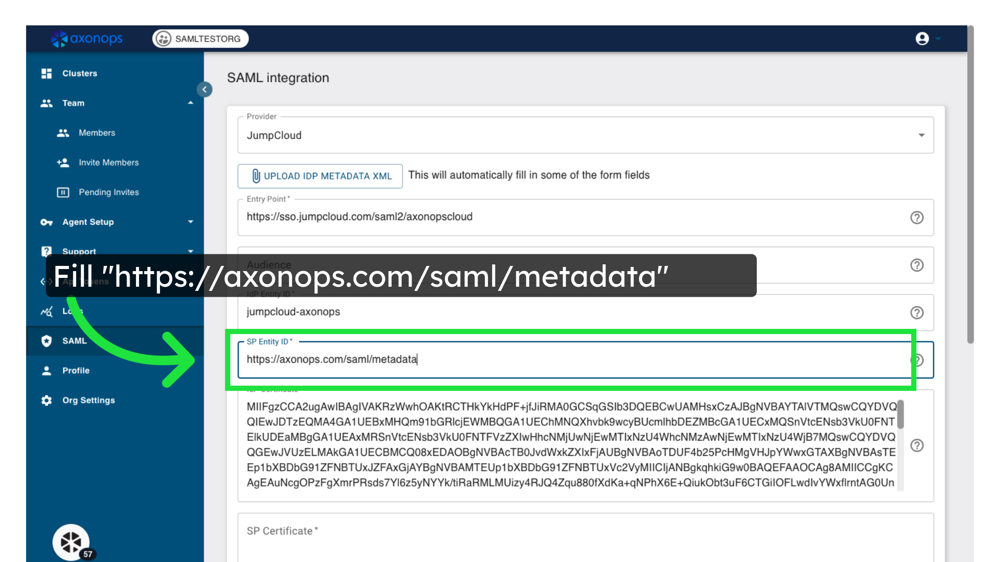
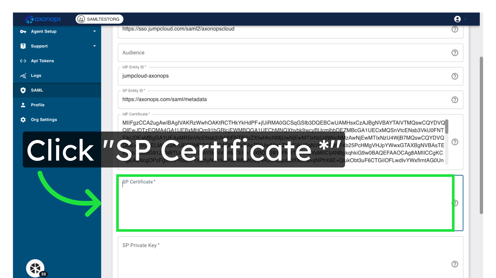
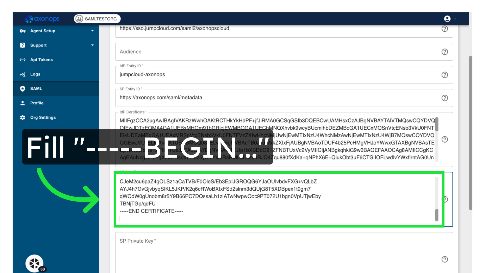
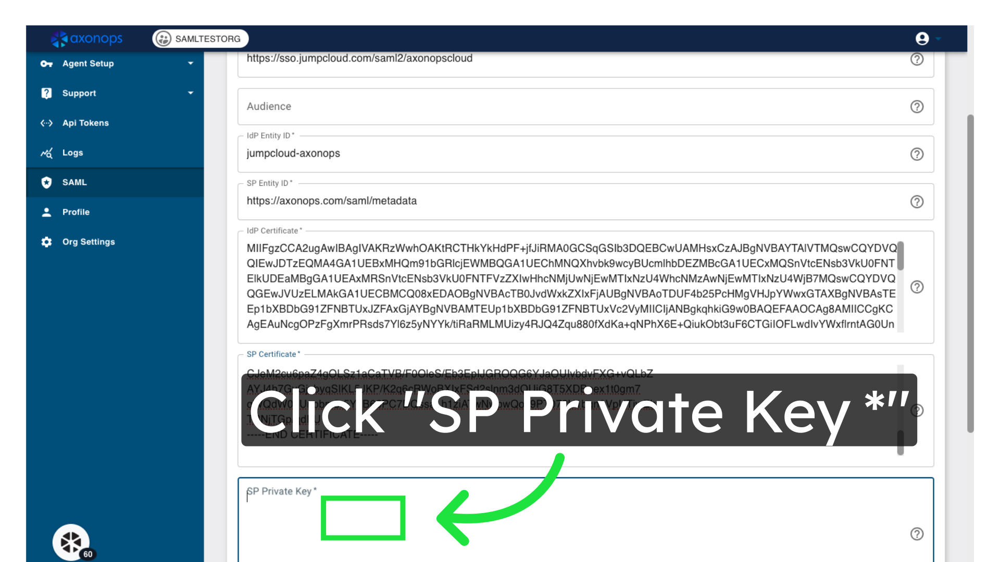
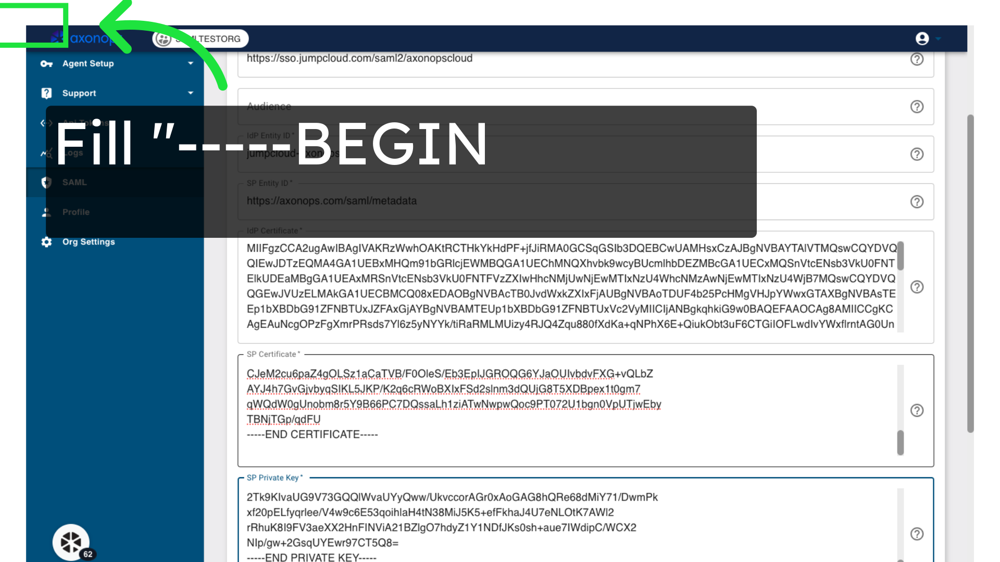

# Configuring SAML authentication in AxonOps Cloud

### 1\. Go to "console.axonops.cloud"

Go to the AxonOps console and login as a user with superadmin rights.
Open the SAML page by clicking the SAML link in the sidebar.

### 3\. Click "Upload IdP Metadata XML"

Upload the IdP Metadata XML file that you downloaded from JumpCloud

### 4\. Enter the IdP Entity ID

Fill in the text box with `jumpcloud-axonops`, this must match the IdP Entity ID entered in JumpCloud.

### 5\. Enter the SP Entity ID

Enter `https://axonops.com/saml/metadata` in the SP Entity ID field

### 6\. Click "SP Certificate"

Access the SP Certificate section.

### 7\. Paste in your certificate

Paste the PEM-format certificate you generated in the prerequisites into the `SP Certificate` field

### 8\. Click "SP Private Key"

Access the SP Private Key section.

### 9. Paste your private key

Paste the PEM-format private key you generated in the prerequisites into the `SP Private Key` field

### 10\. Click "Save"

Save the settings.

