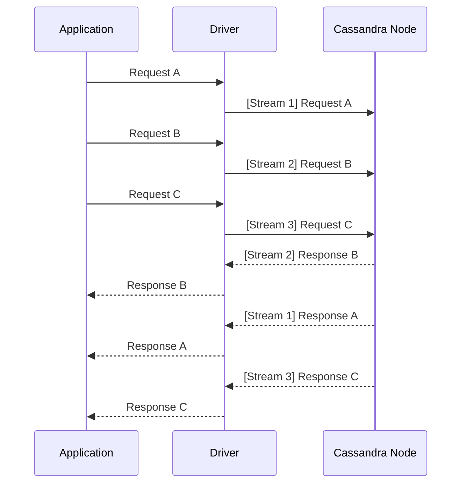
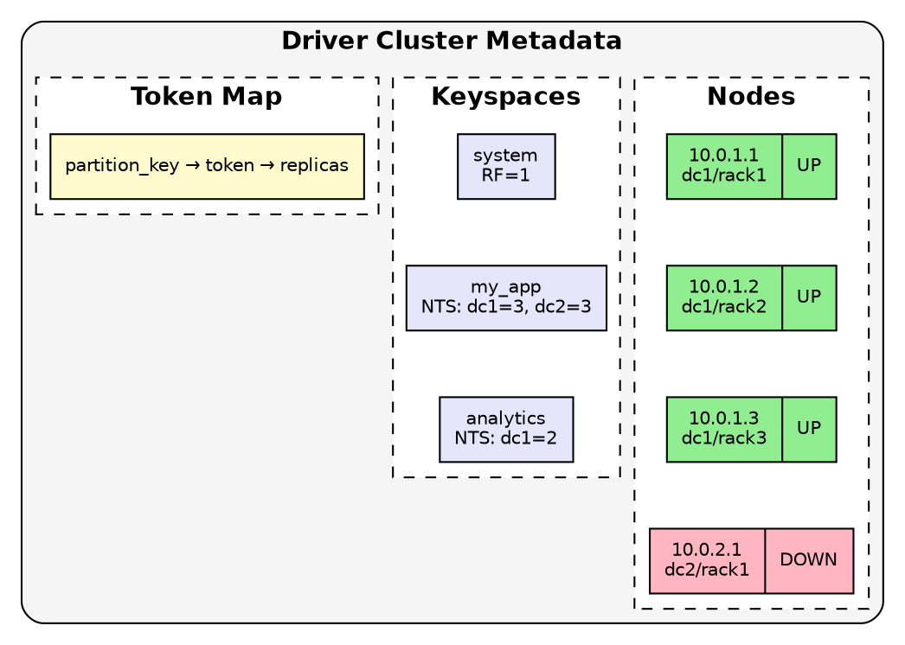
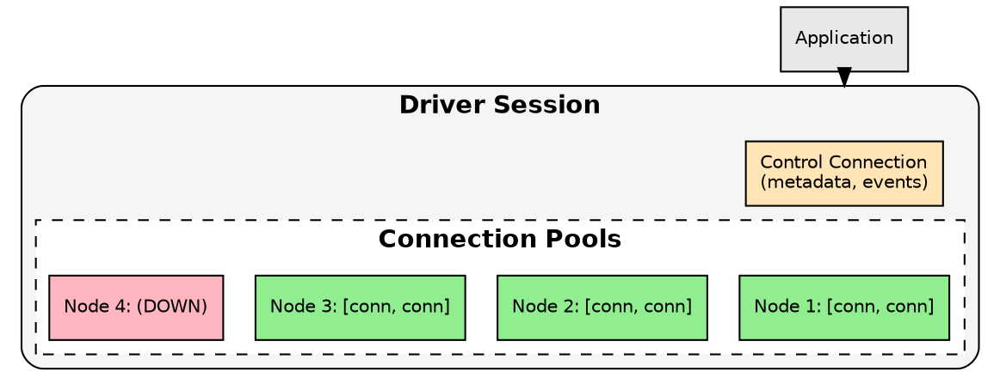
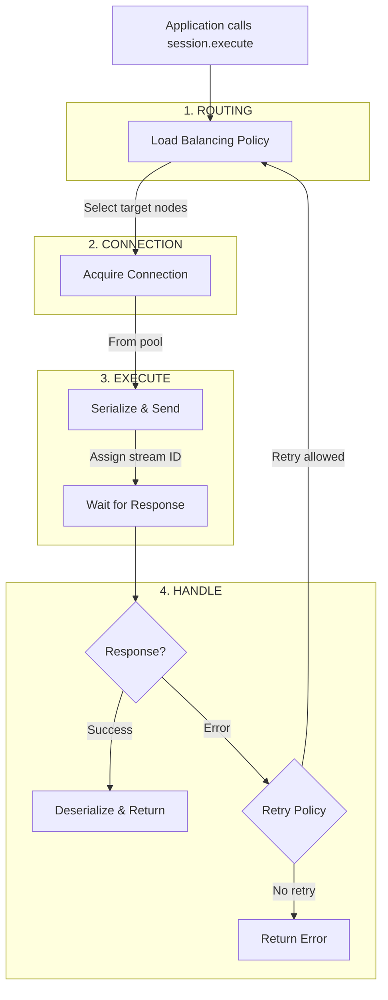

# Cassandra Drivers

Cassandra drivers provide the interface between applications and the Cassandra cluster. Unlike traditional database connectors, Cassandra drivers are topology-aware—they maintain knowledge of all nodes in the cluster and make intelligent decisions about request routing, connection management, and failure handling.

---

## Architecture Overview

### Asynchronous Protocol

Cassandra uses the CQL Native Protocol, a binary protocol designed for high-throughput asynchronous communication. Key characteristics:

| Feature | Description |
|---------|-------------|
| Multiplexed connections | Multiple concurrent requests share a single TCP connection |
| Stream IDs | Each request tagged with ID; responses matched asynchronously |
| Non-blocking I/O | Driver does not block threads waiting for responses |
| Configurable concurrency | Limit in-flight requests per connection (default typically 1024-2048) |

Responses return in completion order, not request order. A single TCP connection handles thousands of concurrent requests.

This design allows a single connection to handle thousands of concurrent requests without thread-per-request overhead. Applications benefit from:

- **Efficient resource usage** — Few connections support high throughput
- **Natural back-pressure** — When stream IDs exhaust, driver queues or rejects requests
- **Simplified connection pooling** — Fewer connections to manage and monitor

### Cluster Metadata

The driver maintains a live view of cluster topology:

The driver discovers this information through:

1. **Control connection** — Dedicated connection to one node for metadata queries
2. **System tables** — Queries `system.local`, `system.peers`, `system_schema.*`
3. **Event subscription** — Receives push notifications for topology and schema changes

This metadata enables token-aware routing (sending requests directly to replica nodes) and informed load balancing decisions.

### Connection Pooling

Each driver maintains connection pools to cluster nodes:

Pool configuration parameters:

| Parameter | Description | Typical Default |
|-----------|-------------|-----------------|
| Core connections per host | Minimum connections maintained | 1 |
| Max connections per host | Maximum connections allowed | 2-8 |
| Max requests per connection | Concurrent requests before opening new connection | 1024-2048 |
| Heartbeat interval | Frequency of idle connection health checks | 30 seconds |

---

## Request Lifecycle

A typical request flows through these stages:

---

## Available Drivers

Official and community-maintained drivers exist for most languages:

| Language | Driver | Maintainer | Repository |
|----------|--------|------------|------------|
| Java | Apache Cassandra Java Driver | Apache | [cassandra-java-driver](https://github.com/apache/cassandra-java-driver) |
| Python | Apache Cassandra Python Driver | Apache | [cassandra-python-driver](https://github.com/apache/cassandra-python-driver) |
| Node.js | DataStax Node.js Driver | DataStax | [nodejs-driver](https://github.com/datastax/nodejs-driver) |
| C# | DataStax C# Driver | DataStax | [csharp-driver](https://github.com/datastax/csharp-driver) |
| Go | Apache Cassandra GoCQL Driver | Apache | [cassandra-gocql-driver](https://github.com/apache/cassandra-gocql-driver) |
| Rust | ScyllaDB Rust Driver | ScyllaDB | [scylla-rust-driver](https://github.com/scylladb/scylla-rust-driver) |
| C/C++ | Apache Cassandra C++ Driver | Apache | [cassandra-cpp-driver](https://github.com/apache/cassandra-cpp-driver) |

All major drivers implement similar concepts (policies, connection pooling, prepared statements) though APIs and configuration details vary.

---

## Section Contents

- **[Connection Management](connection-management.md)** — Connection lifecycle, pooling, and health monitoring
- **[Policies](policies/index.md)** — Load balancing, retry, reconnection, and speculative execution
- **[Prepared Statements](prepared-statements.md)** — Efficient query execution with prepared statements
- **[Best Practices](best-practices.md)** — Production configuration recommendations

