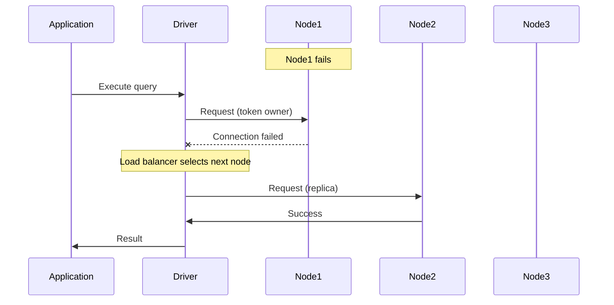
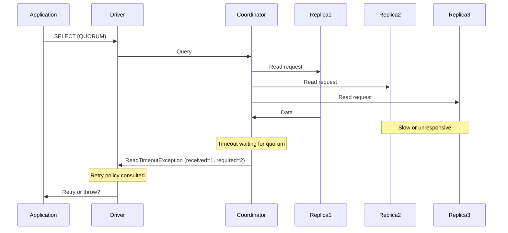
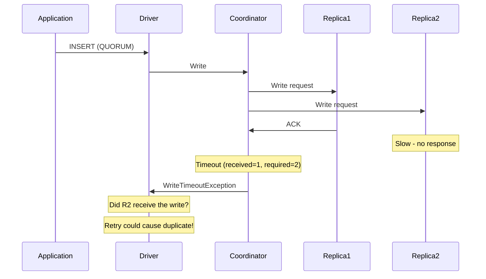
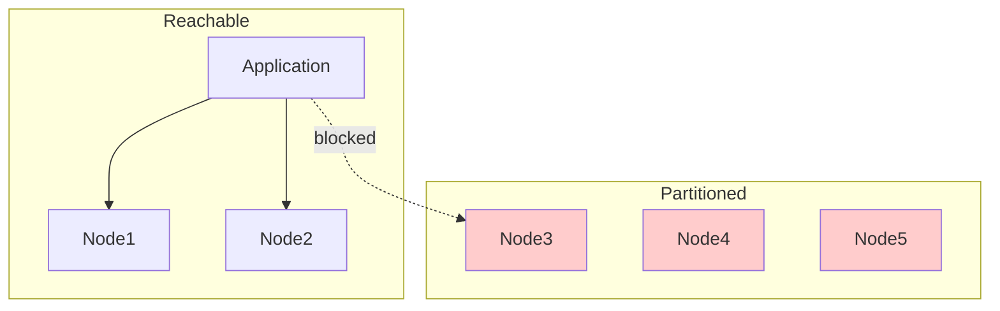
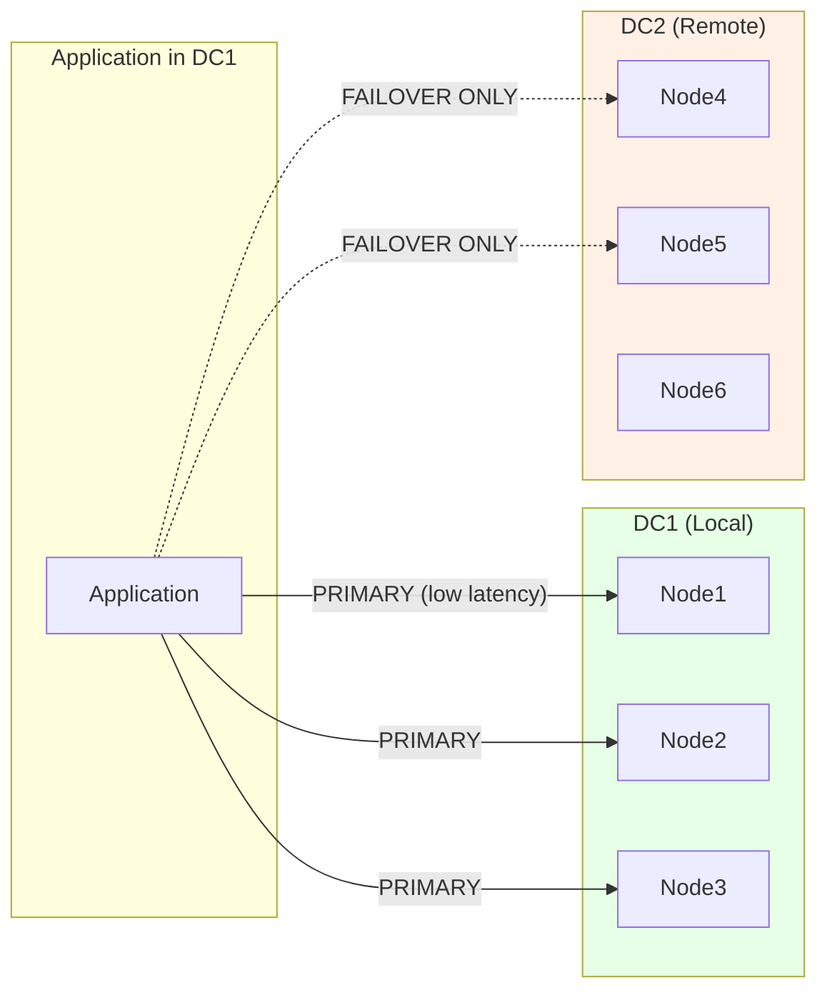
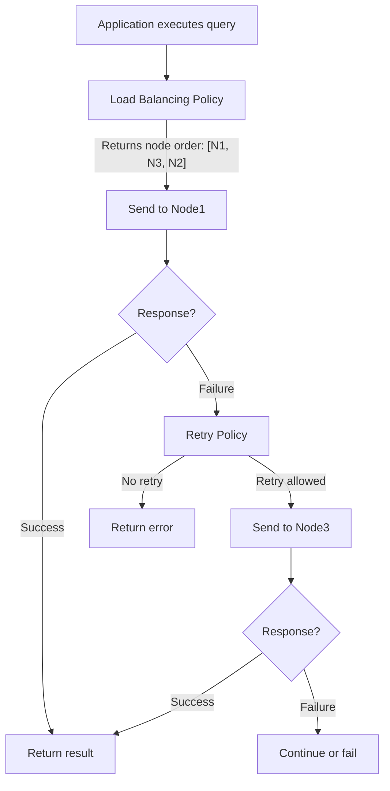
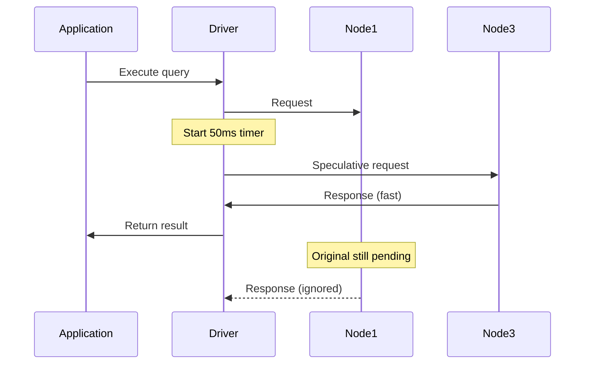

# Driver Policies

Driver policies control how the application interacts with the Cassandra cluster during normal operation and failure scenarios. These policies are the primary mechanism through which developers configure failure handling behavior.

---

## Developer Responsibility for Failure Handling

Unlike traditional databases where failure handling is largely abstracted away, Cassandra drivers expose failure scenarios directly to the application. **The developer is responsible for configuring appropriate responses to failures.**

This design is intentional: Cassandra's distributed architecture means that "failure" is nuanced. A node being slow is different from a node being down. A write timeout does not mean the write failed—it may have succeeded on some replicas. The driver cannot make assumptions about what the application considers acceptable behavior.

| Failure Type | What Happened | Driver's Question | Developer Must Decide |
|--------------|---------------|-------------------|----------------------|
| Read timeout | Some replicas didn't respond in time | Retry or fail? | Is stale data acceptable? Retry elsewhere? |
| Write timeout | Coordinator didn't get enough acknowledgments | Retry or fail? | Is duplicate write acceptable? Is operation idempotent? |
| Unavailable | Not enough replicas alive to satisfy CL | Retry or fail? | Lower consistency acceptable? Wait and retry? |
| Node down | Node unreachable | Where to route? When to retry connection? | Failover strategy? Recovery timing? |

**Default policies exist but are generic.** Production applications must evaluate each policy against their specific requirements for consistency, latency, and availability.

---

## Policy Overview

| Policy | Question It Answers | Default Behavior |
|--------|--------------------|--------------------|
| **Load Balancing** | Which node should handle this request? | Round-robin across local datacenter, token-aware |
| **Retry** | Should a failed request be retried? | Retry read timeouts once, don't retry write timeouts |
| **Reconnection** | How quickly to reconnect after node failure? | Exponential backoff (1s base, 10min max) |
| **Speculative Execution** | Should redundant requests be sent? | Disabled |

---

## Default Policy Behavior

Understanding default behavior is essential before customizing policies.

### Java Driver Defaults (v4.x)

| Policy | Default Implementation | Behavior |
|--------|----------------------|----------|
| Load Balancing | `DefaultLoadBalancingPolicy` | Token-aware, prefers local DC, round-robin within replicas |
| Retry | `DefaultRetryPolicy` | Retry read timeout if enough replicas responded; never retry write timeout |
| Reconnection | `ExponentialReconnectionPolicy` | Base: 1 second, Max: 10 minutes |
| Speculative Execution | None | Disabled—must explicitly enable |

### Python Driver Defaults

| Policy | Default Implementation | Behavior |
|--------|----------------------|----------|
| Load Balancing | `TokenAwarePolicy(DCAwareRoundRobinPolicy())` | Token-aware wrapping DC-aware round-robin |
| Retry | `RetryPolicy` | Retry read timeout once on same host; retry unavailable once on next host |
| Reconnection | `ExponentialReconnectionPolicy` | Base: 1 second, Max: 600 seconds |
| Speculative Execution | None | Disabled |

---

## Failure Scenarios

Understanding common failure scenarios helps in selecting appropriate policies.

### Scenario 1: Single Node Failure



**Policy involvement:**

- **Load Balancing**: Provides fallback nodes when primary fails
- **Retry**: Determines if connection failure triggers retry
- **Reconnection**: Schedules background reconnection to Node1

### Scenario 2: Read Timeout (Partial Response)



**Policy involvement:**

- **Retry**: Decides whether to retry based on how many replicas responded
- **Speculative Execution**: Could have sent parallel request to avoid timeout

### Scenario 3: Write Timeout (Dangerous)



**Critical consideration**: Write may have succeeded on R2 but acknowledgment was lost. Retrying non-idempotent writes risks data corruption.

### Scenario 4: Network Partition



**Policy involvement:**

- **Load Balancing**: Must route only to reachable nodes
- **Reconnection**: Attempts to reconnect to partitioned nodes
- **Retry**: Unavailable exceptions if CL cannot be met with reachable nodes

---

## Multi-Datacenter Configuration

Multi-DC deployments require careful policy configuration to ensure correct behavior during normal operation and DC failures.

### Local Datacenter Configuration

**Always configure the local datacenter explicitly.** This is the most critical setting for multi-DC deployments.

```java
// Java - REQUIRED for multi-DC
CqlSession session = CqlSession.builder()
    .withLocalDatacenter("dc1")
    .build();
```

```python
# Python - REQUIRED for multi-DC
from cassandra.policies import DCAwareRoundRobinPolicy
cluster = Cluster(
    load_balancing_policy=DCAwareRoundRobinPolicy(local_dc='dc1')
)
```

### Multi-DC Request Routing



### DC Failover Behavior

| Configuration | Normal Operation | Local DC Down |
|---------------|-----------------|---------------|
| `LOCAL_QUORUM` + local DC only | Routes to local DC | **All requests fail** |
| `LOCAL_QUORUM` + remote DC allowed | Routes to local DC | Fails over to remote DC |
| `QUORUM` | May route anywhere | Continues if global quorum available |

### Multi-DC Policy Configuration

```java
// Java - Multi-DC with controlled failover
CqlSession session = CqlSession.builder()
    .withLocalDatacenter("dc1")
    .withLoadBalancingPolicy(
        DefaultLoadBalancingPolicy.builder()
            .withLocalDatacenter("dc1")
            // Permit failover to remote DC for LOCAL consistency levels
            .withDcFailoverMaxNodesPerRemoteDc(2)
            .build())
    .build();
```

### Consistency Level Implications

| Consistency Level | Multi-DC Behavior | DC Failure Impact |
|-------------------|-------------------|-------------------|
| `LOCAL_ONE` | Local DC only | Fails if local DC down |
| `LOCAL_QUORUM` | Local DC only | Fails if local DC down |
| `QUORUM` | Global quorum | May succeed with one DC down |
| `EACH_QUORUM` | Quorum in every DC | Fails if any DC down |
| `ALL` | Every replica | Fails if any node down |

**Recommendation**: Use `LOCAL_QUORUM` for most operations. Configure load balancer to allow remote DC failover only when acceptable for the use case.

---

## Why Policies Matter

Default policies are designed for general use cases but may not match specific application requirements:

### Load Balancing Examples

| Scenario | Default Behavior | Problem |
|----------|------------------|---------|
| Multi-DC deployment | May route to remote DC | High latency if local DC not configured |
| Heterogeneous hardware | Equal distribution | Overloads weaker nodes |
| Batch analytics | Token-aware routing | Optimal for OLTP, but analytics may prefer round-robin |

### Retry Examples

| Scenario | Default Behavior | Problem |
|----------|------------------|---------|
| Non-idempotent writes | May retry on timeout | Potential duplicate writes |
| Overloaded cluster | Retry immediately | Amplifies load, worsens situation |
| Read timeout | Retry same node | Node may still be slow |

### Reconnection Examples

| Scenario | Default Behavior | Problem |
|----------|------------------|---------|
| Brief network blip | Exponential backoff | Slow recovery for transient issues |
| Node replacement | Standard reconnection | May attempt reconnection to decommissioned node |
| Rolling restart | Backoff after each node | Cascading delays |

---

## Policy Interactions

Policies do not operate in isolation—they interact during request execution:



If speculative execution is enabled, requests are sent concurrently:



---

## Configuration Approach

### Explicit Configuration

Do not rely on defaults for production deployments. Configure each policy explicitly:

```java
// Java driver example - explicit policy configuration
CqlSession session = CqlSession.builder()
    .withLocalDatacenter("dc1")
    .withLoadBalancingPolicy(
        DefaultLoadBalancingPolicy.builder()
            .withLocalDatacenter("dc1")
            .withSlowReplicaAvoidance(true)
            .build())
    .withRetryPolicy(new CustomRetryPolicy())
    .withReconnectionPolicy(
        ExponentialReconnectionPolicy.builder()
            .withBaseDelay(Duration.ofSeconds(1))
            .withMaxDelay(Duration.ofMinutes(5))
            .build())
    .withSpeculativeExecutionPolicy(
        ConstantSpeculativeExecutionPolicy.builder()
            .withMaxExecutions(2)
            .withDelay(Duration.ofMillis(100))
            .build())
    .build();
```

### Per-Statement Override

Some policies can be overridden per statement:

```java
// Override retry policy for specific query
Statement statement = SimpleStatement.builder("SELECT * FROM users WHERE id = ?")
    .addPositionalValue(userId)
    .setRetryPolicy(FallthroughRetryPolicy.INSTANCE)  // No retries
    .build();
```

This allows different behavior for different query types (e.g., strict no-retry for non-idempotent writes).

---

## Policy Recommendations by Use Case

| Use Case | Load Balancing | Retry | Reconnection | Speculative Execution |
|----------|---------------|-------|--------------|----------------------|
| **OLTP (low latency)** | Token-aware, local DC | Conservative (reads only) | Fast base (500ms) | Enable for reads |
| **Batch/Analytics** | Round-robin or token-aware | Aggressive retry | Standard | Disable |
| **Multi-DC Active-Active** | Token-aware, local DC, failover enabled | Per-DC retry | Standard | Local DC only |
| **Write-heavy** | Token-aware | No retry for writes | Standard | Disable |
| **Read-heavy** | Token-aware | Retry reads | Standard | Enable |

### OLTP Application Configuration

```java
// Low-latency OLTP configuration
CqlSession session = CqlSession.builder()
    .withLocalDatacenter("dc1")
    .withLoadBalancingPolicy(
        DefaultLoadBalancingPolicy.builder()
            .withLocalDatacenter("dc1")
            .withSlowReplicaAvoidance(true)
            .build())
    // Conservative retry - only idempotent operations
    .withRetryPolicy(DefaultRetryPolicy.INSTANCE)
    // Fast reconnection for quick recovery
    .withReconnectionPolicy(
        ExponentialReconnectionPolicy.builder()
            .withBaseDelay(Duration.ofMillis(500))
            .withMaxDelay(Duration.ofMinutes(2))
            .build())
    // Speculative execution for tail latency
    .withSpeculativeExecutionPolicy(
        ConstantSpeculativeExecutionPolicy.builder()
            .withMaxExecutions(2)
            .withDelay(Duration.ofMillis(50))
            .build())
    .build();
```

### Multi-DC Active-Active Configuration

```java
// Multi-DC with controlled failover
CqlSession session = CqlSession.builder()
    .withLocalDatacenter("dc1")
    .withLoadBalancingPolicy(
        DefaultLoadBalancingPolicy.builder()
            .withLocalDatacenter("dc1")
            // Allow failover to 2 nodes in remote DC
            .withDcFailoverMaxNodesPerRemoteDc(2)
            .build())
    // Standard retry
    .withRetryPolicy(DefaultRetryPolicy.INSTANCE)
    // Standard reconnection
    .withReconnectionPolicy(
        ExponentialReconnectionPolicy.builder()
            .withBaseDelay(Duration.ofSeconds(1))
            .withMaxDelay(Duration.ofMinutes(5))
            .build())
    // No speculative execution across DCs (latency difference too high)
    .build();
```

---

## Section Contents

- **[Load Balancing Policy](load-balancing.md)** — Node selection and request distribution
- **[Retry Policy](retry.md)** — Handling failed requests and error classification
- **[Reconnection Policy](reconnection.md)** — Recovery after node failures
- **[Speculative Execution Policy](speculative-execution.md)** — Reducing tail latency through redundant requests

