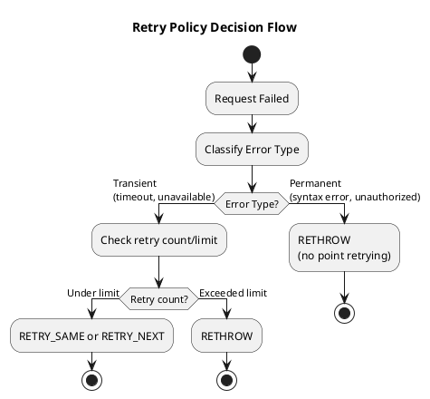

# Retry Policy

The retry policy determines whether to retry a failed request and on which node. This policy is critical for application reliability but must be configured carefully to avoid unintended consequences.

---

## Error Classification

Not all errors are retryable. The retry policy classifies errors and decides appropriate action:

| Error Type | Typical Cause | Retryable? |
|------------|---------------|------------|
| **ReadTimeoutException** | Replica(s) did not respond in time | Depends on received/required |
| **WriteTimeoutException** | Write coordinator timeout | Usually no (non-idempotent) |
| **UnavailableException** | Not enough replicas alive | Retry on different node |
| **OverloadedException** | Coordinator is overloaded | Retry on different node |
| **ServerError** | Unexpected server error | Usually no |
| **QueryValidationException** | Syntax or schema error | No (not transient) |

### Read Timeout Details

A read timeout includes information about how many replicas responded:

```
ReadTimeoutException Analysis:

Required replicas (based on CL): 2
Received responses: 1
Data received: false

Interpretation:
  - Only 1 of 2 required replicas responded
  - No replica sent actual data (only digest)

Retry decision:
  - If 0 received: replica might be overloaded, retry elsewhere
  - If received >= required but no data: coordinator issue, retry
  - If received < required: may or may not help to retry
```

### Write Timeout Details

Write timeouts are more complex because writes may have partially succeeded:

```
WriteTimeoutException Analysis:

Write type: SIMPLE
Required acknowledgments: 2
Received acknowledgments: 1

Interpretation:
  - Write reached coordinator
  - At least 1 replica acknowledged
  - Possibly 2+ replicas received it (timeout ≠ failure)

Danger:
  - Retrying may cause duplicate write
  - For non-idempotent operations (counters), this corrupts data
```

---

## Idempotency Consideration

The most important factor in retry decisions is whether the operation is idempotent:

| Operation Type | Idempotent? | Safe to Retry? |
|----------------|-------------|----------------|
| SELECT | Yes | Yes |
| INSERT (no LWT) | Yes* | Yes* |
| UPDATE SET column = value | Yes | Yes |
| UPDATE SET counter = counter + 1 | **No** | **No** |
| DELETE | Yes | Yes |
| INSERT with TTL | **Depends** | Depends on timing sensitivity |

*INSERT is idempotent if the same row/values are written. If using auto-generated timestamps, retries produce identical results.

```
Idempotent vs Non-Idempotent:

Idempotent (safe to retry):
  UPDATE users SET name = 'Alice' WHERE id = 123

  First attempt: Sets name to 'Alice'
  Retry:         Sets name to 'Alice' (same result)


Non-Idempotent (dangerous to retry):
  UPDATE stats SET views = views + 1 WHERE page_id = 456

  First attempt: Increments views (maybe succeeded, maybe not)
  Retry:         Increments again (double-counted if first succeeded)
```

---

## Retry Policy Decisions

For each failed request, the retry policy returns one of:

| Decision | Meaning |
|----------|---------|
| **RETRY_SAME** | Retry on the same node |
| **RETRY_NEXT** | Retry on the next node in query plan |
| **IGNORE** | Return empty/default result to application |
| **RETHROW** | Propagate error to application |

### Decision Flow



---

## Common Retry Policies

### Default Retry Policy

Most drivers include a default policy that:

- Retries read timeouts if enough replicas responded
- Does **not** retry write timeouts (assumes non-idempotent)
- Retries unavailable exceptions on next node
- Limited retry attempts (typically 1)

This is a conservative policy suitable for mixed workloads.

### Fallthrough (No Retry)

Never retries any error—always propagates to application:

```java
// Java driver
.withRetryPolicy(FallthroughRetryPolicy.INSTANCE)
```

Use when:

- Application handles retries itself
- All operations are non-idempotent
- Debugging (to see all errors)

### Aggressive Retry

Retries most errors multiple times:

**Warning**: Aggressive retry policies can cause cascading failures by amplifying load on an already struggling cluster.

```
Cascading Failure Scenario:

1. Node3 becomes slow (GC, disk issue)
2. Requests to Node3 timeout
3. Aggressive retry policy retries each request 3×
4. Node3 now receives 3× the requests
5. Node3 becomes slower
6. Timeouts increase, more retries triggered
7. Node3 overwhelmed, marks as DOWN
8. Load shifts to Node1, Node2
9. If they were near capacity, they may also degrade
```

---

## Custom Retry Policies

For fine-grained control, implement a custom retry policy:

```java
// Java driver - custom retry policy
public class IdempotentOnlyRetryPolicy implements RetryPolicy {

    @Override
    public RetryDecision onReadTimeout(
            Statement statement,
            ConsistencyLevel cl,
            int required,
            int received,
            boolean dataRetrieved,
            int retryCount) {

        if (retryCount > 0) {
            return RetryDecision.rethrow();
        }
        // Retry reads on different node
        return RetryDecision.tryNextHost(cl);
    }

    @Override
    public RetryDecision onWriteTimeout(
            Statement statement,
            ConsistencyLevel cl,
            WriteType writeType,
            int required,
            int received,
            int retryCount) {

        // Only retry if statement is explicitly marked idempotent
        if (statement.isIdempotent() && retryCount == 0) {
            return RetryDecision.tryNextHost(cl);
        }
        return RetryDecision.rethrow();
    }

    @Override
    public RetryDecision onUnavailable(
            Statement statement,
            ConsistencyLevel cl,
            int required,
            int alive,
            int retryCount) {

        // Retry unavailable on next node (maybe different replica set)
        if (retryCount == 0) {
            return RetryDecision.tryNextHost(cl);
        }
        return RetryDecision.rethrow();
    }
}
```

### Marking Statements Idempotent

```java
// Mark specific statement as idempotent
Statement statement = SimpleStatement.builder("UPDATE users SET name = ? WHERE id = ?")
    .addPositionalValues("Alice", userId)
    .setIdempotent(true)  // Safe to retry
    .build();
```

---

## Per-Statement Policy Override

Override retry policy for specific queries:

```java
// No retries for counter updates
Statement counterUpdate = SimpleStatement.builder(
        "UPDATE page_stats SET views = views + 1 WHERE page_id = ?")
    .addPositionalValue(pageId)
    .setRetryPolicy(FallthroughRetryPolicy.INSTANCE)  // Never retry
    .build();

// Allow retries for idempotent read
Statement userQuery = SimpleStatement.builder(
        "SELECT * FROM users WHERE id = ?")
    .addPositionalValue(userId)
    .setRetryPolicy(DefaultRetryPolicy.INSTANCE)  // Standard retry
    .build();
```

---

## Retry Metrics

Monitor retry behavior in production:

| Metric | Description | Warning Sign |
|--------|-------------|--------------|
| Retry rate | Retries per second | Sustained high rate indicates cluster issues |
| Retry success rate | Percentage of retries that succeed | Low success rate means retries are wasteful |
| Retry exhaustion | Requests that failed after all retries | Any occurrence needs investigation |

---

## Best Practices

| Practice | Rationale |
|----------|-----------|
| Default to conservative | Better to fail fast than corrupt data |
| Mark idempotent operations explicitly | Enables safe retry for those operations |
| Monitor retry rates | High retry rates indicate underlying issues |
| Don't rely on retries for availability | Fix the root cause instead |
| Consider circuit breakers | Prevent retry storms during outages |

---

## Related Documentation

- **[Load Balancing Policy](load-balancing.md)** — Determines which node receives retry
- **[Speculative Execution](speculative-execution.md)** — Alternative to retry for latency reduction

