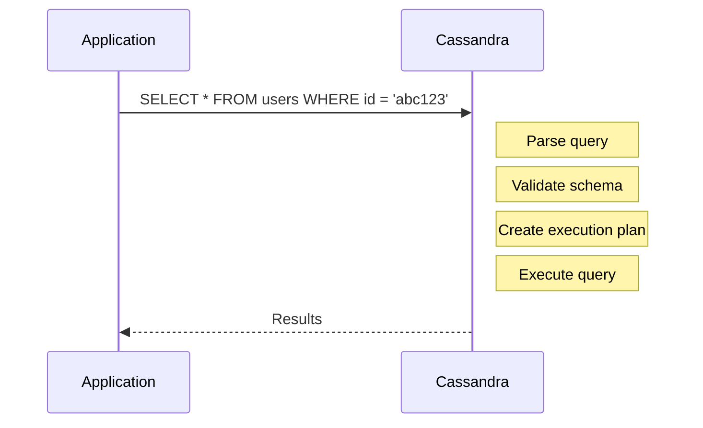
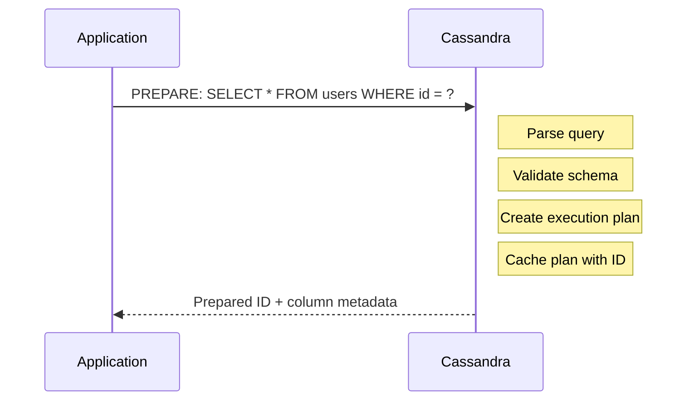
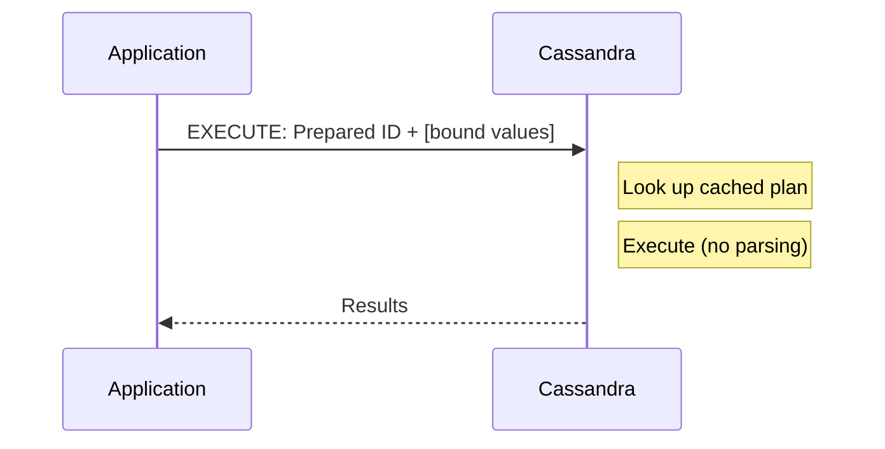
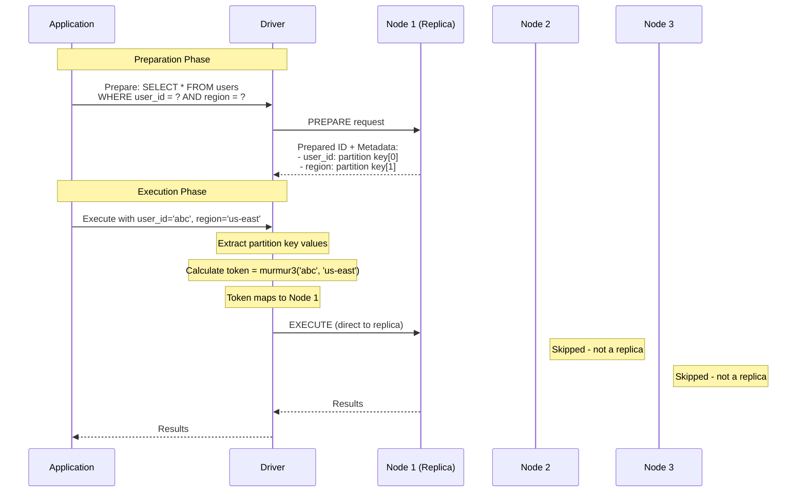
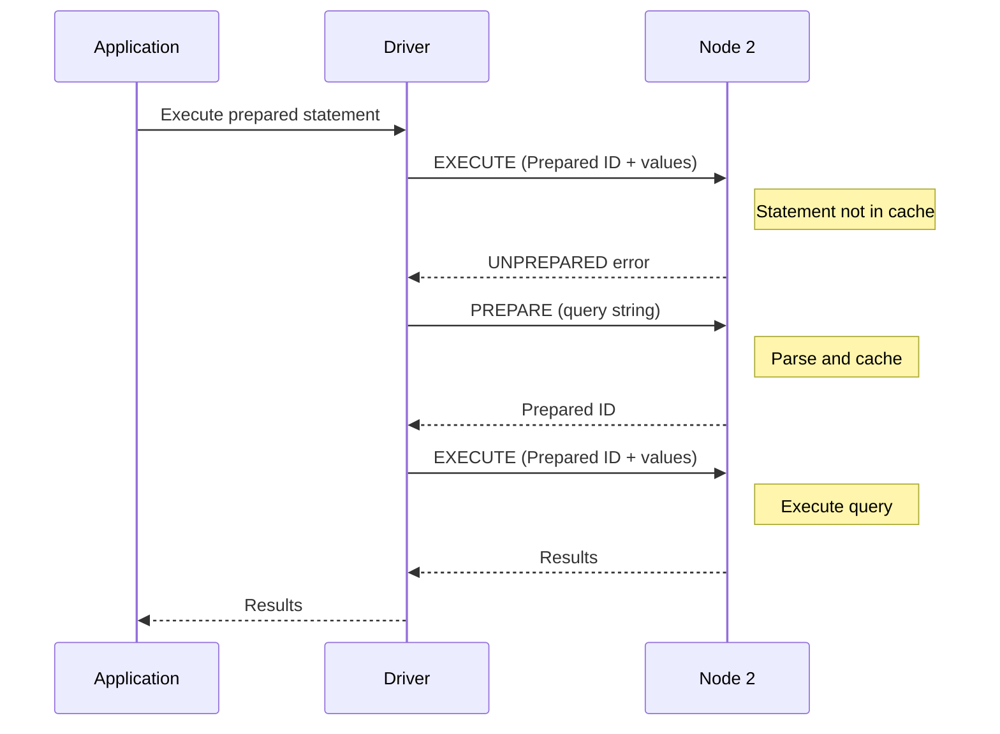
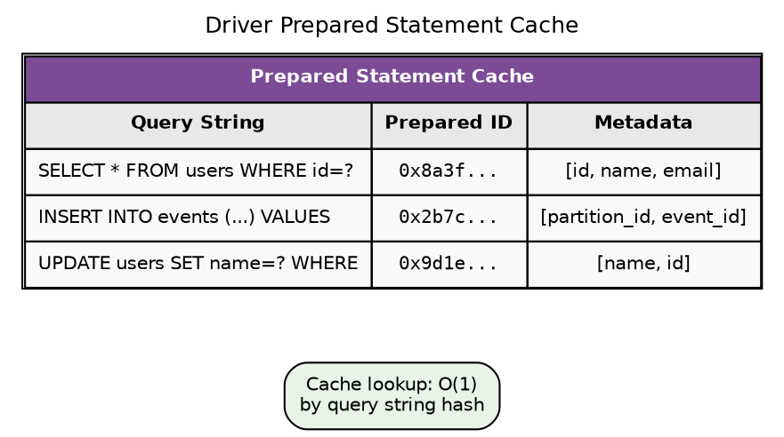
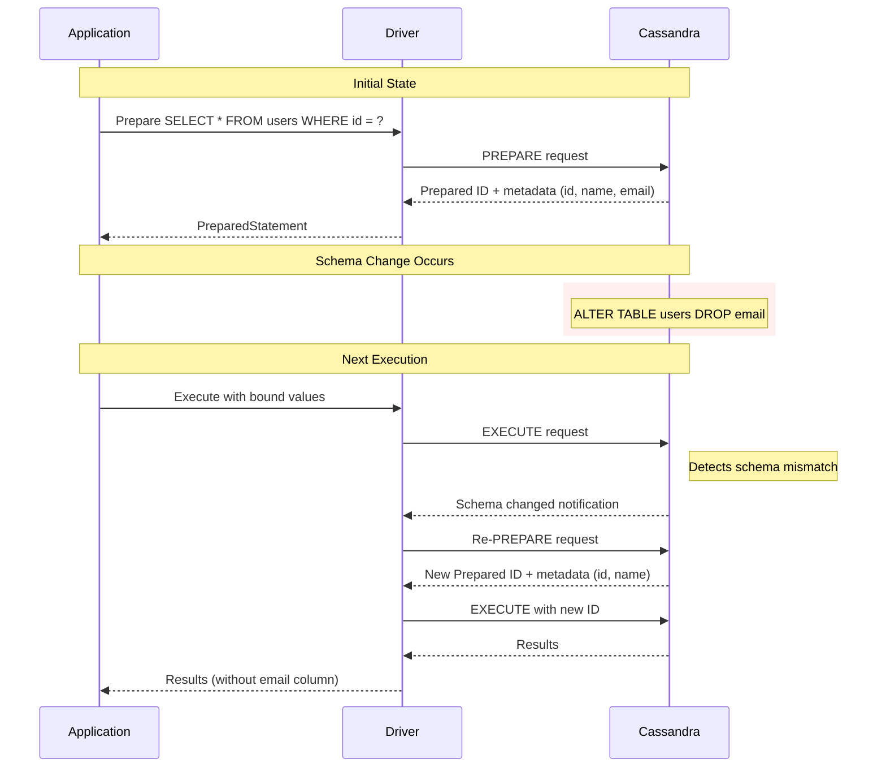
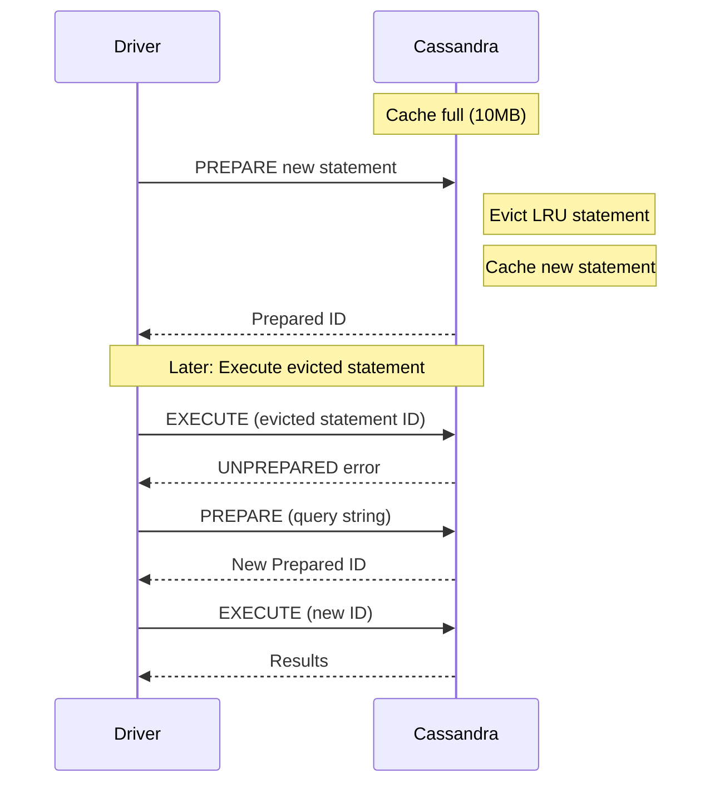

# Prepared Statements

Prepared statements are the recommended method for executing CQL queries in production applications. They provide performance benefits, security protection, and enable token-aware routing.

---

## How Prepared Statements Work

Prepared statements separate query parsing from execution:

### Simple Statement (every execution)



### Prepared Statement

**PREPARE phase (once):**



**EXECUTE phase (every request):**



---

## Performance Benefits

### Reduced Server-Side Overhead

| Operation | Simple Statement | Prepared Statement |
|-----------|-----------------|-------------------|
| Parse query | Every request | Once |
| Validate schema | Every request | Once |
| Create plan | Every request | Once |
| Execute | Every request | Every request |

For high-throughput workloads, the parsing overhead is significant:

```
Throughput comparison (10,000 queries/sec):

Simple statements:
  10,000 × (parse + validate + plan + execute)
  CPU overhead: ~30% spent on parsing

Prepared statements:
  1 × (parse + validate + plan)
  10,000 × (execute only)
  CPU overhead: <5% for statement handling
```

### Token-Aware Routing

Prepared statements enable token-aware routing because the driver knows the partition key structure:



Without prepared statements, the driver cannot determine partition key values from embedded query strings.

---

## Prepared Statement Lifecycle

### Preparation

```java
// Prepare once (typically at application startup)
PreparedStatement prepared = session.prepare(
    "SELECT * FROM users WHERE user_id = ?");
```

The driver:

1. Sends PREPARE request to one node
2. Receives prepared statement ID and metadata
3. Caches the prepared statement locally
4. Automatically re-prepares on other nodes as needed

### Execution

```java
// Execute many times with different values
BoundStatement bound = prepared.bind(userId);
ResultSet results = session.execute(bound);
```

The driver:

1. Looks up cached prepared statement
2. Serializes bound values
3. Sends EXECUTE request (not the query string)
4. Routes token-aware if partition key bound

### Automatic Re-Preparation

If a node restarts or does not have the prepared statement, the driver automatically re-prepares:



This is transparent to the application.

---

## Binding Values

### Positional Binding

```java
PreparedStatement prepared = session.prepare(
    "INSERT INTO users (id, name, email) VALUES (?, ?, ?)");

// Bind by position
BoundStatement bound = prepared.bind(
    userId,     // position 0
    "Alice",    // position 1
    "alice@example.com"  // position 2
);
```

### Named Binding

```java
PreparedStatement prepared = session.prepare(
    "INSERT INTO users (id, name, email) VALUES (:id, :name, :email)");

// Bind by name
BoundStatement bound = prepared.bind()
    .setUuid("id", userId)
    .setString("name", "Alice")
    .setString("email", "alice@example.com");
```

Named binding is more readable and less error-prone for queries with many parameters.

### Null Values

Explicitly bind null values:

```java
// Correct: explicit null
bound.setString("middle_name", null);

// Incorrect: unbound value
// Leaves value unset, may cause errors
```

---

## Caching Prepared Statements

### Driver-Side Cache

Drivers maintain a cache of prepared statements:



### Application-Level Caching

Prepare statements once and reuse:

```java
// GOOD: Prepare once, reuse
public class UserRepository {
    private final PreparedStatement selectUser;
    private final PreparedStatement insertUser;

    public UserRepository(CqlSession session) {
        this.selectUser = session.prepare(
            "SELECT * FROM users WHERE id = ?");
        this.insertUser = session.prepare(
            "INSERT INTO users (id, name) VALUES (?, ?)");
    }

    public User getUser(UUID id) {
        return session.execute(selectUser.bind(id))...;
    }
}
```

```java
// BAD: Prepare every request
public User getUser(UUID id) {
    // Prepares the same statement repeatedly!
    PreparedStatement ps = session.prepare(
        "SELECT * FROM users WHERE id = ?");
    return session.execute(ps.bind(id))...;
}
```

The driver caches prepared statements, so re-preparing is not catastrophic, but it adds unnecessary overhead.

---

## Schema Changes and Prepared Statements

When schema changes, prepared statements may become invalid:



### Handling Schema Changes

| Driver Behavior | Description |
|-----------------|-------------|
| Automatic re-prepare | Driver detects schema change, re-prepares |
| Metadata refresh | Driver updates column metadata |
| Application notification | Some drivers emit events for schema changes |

Best practice: Prepare statements at startup and handle re-preparation transparently. Avoid caching result metadata assumptions.

---

## Batch Statements

Prepared statements can be used in batches:

```java
PreparedStatement insertEvent = session.prepare(
    "INSERT INTO events (partition_id, event_id, data) VALUES (?, ?, ?)");

BatchStatement batch = BatchStatement.newInstance(BatchType.UNLOGGED)
    .add(insertEvent.bind(partitionId, event1Id, data1))
    .add(insertEvent.bind(partitionId, event2Id, data2))
    .add(insertEvent.bind(partitionId, event3Id, data3));

session.execute(batch);
```

**Important**: Batches should contain statements for the same partition. Cross-partition batches have significant performance overhead.

---

## Prepared Statement Limits

Cassandra limits prepared statements per node:

| Parameter | Default | Description |
|-----------|---------|-------------|
| prepared_statements_cache_size_mb | 10MB | Memory for prepared statement cache |

When cache is full, least-recently-used statements are evicted:



### Avoiding Cache Churn

| Anti-Pattern | Problem |
|--------------|---------|
| Dynamic query generation | Thousands of unique queries fill cache |
| String concatenation in queries | Each variation is separate statement |
| Unbounded IN clauses | `IN (?, ?, ?, ...)` with varying count |

```java
// BAD: Dynamic IN clause (each size is different prepared statement)
String query = "SELECT * FROM users WHERE id IN (" +
    String.join(",", Collections.nCopies(ids.size(), "?")) + ")";

// BETTER: Fixed batch size or multiple queries
// Or use token-range queries for large sets
```

---

## Best Practices

| Practice | Rationale |
|----------|-----------|
| Prepare at startup | Amortize preparation cost, fail fast on errors |
| Reuse prepared statements | Avoid redundant cache lookups |
| Use named parameters | More readable, less error-prone |
| Bind all values explicitly | Avoid unbound value errors |
| Use for all production queries | Performance and token-aware routing |
| Avoid dynamic query generation | Prevents cache churn |

---

## Related Documentation

- **[Load Balancing Policy](policies/load-balancing.md)** — Token-aware routing with prepared statements
- **[CQL Reference](../../cql/index.md)** — Query syntax

