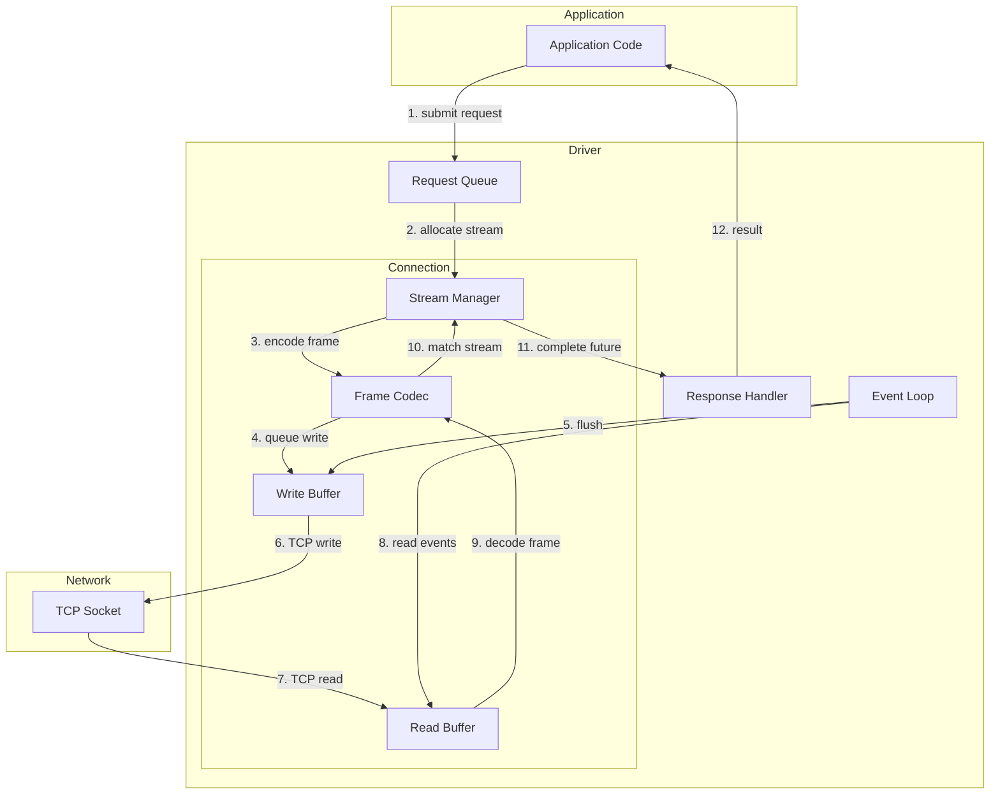
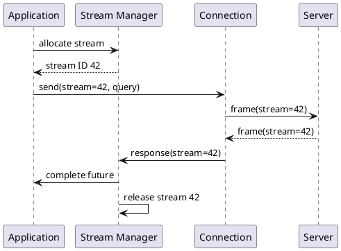
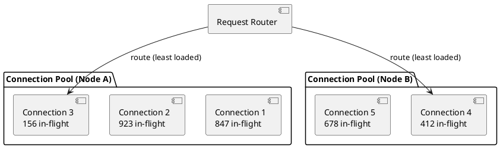
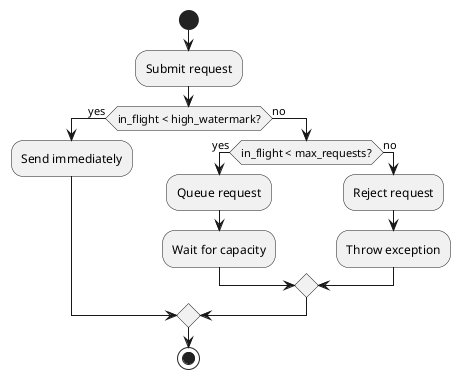

# Asynchronous Connections

Cassandra drivers use asynchronous, non-blocking I/O to achieve high throughput with minimal resources. This architecture enables thousands of concurrent requests using a small number of connections.

## Asynchronous Model

### Why Asynchronous?

Traditional synchronous database access follows a blocking model:

```
Thread 1: send request → wait → receive response → process
Thread 2: send request → wait → receive response → process
```

This model requires one thread per concurrent request, leading to:
- High memory usage (1MB+ stack per thread)
- Context switching overhead
- Thread pool sizing challenges

Asynchronous I/O eliminates these limitations:

```
Event Loop: send request 1 → send request 2 → send request 3 →
            receive response 2 → receive response 1 → receive response 3
```

### Benefits

| Aspect | Synchronous | Asynchronous |
|--------|-------------|--------------|
| Threads per request | 1 | 0 (shared) |
| Memory per connection | ~1MB (thread stack) | ~64KB (buffers) |
| Context switches | Per request | Per I/O event |
| Concurrent requests | Limited by threads | Limited by protocol |
| Latency overhead | Thread scheduling | Minimal |

---

## Connection Architecture

### Connection Components



### Event Loop

The event loop is the core of asynchronous I/O:

1. **Selector/Epoll** - Monitors sockets for read/write readiness
2. **Event Dispatch** - Routes I/O events to handlers
3. **Task Execution** - Runs callbacks and completions

Most drivers use platform-native I/O:
- Linux: epoll
- macOS: kqueue
- Windows: IOCP

### Non-Blocking Sockets

Connections use non-blocking TCP sockets:

```
Socket Configuration:
  - TCP_NODELAY: Disable Nagle's algorithm (reduce latency)
  - SO_KEEPALIVE: Detect dead connections
  - Non-blocking mode: Never block on read/write
```

---

## Stream Multiplexing

### Stream Allocation

The CQL protocol supports up to 32,768 concurrent streams per connection (protocol v3+). Stream allocation:



### Stream Management Strategies

**Sequential Allocation:**
```
Streams: 1, 2, 3, 4, ... (wrap at max)
Pros: Simple, predictable
Cons: Head-of-line if stream stuck
```

**Pooled Allocation:**
```
Free list: [5, 12, 7, 23, ...]
Allocate: pop from list
Release: push to list
Pros: Fast allocation, no fragmentation
```

### In-Flight Request Limits

Drivers limit concurrent requests per connection:

| Configuration | Typical Value | Purpose |
|---------------|---------------|---------|
| Max requests per connection | 1024-2048 | Prevent overload |
| High watermark | 80% of max | Trigger backpressure |
| Low watermark | 50% of max | Resume after backpressure |

!!! note "Backpressure Behavior"
    When the high watermark is reached, new requests are queued or rejected until in-flight requests drop below the low watermark. This prevents overwhelming individual connections.

---

## Connection Pooling

### Pool Architecture

Each node maintains a connection pool:



### Pool Configuration

| Parameter | Description | Default |
|-----------|-------------|---------|
| Core connections | Minimum maintained connections | 1 |
| Max connections | Maximum connections to create | 8 (local), 2 (remote) |
| Max requests/connection | Concurrent requests limit | 1024 |

!!! tip "Remote Datacenter Connections"
    Remote datacenter pools typically use fewer connections (1-2) since cross-DC requests should be rare in normal operation. This conserves resources while maintaining fallback capability.

### Connection Selection

When routing a request to a pool:

1. **Least-loaded selection** - Choose connection with fewest in-flight requests
2. **Round-robin** - Cycle through connections (simpler)
3. **Random** - Random selection (load spreads naturally)

### Pool Scaling

Pools grow and shrink based on demand:

**Scale Up:**
```
if (all_connections_at_max_requests && pool_size < max_connections):
    create_new_connection()
```

**Scale Down:**
```
if (connection_idle_time > threshold && pool_size > core_connections):
    close_idle_connection()
```

---

## Request Lifecycle

### Submission

```python
# Conceptual flow (not actual API)
async def execute(query):
    # 1. Select node via load balancer
    node = load_balancer.select(query)

    # 2. Get connection from pool
    connection = await pool.acquire(node)

    # 3. Allocate stream
    stream_id = connection.allocate_stream()

    # 4. Create response future
    future = Future()
    connection.register(stream_id, future)

    # 5. Encode and send
    frame = encode_query(stream_id, query)
    connection.write(frame)

    # 6. Return future (completes when response arrives)
    return future
```

### Response Handling

```python
# Conceptual flow
def on_data_received(connection, data):
    # 1. Decode frame
    frame = decode_frame(data)

    # 2. Find waiting future
    future = connection.get_pending(frame.stream_id)

    # 3. Release stream
    connection.release_stream(frame.stream_id)

    # 4. Complete future
    if frame.is_error():
        future.set_exception(decode_error(frame))
    else:
        future.set_result(decode_result(frame))
```

### Pipelining

Multiple requests can be sent before receiving responses:

```
Time →
Client: [Q1][Q2][Q3][Q4]----------------→
Server: ------[R2][R1][R4][R3]----------→

Without pipelining (would require):
Client: [Q1]----[Q2]----[Q3]----[Q4]---→
Server: ----[R1]----[R2]----[R3]----[R4]→
```

Pipelining benefits:
- Better network utilization
- Reduced per-request latency
- Amortized TCP overhead

---

## Backpressure

### Request-Side Backpressure

When the system is overloaded, drivers apply backpressure:



### Response-Side Backpressure

If the application cannot process responses fast enough:

1. **Buffer responses** - Accumulate in memory (risky)
2. **Pause reading** - Stop reading from socket (TCP backpressure)
3. **Drop connection** - Last resort

### Backpressure Signals

| Signal | Meaning | Action |
|--------|---------|--------|
| Queue full | Too many pending requests | Slow down submissions |
| High in-flight | Approaching connection limit | Consider more connections |
| Read buffer full | Processing too slow | Increase consumer capacity |

!!! warning "Ignoring Backpressure"
    Applications that ignore backpressure signals risk memory exhaustion, request timeouts, and cascading failures. Design applications to handle BusyConnectionException or equivalent errors gracefully.

---

## Connection Health

### Heartbeats

Drivers send periodic heartbeats to detect dead connections:

```
Heartbeat interval: 30 seconds (typical)
Mechanism: OPTIONS request or protocol-level ping
Timeout: If no response, mark connection unhealthy
```

### Health Checks

| Check | Frequency | Failure Action |
|-------|-----------|----------------|
| Heartbeat | 30s | Mark unhealthy, reconnect |
| Read timeout | Per request | Retry on different connection |
| Write failure | Immediate | Close connection |
| Protocol error | Immediate | Close connection |

### Reconnection

When connections fail:

1. **Mark connection dead** - Remove from active pool
2. **Schedule reconnection** - Exponential backoff
3. **Notify load balancer** - May affect node status

```
Reconnection schedule:
  Attempt 1: immediate
  Attempt 2: 1 second
  Attempt 3: 2 seconds
  Attempt 4: 4 seconds
  ...
  Max delay: 60 seconds
```

---

## Memory Management

### Buffer Allocation

Efficient buffer management is critical for performance:

**Read Buffers:**
```
Per-connection read buffer: 64KB typical
Allocation: Pre-allocated or pooled
Growth: Expand for large frames
```

**Write Buffers:**
```
Per-connection write buffer: 64KB typical
Coalescing: Batch small writes
Flushing: On buffer full or explicit flush
```

### Object Pooling

Drivers pool frequently allocated objects:

| Object | Pooling Benefit |
|--------|-----------------|
| Frames | Avoid allocation per request |
| Byte buffers | Reduce GC pressure |
| Futures/Promises | Reuse completion objects |
| Row objects | Minimize allocation during iteration |

### Memory Budgeting

Total driver memory usage:

```
Memory = (connections × connection_overhead) +
         (in_flight_requests × request_overhead) +
         (result_sets × result_overhead)

Example:
  50 connections × 128KB = 6.4MB
  5000 in-flight × 2KB = 10MB
  Result buffers = variable
  Total: ~20-50MB typical
```

---

## Threading Models

### Single-Threaded Event Loop

Some drivers use a single I/O thread:

```
Pros: Simple, no synchronization needed
Cons: CPU-bound work blocks I/O
Pattern: Node.js driver
```

### Thread Pool

Others use thread pools:

```
I/O threads: Handle network operations
Worker threads: Execute callbacks
Pros: Better CPU utilization
Cons: Synchronization complexity
Pattern: Java driver
```

### Hybrid

Modern drivers often combine approaches:

```
I/O threads: 1 per N connections
Callback threads: Configurable pool
User code: Application threads
```

---

## Performance Characteristics

### Latency Components

| Component | Typical Range | Notes |
|-----------|---------------|-------|
| Stream allocation | <1 μs | Lock-free in good implementations |
| Frame encoding | 1-10 μs | Depends on query complexity |
| Buffer copy | 1-5 μs | Zero-copy when possible |
| Syscall overhead | 1-10 μs | Batching amortizes |
| Network latency | 100 μs - 10 ms | Same DC vs cross-DC |

### Throughput Factors

Maximum throughput depends on:

```
Max throughput = connections × streams_per_connection × (1 / avg_latency)

Example:
  8 connections × 1024 streams × (1 / 0.005s) = 1.6M requests/sec theoretical

Practical limits:
  - Server capacity
  - Network bandwidth
  - Serialization CPU
  - GC pauses
```

### Optimization Techniques

| Technique | Benefit |
|-----------|---------|
| Connection warming | Avoid cold start latency |
| Request coalescing | Reduce syscalls |
| Zero-copy buffers | Minimize CPU |
| Prepared statements | Reduce encoding |

---

## Related Documentation

- **[CQL Protocol](cql-protocol.md)** - Wire protocol details
- **[Load Balancing](load-balancing.md)** - Node selection strategies
- **[Failure Handling](failure-handling.md)** - Error recovery
