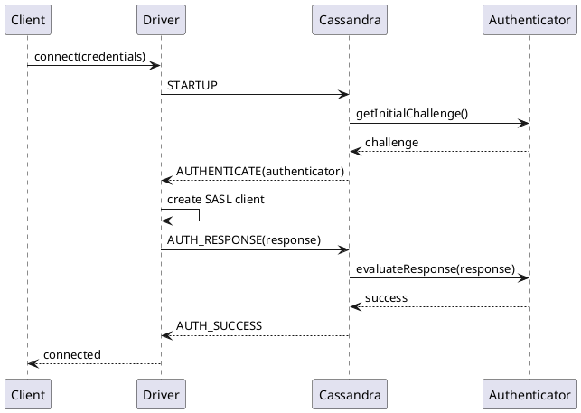
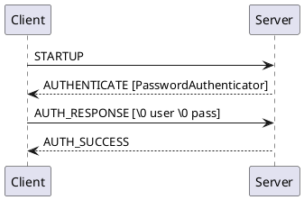
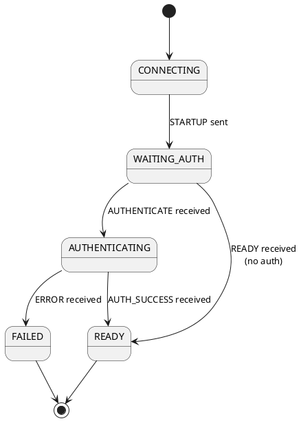

# Authentication Architecture

Authentication in Cassandra verifies client identity before allowing connections. The protocol uses SASL (Simple Authentication and Security Layer) to provide a consistent handshake flow for the built-in PasswordAuthenticator.

## Authentication Model

### SASL Framework

Cassandra implements authentication through SASL, a framework that separates authentication mechanisms from the application protocol:



### Authentication Components

| Component | Role | Location |
|-----------|------|----------|
| Authenticator | Server-side credential validation | Cassandra node |
| AuthProvider | Client-side credential supply | Driver |
| SASL Mechanism | Challenge-response protocol | Both sides |

---

## Protocol Flow

### Initial Handshake

When authentication is enabled, the server responds to STARTUP with AUTHENTICATE instead of READY:

```
Client → Server: STARTUP {CQL_VERSION: "3.0.0"}
Server → Client: AUTHENTICATE {authenticator: "org.apache.cassandra.auth.PasswordAuthenticator"}
```

The authenticator class name indicates which authentication mechanism the server expects.

### Challenge-Response Sequence

For PasswordAuthenticator, authentication completes in a single round:

```
Client → Server: AUTH_RESPONSE {credentials}
Server → Client: AUTH_SUCCESS
```

### Frame Format

**AUTH_RESPONSE:**
```
AUTH_RESPONSE {
    <token>: [bytes] SASL response token
}
```

**AUTH_CHALLENGE:**
```
AUTH_CHALLENGE {
    <token>: [bytes] SASL challenge token
}
```

**AUTH_SUCCESS:**
```
AUTH_SUCCESS {
    <token>: [bytes] Optional final token
}
```

---

## PasswordAuthenticator

The default and primary authenticator uses username/password credentials stored in Cassandra.

### SASL Mechanism

PasswordAuthenticator uses the PLAIN SASL mechanism.

### Credential Format

```
Token = NUL + username + NUL + password
      = \x00 + "username" + \x00 + "password"
```

The token is a byte sequence containing:
1. A null byte (`0x00`)
2. UTF-8 encoded username
3. A null byte (`0x00`)
4. UTF-8 encoded password

### Authentication Sequence



### Server Storage

Credentials are stored in the `system_auth` keyspace:

```sql
-- Credentials stored in system_auth.roles
SELECT role, salted_hash FROM system_auth.roles WHERE role = 'username';
```

Passwords are hashed using bcrypt with a configurable work factor.

### Default Superuser

Cassandra creates a default superuser on first startup:

| Username | Default Password | Notes |
|----------|------------------|-------|
| cassandra | cassandra | Must be changed in production |

!!! danger "Change Default Credentials"
    The default cassandra/cassandra superuser credentials must be changed immediately in any non-development environment. Leaving default credentials is a critical security vulnerability.

---

## Credential Management

### Client-Side Credentials

Drivers support multiple credential sources:

| Source | Use Case | Security |
|--------|----------|----------|
| Hardcoded | Development only | Poor |
| Environment variables | Container deployments | Moderate |
| Configuration file | Traditional deployments | Moderate |
| Credential provider | Production | Good |
| Vault integration | Enterprise | Best |

### Credential Provider Interface

Drivers typically provide a credential abstraction:

```java
// Conceptual interface
interface AuthProvider {
    // Called when authentication is required
    Authenticator newAuthenticator(
        InetSocketAddress host,
        String authenticator
    );
}

interface Authenticator {
    // Initial response token
    byte[] initialResponse();

    // Evaluate server challenge
    byte[] evaluateChallenge(byte[] challenge);

    // Called on success
    void onSuccess(byte[] token);
}
```

### Credential Caching

Drivers cache successful authentication:

```
Cache key: (host, authenticator_class)
Cache value: authenticated_connection
TTL: Connection lifetime

Benefits:
- Avoid repeated authentication
- Reduce load on auth backend
- Faster connection reuse
```

---

## Server-Side Architecture

### Authenticator Interface

Cassandra's authenticator plugin interface:

```java
// Simplified interface
public interface IAuthenticator {
    // Whether authentication is required
    boolean requireAuthentication();

    // Supported SASL mechanisms
    Set<String> supportedMechanisms();

    // Create SASL negotiator for connection
    SaslNegotiator newSaslNegotiator(InetAddress clientAddress);

    // Validate credentials (legacy)
    AuthenticatedUser authenticate(Map<String, String> credentials);
}
```

### Built-in Authenticators

| Authenticator | Description |
|---------------|-------------|
| `AllowAllAuthenticator` | No authentication (default) |
| `PasswordAuthenticator` | Username/password authentication |

### Role Validation

After SASL completes, the server validates the authenticated identity:

```
1. SASL authentication succeeds
2. Extract username from credentials
3. Lookup role in system_auth.roles
4. Verify role can login (LOGIN = true)
5. Establish session with role identity
```

### Authentication Caching

Server caches authentication results:

```yaml
# cassandra.yaml
credentials_validity_in_ms: 2000
credentials_update_interval_in_ms: 2000
credentials_cache_max_entries: 1000
```

| Parameter | Description |
|-----------|-------------|
| validity | How long cached credentials are valid |
| update_interval | Background refresh interval |
| max_entries | Maximum cached credentials |

---

## Security Considerations

### Password Security

**Storage:**
- Passwords never stored in plaintext
- Bcrypt hashing with configurable rounds
- Salt per password

**Transmission:**

- PLAIN mechanism sends password in cleartext within the protocol
- TLS encryption strongly recommended
- Without TLS, credentials are visible to network observers

!!! warning "Enable TLS"
    Without TLS encryption, credentials are transmitted in cleartext and can be captured by network observers. Always enable client-to-node encryption in production environments.

### Enabling Authentication

```yaml
# cassandra.yaml
authenticator: PasswordAuthenticator
```

After enabling, restart all nodes and update client configurations.

### Credential Rotation

**Rotating Passwords:**
```sql
-- 1. Create new role with same permissions
CREATE ROLE new_app_user WITH PASSWORD = 'new_password' AND LOGIN = true;
GRANT existing_role TO new_app_user;

-- 2. Update applications to use new credentials
-- 3. Revoke old credentials
ALTER ROLE old_app_user WITH LOGIN = false;
```

### Failed Authentication Handling

| Event | Server Action | Client Action |
|-------|---------------|---------------|
| Wrong password | ERROR (Bad credentials) | Report to application |
| Unknown user | ERROR (Bad credentials) | Report to application |
| Locked account | ERROR (Bad credentials) | Report to application |

**Security Note:** Error messages are intentionally vague to prevent user enumeration.

### Brute Force Protection

Cassandra has limited built-in protection:

- No automatic lockout
- No rate limiting
- Relies on network-level controls

**Recommendations:**
- Use strong passwords
- Enable TLS
- Network-level rate limiting
- Monitor authentication failures
- Restrict network access to trusted clients

---

## Connection States

### State Machine



### Timeouts

| Timeout | Scope | Typical Value |
|---------|-------|---------------|
| Connection timeout | TCP connect | 5 seconds |
| Authentication timeout | SASL exchange | 12 seconds |
| Initial handshake | STARTUP to READY | 30 seconds |

---

## Internode Authentication

### Node-to-Node Authentication

Cassandra nodes also authenticate with each other:

```yaml
# cassandra.yaml
internode_authenticator: org.apache.cassandra.auth.AllowAllInternodeAuthenticator
```

**Options:**
- `AllowAllInternodeAuthenticator` - No authentication (default)
- Custom implementations for specific requirements

### Certificate-Based Authentication

With internode encryption, certificate validation provides authentication:

```yaml
server_encryption_options:
    internode_encryption: all
    require_client_auth: true
    truststore: /path/to/truststore.jks
```

This approach uses mutual TLS (mTLS) where both nodes present certificates that are validated against a trusted certificate authority.

---

## Performance Considerations

### Authentication Latency

| Scenario | Typical Latency | Notes |
|----------|-----------------|-------|
| Cached credentials | <1 ms | Cache hit on server |
| Uncached credentials | 1-5 ms | Bcrypt verification |

### Optimization Strategies

1. **Credential caching** - Server caches validated credentials
2. **Connection pooling** - Amortize authentication cost across requests
3. **Keep-alive** - Maintain connections to avoid re-authentication

---

## Related Documentation

- **[CQL Protocol](cql-protocol.md)** - Protocol handshake details
- **[Async Connections](async-connections.md)** - Connection lifecycle
