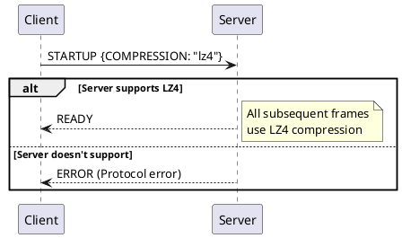

# Protocol Compression

The CQL protocol supports frame-level compression to reduce network bandwidth between clients and Cassandra nodes. Compression is particularly beneficial for large result sets, batch operations, and high-latency network connections.

## Compression Overview

### Why Compress?

Network bandwidth is often the bottleneck for Cassandra workloads:

| Scenario | Uncompressed | Compressed (LZ4) | Savings |
|----------|--------------|------------------|---------|
| Text-heavy result (1000 rows) | 500 KB | 80 KB | 84% |
| Binary data result | 500 KB | 400 KB | 20% |
| Small query/response | 200 B | 250 B | -25% (overhead) |

**Compression benefits:**
- Reduced network utilization
- Lower cloud egress costs
- Faster transfers on slow links
- Better throughput on saturated networks

**Compression costs:**
- CPU cycles for encode/decode
- Overhead for small messages
- Memory for buffers

### Supported Algorithms

| Algorithm | Speed | Ratio | Use Case |
|-----------|-------|-------|----------|
| LZ4 | Very fast | Moderate | General purpose (recommended) |
| Snappy | Fast | Moderate | Alternative to LZ4 |
| None | N/A | N/A | Low-latency, small payloads |

!!! tip "LZ4 Recommended"
    LZ4 provides the best balance of compression ratio and CPU efficiency. Enable it by default unless specific requirements dictate otherwise.

---

## Protocol Negotiation

### Enabling Compression

Compression is negotiated during connection establishment:



### STARTUP Options

```
STARTUP {
    CQL_VERSION: "3.0.0",
    COMPRESSION: "lz4"  // or "snappy" or omit for none
}
```

### Discovering Support

Query supported compression before connecting:

```
Client → Server: OPTIONS
Server → Client: SUPPORTED {
    COMPRESSION: ["lz4", "snappy"],
    CQL_VERSION: ["3.4.6"]
}
```

---

## Frame Compression

### Compression Flag

The frame header indicates compression:

```
Frame Header:
  Byte 1: flags
    Bit 0: COMPRESSION (0x01)
      0 = Body is uncompressed
      1 = Body is compressed
```

### Compressed Frame Format

**LZ4 Format:**
```
+-------------------------+
| Frame Header (9 bytes)  |  ← Not compressed
+-------------------------+
| Uncompressed Length (4) |  ← Original size (big-endian int)
+-------------------------+
| LZ4 Compressed Data     |  ← Compressed frame body
+-------------------------+
```

**Snappy Format:**
```
+-------------------------+
| Frame Header (9 bytes)  |  ← Not compressed
+-------------------------+
| Snappy Compressed Data  |  ← Compressed frame body (includes length)
+-------------------------+
```

### Compression Decision

Not all frames benefit from compression:

```python
# Conceptual compression decision
def should_compress(body):
    # Small bodies may expand with compression
    if len(body) < COMPRESSION_THRESHOLD:  # e.g., 512 bytes
        return False

    # Already compressed data doesn't benefit
    if is_compressed_content(body):
        return False

    return True
```

---

## LZ4 Compression

### Algorithm Characteristics

LZ4 is a fast lossless compression algorithm:

| Metric | Value |
|--------|-------|
| Compression speed | ~780 MB/s |
| Decompression speed | ~4970 MB/s |
| Compression ratio | 2.1:1 (typical text) |
| Memory usage | Low |

### LZ4 Framing

Cassandra uses raw LZ4 block format with explicit length:

```
LZ4 Compressed Body:
  [4 bytes] - Uncompressed length (big-endian)
  [N bytes] - LZ4 compressed data

Decompression:
  1. Read uncompressed length
  2. Allocate output buffer
  3. LZ4 decompress into buffer
```

### Implementation Notes

```python
# Conceptual LZ4 compression
import lz4.block

def compress_frame(body):
    compressed = lz4.block.compress(body, store_size=False)
    # Prepend original length
    length_prefix = len(body).to_bytes(4, 'big')
    return length_prefix + compressed

def decompress_frame(data):
    uncompressed_length = int.from_bytes(data[:4], 'big')
    compressed = data[4:]
    return lz4.block.decompress(compressed, uncompressed_size=uncompressed_length)
```

---

## Snappy Compression

### Algorithm Characteristics

Snappy prioritizes speed over compression ratio:

| Metric | Value |
|--------|-------|
| Compression speed | ~500 MB/s |
| Decompression speed | ~1500 MB/s |
| Compression ratio | 1.5-2:1 (typical) |
| Memory usage | Low |

### Snappy Framing

Snappy includes length in its format:

```
Snappy Compressed Body:
  [Varint]  - Uncompressed length (Snappy format)
  [N bytes] - Snappy compressed data

The length is encoded in the Snappy stream itself.
```

---

## Performance Analysis

### Compression Ratios by Data Type

| Data Type | LZ4 Ratio | Snappy Ratio |
|-----------|-----------|--------------|
| ASCII text | 3:1 - 5:1 | 2:1 - 4:1 |
| JSON | 4:1 - 8:1 | 3:1 - 6:1 |
| UUIDs | 2:1 - 3:1 | 1.5:1 - 2:1 |
| Random binary | 1:1 - 1.1:1 | 1:1 - 1.05:1 |
| Repeated values | 10:1+ | 8:1+ |

### CPU vs Network Tradeoff

```
Without compression:
  Network time = data_size / bandwidth
  CPU time = 0

With compression:
  Network time = compressed_size / bandwidth
  CPU time = compression_time + decompression_time

Break-even when:
  (data_size - compressed_size) / bandwidth > cpu_time
```

**Example calculation:**
```
Data: 100 KB, compresses to 20 KB
Bandwidth: 1 Gbps = 125 MB/s
LZ4 speed: 780 MB/s compress, 4970 MB/s decompress

Without compression:
  Network: 100 KB / 125 MB/s = 0.8 ms

With compression:
  Compress: 100 KB / 780 MB/s = 0.13 ms
  Network: 20 KB / 125 MB/s = 0.16 ms
  Decompress: 100 KB / 4970 MB/s = 0.02 ms
  Total: 0.31 ms

Savings: 0.8 - 0.31 = 0.49 ms (61% faster)
```

### When Compression Helps

| Scenario | Compression Benefit |
|----------|---------------------|
| Large text results | High |
| High-latency links | High |
| Bandwidth-limited | High |
| Small queries/responses | Low or negative |
| Already compressed data | Negative |
| CPU-bound workloads | Low |

### When to Avoid Compression

- Very small messages (<512 bytes)
- Binary/compressed content (images, encrypted data)
- Extremely CPU-constrained clients
- Ultra-low-latency requirements (<1ms)

---

## Configuration

### Driver Configuration

Most drivers default to LZ4 when available:

```python
# Python driver
from cassandra.cluster import Cluster

cluster = Cluster(
    compression=True  # Uses LZ4 by default
)

# Or explicitly
cluster = Cluster(
    compression='lz4'  # or 'snappy' or False
)
```

### Server Configuration

Cassandra supports compression without additional configuration. The server advertises supported algorithms in the SUPPORTED response.

### Compression Threshold

Some drivers support minimum size thresholds:

```java
// Conceptual - compress only if body > threshold
builder.withCompression(
    ProtocolOptions.Compression.LZ4,
    512  // Minimum bytes to compress
);
```

---

## Memory Considerations

### Buffer Allocation

Compression requires temporary buffers:

```
Compression:
  Input buffer: Original data
  Output buffer: Max compressed size
  Working memory: Algorithm-specific

LZ4 working memory: ~16 KB
Snappy working memory: ~32 KB
```

### Buffer Pooling

Efficient implementations pool buffers:

```python
# Conceptual buffer pool
class CompressionBufferPool:
    def __init__(self, max_size, buffer_size):
        self.pool = Queue(max_size)
        self.buffer_size = buffer_size

    def acquire(self):
        try:
            return self.pool.get_nowait()
        except Empty:
            return bytearray(self.buffer_size)

    def release(self, buffer):
        try:
            self.pool.put_nowait(buffer)
        except Full:
            pass  # Discard if pool full
```

### Streaming Compression

For very large frames, streaming reduces memory:

```
Stream compression:
  Process data in chunks
  Never hold entire message in memory
  Slightly lower compression ratio
```

---

## Monitoring Compression

### Metrics to Track

| Metric | Purpose |
|--------|---------|
| Compression ratio | Effectiveness |
| Compression time | CPU overhead |
| Bytes saved | Bandwidth reduction |
| Compressed message count | Usage patterns |

### Diagnostic Information

```python
# Conceptual metrics collection
class CompressionMetrics:
    def record_compression(self, original_size, compressed_size, duration):
        self.ratio_histogram.observe(original_size / compressed_size)
        self.time_histogram.observe(duration)
        self.bytes_saved.inc(original_size - compressed_size)
        self.messages_compressed.inc()
```

---

## Compression and TLS

### Interaction with Encryption

When both compression and TLS are enabled:

```
Order of operations:
  Send: Serialize → Compress → Encrypt → Transmit
  Receive: Receive → Decrypt → Decompress → Deserialize

Note: Compression happens BEFORE encryption
```

### Security Considerations

Compression before encryption can leak information (CRIME/BREACH attacks):

- CQL protocol is less vulnerable than HTTP
- No user-controlled input in headers
- Still, be aware of theoretical risks
- Consider disabling compression for highly sensitive data

!!! note "Compression Side-Channel Attacks"
    The CRIME/BREACH class of attacks exploit compression to infer encrypted content. While the CQL protocol is less susceptible than HTTP, extremely sensitive deployments should evaluate this risk.

---

## Best Practices

### General Recommendations

1. **Enable LZ4 by default** - Best balance of speed and ratio
2. **Monitor compression metrics** - Verify actual benefit
3. **Set appropriate thresholds** - Avoid compressing small messages
4. **Profile CPU impact** - Ensure not CPU-bound

### Workload-Specific Guidance

| Workload | Recommendation |
|----------|----------------|
| OLTP (small reads/writes) | Maybe disable or high threshold |
| Analytics (large scans) | Enable with LZ4 |
| Batch loading | Enable, monitor throughput |
| Cross-DC replication | Enable, significant savings |

---

## Related Documentation

- **[CQL Protocol](cql-protocol.md)** - Frame format and flags
- **[Async Connections](async-connections.md)** - Connection establishment
- **[Throttling](throttling.md)** - Bandwidth management
