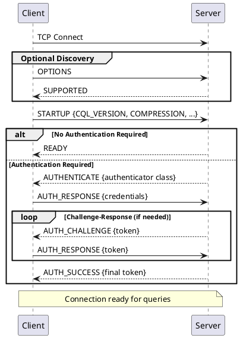

# CQL Native Protocol Specification

The CQL Native Protocol is a frame-based binary protocol that governs all client-server communication in Apache Cassandra. This specification documents the complete protocol including frame format, message types, data encoding, and version-specific features.

## Protocol Overview

The CQL Native Protocol operates over TCP and provides:

- **Request-response messaging** with asynchronous multiplexing
- **Binary encoding** for efficiency and type safety
- **Version negotiation** for backward compatibility
- **Optional compression** to reduce bandwidth
- **Server-pushed events** for topology and schema changes

### Version History

| Version | Cassandra | Status | Notable Changes |
|---------|-----------|--------|-----------------|
| v1 | 1.2 | Deprecated | Initial release |
| v2 | 2.0 | Deprecated | Batch, query paging, result metadata flags |
| v3 | 2.1+ | Supported | 32K streams, UDT, tuple types, timestamps on queries |
| v4 | 2.2+ | Supported | Custom payloads, warnings, unset values, dates/times |
| v5 | 4.0+ | Supported | Per-query keyspace, NOW_IN_SECONDS, duration type, result metadata ID |
| v6 | 5.0+ | Current | Tablets, vector types, rate limiting errors |

### Version Negotiation

Protocol version is established during connection:

1. Client sends STARTUP with desired version in frame header
2. If server supports this version, connection proceeds
3. If not, server responds with ERROR containing supported versions
4. Client reconnects with mutually supported version

Clients should attempt the highest version they support and fall back as needed.

---

## Primitive Types

!!! info "Byte Order"
    All multi-byte integers in the CQL protocol are encoded in **big-endian** (network byte order).

### Numeric Types

| Type | Size | Description |
|------|------|-------------|
| `[byte]` | 1 | Unsigned 8-bit integer |
| `[short]` | 2 | Unsigned 16-bit integer |
| `[int]` | 4 | Signed 32-bit integer |
| `[long]` | 8 | Signed 64-bit integer |

### String Types

| Type | Format | Description |
|------|--------|-------------|
| `[string]` | `[short]` length + UTF-8 bytes | Standard string (max 65535 bytes) |
| `[long string]` | `[int]` length + UTF-8 bytes | Extended string (max 2GB) |

### Byte Sequences

| Type | Format | Description |
|------|--------|-------------|
| `[bytes]` | `[int]` length + raw bytes | Variable-length bytes; -1 length = null |
| `[short bytes]` | `[short]` length + raw bytes | Short byte sequence (max 65535 bytes) |

!!! warning "Null vs Unset Values"
    A `[bytes]` value with length -1 represents null. A length of -2 represents "not set" (v4+). These are semantically different: NULL explicitly sets a column to null, while NOT SET leaves the column unchanged in UPDATE operations.

### UUID

| Type | Size | Description |
|------|------|-------------|
| `[uuid]` | 16 | UUID in standard binary format (big-endian) |

### Internet Address

| Type | Format | Description |
|------|--------|-------------|
| `[inet]` | `[byte]` size + address bytes | IPv4 (4 bytes) or IPv6 (16 bytes) |
| `[inetaddr]` | `[inet]` + `[int]` port | Address with port number |

### Consistency Level

| Type | Size | Description |
|------|------|-------------|
| `[consistency]` | 2 | Consistency level as unsigned short |

### String Collections

| Type | Format | Description |
|------|--------|-------------|
| `[string list]` | `[short]` count + repeated `[string]` | List of strings |
| `[string map]` | `[short]` count + repeated (`[string]` key + `[string]` value) | String-to-string map |
| `[string multimap]` | `[short]` count + repeated (`[string]` key + `[string list]` values) | String-to-string-list map |
| `[bytes map]` | `[short]` count + repeated (`[string]` key + `[bytes]` value) | String-to-bytes map |

---

## Frame Format

All protocol communication consists of frames. Each frame has a fixed 9-byte header followed by a variable-length body.

### Frame Header (9 bytes)

```
Byte:     0         1         2         3         4         5         6         7         8
       +----------+----------+----------+----------+----------+----------+----------+----------+----------+
       | version  |  flags   |       stream_id     |  opcode  |                length                     |
       +----------+----------+----------+----------+----------+----------+----------+----------+----------+
       |  1 byte  |  1 byte  |       2 bytes       |  1 byte  |                4 bytes                    |
```

| Offset | Field | Size | Description |
|--------|-------|------|-------------|
| 0 | version | 1 byte | Protocol version with direction bit |
| 1 | flags | 1 byte | Frame flags |
| 2-3 | stream | 2 bytes | Stream identifier (big-endian) |
| 4 | opcode | 1 byte | Message type |
| 5-8 | length | 4 bytes | Body length in bytes (big-endian) |

### Version Byte

```
Bit 7 (MSB): Direction
    0 = Request (client → server)
    1 = Response (server → client)

Bits 6-0: Protocol version number
```

**Examples:**

| Hex Value | Binary | Meaning |
|-----------|--------|---------|
| `0x03` | `0000 0011` | Request, protocol v3 |
| `0x83` | `1000 0011` | Response, protocol v3 |
| `0x04` | `0000 0100` | Request, protocol v4 |
| `0x84` | `1000 0100` | Response, protocol v4 |
| `0x05` | `0000 0101` | Request, protocol v5 |
| `0x85` | `1000 0101` | Response, protocol v5 |

### Frame Flags

| Bit | Flag | Description | Versions |
|-----|------|-------------|----------|
| 0 | COMPRESSION | Body is compressed | All |
| 1 | TRACING | Request: enable tracing; Response: tracing ID included | All |
| 2 | CUSTOM_PAYLOAD | Custom payload map included | v4+ |
| 3 | WARNING | Response contains warning messages | v4+ |
| 4 | USE_BETA | Enable beta protocol features | v5+ |
| 5-7 | Reserved | Must be zero | - |

**Flag combinations:** Multiple flags may be set. When COMPRESSION is set, all other frame body processing occurs after decompression.

### Stream Identifier

The stream ID enables request-response multiplexing:

- **Range:** 0 to 32767 (signed 16-bit, but negative values reserved)
- **Stream 0:** Reserved for server-initiated EVENT messages
- **Client streams:** 1 to 32767 for client requests
- **Matching:** Server responses carry the same stream ID as the request
- **Reuse:** Stream IDs may be reused after response received

!!! note "Stream Limit History"
    Protocol v1-v2 supported only streams 0-127. Protocol v3+ expanded this to 32768 concurrent streams per connection.

### Maximum Frame Size

The default maximum frame size is 256 MB (268,435,456 bytes). This is configurable on the server via `native_transport_max_frame_size_in_mb`.

!!! tip "Frame Size Tuning"
    Increasing the maximum frame size may be necessary for queries returning very large result sets or batch operations with many statements.

---

## Opcodes

### Request Opcodes (Client → Server)

| Opcode | Name | Description |
|--------|------|-------------|
| `0x01` | STARTUP | Initialize connection, negotiate options |
| `0x05` | OPTIONS | Query server capabilities |
| `0x07` | QUERY | Execute CQL query string |
| `0x09` | PREPARE | Prepare CQL statement for later execution |
| `0x0A` | EXECUTE | Execute prepared statement |
| `0x0B` | REGISTER | Subscribe to server events |
| `0x0D` | BATCH | Execute batch of statements |
| `0x0F` | AUTH_RESPONSE | Respond to authentication challenge |

### Response Opcodes (Server → Client)

| Opcode | Name | Description |
|--------|------|-------------|
| `0x00` | ERROR | Error response with code and message |
| `0x02` | READY | Connection initialized successfully |
| `0x03` | AUTHENTICATE | Authentication required |
| `0x06` | SUPPORTED | Response to OPTIONS with capabilities |
| `0x08` | RESULT | Query/execute result |
| `0x0C` | EVENT | Asynchronous event notification |
| `0x0E` | AUTH_CHALLENGE | Authentication challenge token |
| `0x10` | AUTH_SUCCESS | Authentication completed successfully |

---

## Connection Establishment

### Connection Sequence



### OPTIONS Request

The OPTIONS message has an empty body. It requests the server's supported protocol options.

**Body:** Empty (0 bytes)

### SUPPORTED Response

Response to OPTIONS containing server capabilities.

**Body:**
```
SUPPORTED {
    <options>: [string multimap]
}
```

**Standard options:**

| Key | Description | Example Values |
|-----|-------------|----------------|
| `CQL_VERSION` | Supported CQL versions | `["3.4.6", "3.4.7"]` |
| `COMPRESSION` | Supported compression algorithms | `["lz4", "snappy"]` |
| `PROTOCOL_VERSIONS` | Supported protocol versions | `["3/v3", "4/v4", "5/v5", "6/v6"]` |

### STARTUP Request

Initializes the connection with client options.

**Body:**
```
STARTUP {
    <options>: [string map]
}
```

**Required options:**

| Key | Description | Example |
|-----|-------------|---------|
| `CQL_VERSION` | CQL version to use | `"3.4.6"` |

**Optional options:**

| Key | Description | Example | Version |
|-----|-------------|---------|---------|
| `COMPRESSION` | Compression algorithm | `"lz4"` or `"snappy"` | All |
| `NO_COMPACT` | Disable COMPACT STORAGE | `"true"` | v4+ |
| `THROW_ON_OVERLOAD` | Throw error instead of queueing | `"true"` | v4+ |
| `DRIVER_NAME` | Driver identifier | `"DataStax Java Driver"` | v5+ |
| `DRIVER_VERSION` | Driver version | `"4.17.0"` | v5+ |
| `CLIENT_ID` | Unique client identifier | UUID string | v5+ |

### READY Response

Indicates successful connection initialization.

**Body:** Empty (0 bytes)

### AUTHENTICATE Response

Indicates authentication is required.

**Body:**
```
AUTHENTICATE {
    <authenticator>: [string] Java class name of authenticator
}
```

**Common authenticators:**

| Class Name | Authentication Type |
|------------|---------------------|
| `org.apache.cassandra.auth.PasswordAuthenticator` | Username/password |
| `com.datastax.bdp.cassandra.auth.DseAuthenticator` | DSE unified auth |

### AUTH_RESPONSE Request

Client authentication response.

**Body:**
```
AUTH_RESPONSE {
    <token>: [bytes] Authentication token
}
```

For `PasswordAuthenticator`, the token format is:
```
NUL + username + NUL + password
(0x00 byte + UTF-8 username + 0x00 byte + UTF-8 password)
```

### AUTH_CHALLENGE Response

Server requests additional authentication data.

**Body:**
```
AUTH_CHALLENGE {
    <token>: [bytes] Challenge token
}
```

### AUTH_SUCCESS Response

Authentication completed successfully.

**Body:**
```
AUTH_SUCCESS {
    <token>: [bytes] Final token (may be empty)
}
```

---

## Query Execution

### Query Parameters

Query parameters are used by QUERY, EXECUTE, and BATCH messages. The format varies by protocol version.

**Parameter flags (protocol v5+):**

| Bit | Flag | Description |
|-----|------|-------------|
| 0 | VALUES | Values are provided |
| 1 | SKIP_METADATA | Don't include metadata in result |
| 2 | PAGE_SIZE | Page size is set |
| 3 | PAGING_STATE | Paging state is provided |
| 4 | SERIAL_CONSISTENCY | Serial consistency is set |
| 5 | TIMESTAMP | Default timestamp is set |
| 6 | NAMES_FOR_VALUES | Values are named (not positional) |
| 7 | KEYSPACE | Keyspace is specified |
| 8 | NOW_IN_SECONDS | Server time override (v5+) |

**Query parameters structure:**
```
<query_parameters> {
    <consistency>: [consistency]
    <flags>: [int] (v5+) or [byte] (v3-v4)

    if (flags & VALUES):
        if (flags & NAMES_FOR_VALUES):
            <n>: [short] number of values
            <values>: n × ([string] name + [bytes] value)
        else:
            <n>: [short] number of values
            <values>: n × [bytes] value

    if (flags & PAGE_SIZE):
        <page_size>: [int]

    if (flags & PAGING_STATE):
        <paging_state>: [bytes]

    if (flags & SERIAL_CONSISTENCY):
        <serial_consistency>: [consistency]

    if (flags & TIMESTAMP):
        <timestamp>: [long] microseconds since epoch

    if (flags & KEYSPACE):  // v5+
        <keyspace>: [string]

    if (flags & NOW_IN_SECONDS):  // v5+
        <now_in_seconds>: [int] seconds since epoch
}
```

### QUERY Request

Execute a CQL query string.

**Body:**
```
QUERY {
    <query>: [long string] CQL query text
    <query_parameters>: Query parameters (see above)
}
```

### PREPARE Request

Prepare a CQL statement for repeated execution.

**Body (v3-v4):**
```
PREPARE {
    <query>: [long string] CQL statement to prepare
}
```

**Body (v5+):**
```
PREPARE {
    <query>: [long string] CQL statement to prepare
    <flags>: [int]
    if (flags & KEYSPACE):
        <keyspace>: [string]
}
```

### EXECUTE Request

Execute a previously prepared statement.

**Body (v3-v4):**
```
EXECUTE {
    <id>: [short bytes] Prepared statement ID
    <query_parameters>: Query parameters
}
```

**Body (v5+):**
```
EXECUTE {
    <id>: [short bytes] Prepared statement ID
    <result_metadata_id>: [short bytes] Expected result metadata ID
    <query_parameters>: Query parameters
}
```

The `result_metadata_id` allows the server to skip sending result metadata if it hasn't changed since preparation.

### BATCH Request

Execute multiple statements atomically.

**Body:**
```
BATCH {
    <type>: [byte] Batch type
    <n>: [short] Number of statements
    <statements>: n × statement entries
    <consistency>: [consistency]
    <flags>: [int] (v5+) or [byte] (v3-v4)

    if (flags & SERIAL_CONSISTENCY):
        <serial_consistency>: [consistency]

    if (flags & TIMESTAMP):
        <timestamp>: [long]

    if (flags & KEYSPACE):  // v5+
        <keyspace>: [string]

    if (flags & NOW_IN_SECONDS):  // v5+
        <now_in_seconds>: [int]
}
```

**Batch types:**

| Value | Type | Description |
|-------|------|-------------|
| `0` | LOGGED | Atomic batch with batch log for recovery |
| `1` | UNLOGGED | Non-atomic, no batch log |
| `2` | COUNTER | Counter operations only |

!!! warning "Batch Performance"
    Batches are not a performance optimization. They are designed for atomicity across multiple partitions. For single-partition operations, individual statements often perform better.

**Statement entry:**
```
<statement> {
    <kind>: [byte]
        0 = query string
        1 = prepared statement ID

    if (kind == 0):
        <query>: [long string]
    else:
        <id>: [short bytes]

    <n>: [short] Number of values
    <values>: n × [bytes] (or name+value pairs if NAMES_FOR_VALUES)
}
```

---

## Consistency Levels

| Value | Name | Description |
|-------|------|-------------|
| `0x0000` | ANY | Write: any node; Read: not supported |
| `0x0001` | ONE | Single replica |
| `0x0002` | TWO | Two replicas |
| `0x0003` | THREE | Three replicas |
| `0x0004` | QUORUM | Majority: ⌊RF/2⌋ + 1 |
| `0x0005` | ALL | All replicas |
| `0x0006` | LOCAL_QUORUM | Quorum within local datacenter |
| `0x0007` | EACH_QUORUM | Quorum in each datacenter |
| `0x0008` | SERIAL | Linearizable (Paxos) |
| `0x0009` | LOCAL_SERIAL | Linearizable within local DC |
| `0x000A` | LOCAL_ONE | Single replica in local DC |

---

## Result Message

The RESULT message returns query results in various formats.

**Body:**
```
RESULT {
    <kind>: [int] Result type
    <body>: Kind-specific content
}
```

### Result Kinds

| Value | Kind | Description |
|-------|------|-------------|
| `0x0001` | Void | No result data |
| `0x0002` | Rows | Row data with metadata |
| `0x0003` | Set_keyspace | USE keyspace confirmation |
| `0x0004` | Prepared | Prepared statement result |
| `0x0005` | Schema_change | Schema modification result |

### Void Result

Returned for statements that don't produce rows (INSERT, UPDATE, DELETE).

**Body:** Just the kind `[int]` = 1, no additional data.

### Rows Result

**Body:**
```
Rows {
    <metadata>: Rows metadata
    <rows_count>: [int]
    <rows_content>: rows_count × row data
}
```

**Rows metadata:**
```
<rows_metadata> {
    <flags>: [int]
    <columns_count>: [int]

    if (flags & HAS_MORE_PAGES):
        <paging_state>: [bytes]

    if (flags & METADATA_CHANGED):  // v5+
        <new_metadata_id>: [short bytes]

    if NOT (flags & NO_METADATA):
        if (flags & GLOBAL_TABLES_SPEC):
            <global_keyspace>: [string]
            <global_table>: [string]
            <column_specs>: columns_count × column_spec_no_table
        else:
            <column_specs>: columns_count × column_spec_with_table
}
```

**Metadata flags:**

| Bit | Flag | Description |
|-----|------|-------------|
| 0 | GLOBAL_TABLES_SPEC | All columns from same table |
| 1 | HAS_MORE_PAGES | More pages available |
| 2 | NO_METADATA | Metadata omitted (SKIP_METADATA was set) |
| 3 | METADATA_CHANGED | Result metadata ID changed (v5+) |

**Column specification (with table):**
```
<column_spec_with_table> {
    <keyspace>: [string]
    <table>: [string]
    <name>: [string]
    <type>: [option] Column data type
}
```

**Column specification (without table):**
```
<column_spec_no_table> {
    <name>: [string]
    <type>: [option] Column data type
}
```

**Row content:**
```
<row> {
    <values>: columns_count × [bytes]
}
```

Each value is encoded as `[bytes]` according to its column type. Null values have length -1.

### Set_keyspace Result

Returned after successful USE statement.

**Body:**
```
Set_keyspace {
    <keyspace>: [string]
}
```

### Prepared Result

Returned after successful PREPARE.

**Body (v3-v4):**
```
Prepared {
    <id>: [short bytes] Statement ID
    <metadata>: Prepared metadata (bound variables)
    <result_metadata>: Rows metadata (result columns)
}
```

**Body (v5+):**
```
Prepared {
    <id>: [short bytes] Statement ID
    <result_metadata_id>: [short bytes]
    <metadata>: Prepared metadata
    <result_metadata>: Rows metadata
}
```

**Prepared metadata:**
```
<prepared_metadata> {
    <flags>: [int]
    <columns_count>: [int]
    <pk_count>: [int] Number of partition key columns

    if (pk_count > 0):
        <pk_indices>: pk_count × [short] Column indices

    if (flags & GLOBAL_TABLES_SPEC):
        <global_keyspace>: [string]
        <global_table>: [string]
        <column_specs>: columns_count × column_spec_no_table
    else:
        <column_specs>: columns_count × column_spec_with_table
}
```

The `pk_indices` array identifies which bound variables form the partition key, enabling token-aware routing.

### Schema_change Result

Returned after DDL operations.

**Body:**
```
Schema_change {
    <change_type>: [string] "CREATED" | "UPDATED" | "DROPPED"
    <target>: [string] Object type
    <options>: Target-specific options
}
```

**Target types and options:**

| Target | Options |
|--------|---------|
| `KEYSPACE` | `<keyspace>: [string]` |
| `TABLE` | `<keyspace>: [string]`, `<table>: [string]` |
| `TYPE` | `<keyspace>: [string]`, `<type>: [string]` |
| `FUNCTION` | `<keyspace>: [string]`, `<function>: [string]`, `<arg_types>: [string list]` |
| `AGGREGATE` | `<keyspace>: [string]`, `<aggregate>: [string]`, `<arg_types>: [string list]` |

---

## Data Type Encoding

### Type Option Format

Column types are encoded as "options":

```
<option> {
    <id>: [short] Type ID
    <value>: Type-specific data (if required)
}
```

### Native Types

| ID | CQL Type | Wire Encoding |
|----|----------|---------------|
| `0x0000` | custom | `[string]` class name + custom encoding |
| `0x0001` | ascii | UTF-8 bytes (ASCII subset) |
| `0x0002` | bigint | 8 bytes, signed big-endian |
| `0x0003` | blob | Raw bytes |
| `0x0004` | boolean | 1 byte: `0x00` = false, `0x01` = true |
| `0x0005` | counter | 8 bytes, signed big-endian |
| `0x0006` | decimal | `[int]` scale + varint unscaled value |
| `0x0007` | double | 8 bytes, IEEE 754 big-endian |
| `0x0008` | float | 4 bytes, IEEE 754 big-endian |
| `0x0009` | int | 4 bytes, signed big-endian |
| `0x000A` | — | (Reserved) |
| `0x000B` | timestamp | 8 bytes, milliseconds since Unix epoch |
| `0x000C` | uuid | 16 bytes, standard UUID binary format |
| `0x000D` | varchar/text | UTF-8 bytes |
| `0x000E` | varint | Variable-length two's complement |
| `0x000F` | timeuuid | 16 bytes, Type 1 UUID |
| `0x0010` | inet | 4 bytes (IPv4) or 16 bytes (IPv6) |
| `0x0011` | date | 4 bytes, unsigned days since epoch (2^31 = Jan 1, 1970) |
| `0x0012` | time | 8 bytes, nanoseconds since midnight |
| `0x0013` | smallint | 2 bytes, signed big-endian |
| `0x0014` | tinyint | 1 byte, signed |
| `0x0015` | duration | varint months + varint days + varint nanoseconds |
| `0x0016` | vector | (v6+) Fixed-size vector with element type and dimensions |

### Detailed Native Type Encoding

**decimal:**
```
<decimal> {
    <scale>: [int] Number of decimal places
    <unscaled>: [varint] Unscaled integer value
}
Value = unscaled × 10^(-scale)
```

**varint:**
```
Variable-length two's complement integer
Minimum bytes needed to represent the value
Sign-extended as needed
Examples:
    0 → 0x00
    127 → 0x7F
    128 → 0x0080
    -1 → 0xFF
    -128 → 0x80
    -129 → 0xFF7F
```

**date:**
```
Unsigned 32-bit integer
Days since January 1, 1970 (Unix epoch)
With offset: value 2^31 (0x80000000) = January 1, 1970
Range: -5877641-06-23 to 5881580-07-11
```

**time:**
```
64-bit signed integer
Nanoseconds since midnight
Range: 0 to 86399999999999
```

**duration:**
```
<duration> {
    <months>: [varint]
    <days>: [varint]
    <nanoseconds>: [varint]
}
Each component uses zigzag encoding for the varint
```

**inet:**
```
IPv4: 4 bytes, network byte order
IPv6: 16 bytes, network byte order
No length prefix - inferred from value length
```

### Collection Types

| ID | CQL Type | Type Option Value |
|----|----------|-------------------|
| `0x0020` | list | `<element_type>: [option]` |
| `0x0021` | map | `<key_type>: [option]`, `<value_type>: [option]` |
| `0x0022` | set | `<element_type>: [option]` |

**Collection value encoding:**

```
List/Set:
    <n>: [int] Number of elements
    <elements>: n × [bytes] encoded element values

Map:
    <n>: [int] Number of key-value pairs
    <entries>: n × ([bytes] key + [bytes] value)
```

### User-Defined Types (UDT)

| ID | Type Option Value |
|----|-------------------|
| `0x0030` | `<keyspace>: [string]`, `<name>: [string]`, `<n>: [short]`, `<fields>: n × ([string] field_name + [option] field_type)` |

**UDT value encoding:**
```
<udt_value> {
    <fields>: n × [bytes] field values in definition order
}
Null fields encoded with length -1
Missing trailing fields assumed null
```

### Tuple Types

| ID | Type Option Value |
|----|-------------------|
| `0x0031` | `<n>: [short]`, `<types>: n × [option]` |

**Tuple value encoding:**
```
<tuple_value> {
    <elements>: n × [bytes] element values in definition order
}
```

### Vector Types (v6+)

| ID | Type Option Value |
|----|-------------------|
| `0x0016` | `<element_type>: [option]`, `<dimensions>: [int]` |

**Vector value encoding:**
```
<vector_value> {
    <elements>: dimensions × encoded element (no length prefix per element)
}
```

---

## Error Handling

### ERROR Response

**Body:**
```
ERROR {
    <code>: [int] Error code
    <message>: [string] Human-readable description
    <additional>: Error-specific additional data
}
```

### Error Codes

#### Server Errors (0x0000 - 0x00FF)

| Code | Name | Description |
|------|------|-------------|
| `0x0000` | Server error | Unexpected server-side error |
| `0x000A` | Protocol error | Invalid protocol message |

#### Authentication Errors (0x0100 - 0x01FF)

| Code | Name | Description |
|------|------|-------------|
| `0x0100` | Bad credentials | Authentication failed |

#### Coordinator Errors (0x1000 - 0x1FFF)

| Code | Name | Additional Data |
|------|------|-----------------|
| `0x1000` | Unavailable | `<consistency>`, `<required>: [int]`, `<alive>: [int]` |
| `0x1001` | Overloaded | None |
| `0x1002` | Is_bootstrapping | None |
| `0x1003` | Truncate_error | None |
| `0x1100` | Write_timeout | See below |
| `0x1200` | Read_timeout | See below |
| `0x1300` | Read_failure | See below |
| `0x1400` | Function_failure | `<keyspace>`, `<function>`, `<arg_types>` |
| `0x1500` | Write_failure | See below |
| `0x1600` | CDC_write_failure | None (v5+) |
| `0x1700` | CAS_write_unknown | See below (v5+) |
| `0x1800` | Rate_limit | (v6+) |

#### Query Errors (0x2000 - 0x2FFF)

| Code | Name | Additional Data |
|------|------|-----------------|
| `0x2000` | Syntax_error | None |
| `0x2100` | Unauthorized | None |
| `0x2200` | Invalid | None |
| `0x2300` | Config_error | None |
| `0x2400` | Already_exists | `<keyspace>`, `<table>` (empty if keyspace) |
| `0x2500` | Unprepared | `<id>: [short bytes]` Statement ID |

!!! tip "Handling Unprepared Errors"
    When receiving an Unprepared error (0x2500), the driver should automatically re-prepare the statement and retry. Most drivers handle this transparently.

### Timeout/Failure Error Details

**Write_timeout (0x1100):**
```
<write_timeout_data> {
    <consistency>: [consistency]
    <received>: [int] Acknowledgments received
    <required>: [int] Acknowledgments required
    <write_type>: [string]
    <contentions>: [short] (only for CAS, v5+)
}
```

**Write types:**
- `SIMPLE` - Single partition, non-batch
- `BATCH` - Logged batch
- `UNLOGGED_BATCH` - Unlogged batch
- `COUNTER` - Counter operation
- `BATCH_LOG` - Batch log write
- `CAS` - Compare-and-set (LWT)
- `VIEW` - Materialized view update
- `CDC` - CDC write

**Read_timeout (0x1200):**
```
<read_timeout_data> {
    <consistency>: [consistency]
    <received>: [int] Responses received
    <required>: [int] Responses required
    <data_present>: [byte] 0 = no data, 1 = data received
}
```

**Read_failure (0x1300):**
```
<read_failure_data> {
    <consistency>: [consistency]
    <received>: [int]
    <required>: [int]
    <num_failures>: [int]
    <failure_map>: Map of endpoint → error code (v5+)
    <data_present>: [byte]
}
```

**Write_failure (0x1500):**
```
<write_failure_data> {
    <consistency>: [consistency]
    <received>: [int]
    <required>: [int]
    <num_failures>: [int]
    <failure_map>: Map of endpoint → error code (v5+)
    <write_type>: [string]
}
```

**Failure map (v5+):**
```
<failure_map> {
    <n>: [int]
    <entries>: n × (<endpoint>: [inetaddr] + <error_code>: [short])
}
```

**CAS_write_unknown (0x1700, v5+):**
```
<cas_write_unknown_data> {
    <consistency>: [consistency]
    <received>: [int]
    <required>: [int]
}
```

---

## Event System

### REGISTER Request

Subscribe to server-pushed events.

**Body:**
```
REGISTER {
    <event_types>: [string list]
}
```

**Event types:**
- `TOPOLOGY_CHANGE` - Node added or removed
- `STATUS_CHANGE` - Node up or down
- `SCHEMA_CHANGE` - Schema modifications

Server responds with READY upon successful registration.

### EVENT Message

Pushed by server on stream 0.

**Body:**
```
EVENT {
    <type>: [string] Event type
    <data>: Type-specific event data
}
```

### TOPOLOGY_CHANGE Event

```
TOPOLOGY_CHANGE {
    <change>: [string] "NEW_NODE" | "REMOVED_NODE"
    <address>: [inetaddr]
}
```

### STATUS_CHANGE Event

```
STATUS_CHANGE {
    <change>: [string] "UP" | "DOWN"
    <address>: [inetaddr]
}
```

### SCHEMA_CHANGE Event

Same format as Schema_change result:

```
SCHEMA_CHANGE {
    <change_type>: [string] "CREATED" | "UPDATED" | "DROPPED"
    <target>: [string]
    <options>: Target-specific data
}
```

---

## Compression

Compression is negotiated during STARTUP. When enabled, the **frame body** (not header) is compressed.

### LZ4 Compression

When using LZ4:
```
<compressed_body> {
    <uncompressed_length>: [int] Original body length (big-endian)
    <compressed_data>: LZ4-compressed bytes
}
```

The frame header's `length` field contains the compressed size (including the 4-byte uncompressed length).

### Snappy Compression

When using Snappy, the body is compressed using Snappy framing format. No additional length prefix is added.

### Compression Threshold

Implementations typically skip compression for small frames where overhead exceeds benefit. A common threshold is 512 bytes.

!!! tip "Compression Recommendation"
    LZ4 compression is recommended for most workloads due to its excellent speed-to-ratio balance. Enable compression in the STARTUP message to reduce bandwidth usage.

---

## Tracing

When the TRACING flag is set on a request:

1. Server enables tracing for that request
2. Response includes tracing ID in the body prefix
3. Tracing data stored in `system_traces` keyspace

**Response body with tracing:**
```
<traced_response> {
    <tracing_id>: [uuid]
    <normal_body>: Original response body
}
```

Trace data can be queried from:

- `system_traces.sessions` - Session metadata
- `system_traces.events` - Detailed trace events

!!! warning "Tracing Overhead"
    Tracing adds significant overhead to request processing. Use it for debugging specific issues, not in production traffic.

---

## Custom Payloads (v4+)

Custom payloads allow drivers and servers to exchange implementation-specific data.

When CUSTOM_PAYLOAD flag is set:
```
<payload_prefix> {
    <payload>: [bytes map]
}
```

This prefix appears before the normal message body in both requests and responses.

**Common uses:**
- Driver-specific metadata
- Proxy routing information
- Custom authentication tokens

---

## Protocol Differences by Version

### v3 → v4 Changes

- Custom payload support (CUSTOM_PAYLOAD flag)
- Warning messages in responses (WARNING flag)
- "Not set" value encoding (length -2)
- `date` and `time` types
- Failure maps in error responses
- Schema change notifications for functions/aggregates

### v4 → v5 Changes

- 4-byte flags field (was 1 byte)
- Per-query keyspace
- NOW_IN_SECONDS parameter
- Result metadata ID for EXECUTE optimization
- `duration` type
- Failure reason codes in error maps
- METADATA_CHANGED flag in results
- CAS_write_unknown error

### v5 → v6 Changes

- Tablet support
- Vector type
- Rate limit errors

---

## Implementation Notes

### Byte Order

All multi-byte values use big-endian (network) byte order.

### String Encoding

All strings are UTF-8 encoded.

### Null Handling

- `[bytes]` with length -1 represents null
- `[bytes]` with length -2 represents "not set" (v4+)
- "Not set" differs from null in UPDATE operations:
  - NULL explicitly sets column to null
  - NOT SET leaves column unchanged

### Connection Limits

| Resource | Default Limit |
|----------|---------------|
| Max frame size | 256 MB |
| Max streams | 32768 |
| Max concurrent connections per IP | Unlimited |

### Timeouts

Servers enforce request timeouts configured in `cassandra.yaml`. Clients should implement their own timeouts and handle partial responses appropriately.

---

## Related Documentation

- **[Async Connections](async-connections.md)** - Connection pooling and multiplexing
- **[Authentication](authentication.md)** - SASL authentication details
- **[Prepared Statements](prepared-statements.md)** - Statement lifecycle
- **[Failure Handling](failure-handling.md)** - Error recovery strategies
