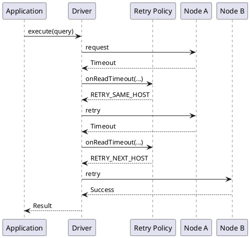
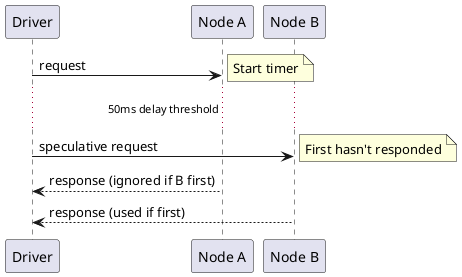
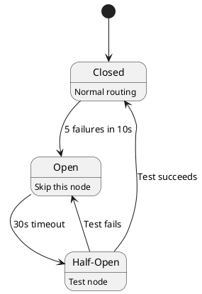

# Failure Handling Policies

Cassandra drivers implement sophisticated failure handling to maintain availability despite node failures, network issues, and transient errors. This includes retry policies, speculative execution, and idempotency awareness.

## Failure Handling Overview

### Failure Types

| Failure Type | Scope | Recovery Strategy |
|--------------|-------|-------------------|
| Connection failure | Single connection | Reconnect, try other node |
| Request timeout | Single request | Retry based on policy |
| Node down | Single node | Route to other nodes |
| Coordinator error | Request processing | Retry on same/different node |
| Consistency failure | Cluster-wide | May not be recoverable |

### Handling Architecture



---

## Retry Policies

### Policy Interface

```python
# Conceptual retry policy interface
class RetryPolicy:
    def on_read_timeout(self, statement, consistency, required, received,
                        data_retrieved, retry_number):
        """Called when a read times out"""
        return RetryDecision.RETHROW  # or RETRY_SAME, RETRY_NEXT, IGNORE

    def on_write_timeout(self, statement, consistency, write_type,
                         required, received, retry_number):
        """Called when a write times out"""
        return RetryDecision.RETHROW

    def on_unavailable(self, statement, consistency,
                       required, alive, retry_number):
        """Called when not enough replicas available"""
        return RetryDecision.RETHROW

    def on_request_error(self, statement, consistency, exception, retry_number):
        """Called on other request errors"""
        return RetryDecision.RETHROW
```

### Retry Decisions

| Decision | Behavior |
|----------|----------|
| RETHROW | Propagate error to application |
| RETRY_SAME_HOST | Retry on same coordinator |
| RETRY_NEXT_HOST | Retry on next node in query plan |
| IGNORE | Return empty result (for reads) |

### Built-in Policies

#### Default Retry Policy

Conservative policy that retries only when safe:

| Error | Retry? | Rationale |
|-------|--------|-----------|
| Read timeout (data received) | Yes, same host | Coordinator has data |
| Read timeout (no data) | No | Might not be available |
| Write timeout (BATCH_LOG) | Yes, same host | Safe to retry |
| Write timeout (other) | No | Risk of duplicate writes |
| Unavailable | No | Won't succeed |

#### Fallthrough Policy

Never retry (application handles everything):

```python
class FallthroughRetryPolicy:
    def on_read_timeout(self, *args):
        return RetryDecision.RETHROW

    def on_write_timeout(self, *args):
        return RetryDecision.RETHROW

    def on_unavailable(self, *args):
        return RetryDecision.RETHROW
```

#### Downgrading Consistency Policy

Retries at lower consistency when needed:

```python
class DowngradingConsistencyPolicy:
    def on_unavailable(self, statement, consistency, required, alive, retry_num):
        if retry_num > 0:
            return RetryDecision.RETHROW

        # Downgrade to match available replicas
        if alive >= 1:
            if consistency in [QUORUM, LOCAL_QUORUM]:
                return RetryDecision.RETRY_SAME_HOST_WITH_CONSISTENCY(ONE)

        return RetryDecision.RETHROW
```

!!! danger "Consistency Violation Risk"
    Downgrading consistency can result in stale reads or lost writes. This policy should only be used when availability is prioritized over consistency, and the application can tolerate eventual consistency.

---

## Error Categories

### Read Timeout

Coordinator didn't receive enough responses in time:

```
ReadTimeoutException:
  consistency: QUORUM
  required: 2
  received: 1
  data_retrieved: false

Interpretation:
  - 2 responses needed for QUORUM
  - Only 1 replica responded
  - No data was retrieved
```

**Retry strategy:**
- If data_retrieved=true: Safe to retry same host
- If data_retrieved=false: Retry may not help

### Write Timeout

Coordinator didn't receive enough acknowledgments:

```
WriteTimeoutException:
  consistency: QUORUM
  required: 2
  received: 1
  write_type: SIMPLE

Write types:
  SIMPLE - Single partition write
  BATCH - Atomic batch
  BATCH_LOG - Batch log write
  UNLOGGED_BATCH - Non-atomic batch
  COUNTER - Counter update
  CAS - Compare-and-set (LWT)
```

**Retry strategy by write_type:**

| Write Type | Safe to Retry? | Reason |
|------------|----------------|--------|
| BATCH_LOG | Yes | Batch logged, will complete |
| SIMPLE | Maybe* | Depends on idempotency |
| BATCH | Maybe* | Depends on idempotency |
| UNLOGGED_BATCH | Maybe* | Some writes may have succeeded |
| COUNTER | No | Non-idempotent |
| CAS | No | May have succeeded |

*Idempotent operations only

### Unavailable Exception

Not enough replicas alive to satisfy consistency:

```
UnavailableException:
  consistency: QUORUM
  required: 2
  alive: 1

Interpretation:
  - Cluster knows only 1 replica is up
  - Can't attempt the operation
  - Request never sent to replicas
```

**Retry strategy:**
- Retry won't help unless topology changes
- Consider downgrading consistency
- May indicate larger cluster issue

### Request Error

Connection or protocol level failures:

| Error | Retry Appropriate? |
|-------|-------------------|
| Connection closed | Yes, different node |
| Protocol error | No (bug) |
| Server error | Maybe, different node |
| Overloaded | Yes, with backoff |

---

## Speculative Execution

### Concept

Send redundant requests to reduce tail latency:



### Benefits

Speculative execution helps when:

- Occasional slow nodes
- Network hiccups
- GC pauses on nodes
- Uneven load distribution

!!! warning "Non-Idempotent Operations"
    Speculative execution should only be used for idempotent operations. Non-idempotent writes may be executed multiple times, causing data inconsistency.

### Configuration

```python
# Conceptual speculative execution policy
class SpeculativeExecutionPolicy:
    def new_plan(self, keyspace, statement):
        """Return when to start speculative requests"""
        return SpeculativePlan(
            delay_ms=50,      # Wait 50ms before speculating
            max_speculative=2  # At most 2 speculative requests
        )
```

### Speculative Policies

**Constant Delay:**
```
Start speculative after fixed delay
Example: 50ms, 100ms thresholds
```

**Percentile-Based:**
```
Start speculative at p99 latency
Adapts to observed performance
Requires latency tracking
```

**No Speculation:**
```
Never send speculative requests
Simplest, safest option
```

### Interaction with Retries

Speculative execution and retries are different:

| Aspect | Retry | Speculative |
|--------|-------|-------------|
| Trigger | Error received | Timeout threshold |
| Original request | Abandoned | Still pending |
| Goal | Error recovery | Latency reduction |
| Request count | Serial | Parallel |

---

## Idempotency

### Why Idempotency Matters

Non-idempotent operations may cause problems when retried:

```
Non-idempotent:
  counter += 1    → Retry doubles increment
  INSERT IF NOT EXISTS → Retry may fail unexpectedly

Idempotent:
  SET value = 5   → Retry is safe
  DELETE WHERE... → Retry is safe
```

!!! tip "Design for Idempotency"
    Design write operations to be idempotent whenever possible. Use absolute values (SET x = 5) rather than increments (SET x = x + 1) to enable safe retries.

### Driver Idempotency Tracking

Drivers can track idempotency:

```python
# Mark statement as idempotent
statement = SimpleStatement(
    "UPDATE users SET name = ? WHERE id = ?",
    is_idempotent=True
)

# Prepared statements can have default
prepared = session.prepare("UPDATE users SET name = ? WHERE id = ?")
prepared.is_idempotent = True
```

### Idempotency-Aware Retry

```python
class IdempotentAwareRetryPolicy:
    def on_write_timeout(self, statement, consistency, write_type,
                         required, received, retry_number):
        if statement.is_idempotent:
            return RetryDecision.RETRY_NEXT_HOST
        else:
            return RetryDecision.RETHROW
```

### Making Operations Idempotent

| Operation | Idempotent? | Make Idempotent |
|-----------|-------------|-----------------|
| INSERT | Yes* | Use fixed values |
| UPDATE SET x = 5 | Yes | N/A |
| UPDATE SET x = x + 1 | No | Use LWT or external tracking |
| DELETE | Yes | N/A |
| Counter update | No | Can't easily |
| LWT (IF...) | No | Application must handle |

*INSERT with same PK is idempotent (upsert behavior)

---

## Circuit Breakers

### Node-Level Circuit Breaker

Prevent overwhelming failing nodes:



### Implementation

```python
class NodeCircuitBreaker:
    def __init__(self, failure_threshold=5, open_duration=30):
        self.failures = 0
        self.state = "CLOSED"
        self.last_failure = None
        self.failure_threshold = failure_threshold
        self.open_duration = open_duration

    def record_success(self):
        self.failures = 0
        self.state = "CLOSED"

    def record_failure(self):
        self.failures += 1
        self.last_failure = time.now()
        if self.failures >= self.failure_threshold:
            self.state = "OPEN"

    def should_try(self):
        if self.state == "CLOSED":
            return True
        if self.state == "OPEN":
            if time.now() - self.last_failure > self.open_duration:
                self.state = "HALF_OPEN"
                return True
            return False
        return True  # HALF_OPEN - allow test
```

---

## Handling Specific Failures

### Connection Failures

```
Connection reset by peer:
  1. Mark connection dead
  2. Remove from pool
  3. Retry on different connection
  4. Schedule reconnection
```

### Coordinator Failures

```
Coordinator crashes mid-request:
  1. Connection closes
  2. Request fails with error
  3. Retry on different node
  4. Idempotent operations safe
```

### Partial Failures

Some replicas succeed, others fail:

```
Write to 3 replicas, 2 succeed:
  - Client may see WriteTimeoutException
  - But 2 copies exist
  - Read at QUORUM will succeed
  - Retry may create 4th copy (okay for idempotent)
```

### Lightweight Transaction Failures

LWT requires special handling:

```
CAS operation timeout:
  - May have succeeded
  - May have failed
  - Retry may see "already exists"
  - Application must handle all cases
```

---

## Timeout Configuration

### Timeout Hierarchy

```
Connection timeout: Time to establish TCP connection
Request timeout: Total time for request completion
Read timeout: Time waiting for coordinator response
```

### Configuration

```python
# Typical timeout configuration
cluster = Cluster(
    connect_timeout=5,      # Connection establishment
    request_timeout=12      # Overall request timeout
)

# Per-statement timeout
statement = SimpleStatement(
    "SELECT * FROM large_table",
    timeout=60  # Override for slow query
)
```

### Timeout Selection

| Workload | Request Timeout | Rationale |
|----------|-----------------|-----------|
| OLTP | 1-5s | Fast failure, retry elsewhere |
| Analytics | 60-300s | Long-running queries |
| Batch load | 30-60s | Large writes |

---

## Monitoring Failure Handling

### Key Metrics

| Metric | Healthy Range | Alert Threshold |
|--------|---------------|-----------------|
| Retry rate | < 1% | > 5% |
| Speculative execution rate | < 5% | > 20% |
| Circuit breaker opens | 0 | Any |
| Timeout rate | < 0.1% | > 1% |

### Diagnostic Information

```python
# Track failure handling stats
class FailureMetrics:
    def __init__(self):
        self.retries = Counter()
        self.speculative = Counter()
        self.circuit_opens = Counter()
        self.errors_by_type = Counter()

    def on_retry(self, error_type, node):
        self.retries.inc(error_type=error_type, node=node)

    def on_speculative(self, node):
        self.speculative.inc(node=node)
```

---

## Best Practices

### Retry Policy Selection

| Use Case | Recommended Policy |
|----------|-------------------|
| General production | Default policy |
| Strict consistency | Fallthrough (handle in app) |
| High availability | Downgrading (with caution) |
| Idempotent workload | Aggressive retry |

### Error Handling in Application

```python
from cassandra import WriteTimeoutException, UnavailableException

try:
    session.execute(statement)
except WriteTimeoutException as e:
    if statement.is_idempotent:
        logger.warning(f"Write timeout, may have succeeded: {e}")
        # Retry or verify
    else:
        logger.error(f"Write timeout, state unknown: {e}")
        # Manual intervention may be needed
except UnavailableException as e:
    logger.error(f"Cluster unhealthy: {e}")
    # Alert operations team
```

### Defensive Programming

1. **Mark idempotency explicitly** - Don't rely on inference
2. **Set appropriate timeouts** - Not too short, not too long
3. **Monitor failure rates** - Catch issues early
4. **Test failure scenarios** - Chaos engineering
5. **Document retry behavior** - Operations team awareness

---

## Related Documentation

- **[Load Balancing](load-balancing.md)** - Node selection for retries
- **[Async Connections](async-connections.md)** - Connection management
- **[CQL Protocol](cql-protocol.md)** - Error codes and handling
