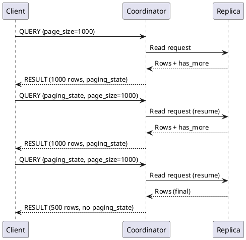
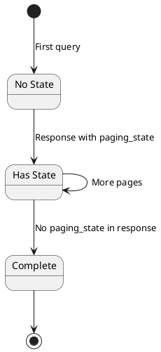

# Query Pagination

Cassandra implements server-side pagination to handle result sets that are too large to return in a single response. This mechanism protects both clients and servers from memory exhaustion while enabling efficient iteration through large datasets.

## Pagination Model

### Why Pagination?

Without pagination, a query returning millions of rows would:

- Exhaust server heap building the response
- Consume excessive network bandwidth
- Overwhelm client memory
- Create unpredictable latency

Pagination addresses these issues by:

- Limiting rows per response
- Streaming results incrementally
- Maintaining predictable memory usage
- Enabling progress tracking

### Page Mechanics



---

## Protocol Support

### Request Parameters

The QUERY and EXECUTE messages include pagination parameters:

| Parameter | Type | Description |
|-----------|------|-------------|
| page_size | int | Maximum rows per page |
| paging_state | bytes | Resume token (null for first page) |

### Response Metadata

The RESULT message includes pagination state:

```
Result Metadata Flags:
  0x0002 - HAS_MORE_PAGES: More pages available

Paging State:
  Present when HAS_MORE_PAGES is set
  Opaque token for resumption
```

### Page Size Behavior

| page_size Value | Behavior |
|-----------------|----------|
| Positive | Return at most N rows |
| Zero | Use server default |
| Negative | Protocol error |
| Omitted | Use server default (5000 in Cassandra) |

---

## Paging State

### Structure

The paging state is an opaque token containing:

```
Paging State Contents:
  - Partition key of next row
  - Clustering key of next row
  - Remaining row count in partition
  - Query-specific metadata
```

Clients must treat this as opaque—the format may change between versions.

### State Lifecycle



### State Validity

Paging state is valid only:

- For the same query (same CQL, parameters)
- Against the same keyspace/table
- Within reasonable time (data may change)
- With compatible protocol version

**Invalid state results in:**
- Undefined behavior
- Potential duplicate/missing rows
- Protocol errors in some cases

---

## Pagination Patterns

### Automatic Pagination (Driver-Managed)

Most drivers provide automatic pagination:

```python
# Conceptual - Python driver style
result = session.execute("SELECT * FROM large_table")

# Driver fetches pages automatically as you iterate
for row in result:
    process(row)
    # Driver transparently fetches next page when needed
```

**How It Works:**
1. Execute query with page_size
2. Receive first page
3. As application iterates, track position
4. When approaching page end, fetch next page
5. Continue until no more pages

### Manual Pagination

For explicit control:

```python
# Conceptual - manual pagination
page_state = None
while True:
    result = session.execute(
        query,
        paging_state=page_state,
        fetch_size=1000
    )

    for row in result.current_page():
        process(row)

    page_state = result.paging_state
    if page_state is None:
        break  # No more pages
```

### Stateless Pagination (Token-Based)

For APIs needing stable pagination across requests:

```sql
-- Use token() for stable, resumable pagination
SELECT * FROM users
WHERE token(user_id) > token(last_seen_id)
LIMIT 100;
```

**Advantages:**

- Stable across schema changes
- No paging state to manage
- Supports arbitrary resume points

**Disadvantages:**

- Requires partition key in results
- Manual position tracking
- Not suitable for all query types

!!! tip "API Pagination"
    For REST APIs or other stateless interfaces, token-based pagination is often preferable since it does not require storing paging state between requests.

---

## Server-Side Behavior

### Page Building

The coordinator builds pages by:

1. Sending read requests to replicas
2. Collecting rows up to page_size
3. Tracking position for resumption
4. Including continuation state in response

### Memory Management

```
Per-Query Memory:
  - Read buffer: page_size × avg_row_size
  - Merge buffer: RF × page_size (worst case)
  - Response buffer: page_size × row_size

Example (page_size=5000, RF=3, 1KB rows):
  - Read: 5MB
  - Merge: 15MB worst case
  - Response: 5MB
  Total: ~10-25MB per concurrent query
```

### Coordinator vs Replica Pages

Pagination involves two levels:

**Replica-Level:**
- Replica reads data from SSTables/memtables
- Returns chunks to coordinator
- Size controlled by internal settings

**Coordinator-Level:**
- Aggregates from multiple replicas
- Applies consistency level
- Returns page to client
- Size controlled by page_size

---

## Consistency Considerations

### Read Consistency

Page requests are independent queries:

```
Page 1: Read at QUORUM, sees data version V1
Page 2: Read at QUORUM, sees data version V2 (concurrent write)
```

**Implications:**

- Pages may reflect different snapshots
- Concurrent writes can cause duplicates or gaps
- Strong consistency requires application-level handling

!!! warning "No Snapshot Isolation"
    Pagination does not provide snapshot isolation. Each page fetch is an independent query that may see different data versions if concurrent writes occur.

### Duplicate/Missing Rows

Concurrent modifications can cause:

| Scenario | Result |
|----------|--------|
| Row inserted in scanned range | May appear in later page |
| Row deleted in unscanned range | Correctly excluded |
| Row moved (PK change) | May appear twice or not at all |
| Row updated | Different values in different pages |

### Mitigation Strategies

1. **Timestamps** - Filter by write time
2. **Versioning** - Include version column
3. **Idempotent processing** - Handle duplicates gracefully
4. **Snapshot isolation** - Accept eventual consistency

---

## Performance Characteristics

### Latency

| Factor | Impact |
|--------|--------|
| Page size | Larger = higher latency per page |
| Row size | Larger = more network time |
| Consistency level | Higher = more coordination |
| Cluster load | Affects all pages equally |

### Throughput

```
Rows per second = page_size / page_latency

Example:
  page_size = 5000
  page_latency = 50ms
  throughput = 100,000 rows/second
```

### Page Size Selection

| Use Case | Recommended Size | Rationale |
|----------|------------------|-----------|
| Interactive UI | 20-100 | Low latency per page |
| Batch processing | 1000-5000 | Balance latency/overhead |
| Export/migration | 5000-10000 | Maximize throughput |
| Low memory | 100-500 | Minimize buffer usage |

---

## Advanced Patterns

### Parallel Pagination

Process multiple token ranges concurrently:

```python
# Conceptual - parallel token range scanning
ranges = get_token_ranges()  # Split full ring

async def scan_range(start, end):
    query = f"SELECT * FROM table WHERE token(pk) >= {start} AND token(pk) < {end}"
    async for row in session.execute_async(query):
        yield row

# Process ranges in parallel
results = await asyncio.gather(*[scan_range(r.start, r.end) for r in ranges])
```

### Resumable Processing

Save state for crash recovery:

```python
# Save checkpoint
def save_checkpoint(paging_state, processed_count):
    store.put("checkpoint", {
        "paging_state": base64.encode(paging_state),
        "count": processed_count
    })

# Resume from checkpoint
def load_checkpoint():
    cp = store.get("checkpoint")
    return base64.decode(cp["paging_state"]), cp["count"]
```

### Pagination with Aggregation

Aggregations must scan all data:

```sql
-- This scans all matching rows (no pagination benefit)
SELECT COUNT(*) FROM events WHERE date = '2024-01-15';

-- Better: paginate and count client-side for huge tables
SELECT * FROM events WHERE date = '2024-01-15';
-- Then count in application
```

---

## Limitations

### No Random Access

Cannot jump to arbitrary page:

```
Page N requires: state from page N-1
Cannot request: "Give me page 5 directly"
```

Workaround: Use token ranges for partitioned random access.

### No Page Count

Total pages unknown until complete:

```
Cannot determine: "How many pages total?"
Can only know: "Are there more pages?"
```

Workaround: Estimate from row count statistics.

### State Expiration

Long-running pagination may fail:

- Compaction removes data
- TTL expires rows
- Schema changes invalidate state

Workaround: Use token-based pagination for long operations.

### Cross-Partition Limits

Pagination across partitions has limits:

```sql
-- May not return exactly page_size rows
SELECT * FROM table LIMIT 1000;  -- Scans until 1000 rows found
```

The server may return fewer rows than page_size if:
- Coordinator aggregation complexity
- Cross-partition tombstone handling
- Internal batch size limits

---

## Monitoring Pagination

### Metrics to Track

| Metric | Indicates |
|--------|-----------|
| Pages per query | Query result size |
| Page fetch latency | Server performance |
| Timeout rate | Overloaded cluster |
| Empty pages | Tombstone issues |

### Tracing Pagination

Enable query tracing to see pagination:

```sql
TRACING ON;
SELECT * FROM large_table;
```

Trace shows:
- Rows read per page
- Replicas contacted
- Time per operation

---

## Related Documentation

- **[CQL Protocol](cql-protocol.md)** - Protocol pagination parameters
- **[Async Connections](async-connections.md)** - Async iteration
- **[Failure Handling](failure-handling.md)** - Handling page failures
