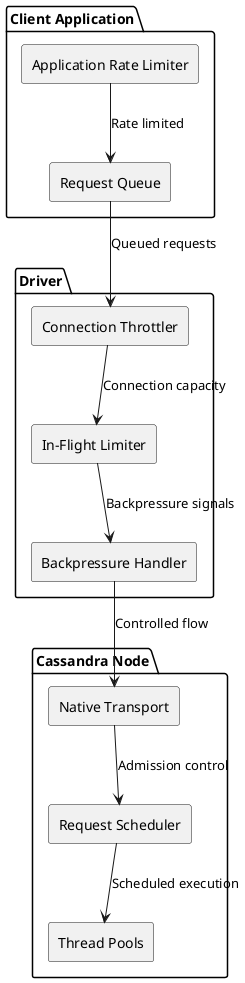
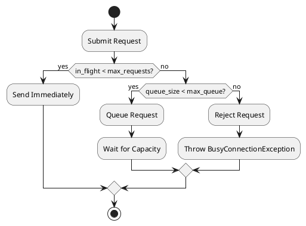
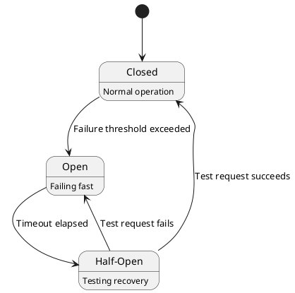

# Query Throttling

Query throttling controls the rate at which clients send requests to Cassandra, preventing overload conditions that degrade cluster performance. Throttling occurs at multiple levels: client-side rate limiting, driver backpressure, and server-side admission control.

## Throttling Architecture

### Throttling Layers



### Throttling Purposes

| Level | Purpose | Mechanism |
|-------|---------|-----------|
| Application | Business logic limits | Rate limiters, quotas |
| Driver | Prevent connection overload | In-flight limits, backpressure |
| Server | Protect node resources | Queue limits, rejection |

---

## Client-Side Throttling

### Rate Limiting

Application-level rate limiting controls request submission:

```python
# Conceptual - Token bucket rate limiter
class RateLimiter:
    def __init__(self, rate, burst):
        self.rate = rate      # Requests per second
        self.burst = burst    # Maximum burst size
        self.tokens = burst
        self.last_update = time.now()

    def acquire(self):
        # Refill tokens based on elapsed time
        now = time.now()
        elapsed = now - self.last_update
        self.tokens = min(self.burst, self.tokens + elapsed * self.rate)
        self.last_update = now

        if self.tokens >= 1:
            self.tokens -= 1
            return True  # Proceed
        return False  # Wait or reject
```

### Rate Limiting Strategies

| Strategy | Behavior | Use Case |
|----------|----------|----------|
| Token bucket | Allows bursts up to limit | General purpose |
| Leaky bucket | Constant rate, no bursts | Strict rate control |
| Sliding window | Rate over rolling window | API quotas |
| Adaptive | Adjusts based on response | Auto-tuning |

### Request Queuing

When rate-limited, requests enter a queue:

```
Queue Strategies:
  - Bounded queue: Reject when full
  - Unbounded queue: Risk memory exhaustion
  - Priority queue: Prefer important requests
  - Timeout queue: Drop stale requests
```

---

## Driver-Level Throttling

### In-Flight Request Limits

Drivers limit concurrent requests per connection:

```
Connection Capacity:
  max_concurrent_requests_per_connection = 1024 (typical)

Total Capacity:
  max_concurrent = connections × max_per_connection

Example:
  8 connections × 1024 = 8192 concurrent requests
```

### Backpressure Mechanisms

When capacity is reached:



### Throttling Configuration

| Parameter | Description | Typical Default |
|-----------|-------------|-----------------|
| max_requests_per_connection | Concurrent requests per connection | 1024-2048 |
| max_queue_size | Waiting requests | 256-1024 |
| acquire_timeout | Time to wait for capacity | 12 seconds |

### Adaptive Throttling

Advanced drivers adjust limits based on server response:

```python
# Conceptual - Adaptive throttling
class AdaptiveThrottler:
    def __init__(self):
        self.current_limit = 1000
        self.min_limit = 100
        self.max_limit = 5000

    def on_success(self, latency):
        if latency < target_latency:
            # Room to increase
            self.current_limit = min(
                self.current_limit * 1.1,
                self.max_limit
            )

    def on_timeout(self):
        # Back off aggressively
        self.current_limit = max(
            self.current_limit * 0.5,
            self.min_limit
        )

    def on_overloaded(self):
        # Server signals overload
        self.current_limit = max(
            self.current_limit * 0.7,
            self.min_limit
        )
```

---

## Server-Side Throttling

### Native Transport Limits

Cassandra limits concurrent connections and requests:

```yaml
# cassandra.yaml
native_transport_max_threads: 128
native_transport_max_frame_size_in_mb: 256
native_transport_max_concurrent_connections: -1  # unlimited
native_transport_max_concurrent_connections_per_ip: -1
```

### Request Queuing

The native transport queues requests when threads are busy:

```
Request Flow:
  1. Request arrives at native transport
  2. If thread available, process immediately
  3. If no thread, queue up to limit
  4. If queue full, reject request
```

### Overload Response

When overloaded, servers may respond with:

```
ERROR {
    code: 0x1001  // Overloaded
    message: "Server is overloaded"
}
```

**Client behavior on Overloaded:**

1. Do not retry immediately
2. Back off exponentially
3. Try different node
4. Eventually fail request

!!! warning "Overloaded Responses"
    Receiving Overloaded errors indicates the cluster is under stress. Continuing to send requests at the same rate will worsen the situation. Implement exponential backoff and consider reducing overall request rate.

### Rate Limiting (Cassandra 5.0+)

Cassandra 5.0 introduces server-side rate limiting:

```
ERROR {
    code: 0x..  // Rate limit error
    message: "Rate limit exceeded"
    // Additional: retry_after hint
}
```

---

## Throttling Patterns

### Global Rate Limiting

Limit total cluster throughput:

```python
# Distributed rate limiter (conceptual)
class ClusterRateLimiter:
    def __init__(self, redis_client, rate_limit):
        self.redis = redis_client
        self.limit = rate_limit
        self.window = 1  # second

    def acquire(self, key="global"):
        current = self.redis.incr(f"rate:{key}")
        if current == 1:
            self.redis.expire(f"rate:{key}", self.window)

        if current > self.limit:
            return False
        return True
```

### Per-User/Tenant Throttling

Multi-tenant applications need per-tenant limits:

```python
# Per-tenant throttling
class TenantThrottler:
    def __init__(self, limits):
        self.limiters = {}
        self.default_limit = limits["default"]

    def acquire(self, tenant_id):
        if tenant_id not in self.limiters:
            limit = self.get_tenant_limit(tenant_id)
            self.limiters[tenant_id] = RateLimiter(limit)

        return self.limiters[tenant_id].acquire()
```

### Priority-Based Throttling

Different priorities for different operations:

```python
# Priority queues
class PriorityThrottler:
    def __init__(self):
        self.queues = {
            "critical": Queue(maxsize=100),    # Always processed
            "normal": Queue(maxsize=1000),     # Standard priority
            "background": Queue(maxsize=5000)  # Best effort
        }

    def submit(self, request, priority="normal"):
        queue = self.queues[priority]
        if queue.full():
            if priority == "critical":
                # Evict from lower priority
                self.evict("background")
            else:
                raise ThrottledException()
        queue.put(request)
```

---

## Backpressure Signals

### Response-Based Signals

| Signal | Meaning | Action |
|--------|---------|--------|
| Success (fast) | Healthy | Maintain or increase rate |
| Success (slow) | Approaching limit | Reduce rate slightly |
| Timeout | Overloaded | Reduce rate significantly |
| Overloaded error | Server struggling | Back off, try other node |
| Unavailable | Capacity issue | Circuit breaker |

### Latency-Based Adjustment

Use latency percentiles to tune throttling:

```python
# Latency-based throttling
class LatencyThrottler:
    def __init__(self, target_p99):
        self.target = target_p99
        self.rate = 1000  # Initial rate

    def observe(self, latencies):
        p99 = percentile(latencies, 99)

        if p99 < self.target * 0.8:
            # Well under target, increase
            self.rate *= 1.1
        elif p99 > self.target:
            # Over target, decrease
            self.rate *= 0.9

        return self.rate
```

---

## Circuit Breakers

!!! note "Circuit Breaker Pattern"
    Circuit breakers are a critical resiliency pattern that prevents a failing service from being overwhelmed with requests, allowing it time to recover.

### Purpose

Circuit breakers prevent cascading failures:



### Implementation

```python
# Conceptual circuit breaker
class CircuitBreaker:
    def __init__(self, failure_threshold=5, recovery_timeout=30):
        self.state = "CLOSED"
        self.failure_count = 0
        self.failure_threshold = failure_threshold
        self.recovery_timeout = recovery_timeout
        self.last_failure_time = None

    def call(self, operation):
        if self.state == "OPEN":
            if time.now() - self.last_failure_time > self.recovery_timeout:
                self.state = "HALF_OPEN"
            else:
                raise CircuitOpenException()

        try:
            result = operation()
            self.on_success()
            return result
        except Exception as e:
            self.on_failure()
            raise

    def on_success(self):
        self.failure_count = 0
        self.state = "CLOSED"

    def on_failure(self):
        self.failure_count += 1
        self.last_failure_time = time.now()
        if self.failure_count >= self.failure_threshold:
            self.state = "OPEN"
```

---

## Monitoring Throttling

### Key Metrics

| Metric | Description | Alert Threshold |
|--------|-------------|-----------------|
| Throttled requests | Requests rate limited | > 1% of traffic |
| Queue depth | Waiting requests | > 80% of max |
| Rejection rate | Requests dropped | Any rejections |
| Backpressure events | Driver throttling | Increasing trend |

### Diagnostic Queries

```python
# Monitor throttling state (conceptual)
def throttling_status():
    return {
        "current_rate": rate_limiter.current_rate,
        "queue_depth": request_queue.size(),
        "in_flight": connection_pool.in_flight_count(),
        "rejections_1m": metrics.get("rejections", window="1m"),
        "p99_latency": metrics.get("latency_p99")
    }
```

---

## Best Practices

### Configuration Guidelines

| Workload | Rate Limit | Queue Size | Timeout |
|----------|------------|------------|---------|
| OLTP | 10K-100K/s | Small (256) | Short (1s) |
| Analytics | 1K-10K/s | Large (10K) | Long (60s) |
| Batch | 100-1K/s | Medium (1K) | Medium (10s) |

### Gradual Ramp-Up

Avoid thundering herd on startup:

```python
# Gradual traffic ramp
def ramp_up(target_rate, duration):
    steps = 10
    step_duration = duration / steps
    step_increase = target_rate / steps

    current = step_increase
    for _ in range(steps):
        rate_limiter.set_rate(current)
        sleep(step_duration)
        current += step_increase
```

### Load Shedding

When overloaded, shed less critical load:

```python
# Load shedding strategy
def should_accept(request):
    current_load = get_current_load()

    if current_load < 0.7:
        return True  # Accept all

    if current_load < 0.9:
        # Shed background work
        return request.priority != "background"

    if current_load < 0.95:
        # Keep only critical
        return request.priority == "critical"

    # Extreme load - reject all new requests
    return False
```

---

## Related Documentation

- **[Async Connections](async-connections.md)** - Connection capacity limits
- **[Failure Handling](failure-handling.md)** - Retry policies
- **[Load Balancing](load-balancing.md)** - Request distribution
