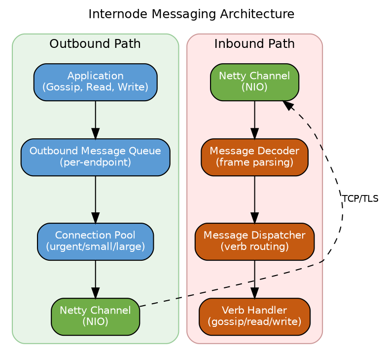
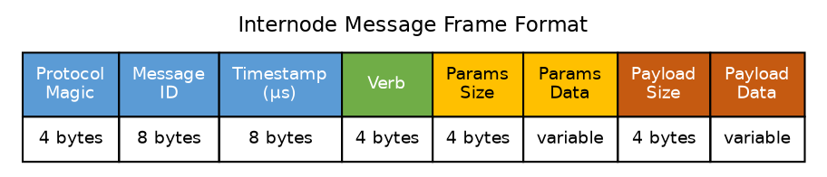
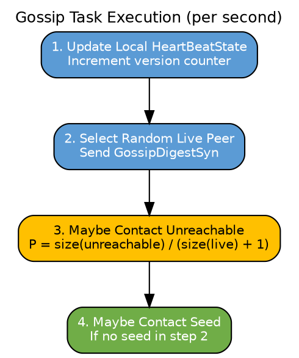
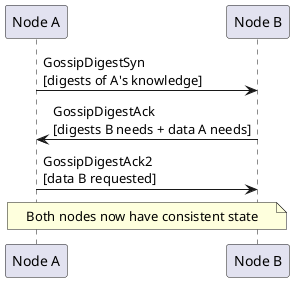
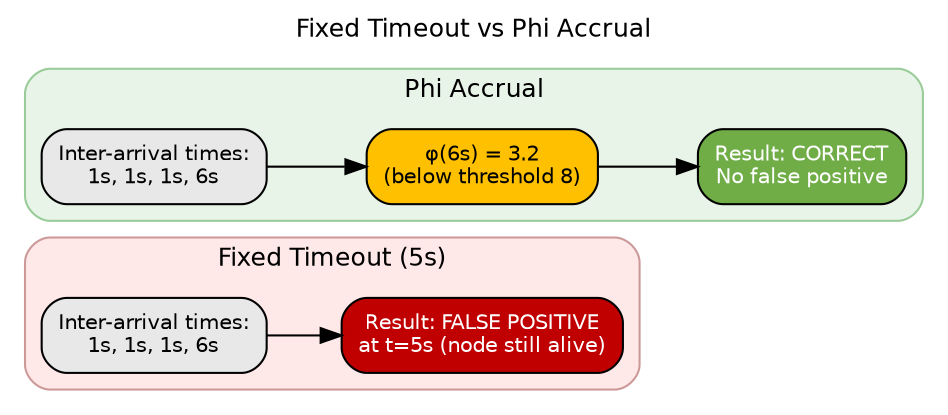
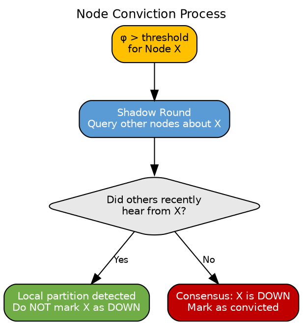
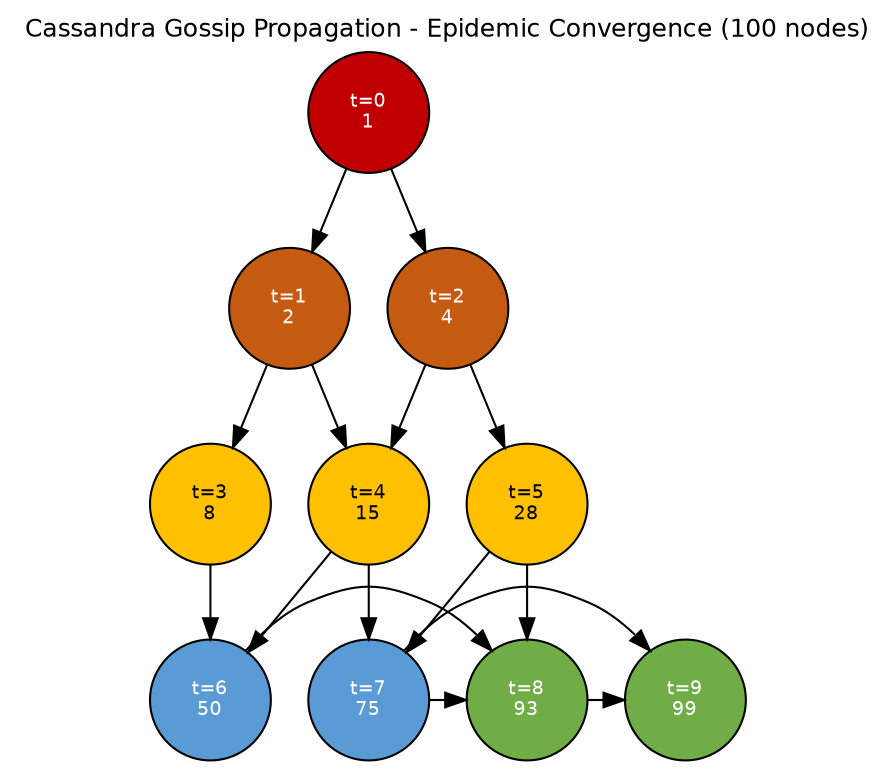

# Gossip Protocol and Internode Messaging

## Overview

Cassandra employs a peer-to-peer gossip protocol for cluster state dissemination and failure detection. This protocol operates as an epidemic algorithm, propagating information through randomized peer-to-peer exchanges until convergence is achieved across all cluster members. The gossip subsystem operates independently on each node, with no centralized coordination component.

The gossip protocol provides:

| Function | Description |
|----------|-------------|
| Cluster membership | Maintains a consistent view of cluster topology across all nodes |
| Failure detection | Probabilistic detection using the Phi Accrual algorithm |
| State propagation | Disseminates node metadata (tokens, schema version, load metrics) |
| Decentralization | Eliminates single points of failure in cluster coordination |

### Theoretical Foundations

Cassandra's gossip implementation derives from epidemic protocols and failure detection research in distributed systems literature:

| Influence | Paper | Cassandra Application |
|-----------|-------|----------------------|
| Epidemic Algorithms | [Demers, A. et al. (1987). "Epidemic Algorithms for Replicated Database Maintenance"](https://dl.acm.org/doi/10.1145/41840.41841) | Anti-entropy protocol design |
| SWIM Protocol | [Das, A., Gupta, I., & Motivala, A. (2002). "SWIM: Scalable Weakly-consistent Infection-style Process Group Membership Protocol"](https://www.cs.cornell.edu/projects/Quicksilver/public_pdfs/SWIM.pdf) | Membership protocol structure, probabilistic peer selection |
| Amazon Dynamo | [DeCandia, G. et al. (2007). "Dynamo: Amazon's Highly Available Key-value Store"](https://www.allthingsdistributed.com/files/amazon-dynamo-sosp2007.pdf) | Gossip-based membership and failure detection integration |
| Phi Accrual Failure Detector | [Hayashibara, N. et al. (2004). "The φ Accrual Failure Detector"](https://www.researchgate.net/publication/29682135_The_ph_accrual_failure_detector) | Adaptive, suspicion-level-based failure detection |

### Protocol Characteristics

| Property | Value | Implication |
|----------|-------|-------------|
| Convergence time | O(log N) rounds | State propagates exponentially |
| Message complexity | O(N) per round | Each node contacts constant number of peers |
| Space complexity | O(N) per node | Each node stores state for all known nodes |
| Consistency model | Eventually consistent | Temporary divergence permitted during propagation |

---

## Internode Messaging Architecture

### Messaging Layer (Cassandra 4.0+)

The internode messaging subsystem provides the transport layer for gossip and all other inter-node communication. Cassandra 4.0 introduced a non-blocking I/O (NIO) implementation using Netty, replacing the previous blocking socket implementation.



### Connection Types

Cassandra establishes three separate connection types between each pair of nodes, optimizing for different message characteristics:

| Connection Type | Purpose | Buffer Strategy | Message Examples |
|-----------------|---------|-----------------|------------------|
| **Urgent** | Time-critical control messages | NonblockingBufferHandler | Gossip SYN/ACK, failure notifications |
| **Small** | Low-latency data messages | NonblockingBufferHandler | Read requests, small mutations |
| **Large** | Bulk data transfer | BlockingBufferHandler | Streaming, large mutations |

### Message Frame Structure

Each internode message follows a binary frame format:



| Field | Size | Description |
|-------|------|-------------|
| Protocol Magic | 4 bytes | Identifies message protocol version |
| Message ID | 8 bytes | Unique identifier for request-response correlation |
| Timestamp | 8 bytes | Microsecond timestamp for timeout calculation |
| Verb | 4 bytes | Operation type identifier (see Verb table) |
| Params Size | 4 bytes | Length of optional parameters section |
| Params Data | variable | Key-value parameters (optional) |
| Payload Size | 4 bytes | Length of message payload |
| Payload Data | variable | Serialized message content |

### Message Verbs

The verb field identifies the operation type. Gossip-related verbs:

| Verb | Code | Direction | Description |
|------|------|-----------|-------------|
| `GOSSIP_DIGEST_SYN` | 0 | Initiator → Peer | Gossip round initiation with digests |
| `GOSSIP_DIGEST_ACK` | 1 | Peer → Initiator | Response with needed digests and data |
| `GOSSIP_DIGEST_ACK2` | 2 | Initiator → Peer | Final data transfer |
| `GOSSIP_SHUTDOWN` | 3 | Leaving → Peers | Node shutdown announcement |
| `ECHO_REQ` | 4 | Any → Any | Lightweight liveness check |
| `ECHO_RSP` | 5 | Any → Any | Echo response |

Other significant verbs for context:

| Category | Verbs |
|----------|-------|
| Read operations | `READ_REQ`, `READ_RSP`, `RANGE_REQ`, `RANGE_RSP` |
| Write operations | `MUTATION`, `MUTATION_RSP`, `BATCH_STORE_REQ` |
| Repair | `VALIDATION_REQ`, `SYNC_REQ`, `SYNC_RSP` |
| Streaming | `STREAM_INIT`, `STREAM_MSG`, `COMPLETE_MSG` |
| Schema | `SCHEMA_PULL_REQ`, `SCHEMA_PUSH_REQ` |

### Queue Management

Message queuing prevents overwhelming slow or temporarily unreachable endpoints:

```yaml
# cassandra.yaml - Internode messaging queue configuration

# Per-endpoint send queue capacity
internode_application_send_queue_capacity: 4MiB

# Reserve capacity per endpoint (borrowed from global)
internode_application_send_queue_reserve_endpoint_capacity: 128MiB

# Global reserve capacity across all endpoints
internode_application_send_queue_reserve_global_capacity: 512MiB

# Message timeout
internode_application_receive_queue_capacity: 4MiB
```

**Queue behavior:**
- Messages queued when endpoint temporarily unavailable
- Queue overflow triggers message dropping with backpressure signaling
- Separate queues per connection type (urgent/small/large)
- FIFO ordering within each queue

---

## Gossip Mechanics

### Gossip Task Execution

Each node executes a `GossipTask` every second (configurable). The task performs four operations in sequence:



**Probabilistic peer selection:**

| Step | Probability | Rationale |
|------|-------------|-----------|
| Live peer | 1.0 | Always gossip with one live peer |
| Unreachable peer | unreachable / (live + 1) | Higher probability as more nodes become unreachable |
| Seed node | Conditional | Only if step 2 didn't select a seed |

### The Three-Way Handshake

Gossip uses a three-message exchange to synchronize state efficiently:



**GossipDigestSyn (SYN):**
- Initiates gossip exchange
- Contains digests (summaries) of initiator's knowledge about all nodes
- Digest = (endpoint, generation, version)

**GossipDigestAck (ACK):**
- Response to SYN
- Contains:
  - Digests that receiver needs (older than receiver's knowledge)
  - Full state data that initiator needs (newer than initiator's knowledge)

**GossipDigestAck2 (ACK2):**
- Final message
- Contains full state data that receiver requested

### Why Three Messages?

The three-way handshake minimizes bandwidth by only sending full state data when necessary:

```
Scenario: Node A knows about 100 nodes, Node B knows about 100 nodes

With full state exchange (naive approach):
- A sends 100 node states → B
- B sends 100 node states → A
- Total: 200 state transfers

With digest-based exchange:
- A sends 100 digests (small) → B
- B compares, finds:
  - 5 nodes where A is behind (B sends full state)
  - 3 nodes where B is behind (B requests from A)
- A sends 3 requested states
- Total: 8 state transfers + 100 small digests

In stable clusters, most gossip rounds transfer minimal data.
```

---

## Gossip State

### EndpointState

Each node maintains an EndpointState for every known node in the cluster:

```
EndpointState (for each node)
├── HeartBeatState
│   ├── generation: 1705312800 (epoch timestamp at node start)
│   └── version: 42 (increments each gossip round)
│
└── ApplicationState (map of key-value pairs)
    ├── STATUS: "NORMAL"
    ├── TOKENS: "-9223372036854775808,..."
    ├── SCHEMA: "a1b2c3d4-e5f6-g7h8-i9j0-k1l2m3n4o5p6"
    ├── DC: "datacenter1"
    ├── RACK: "rack1"
    ├── LOAD: "1234567890"
    ├── SEVERITY: "0.0"
    ├── HOST_ID: "a1b2c3d4-..."
    ├── RPC_ADDRESS: "10.0.1.1"
    ├── RELEASE_VERSION: "4.1.0"
    └── NATIVE_TRANSPORT_ADDRESS: "10.0.1.1"
```

### HeartBeatState

The HeartBeatState tracks the "age" of a node's state:

| Field | Description |
|-------|-------------|
| generation | Timestamp (epoch seconds) when node last started |
| version | Counter incremented each gossip round |

**Generation vs Version:**

```
Node A restarts:
Before restart: generation=1705312800, version=50000
After restart:  generation=1705399200, version=1

Higher generation always wins, even with lower version.
This ensures stale information from before restart is discarded.
```

### ApplicationState Keys

| Key | Description | Example |
|-----|-------------|---------|
| STATUS | Node lifecycle state | NORMAL, LEAVING, LEFT, MOVING |
| TOKENS | Token ranges owned | Comma-separated token list |
| SCHEMA | Schema version UUID | UUID of current schema |
| DC | Datacenter name | datacenter1 |
| RACK | Rack name | rack1 |
| LOAD | Data size on disk (bytes) | 1234567890 |
| SEVERITY | Dynamic snitch score | 0.0 to 1.0 |
| HOST_ID | Unique node identifier | UUID |
| RPC_ADDRESS | Client-facing address | IP address |
| RELEASE_VERSION | Cassandra version | 4.1.0 |
| NATIVE_TRANSPORT_ADDRESS | CQL transport address | IP address |
| NET_VERSION | Messaging protocol version | 12 |
| INTERNAL_IP | Internal address | IP address |
| INTERNAL_ADDRESS_AND_PORT | Internal address with port | IP:port |
| NATIVE_TRANSPORT_PORT | CQL port | 9042 |
| NATIVE_TRANSPORT_PORT_SSL | CQL SSL port | 9142 |
| STORAGE_PORT | Internode port | 7000 |
| STORAGE_PORT_SSL | Internode SSL port | 7001 |
| JMX_PORT | JMX port | 7199 |

### State Versioning

Each ApplicationState value has its own version number:

```
ApplicationState changes:
Time T1: LOAD updated → version 100
Time T2: SCHEMA updated → version 101
Time T3: LOAD updated → version 102
Time T4: STATUS updated → version 103

Each key tracks its own version independently.
Gossip merges states by comparing versions per-key.
```

---

## Failure Detection

### Phi Accrual Failure Detector

Cassandra employs the Phi Accrual Failure Detector algorithm ([Hayashibara et al., 2004](https://www.researchgate.net/publication/29682135_The_ph_accrual_failure_detector)), a probabilistic failure detector that outputs a continuous suspicion level rather than a binary alive/dead determination. This approach adapts automatically to varying network conditions without requiring manual timeout tuning.

!!! note "Local Decision Making"
    UP and DOWN state determinations are made independently by each node based on its own observations. These states are **not propagated via gossip**—each node must independently observe and evaluate peer liveness. This design prevents a single node's incorrect assessment from propagating throughout the cluster.

### Theoretical Basis

Traditional heartbeat-based failure detectors suffer from a fundamental tension: fixed timeouts that detect failures quickly also generate false positives under variable network conditions.



The Phi Accrual approach transforms the problem:
- **Input**: Historical inter-arrival time distribution + time since last heartbeat
- **Output**: Suspicion level φ ∈ [0, ∞) representing probability of failure
- **Decision**: Compare φ against configurable threshold

### Mathematical Formulation

The φ value is computed using the probability that a heartbeat has not yet arrived given the observed inter-arrival time distribution:

**Step 1: Maintain arrival time samples**

A sliding window of the most recent *n* inter-arrival times (default n = 1000):

$$
\text{samples} = [t_1, t_2, t_3, ..., t_n]
$$

**Step 2: Compute distribution parameters**

Calculate mean (μ) and variance (σ²) of the samples:

$$
\mu = \frac{1}{n} \sum_{i=1}^{n} t_i
$$

$$
\sigma^2 = \frac{1}{n} \sum_{i=1}^{n} (t_i - \mu)^2
$$

**Step 3: Compute φ at time Δt since last heartbeat**

The φ function uses an exponential distribution approximation:

$$
\phi(\Delta t) = -\log_{10}(1 - F(\Delta t))
$$

Where F is the cumulative distribution function. For the normal distribution approximation used by Cassandra:

$$
\phi(\Delta t) = -\log_{10}\left(\frac{1}{1 + e^{-(\Delta t - \mu) / \sigma}}\right)
$$

**Step 4: Conviction decision**

If φ > φ_threshold, mark node as DOWN.

### Phi Value Interpretation

| φ Value | Probability Node is Dead | Interpretation |
|---------|-------------------------|----------------|
| 1 | 90% | Very low suspicion |
| 2 | 99% | Low suspicion |
| 3 | 99.9% | Moderate suspicion |
| 4 | 99.99% | Elevated suspicion |
| 8 | 99.999999% | High suspicion (default threshold) |
| 12 | 99.9999999999% | Very high suspicion |

The logarithmic scale means each unit increase represents an order of magnitude increase in confidence that the node has failed.

### Failure Detection Configuration

```yaml
# cassandra.yaml

# Phi threshold for marking node as DOWN
# Higher = more tolerant of latency, slower detection
# Lower = faster detection, more false positives
phi_convict_threshold: 8

# Maximum interval between gossip rounds (ms)
# Affects the baseline inter-arrival time
# Default: 1000
# Not typically changed
```

| Phi Threshold | Approx. Detection Time | False Positive Rate | Recommended Environment |
|---------------|------------------------|---------------------|------------------------|
| 5-6 | ~5-6 missed heartbeats | Higher (10⁻⁵) | Stable, low-latency datacenter |
| 8 (default) | ~8 missed heartbeats | Low (10⁻⁸) | General purpose |
| 10-12 | ~10-12 missed heartbeats | Very low (10⁻¹⁰) | High-latency WAN, cloud environments |

### Node Liveness States

| State | Determination | Description |
|-------|---------------|-------------|
| **UP** | Local observation | Node responding to gossip, φ below threshold |
| **DOWN** | Local observation | φ exceeded threshold, node considered failed |
| **UNKNOWN** | Initial state | No communication history with node |

!!! warning "State Transition Asymmetry"
    A node is marked DOWN based solely on exceeding the φ threshold. However, a node is only marked UP after successful direct communication (not via gossip from other nodes). This asymmetry prevents "resurrection" of nodes based on stale gossip information.

### Conviction Process

When a node's φ exceeds the threshold, Cassandra performs additional verification before conviction:



**Shadow round purpose:**
- Prevents false positives from transient local network issues
- If other nodes recently heard from suspect node, the local node is likely partitioned
- Only convicts if consensus exists that node is unreachable

---

## Gossip Timing and Convergence

### Timing Parameters

| Parameter | Default | JVM Property | Description |
|-----------|---------|--------------|-------------|
| Gossip interval | 1000 ms | - | Fixed interval between gossip rounds |
| Ring delay (quarantine) | 1000 ms | `cassandra.ring_delay_ms` | Delay before node is considered for ring membership changes |
| Shutdown announce delay | 2000 ms | `cassandra.shutdown_announce_in_ms` | Time to announce shutdown before stopping gossip |

### Convergence Analysis

Gossip-based protocols exhibit epidemic propagation characteristics. For a cluster of N nodes with one gossip exchange per round:

**Propagation model:**

Each round, an uninformed node has probability p of becoming informed through contact with an informed node:

$$
p = \frac{I(t)}{N}
$$

Where I(t) is the number of informed nodes at round t.

**Expected convergence:**

The number of informed nodes follows a logistic growth pattern:

$$
I(t+1) = I(t) + (N - I(t)) \cdot \frac{I(t)}{N}
$$

This yields expected convergence in O(log N) rounds:

| Cluster Size | Expected Rounds | Time (1s interval) |
|--------------|-----------------|-------------------|
| 10 nodes | ~4 rounds | ~4 seconds |
| 50 nodes | ~6 rounds | ~6 seconds |
| 100 nodes | ~7 rounds | ~7 seconds |
| 500 nodes | ~9 rounds | ~9 seconds |
| 1000 nodes | ~10 rounds | ~10 seconds |



**Factors affecting convergence:**
- Network partitions delay propagation to isolated segments
- Node failures during propagation reduce spreading efficiency
- Concurrent updates may require additional rounds for consistency

### Consistency Guarantees

Gossip provides **eventual consistency** with the following properties:

| Property | Guarantee |
|----------|-----------|
| **Validity** | If a correct node broadcasts a value, it eventually reaches all correct nodes |
| **Agreement** | All correct nodes eventually agree on the same value |
| **Termination** | Propagation completes in bounded time (O(log N) expected) |
| **Freshness** | Versioned values ensure newer information supersedes older |

!!! note "Temporary Inconsistency"
    During propagation, different nodes may have different views of cluster state. Applications should not assume instantaneous consistency of gossip-propagated information.

---

## Configuration

### cassandra.yaml Gossip Settings

```yaml
# Seed nodes for cluster discovery
seed_provider:
  - class_name: org.apache.cassandra.locator.SimpleSeedProvider
    parameters:
      - seeds: "10.0.1.1,10.0.1.2"

# Address to bind for inter-node communication
listen_address: 10.0.1.1

# Address to broadcast to other nodes (if different from listen)
broadcast_address: 10.0.1.1

# Inter-node communication port
storage_port: 7000

# Inter-node communication port (SSL)
ssl_storage_port: 7001

# Failure detector sensitivity
phi_convict_threshold: 8
```

### JVM Options

```bash
# Gossip-related JVM options (jvm.options or jvm-server.options)

# Shutdown announce delay (ms) - time to gossip shutdown before stopping
-Dcassandra.shutdown_announce_in_ms=2000

# Skip waiting for gossip to settle (use with caution, testing only)
-Dcassandra.skip_wait_for_gossip_to_settle=0

# Disable loading ring state from system tables on startup
-Dcassandra.load_ring_state=false
```

---

## Diagnostics and Troubleshooting

### Viewing Gossip State

```bash
# Full gossip state for all known nodes
nodetool gossipinfo

# Example output:
/10.0.1.1
  generation:1705312800
  heartbeat:45231
  STATUS:14:NORMAL,-9223372036854775808
  LOAD:42:1.0734156E10
  SCHEMA:28:a1b2c3d4-e5f6-g7h8-i9j0-k1l2m3n4o5p6
  DC:7:datacenter1
  RACK:9:rack1
  RELEASE_VERSION:5:4.1.0
  HOST_ID:3:a1b2c3d4-e5f6-g7h8-i9j0-k1l2m3n4o5p6
```

### Understanding gossipinfo Output

| Field | Format | Description |
|-------|--------|-------------|
| generation | number | Epoch seconds when node started |
| heartbeat | number | Current version counter |
| STATUS | version:value | Node status and tokens |
| LOAD | version:value | Disk usage in bytes |
| SCHEMA | version:UUID | Schema version |
| DC | version:name | Datacenter |
| RACK | version:name | Rack |

### Common Gossip Issues

**Issue: Schema disagreement**

```bash
nodetool describecluster

# Look for:
# Schema versions:
#     a1b2c3d4-...: [10.0.1.1, 10.0.1.2]
#     e5f6g7h8-...: [10.0.1.3]  ← Different schema!
```

| Cause | Resolution |
|-------|------------|
| Node out of sync | Wait for gossip propagation, or restart node |
| Failed schema migration | Check logs for schema errors |
| Network partition | Resolve network issue |

**Issue: Node shows as DOWN but is running**

```bash
nodetool status

# Shows node as DN (Down Normal)
```

| Cause | Resolution |
|-------|------------|
| Network partition | Check network connectivity |
| Firewall blocking gossip | Open port 7000/7001 |
| High phi (network latency) | Increase phi_convict_threshold |
| Overloaded node (GC pauses) | Tune JVM, reduce load |

**Issue: Node won't join cluster**

| Symptom | Cause | Resolution |
|---------|-------|------------|
| "Unable to contact any seeds" | Seeds unreachable | Check network, verify seed list |
| "Node already exists" | Previous node with same tokens | Remove old node with removenode |
| Hangs at "Joining" | Bootstrap streaming failed | Check logs, verify disk space |

### Forcing Gossip State

In extreme cases, gossip state can be manually manipulated:

```bash
# Force gossip to reconsider a node (use carefully)
nodetool assassinate <node_ip>

# Remove a node from gossip (when node is permanently gone)
nodetool removenode <host_id>
```

**Warning:** These operations can cause data inconsistency if used incorrectly.

---

## Gossip and Performance

### Gossip Overhead

| Metric | Typical Value | Notes |
|--------|---------------|-------|
| Messages per second | 1-3 per node | Each node gossips once per second |
| Bytes per message | 1-10 KB | Depends on cluster size and changes |
| CPU overhead | Minimal | Simple comparisons and updates |

Gossip overhead is negligible in almost all deployments.

### Large Cluster Considerations

In very large clusters (500+ nodes):

| Consideration | Mitigation |
|---------------|------------|
| Gossip state size | Each node stores state for all nodes (~1KB per node) |
| Convergence time | Increases logarithmically, still fast |
| Cross-DC traffic | Seeds in each DC limit cross-DC gossip |

---

## Related Documentation

- **[Seeds and Discovery](seeds.md)** - Seed node configuration and cluster discovery
- **[Node Lifecycle](node-lifecycle.md)** - Bootstrap, decommission, and node state transitions
- **[Node Replacement](node-replacement.md)** - Dead node handling and replacement procedures
- **[Scaling Operations](scaling.md)** - Adding and removing nodes
- **[Data Streaming](../distributed-data/streaming.md)** - How gossip triggers and coordinates streaming operations
- **[Replica Synchronization](../distributed-data/replica-synchronization.md)** - Anti-entropy repair coordination via gossip
- **[Replication](../distributed-data/replication.md)** - How gossip enables replica placement decisions
- **[Consistency](../distributed-data/consistency.md)** - How gossip enables consistency level guarantees
- **[Partitioning](../distributed-data/partitioning.md)** - Token ownership propagated via gossip

