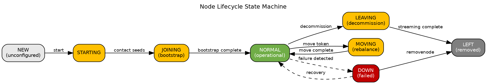
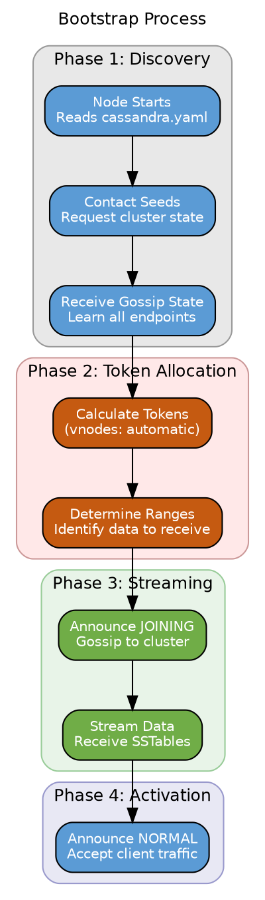
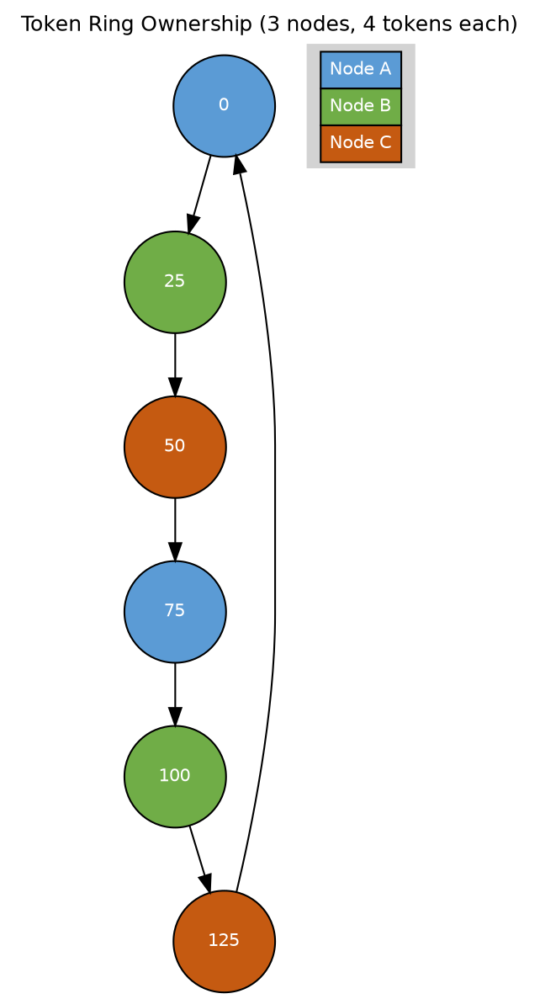
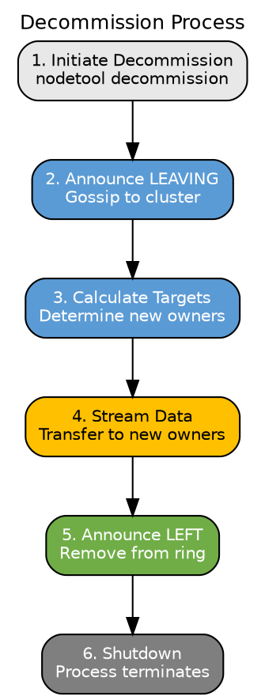
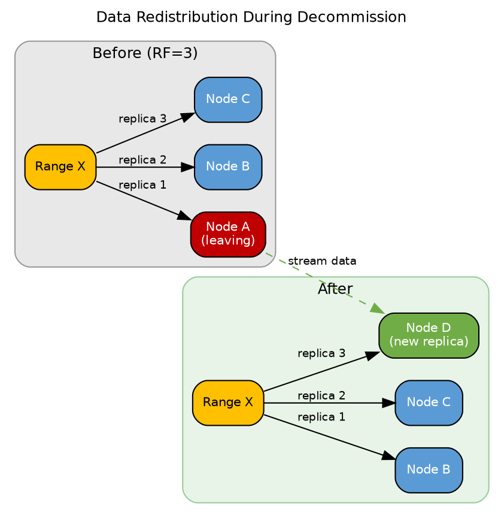
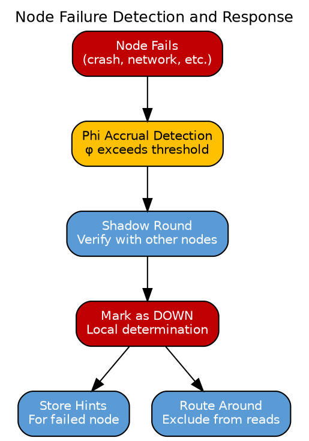

# Node Lifecycle

This section describes the complete lifecycle of a Cassandra node from initial cluster join through eventual removal. Understanding these state transitions is essential for operational management, troubleshooting, and capacity planning.

---

## Lifecycle State Machine

Cassandra nodes progress through well-defined states during their lifecycle:



### State Definitions

| State | Gossip STATUS | Description |
|-------|---------------|-------------|
| **STARTING** | - | Node process started, not yet joined cluster |
| **JOINING** | `BOOT` | Bootstrapping, streaming data from existing nodes |
| **NORMAL** | `NORMAL` | Fully operational, serving client requests |
| **LEAVING** | `LEAVING` | Decommissioning, streaming data to remaining nodes |
| **MOVING** | `MOVING` | Token reassignment in progress |
| **LEFT** | `LEFT` | Removed from cluster, no longer participating |
| **DOWN** | - | Failure detected (local determination, not gossiped) |

---

## Joining the Cluster

### Bootstrap Process

Bootstrap is the process by which a new node joins an existing cluster and receives its share of data.



### Bootstrap Configuration

```yaml
# cassandra.yaml - Bootstrap settings

# Enable/disable automatic bootstrap
# Set to false for first node in cluster or when using replace_address
auto_bootstrap: true

# Number of virtual nodes per physical node
num_tokens: 256

# Initial token (only if num_tokens = 1, not recommended)
# initial_token:

# Allocate tokens using random or algorithm-based approach
allocate_tokens_for_keyspace: <keyspace_name>  # Optional, for better distribution
```

### Bootstrap Streaming

During bootstrap, the new node streams data from existing replicas:

| Aspect | Description |
|--------|-------------|
| **Source selection** | Prefers local datacenter, least-loaded nodes |
| **Range calculation** | Based on new node's tokens and RF |
| **Parallelism** | Concurrent streams from multiple sources |
| **Resume capability** | Can resume after failures (Cassandra 4.0+) |

**Streaming source selection algorithm:**

1. Identify all ranges new node should own
2. For each range, identify replica set
3. Select replica based on:
   - Prefer same datacenter
   - Prefer least-loaded node
   - Avoid nodes already streaming

### Bootstrap Duration

Bootstrap time depends on:

| Factor | Impact |
|--------|--------|
| Data volume | Linear with total data size |
| Network bandwidth | Limited by `stream_throughput_outbound_megabits_per_sec` |
| Number of ranges | More ranges = more coordination overhead |
| Compaction during streaming | May delay completion |

**Estimation formula:**
```
Time ≈ (Data per node × RF) / Stream throughput
Example: (500GB × 3) / 200Mbps ≈ 1.7 hours
```

### Monitoring Bootstrap

```bash
# Check bootstrap progress
nodetool netstats

# Sample output during bootstrap:
# Mode: JOINING
#     /10.0.1.2
#         Receiving 234 files, 45GB total. Already received 156 files, 30GB.

# Check node status
nodetool status
# Shows UJ (Up Joining) during bootstrap

# View detailed streaming
nodetool netstats -H
```

---

## Normal Operation

### NORMAL State

A node in NORMAL state:

- Owns specific token ranges
- Serves as replica for data within RF
- Accepts client read/write requests
- Participates in gossip protocol
- Reports metrics and health status

### Token Ownership

Each node owns ranges of the token ring:



### Operational Health Indicators

| Indicator | Healthy | Warning | Critical |
|-----------|---------|---------|----------|
| Gossip state | NORMAL | JOINING/MOVING | DOWN |
| Pending compactions | < 20 | 20-100 | > 100 |
| Dropped messages | 0 | < 1% | > 1% |
| GC pause | < 500ms | 500ms-1s | > 1s |

---

## Leaving the Cluster

### Decommission Process

Decommission is the orderly removal of a node, ensuring all data is transferred to remaining nodes.



### Decommission Command

```bash
# Initiate decommission (run on node being removed)
nodetool decommission

# This command:
# - Blocks until complete
# - Cannot be cancelled once started
# - Requires RF nodes remain after removal
```

### Decommission Prerequisites

| Requirement | Verification |
|-------------|--------------|
| Sufficient remaining capacity | Check disk usage on remaining nodes |
| Replication factor satisfied | N - 1 ≥ RF for all keyspaces |
| No pending repairs | `nodetool repair_admin list` |
| Gossip healthy | `nodetool gossipinfo` shows all nodes |

### Data Redistribution

During decommission, data transfers to new replica owners:



### Monitoring Decommission

```bash
# Check decommission progress
nodetool netstats

# Sample output:
# Mode: LEAVING
#     /10.0.1.4
#         Sending 456 files, 89GB total. Already sent 234 files, 45GB.

# Node status shows UL (Up Leaving)
nodetool status
```

---

## Token Movement

### Move Operation

The move operation reassigns a node's token position without removing it from the cluster:

```bash
# Move node to new token (single-token nodes only)
nodetool move <new_token>

# Not recommended with vnodes (num_tokens > 1)
```

!!! warning "Move Limitations"
    Token movement is generally discouraged with vnodes. For capacity rebalancing, add/remove nodes instead of moving tokens.

---

## Failure Scenarios

### Node Failure Detection

When a node fails, the cluster detects and responds:



### Response to Node Failure

| Response | Description |
|----------|-------------|
| **Hints stored** | Coordinator stores writes destined for failed node |
| **Reads rerouted** | Failed node excluded from read replica selection |
| **Writes continue** | If CL satisfied by remaining replicas |
| **No automatic replacement** | Manual intervention required |

### Node Recovery

When a failed node recovers:

1. **Gossip reconnection**: Node contacts seeds/peers
2. **State synchronization**: Receives current cluster state
3. **Hint replay**: Receives stored hints from other nodes
4. **Gradual inclusion**: Phi detector marks as UP after successful communication

```bash
# After node restart, verify recovery
nodetool status       # Should show UN (Up Normal)
nodetool gossipinfo   # Verify gossip state
nodetool tpstats      # Check for hint replay activity
```

---

## Operational Commands

### Status Commands

```bash
# View cluster status
nodetool status

# Status output interpretation:
# UN = Up Normal (healthy)
# UJ = Up Joining (bootstrapping)
# UL = Up Leaving (decommissioning)
# UM = Up Moving (token movement)
# DN = Down Normal (failed)

# Detailed gossip state
nodetool gossipinfo

# Ring ownership
nodetool ring
```

### State Transition Commands

| Command | Effect | Use Case |
|---------|--------|----------|
| `nodetool decommission` | NORMAL → LEAVING → LEFT | Orderly node removal |
| `nodetool removenode <host_id>` | Force remove dead node | Node permanently failed |
| `nodetool assassinate <ip>` | Force remove stuck node | Emergency only |
| `nodetool move <token>` | Change token assignment | Rebalancing (not recommended with vnodes) |

### Force Operations

!!! danger "Destructive Operations"
    The following commands can cause data loss if used incorrectly.

```bash
# Force remove a dead node (use when node is unrecoverable)
nodetool removenode <host_id>

# Force remove a stuck node (emergency only)
nodetool assassinate <ip_address>

# These commands:
# - Do NOT stream data
# - May require subsequent repair
# - Should be last resort
```

---

## Best Practices

### Before Any Topology Change

1. **Verify cluster health**: `nodetool status` shows all UN
2. **Check pending operations**: No ongoing repairs, bootstraps
3. **Ensure sufficient capacity**: Remaining nodes can handle load
4. **Backup if critical**: Consider snapshots before major changes

### During Bootstrap

- Schedule during low-traffic periods
- Monitor streaming progress
- Watch for compaction backlog on existing nodes

### During Decommission

- Verify RF nodes will remain
- Allow sufficient time for completion
- Do not force-kill the process

### After Any Change

- Verify `nodetool status` shows expected state
- Run repair on affected ranges if needed
- Monitor for any performance degradation

---

## Related Documentation

- **[Gossip Protocol](gossip.md)** - State propagation and failure detection
- **[Seeds and Discovery](seeds.md)** - Bootstrap discovery process
- **[Node Replacement](node-replacement.md)** - Handling permanently failed nodes
- **[Data Streaming](../distributed-data/streaming.md)** - Bootstrap and decommission data transfer
