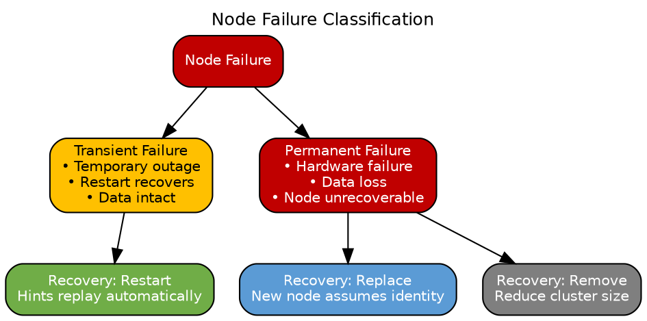
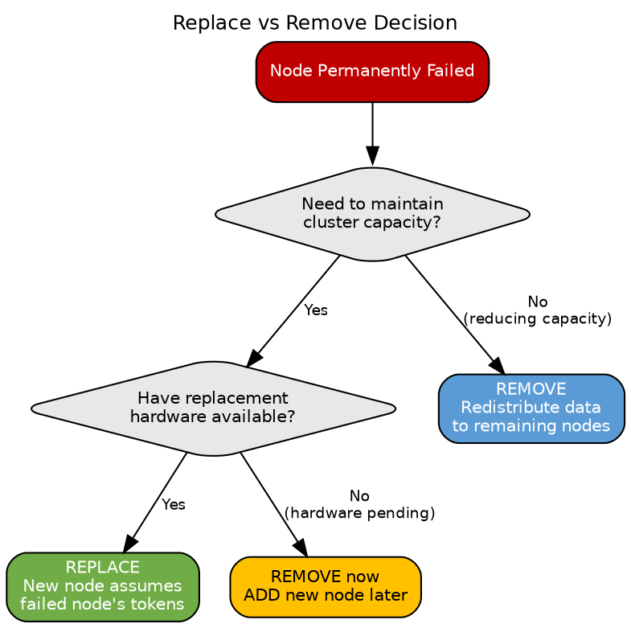
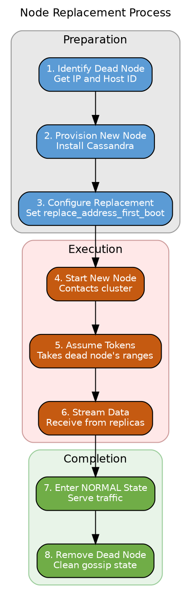
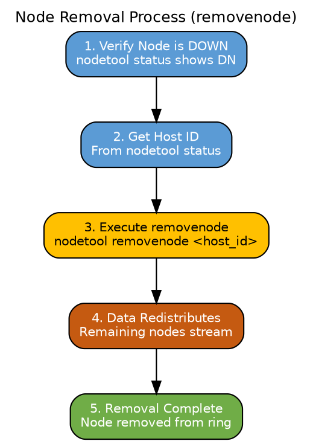
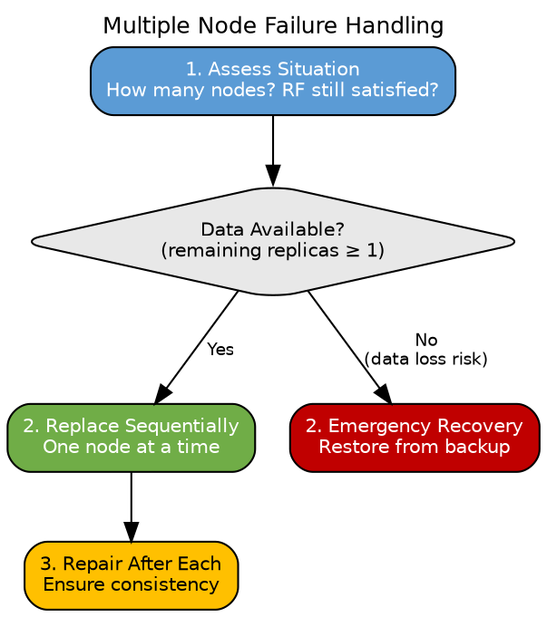

# Node Replacement

This section covers procedures for handling failed nodes and replacing them with new nodes. Understanding the distinction between different failure scenarios and their corresponding recovery procedures is critical for maintaining cluster health and data integrity.

---

## Failure Classification

### Types of Node Failures



| Failure Type | Characteristics | Recovery Approach |
|--------------|-----------------|-------------------|
| **Transient** | Node temporarily unavailable, data intact | Wait for restart, hints replay |
| **Recoverable** | Node can restart, possible data issues | Restart + repair |
| **Permanent** | Hardware failed, node cannot return | Replace or remove |

---

## Decision Framework

### Replace vs Remove

When a node permanently fails, operators must choose between replacement and removal:



| Factor | Replace | Remove |
|--------|---------|--------|
| **Cluster capacity** | Maintained | Reduced |
| **Data movement** | Stream to new node | Redistribute to existing |
| **Token ownership** | Assumed from dead node | Redistributed |
| **Disk usage** | New node only | Increased on remaining |
| **Time to complete** | Longer (full data stream) | Shorter (less data movement) |

---

## Node Replacement Procedure

### Overview

Node replacement allows a new node to assume the identity (tokens) of a failed node:



### Step-by-Step Replacement

#### Step 1: Identify the Dead Node

```bash
# Get dead node information
nodetool status

# Example output:
# Datacenter: datacenter1
# =======================
# Status=Up/Down  State=Normal/Leaving/Joining/Moving
# DN  10.0.1.3  256  50.5%  abc123-def456-...  rack1

# Note the IP address (10.0.1.3) and Host ID (abc123-def456-...)
```

#### Step 2: Provision Replacement Hardware

1. Install same Cassandra version as cluster
2. Configure same `cluster_name`
3. Configure same `snitch` and DC/rack (if replacing in same location)
4. **Do NOT start Cassandra yet**

#### Step 3: Configure for Replacement

```yaml
# cassandra.yaml on NEW node

# Same cluster name
cluster_name: 'Production Cluster'

# IP of the DEAD node being replaced
# This is REMOVED after first boot
# JVM option format: -Dcassandra.replace_address_first_boot=10.0.1.3
```

**JVM option (preferred method):**

```bash
# jvm.options or jvm-server.options (or command line)
-Dcassandra.replace_address_first_boot=10.0.1.3
```

!!! note "replace_address vs replace_address_first_boot"
    Use `replace_address_first_boot` (requires Cassandra 3.0+). This option is automatically cleared after first successful boot, preventing accidental re-replacement on subsequent restarts. The older `replace_address` persists and can cause issues.

#### Step 4: Start the New Node

```bash
# Start Cassandra
sudo systemctl start cassandra
# or
cassandra -f  # foreground for monitoring
```

**During startup, the new node:**
1. Contacts seeds and discovers cluster
2. Announces intention to replace dead node
3. Assumes dead node's tokens
4. Begins streaming data from remaining replicas

#### Step 5: Monitor Progress

```bash
# Watch streaming progress
watch -n 5 'nodetool netstats'

# Check status
nodetool status
# New node shows as UJ (Up Joining) during streaming

# View logs for progress
tail -f /var/log/cassandra/system.log
```

#### Step 6: Verify Completion

```bash
# Confirm new node is NORMAL
nodetool status
# Should show UN (Up Normal) for new node
# Dead node should no longer appear

# Verify token ownership
nodetool ring | grep <new_node_ip>

# Confirm gossip health
nodetool gossipinfo | grep <new_node_ip>
```

#### Step 7: Post-Replacement Tasks

```bash
# Run repair on the new node to ensure consistency
nodetool repair -pr  # Primary range only

# Clean up the JVM option (if not using _first_boot variant)
# Remove -Dcassandra.replace_address from jvm.options
```

---

## Node Removal Procedure

### When to Use Removal

Use `removenode` when:
- No replacement hardware available immediately
- Intentionally reducing cluster capacity
- Node is stuck in an unrecoverable state

### Removal Process



### Removal Command

```bash
# Get host ID of dead node
nodetool status

# Execute removal (run from any live node)
nodetool removenode <host_id>

# Example:
nodetool removenode abc123-def456-789...

# Monitor progress
nodetool removenode status
```

### Removal vs Decommission

| Aspect | removenode | decommission |
|--------|------------|--------------|
| **Node state** | Dead (DN) | Alive (UN) |
| **Initiated from** | Any live node | The leaving node |
| **Data transfer** | Remaining nodes stream to each other | Leaving node streams out |
| **Token handling** | Tokens redistributed | Tokens released |

!!! warning "removenode Requirements"
    The node being removed must be DOWN. Do not use `removenode` on a running node—use `decommission` instead.

---

## Assassinate (Emergency)

### When to Use Assassinate

Use `assassinate` only when:
- Node is stuck (not responding but not fully dead)
- `removenode` fails or hangs
- Emergency cluster recovery needed

!!! danger "Risk of Data Loss"
    `assassinate` forcibly removes a node from gossip without data redistribution. Use only as last resort.

### Assassinate Command

```bash
# Emergency removal (use carefully!)
nodetool assassinate <ip_address>

# Example:
nodetool assassinate 10.0.1.3
```

**After assassination:**
1. Run repair on all nodes to restore consistency
2. Verify no data loss occurred
3. Review why normal procedures failed

---

## Same-IP Replacement

### Replacing with Same IP Address

When the replacement node uses the same IP as the dead node:

```yaml
# cassandra.yaml on replacement node

# Same IP, but new Host ID generated automatically
listen_address: 10.0.1.3  # Same as dead node

# Still need replace_address
# JVM option: -Dcassandra.replace_address_first_boot=10.0.1.3
```

**Procedure:**
1. Ensure dead node's data directory is empty/removed
2. Configure `replace_address_first_boot` with same IP
3. Start node normally
4. Node generates new Host ID but assumes old tokens

### Different-IP Replacement

When replacement uses different IP:

```yaml
# cassandra.yaml on replacement node

listen_address: 10.0.1.10  # NEW IP address

# JVM option references the DEAD node's IP
# -Dcassandra.replace_address_first_boot=10.0.1.3  # OLD IP
```

---

## Handling Multiple Failures

### Concurrent Failures

If multiple nodes fail simultaneously:



**Guidelines:**
- Replace one node at a time
- Wait for each replacement to complete (NORMAL state)
- Run repair between replacements
- If RF nodes failed for any range, data may be unavailable

### Quorum Considerations

| Scenario | RF=3, CL=QUORUM | Impact |
|----------|-----------------|--------|
| 1 node down | 2 replicas remain | Reads/writes succeed |
| 2 nodes down | 1 replica remains | Quorum unavailable |
| 3 nodes down | 0 replicas | Data unavailable |

---

## Verification and Repair

### Post-Replacement Verification

```bash
# 1. Verify node status
nodetool status
# All nodes should show UN

# 2. Verify token ownership
nodetool describering <keyspace>

# 3. Check for pending streaming
nodetool netstats

# 4. Verify gossip state
nodetool gossipinfo

# 5. Check for schema agreement
nodetool describecluster
```

### Post-Replacement Repair

```bash
# Run repair on replacement node
nodetool repair -pr <keyspace>

# For thorough consistency
nodetool repair --full <keyspace>
```

| Repair Type | When to Use |
|-------------|-------------|
| Primary range (`-pr`) | Standard post-replacement |
| Full repair (`--full`) | Suspected consistency issues |
| Incremental | Ongoing maintenance |

---

## Troubleshooting

### Replacement Fails to Start

| Symptom | Cause | Solution |
|---------|-------|----------|
| "Cannot replace a live node" | Target node not marked DOWN | Wait for failure detection or use `assassinate` |
| "Replace address must be peer" | Wrong IP in config | Verify dead node's IP |
| "Unable to find host ID" | Gossip doesn't know dead node | Clear gossip state, check seeds |

### Streaming Stalls

```bash
# Check streaming status
nodetool netstats

# If stuck, check logs
grep -i "stream" /var/log/cassandra/system.log

# Possible causes:
# - Network issues between nodes
# - Disk full on source or target
# - Timeout (increase streaming_socket_timeout_in_ms)
```

### Post-Replacement Issues

| Issue | Resolution |
|-------|------------|
| Data inconsistency | Run repair |
| Missing data | Verify RF, run full repair |
| Performance degradation | Wait for compaction, tune compaction_throughput |

---

## Related Documentation

- **[Node Lifecycle](node-lifecycle.md)** - Normal join/leave procedures
- **[Data Streaming](../distributed-data/streaming.md)** - Streaming mechanics during replacement
- **[Gossip Protocol](gossip.md)** - Failure detection and state propagation
- **[Scaling Operations](scaling.md)** - Adding nodes after removal
