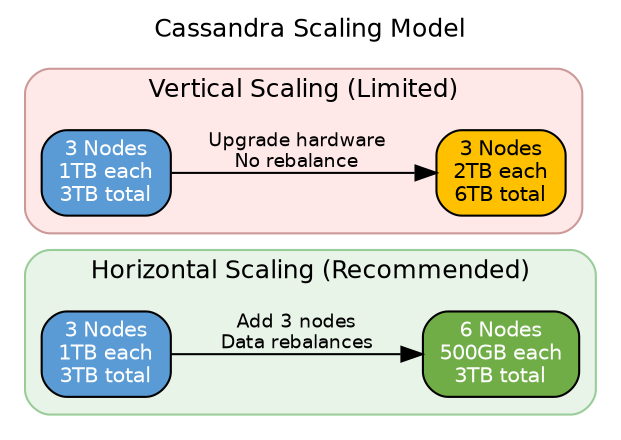
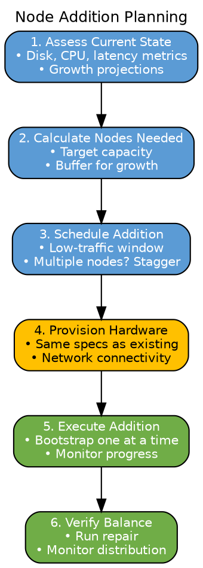
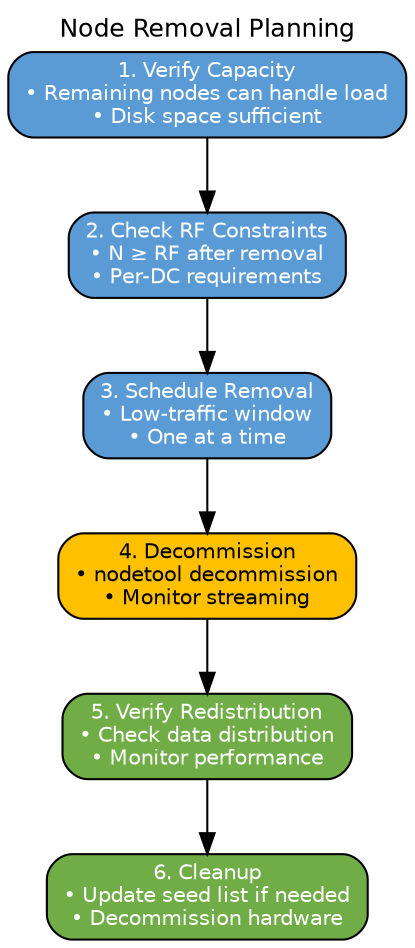
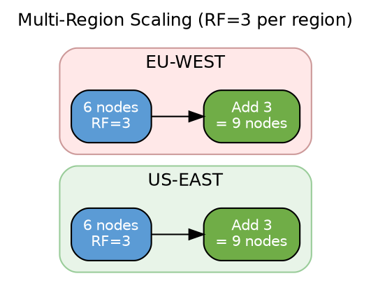

# Scaling Operations

This section covers horizontal scaling procedures for Cassandra clusters, including capacity planning, node addition and removal strategies, and operational best practices for maintaining cluster balance during topology changes.

---

## Scaling Model

### Horizontal vs Vertical Scaling

Cassandra is designed for horizontal scaling—adding more nodes rather than larger nodes:



| Approach | Advantages | Disadvantages |
|----------|------------|---------------|
| **Horizontal** | Linear scaling, fault tolerance | Data movement required |
| **Vertical** | No data movement | Hardware limits, no added fault tolerance |

---

## Capacity Planning

### Key Metrics

Before scaling, assess current cluster state:

| Metric | Target Range | Action if Exceeded |
|--------|--------------|-------------------|
| **Disk usage** | < 50% | Add nodes before 60% |
| **CPU utilization** | < 60% | Add nodes or optimize queries |
| **Memory pressure** | Heap < 80% | Tune JVM or add nodes |
| **Read latency (p99)** | < 50ms | Add nodes or review data model |
| **Write latency (p99)** | < 25ms | Add nodes or reduce batch size |

### Data Distribution Formula

For a cluster with N nodes and replication factor RF:

```
Data per node = (Total data × RF) / N

Example:
- Total unique data: 1 TB
- RF: 3
- Nodes: 6
- Data per node: (1TB × 3) / 6 = 500 GB
```

### Scaling Calculations

**Adding nodes:**
```
New data per node = Current data per node × (N / (N + new_nodes))

Example: Adding 3 nodes to 6-node cluster
- Current: 500 GB per node
- New: 500 GB × (6 / 9) = 333 GB per node
```

**Data movement estimation:**
```
Data to stream = (Total data × RF × new_nodes) / (N + new_nodes)

Example: Adding 3 nodes
- Data to stream: (1TB × 3 × 3) / 9 = 1 TB total
```

---

## Scaling Up (Adding Nodes)

### Planning Node Addition



### Addition Best Practices

| Practice | Rationale |
|----------|-----------|
| **Add multiple of RF** | Maintains balanced distribution |
| **Add one at a time** | Reduces cluster stress |
| **Wait for NORMAL** | Ensure complete bootstrap |
| **Schedule during low traffic** | Minimize impact |
| **Monitor existing nodes** | Watch for compaction backlog |

### Multi-Datacenter Scaling

When scaling across datacenters:

```yaml
# Ensure proportional capacity per DC
# Example: RF=3 per DC

DC1: 6 nodes (3 replicas distributed across 6)
DC2: 6 nodes (3 replicas distributed across 6)

# Add 2 nodes to each DC to maintain balance
DC1: 8 nodes
DC2: 8 nodes
```

### Adding Nodes Procedure

```bash
# Step 1: Verify cluster health
nodetool status  # All UN

# Step 2: Configure new node
# cassandra.yaml with cluster settings
# Ensure same cluster_name, seeds, snitch

# Step 3: Start new node
sudo systemctl start cassandra

# Step 4: Monitor bootstrap
watch -n 5 'nodetool netstats'

# Step 5: Wait for completion (status shows UN)
nodetool status

# Step 6: Run repair on new node
nodetool repair -pr

# Step 7: (If adding multiple) Repeat for next node
```

### vnodes and Token Distribution

With vnodes (recommended), token allocation is automatic:

```yaml
# cassandra.yaml
num_tokens: 256  # Default, provides good distribution

# Optional: Allocate tokens for specific keyspace
allocate_tokens_for_keyspace: my_keyspace
```

**vnodes advantages:**
- Automatic token allocation
- Better load distribution
- Faster streaming (parallel)
- Easier operations

---

## Scaling Down (Removing Nodes)

### Planning Node Removal



### Removal Constraints

Before removing nodes, verify:

| Constraint | Check | Consequence if Violated |
|------------|-------|------------------------|
| **RF satisfied** | Nodes remaining ≥ RF | Decommission blocked |
| **Disk capacity** | Remaining nodes have space | Disk full errors |
| **Performance** | Load can be handled | Latency increase |

### Removing Nodes Procedure

```bash
# Step 1: Verify remaining capacity
# Calculate new disk usage per node

# Step 2: Check RF requirements
nodetool describering <keyspace>

# Step 3: On node being removed, run decommission
nodetool decommission

# This:
# - Streams all data to remaining nodes
# - Takes significant time (hours for large datasets)
# - Cannot be cancelled

# Step 4: Monitor progress
watch -n 10 'nodetool netstats'

# Step 5: Verify completion
nodetool status
# Removed node should no longer appear

# Step 6: Update seed list if node was a seed
# Edit cassandra.yaml on all nodes
# Rolling restart (optional but recommended)
```

---

## Rebalancing

### When Rebalancing is Needed

Token rebalancing may be necessary when:
- Historical uneven additions created imbalance
- Single-token clusters need redistribution
- Significant data skew exists

### Rebalancing with vnodes

With vnodes, adding/removing nodes automatically rebalances. Manual intervention is rarely needed.

### Detecting Imbalance

```bash
# Check data distribution
nodetool status

# Look for significant variation in "Load" column
# Example of imbalanced cluster:
# UN  10.0.1.1  500 GB   ...
# UN  10.0.1.2  800 GB   ...  # 60% more data
# UN  10.0.1.3  450 GB   ...

# Check token ownership
nodetool ring
```

### Addressing Imbalance

| Imbalance Cause | Solution |
|-----------------|----------|
| **Partition key hotspot** | Review data model |
| **Token distribution** | Add nodes (vnodes auto-balance) |
| **Uneven node specs** | Standardize hardware |

---

## Scaling Strategies

### Double the Cluster

Adding nodes equal to current count provides optimal rebalancing:

```
Initial: 3 nodes, 1TB each
Add: 3 nodes
Result: 6 nodes, 500GB each

Data movement: 50% of data moves (optimal)
```

### Incremental Addition

Adding fewer nodes is possible but less efficient:

```
Initial: 3 nodes, 1TB each
Add: 1 node
Result: 4 nodes, 750GB each

Data movement: 25% of data moves
New node load: May still be uneven with vnodes
```

### Multi-Region Scaling



**Guidelines:**
- Scale regions proportionally
- Maintain RF per region
- Consider latency requirements

---

## Streaming Impact

### During Scale-Up

Adding nodes creates streaming load:

| Impact | Mitigation |
|--------|------------|
| **Network bandwidth** | Throttle with `stream_throughput_outbound_megabits_per_sec` |
| **Disk I/O** | Schedule during low-traffic hours |
| **CPU (compaction)** | Monitor pending compactions |
| **Memory** | Ensure heap headroom |

```yaml
# cassandra.yaml - Streaming throttle
stream_throughput_outbound_megabits_per_sec: 200  # Adjust based on network
inter_dc_stream_throughput_outbound_megabits_per_sec: 50
```

### During Scale-Down

Decommissioning creates similar streaming load, plus:
- Remaining nodes receive additional data
- Compaction increases post-streaming

---

## Operational Checklist

### Before Scaling

- [ ] Current cluster health (all nodes UN)
- [ ] No pending repairs or streaming
- [ ] Disk usage < 50% on all nodes
- [ ] Network bandwidth available for streaming
- [ ] Maintenance window scheduled
- [ ] Backups current (if applicable)

### During Scaling

- [ ] One node at a time
- [ ] Monitor streaming progress
- [ ] Watch for errors in logs
- [ ] Track compaction backlog
- [ ] Verify each node reaches NORMAL

### After Scaling

- [ ] All nodes show UN status
- [ ] Data distribution is balanced
- [ ] Performance metrics nominal
- [ ] Repair completed on new nodes
- [ ] Seed list updated (if applicable)
- [ ] Documentation updated

---

## Monitoring During Scaling

### Key Metrics to Watch

```bash
# Streaming progress
nodetool netstats

# Compaction status
nodetool compactionstats

# Thread pool status
nodetool tpstats

# Overall status
nodetool status
```

### Alert Thresholds During Scaling

| Metric | Warning | Critical |
|--------|---------|----------|
| Streaming stuck | No progress for 30 min | No progress for 1 hour |
| Pending compactions | > 50 | > 100 |
| Dropped messages | > 0.1% | > 1% |
| Disk usage | > 70% | > 80% |

---

## Related Documentation

- **[Node Lifecycle](node-lifecycle.md)** - Bootstrap and decommission details
- **[Data Streaming](../distributed-data/streaming.md)** - Streaming mechanics
- **[Partitioning](../distributed-data/partitioning.md)** - Token distribution
- **[Seeds and Discovery](seeds.md)** - Seed management during scaling
