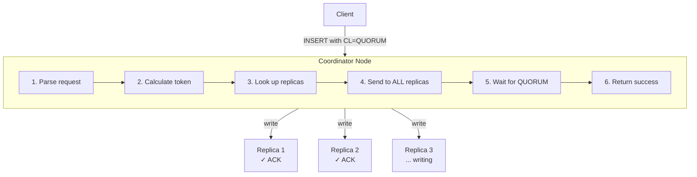

# Consistency

Consistency in Cassandra is tunable—the number of replicas that must acknowledge reads and writes is configurable per operation. This flexibility allows trading consistency for availability and latency.

---

## Consistency Is Per-Request

Unlike traditional databases where consistency is a system property, Cassandra allows specifying consistency per statement:

```sql
-- Strong consistency for this critical write
CONSISTENCY QUORUM;
INSERT INTO orders (id, amount) VALUES (uuid(), 100.00);

-- Weaker consistency for this non-critical read
CONSISTENCY ONE;
SELECT * FROM page_views WHERE page_id = 'homepage';
```

Different operations can be optimized differently within the same application.

---

## The Coordinator's Role

Every client request goes to a coordinator node, which manages the consistency guarantee:

```
Client
  │
  │ INSERT INTO users (id, name) VALUES (123, 'Alice')
  │ WITH CONSISTENCY = QUORUM
  │
  ▼
┌──────────────────────────────────────────────────────┐
│ COORDINATOR NODE                                      │
│                                                       │
│ 1. Parse request                                      │
│ 2. Calculate partition token: token(123)              │
│ 3. Look up replicas for that token                    │
│ 4. Send write to ALL replicas (regardless of CL)      │
│ 5. Wait for QUORUM (2 of 3) acknowledgments           │
│ 6. Return success to client                           │
└──────────────────────────────────────────────────────┘
         │           │           │
         ▼           ▼           ▼
      ┌──────┐   ┌──────┐   ┌──────┐
      │Replica│   │Replica│   │Replica│
      │  1    │   │  2    │   │  3    │
      │ [ACK] │   │ [ACK] │   │ [...] │ ← May still be writing
      └──────┘   └──────┘   └──────┘

Coordinator sends to ALL replicas, but only WAITS for
enough acknowledgments to satisfy the consistency level.
```



### What Acknowledgment Means

**For writes**, a replica acknowledges after:

1. Writing to commit log (durability)
2. Writing to memtable (memory)

The data is not necessarily flushed to SSTable yet, but it is durable because of the commit log.

**For reads**, a replica acknowledges by returning its data.

---

## Write Consistency Levels

### ANY: Maximum Availability

```
ANY: At least one node acknowledges, INCLUDING hints

Scenario: All 3 replicas are down

   Coordinator stores a "hint" locally and returns SUCCESS.
   When replicas come back online, hint is delivered.

DANGER: If coordinator crashes before delivering hint = DATA LOST
```

**When to use**: Almost never. Only for truly non-critical data where losing some writes is acceptable.

### ONE: Single Replica

```
ONE: One replica must acknowledge the write

┌───┐   ┌───┐   ┌───┐
│ N1│   │ N2│   │ N3│      RF = 3
│ ✓ │   │...│   │...│      ONE requires 1 ACK
└───┘   └───┘   └───┘
  │
  └── SUCCESS returned to client
```

**When to use**:

- High-throughput writes where some inconsistency is acceptable
- Time-series data with many writes per second
- When combined with ALL reads (R + W > N)

### QUORUM: Majority of All Replicas

```
QUORUM = floor(RF / 2) + 1

RF = 3:  QUORUM = floor(3/2) + 1 = 2
RF = 5:  QUORUM = floor(5/2) + 1 = 3
RF = 7:  QUORUM = floor(7/2) + 1 = 4
```

**Why majority matters**:

```
With RF=3, QUORUM=2:

Write QUORUM succeeds to nodes {A, B}
Read QUORUM contacts nodes {B, C}

The OVERLAP is B, which has the write.
Since R + W > N (2 + 2 > 3), at least one node in the read
set MUST have the most recent write.
```

**Multi-datacenter QUORUM**:

```
DC1: RF=3           DC2: RF=3
Total RF = 6, QUORUM = 4

Write QUORUM might contact: A, B (DC1) + D, E (DC2)
This means waiting for cross-DC network round trip!
```

**When to use**:

- Single datacenter deployments
- When global consistency across all DCs is required

### LOCAL_QUORUM: Majority in Local Datacenter

```
LOCAL_QUORUM: Quorum within the coordinator's datacenter only

DC1 (coordinator here)     DC2
┌───┐ ┌───┐ ┌───┐         ┌───┐ ┌───┐ ┌───┐
│ A │ │ B │ │ C │         │ D │ │ E │ │ F │
│ ✓ │ │ ✓ │ │   │         │   │ │   │ │   │
└───┘ └───┘ └───┘         └───┘ └───┘ └───┘

2 ACKs from DC1 = SUCCESS
Data is STILL sent to DC2, but coordinator does not wait.
```

**The latency advantage**:

```
QUORUM in multi-DC:
Client → DC1 → DC2 → DC1 → Client
         └───────────┘
         Cross-DC RTT (~50-200ms)

LOCAL_QUORUM:
Client → DC1 → Client
         └─┘
         Local RTT (~1-5ms)

LOCAL_QUORUM is 10-100x faster for multi-DC.
```

**When to use**: Multi-DC deployments (almost always the right choice).

### EACH_QUORUM: Quorum in Every Datacenter

```
EACH_QUORUM: Quorum must be achieved in EACH datacenter

DC1                        DC2
┌───┐ ┌───┐ ┌───┐         ┌───┐ ┌───┐ ┌───┐
│ A │ │ B │ │ C │         │ D │ │ E │ │ F │
│ ✓ │ │ ✓ │ │   │         │ ✓ │ │ ✓ │ │   │
└───┘ └───┘ └───┘         └───┘ └───┘ └───┘

Must wait for slowest DC.
```

**When to use**:

- Regulatory requirements for cross-DC consistency
- Financial transactions that must be in all regions before acknowledgment
- Rare—most applications do not need this

### ALL: Every Replica

```
ALL: Every single replica must acknowledge

┌───┐   ┌───┐   ┌───┐
│ N1│   │ N2│   │ N3│
│ ✓ │   │ ✓ │   │ ✓ │  ← ALL must ACK
└───┘   └───┘   └───┘

If ANY replica is down, write FAILS.
```

**When to use**: Almost never for writes. Single node failure causes all writes to fail.

---

## Read Consistency Levels

### ONE: Fastest Reads

```
ONE: Read from one replica, return immediately

Client → Coordinator → N1 → Data returned

If N1 has stale data, stale data is returned.
Background read repair may fix inconsistency later.
```

### QUORUM: Strong Consistency Reads

```
QUORUM read with RF=3:

Coordinator contacts 2 replicas:
  N1: returns data with timestamp 1000
  N2: returns data with timestamp 2000  ← Newer

Coordinator returns the NEWEST data (timestamp 2000).
If N1 and N2 disagree, coordinator triggers read repair.
```

### LOCAL_QUORUM: Fast Strong Reads

Same logic as QUORUM, but only contacts local DC replicas.

### EACH_QUORUM: Not Supported for Reads

EACH_QUORUM is write-only. For reads, use QUORUM (for cross-DC consistency) or LOCAL_QUORUM (for local consistency).

### ALL: Read From Every Replica

```
ALL: Contact every replica, return newest

If ANY replica is down or slow, read TIMES OUT.
```

**When ALL reads make sense**:

- Combined with ONE writes (R + W > N)
- Read-heavy workload where fast writes are desired
- Single node failure causes all reads to fail

---

## The Strong Consistency Formula

### R + W > N

The fundamental rule for strong consistency:

```
R = Number of replicas read
W = Number of replicas written
N = Replication factor

If R + W > N, reads will see the latest writes.
```

**Why it works**:

```
N = 3 (three replicas total)
W = 2 (write to two replicas)
R = 2 (read from two replicas)

R + W = 4 > 3 = N

The sets of written replicas and read replicas MUST overlap.

Write went to: {A, B}
Read contacts: {B, C}
Overlap: B ← Has the write
```

### Common Combinations

| Combination | R + W | Strong? | Use Case |
|-------------|-------|---------|----------|
| W=QUORUM, R=QUORUM | 4 > 3 | Yes | Standard strong consistency |
| W=ONE, R=ALL | 4 > 3 | Yes | Write-heavy, few reads |
| W=ALL, R=ONE | 4 > 3 | Yes | Read-heavy, few writes |
| W=LOCAL_QUORUM, R=LOCAL_QUORUM | 4 > 3 per DC | Yes (per DC) | Multi-DC standard |
| W=ONE, R=ONE | 2 < 3 | No | High throughput, eventual |
| W=ONE, R=QUORUM | 3 = 3 | No* | Sometimes inconsistent |

*R + W = N is not sufficient; must be strictly greater than.

### Multi-DC Complexity

```
DC1: RF=3, DC2: RF=3, Total RF=6

QUORUM = 4 (global)
LOCAL_QUORUM = 2 (per DC)

With QUORUM/QUORUM:
- Write to 4 replicas (could be 2 per DC, or 3+1)
- Read from 4 replicas
- Guarantees global consistency

With LOCAL_QUORUM/LOCAL_QUORUM:
- Write to 2 replicas IN LOCAL DC
- Read from 2 replicas IN LOCAL DC
- Strong consistency WITHIN each DC
- Cross-DC consistency is eventual
```

For most applications, LOCAL_QUORUM is sufficient because cross-DC replication happens in milliseconds.

---

## Failure Scenarios

### Single Node Failure (RF=3)

```
RF=3, One node down:

┌───┐   ┌───┐   ┌───┐
│ A │   │ B │   │ C │
│ ✓ │   │ ✓ │   │ ✗ │ ← Down
└───┘   └───┘   └───┘
```

| CL | Works? | Reason |
|----|--------|--------|
| ONE | ✓ | 2 replicas available |
| QUORUM (2) | ✓ | 2 of 3 available |
| ALL | ✗ | C is down |

### Two Node Failure (RF=3)

```
RF=3, Two nodes down:

┌───┐   ┌───┐   ┌───┐
│ A │   │ B │   │ C │
│ ✓ │   │ ✗ │   │ ✗ │ ← Both down
└───┘   └───┘   └───┘
```

| CL | Works? | Reason |
|----|--------|--------|
| ONE | ✓ | 1 replica available |
| QUORUM (2) | ✗ | Only 1 of 3 available |
| ALL | ✗ | B and C down |

### Entire Datacenter Failure

```
DC1 (UP)            DC2 (DOWN)
┌───┐ ┌───┐ ┌───┐   ┌───┐ ┌───┐ ┌───┐
│ A │ │ B │ │ C │   │ D │ │ E │ │ F │
│ ✓ │ │ ✓ │ │ ✓ │   │ ✗ │ │ ✗ │ │ ✗ │
└───┘ └───┘ └───┘   └───┘ └───┘ └───┘
```

| CL | Works? | Reason |
|----|--------|--------|
| LOCAL_ONE | ✓ | Only needs local DC |
| LOCAL_QUORUM | ✓ | Only needs local DC |
| QUORUM (4/6) | ✗ | Only 3 of 6 available |
| EACH_QUORUM | ✗ | DC2 has no quorum |

**Key insight**: LOCAL_QUORUM survives entire DC failure while maintaining strong local consistency.

---

## Lightweight Transactions (LWT)

### When Regular Consistency Is Not Enough

Regular QUORUM consistency does not provide linearizability for compare-and-set operations:

```
Problem scenario (race condition):

Time 0: Both Client A and Client B read balance = 100
Time 1: Client A: UPDATE SET balance = 100 - 50
Time 2: Client B: UPDATE SET balance = 100 - 30

Result: balance = 70 (should be 20!)
Both clients read 100, both subtracted from 100.
```

### LWT Solves This With Paxos

Lightweight transactions use the Paxos consensus algorithm ([Lamport, L., 1998, "The Part-Time Parliament"](https://lamport.azurewebsites.net/pubs/lamport-paxos.pdf)) to achieve linearizable consistency for compare-and-set operations.

```sql
-- Compare-and-set with IF clause triggers LWT
UPDATE account SET balance = 50 WHERE id = 1 IF balance = 100;

-- Returns [applied] = true if balance was 100
-- Returns [applied] = false if balance was different
```

### How LWT Works

```
LWT PAXOS PHASES

Phase 1: PREPARE
  Coordinator sends PREPARE(ballot) to replicas
  Replicas promise not to accept lower ballots

Phase 2: READ (for IF clause)
  Coordinator reads current value to check IF condition
  IF condition fails: Return [applied]=false, abort

Phase 3: PROPOSE
  Coordinator sends PROPOSE(ballot, value) to replicas
  Replicas accept if ballot matches promise

Phase 4: COMMIT
  Once quorum accepts, coordinator sends COMMIT
  Replicas durably store the value

Total: 4 round trips (vs 1 for regular writes)
Latency: ~4x regular writes
```

### Serial Consistency Levels

```sql
-- SERIAL: Paxos across ALL datacenters
SERIAL CONSISTENCY SERIAL;
INSERT INTO unique_emails (email, user_id)
VALUES ('a@b.com', 123) IF NOT EXISTS;

-- LOCAL_SERIAL: Paxos within local datacenter only
SERIAL CONSISTENCY LOCAL_SERIAL;
INSERT INTO user_sessions (session_id, user_id)
VALUES (uuid(), 123) IF NOT EXISTS;
```

| Serial CL | Scope | Latency | Use Case |
|-----------|-------|---------|----------|
| SERIAL | All DCs | High (cross-DC) | Global uniqueness |
| LOCAL_SERIAL | Local DC | Lower | DC-local uniqueness |

### LWT Best Practices

1. **Use sparingly**: LWT is 4x slower than regular writes
2. **Batch related LWTs**: Multiple LWT in same partition can share Paxos
3. **Consider alternatives**: Often application-level locking or redesign is better
4. **Monitor contention**: High LWT contention causes performance collapse

```sql
-- Good: Single LWT for compare-and-set
UPDATE inventory SET qty = qty - 1 WHERE product_id = ? IF qty > 0;

-- Bad: Using LWT unnecessarily
INSERT INTO events (id, data) VALUES (uuid(), ?) IF NOT EXISTS;
-- UUID is always unique, LWT is not needed
```

---

## Speculative Execution

Speculative execution sends duplicate requests to reduce tail latency when one replica is slow:

```
WITHOUT SPECULATIVE EXECUTION

QUORUM read (need 2 of 3):

T+0ms:   Send to N1, N2
T+5ms:   N1 responds (fast)
T+500ms: N2 responds (slow, maybe GC pause)
T+500ms: Return to client

WITH SPECULATIVE EXECUTION (99percentile trigger)

T+0ms:   Send to N1, N2
T+5ms:   N1 responds
T+10ms:  N2 has not responded (>99th percentile)
T+10ms:  Speculatively send to N3
T+15ms:  N3 responds
T+15ms:  Return to client (2 responses: N1, N3)
```

### Configuration

```sql
-- Per-table speculative retry setting
ALTER TABLE users WITH speculative_retry = '99percentile';

-- Options:
-- 'Xpercentile': Retry after X percentile latency
-- 'Yms': Retry after Y milliseconds
-- 'ALWAYS': Always send to extra replica immediately
-- 'NONE': Disable speculative retry
```

**Trade-off**: Speculative execution increases replica load but reduces tail latency.

---

## Debugging Consistency Issues

### "I wrote data but cannot read it"

**Diagnosis steps:**

1. Check consistency levels: Write CL + Read CL > RF?
2. Check for clock skew: `ntpq -p` on each node
3. Check for failed writes: Application logs for timeouts
4. Enable tracing: `TRACING ON;`

### Tracing

```sql
TRACING ON;

SELECT * FROM users WHERE user_id = 123;

-- Output shows:
-- - Which replicas were contacted
-- - Response times from each
-- - Whether read repair occurred
```

### JMX Metrics

```
# Unavailable errors (CL could not be satisfied)
org.apache.cassandra.metrics:type=ClientRequest,scope=Read,name=Unavailables
org.apache.cassandra.metrics:type=ClientRequest,scope=Write,name=Unavailables

# Timeouts
org.apache.cassandra.metrics:type=ClientRequest,scope=Read,name=Timeouts
org.apache.cassandra.metrics:type=ClientRequest,scope=Write,name=Timeouts

# LWT metrics
org.apache.cassandra.metrics:type=ClientRequest,scope=CASWrite,name=Latency
org.apache.cassandra.metrics:type=ClientRequest,scope=CASWrite,name=ContentionHistogram
```

---

## Best Practices

### Choosing Consistency Levels

| Scenario | Write CL | Read CL | Rationale |
|----------|----------|---------|-----------|
| Single DC, strong consistency | QUORUM | QUORUM | R+W > N |
| Multi-DC, low latency | LOCAL_QUORUM | LOCAL_QUORUM | No cross-DC wait |
| Multi-DC, global consistency | QUORUM | QUORUM | Cross-DC consensus |
| High throughput, eventual OK | ONE | ONE | Fastest |
| Write-heavy | ONE | ALL | Fast writes |
| Read-heavy | ALL | ONE | Fast reads |
| Time-series metrics | LOCAL_ONE | LOCAL_ONE | Volume over consistency |

### Common Mistakes

| Mistake | Consequence |
|---------|-------------|
| Using ALL in production | Single node failure breaks everything |
| QUORUM in multi-DC when LOCAL_QUORUM suffices | Unnecessary latency |
| ONE/ONE without understanding | No consistency guarantee |
| Overusing LWT | Performance degradation |
| Ignoring clock skew | Silent data loss via timestamp conflicts |

### Monitoring

| Metric | Alert Threshold | Meaning |
|--------|-----------------|---------|
| Unavailables | >0 | CL cannot be met |
| Timeouts | >1% | Replicas too slow |
| Read repair rate | >10% | High inconsistency |
| LWT contention | >10% | Redesign needed |

---

## Related Documentation

- **[Distributed Data Overview](index.md)** - How partitioning, replication, and consistency work together
- **[Replication](replication.md)** - How replicas are placed
- **[Replica Synchronization](replica-synchronization.md)** - How replicas converge
- **[Operations](../../operations/repair/index.md)** - Running repair
