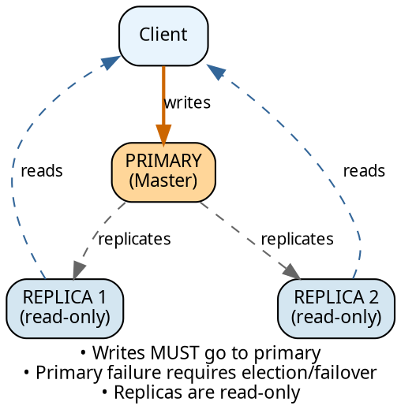
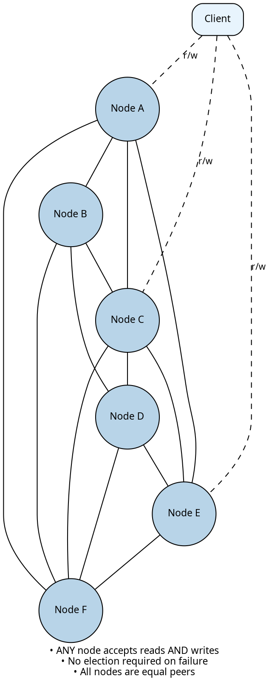
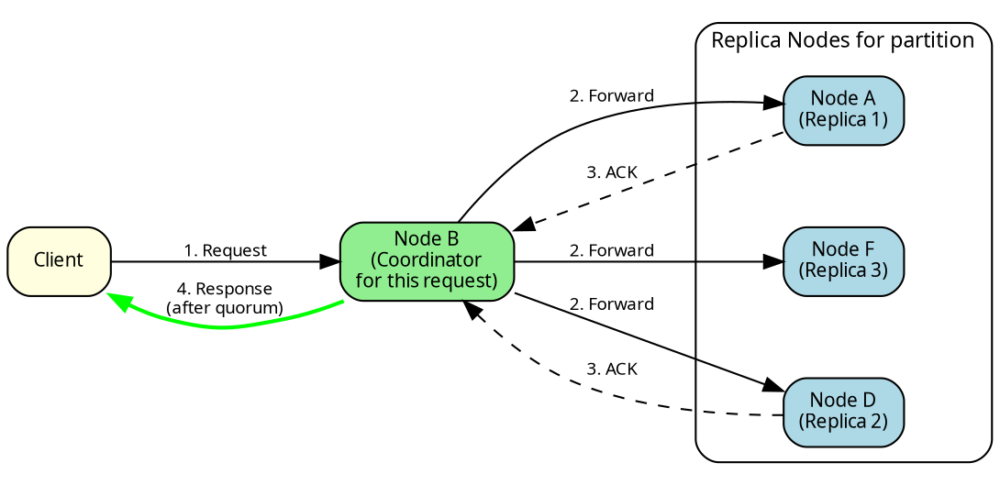
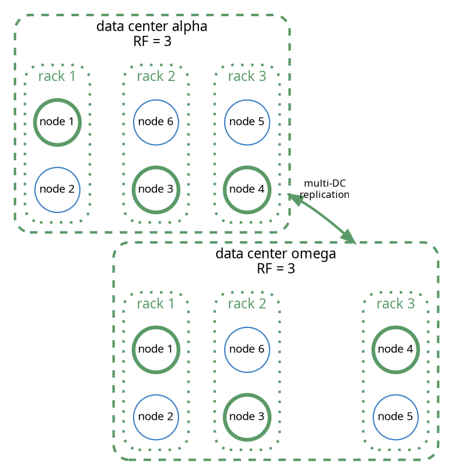
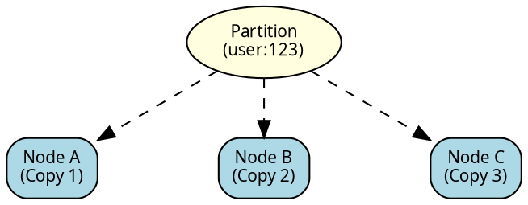
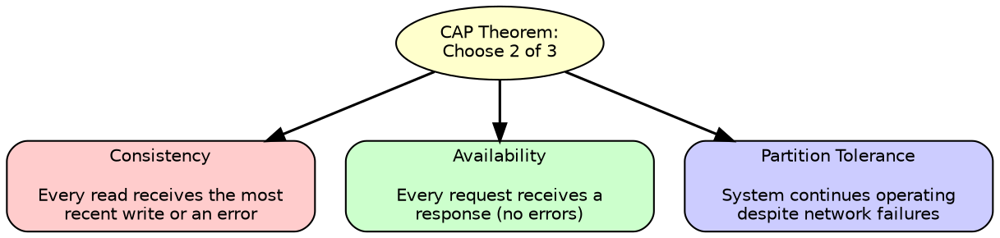
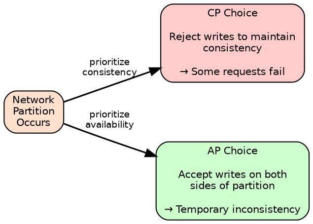

# Distributed Data

Cassandra distributes data across multiple nodes to achieve fault tolerance and horizontal scalability. This section covers the three interconnected mechanisms that govern how data is distributed, replicated, and accessed consistently across the cluster.

---

## Theoretical Foundations

Cassandra's distributed architecture derives from Amazon's Dynamo paper ([DeCandia et al., 2007, "Dynamo: Amazon's Highly Available Key-value Store"](https://www.allthingsdistributed.com/files/amazon-dynamo-sosp2007.pdf)), which introduced techniques for building highly available distributed systems.

| Dynamo Concept | Purpose | Cassandra Implementation |
|----------------|---------|-------------------------|
| Consistent hashing | Distribute data across nodes | Token ring with partitioners |
| Virtual nodes | Even distribution, incremental scaling | vnodes (num_tokens) |
| Replication | Fault tolerance | Configurable replication factor |
| Sloppy quorum | Availability during failures | Hinted handoff |
| Vector clocks | Conflict resolution | Timestamps (last-write-wins) |
| Merkle trees | Efficient synchronization | Merkle tree synchronization |
| Gossip protocol | Failure detection, membership | [Gossip protocol](../cluster-management/gossip.md) |
| CAP theorem | Consistency/availability trade-off | Tunable consistency per operation |

Cassandra implements most Dynamo concepts but makes different trade-offs in some areas.

!!! info "Timestamps vs Vector Clocks"
    Cassandra uses timestamps for conflict resolution rather than vector clocks, choosing simplicity over preserving all conflicting versions. This means concurrent writes to the same key result in last-write-wins semantics based on timestamp, rather than preserving both versions for application-level resolution.

---

## Masterless Architecture

Cassandra's defining architectural characteristic is its **masterless** (or "peer-to-peer") design. Every node in a Cassandra cluster is identical in function—there is no primary, leader, master, or coordinator node that holds special responsibility for the cluster. Unlike systems that require distinct node roles (primary/replica, leader/follower, master/slave), Cassandra nodes are homogeneous: same configuration, same binary, same capabilities. This architectural simplicity translates directly to operational simplicity—adding capacity means deploying identical nodes, and any node can be replaced without special failover procedures.

### What Masterless Means

**Traditional Master-Based System:**



**Cassandra Masterless Design:**



In Cassandra:
- Any node can serve as **coordinator** for any request
- The coordinator role is assigned per-request, not per-cluster
- No node holds special metadata or routing responsibility
- Cluster continues operating if any node (or multiple nodes) fails

### Comparison with Master-Based Systems

| System | Architecture | Write Path | Failure Behavior |
|--------|--------------|------------|------------------|
| **Cassandra** | Masterless | Any node accepts writes for any partition | No failover needed; remaining nodes continue |
| **MongoDB** | Primary/Secondary | Writes to primary only; primary replicates to secondaries | Election required; brief write unavailability |
| **MySQL (Group Replication)** | Single-primary or Multi-primary | Single-primary: one node; Multi-primary: any node | Primary election on failure |
| **PostgreSQL (Streaming)** | Primary/Standby | Primary only; standbys are read-only | Manual or automatic failover required |
| **CockroachDB** | Raft consensus | Leader per range; leader accepts writes | Raft leader election per range |
| **TiDB** | Raft consensus | Leader per region; leader accepts writes | Raft leader election per region |
| **Redis Cluster** | Primary/Replica per slot | Primary for each hash slot | Failover election per slot |

### How Coordinator Selection Works

Cassandra drivers establish connections to all nodes in the local datacenter (and optionally remote DCs). The driver maintains a connection pool to each node and load balances requests across them. For each request:

```
1. Driver selects a coordinator node (load balancing across all connected nodes)
2. That node becomes the COORDINATOR for this request
3. Coordinator determines which nodes hold the data (using token ring)
4. Coordinator forwards request to appropriate replica nodes
5. Coordinator collects responses and returns result to client

Request 1: Client → Node A (coordinator) → Nodes B, C, D (replicas)
Request 2: Client → Node C (coordinator) → Nodes A, E, F (replicas)
Request 3: Client → Node B (coordinator) → Nodes C, D, A (replicas)

Each request can use a different coordinator.
No node is "special" or required for cluster operation.
```



### Benefits of Masterless Design

| Benefit | Description |
|---------|-------------|
| **No single point of failure** | Any node can fail without affecting cluster availability |
| **No failover delay** | No election process; operations continue immediately |
| **Linear write scalability** | All nodes accept writes; adding nodes increases write capacity |
| **Simpler operations** | No primary/replica distinction to manage |
| **Geographic distribution** | Each datacenter is autonomous; no cross-DC leader election |

### Trade-offs of Masterless Design

| Trade-off | Description | Mitigation |
|-----------|-------------|------------|
| **Conflict resolution** | Concurrent writes to same key can conflict | Last-write-wins (timestamps); LWT for critical operations |
| **No single source of truth** | No authoritative primary for reads | Quorum reads; repair for convergence |
| **Coordination overhead** | Each request requires multi-node coordination | Token-aware routing; LOCAL_* consistency levels |
| **Complexity in ordering** | No global write ordering | Per-partition ordering; application-level sequencing |

### Consistency Guarantees: Master-Based vs Masterless

Master-based architectures achieve consistency through a single authoritative node—but at the cost of availability during failures and a write throughput ceiling. Cassandra provides the same guarantees when needed, while allowing flexibility to optimize for availability or performance when strong consistency is not required.

| Requirement | Master-Based Approach | Cassandra Approach |
|-------------|----------------------|-------------------|
| **Strong consistency** | All writes through primary (single point of failure, write bottleneck) | SERIAL consistency via Paxos (no single point of failure, scales horizontally) |
| **Conflict resolution** | Primary is authoritative (unavailable during failover) | Last-write-wins by default; LWT for compare-and-set when needed |
| **Read-your-writes** | Read from primary (adds latency, primary overload risk) | QUORUM reads + writes (R + W > N), load balanced across replicas |

!!! tip "Key Difference"
    Master-based systems force strong consistency at all times with corresponding availability trade-offs. Cassandra allows per-query tuning—strong consistency for financial transactions, eventual consistency for analytics or caching.

### Multi-Datacenter Masterless Operation

Cassandra's masterless design extends across datacenters:

- Single cluster spans multiple datacenters with topology-aware replication
- No cross-DC leader election required
- LOCAL_QUORUM enables DC-local consistency without cross-DC coordination
- Cluster continues operating if one DC fails entirely



!!! note "Multi-DC Latency Advantage"
    Systems using Raft or Paxos consensus across datacenters require cross-DC communication for every write, adding latency proportional to the distance between datacenters. Cassandra with LOCAL_QUORUM avoids this cross-DC round-trip for most operations.

---

## Core Concepts

### Partitioning

Partitioning determines which node stores a given piece of data. Cassandra uses consistent hashing to map partition keys to tokens, and tokens to nodes on a ring.

```
Partition Key → Hash Function → Token → Node(s)

Example:
"user:123" → Murmur3Hash → -7509452495886106294 → Node B
```

The partitioner (hash function) ensures even data distribution regardless of key patterns. This prevents hot spots where sequential keys would otherwise concentrate on a single node.

See [Partitioning](partitioning.md) for details on consistent hashing, the token ring, and partitioner options.

### Replication

Replication copies each partition to multiple nodes for fault tolerance. The replication factor (RF) determines how many copies exist.




The replication strategy determines how replicas are placed—whether they respect datacenter and rack boundaries to survive infrastructure failures.

See [Replication](replication.md) for details on strategies, snitches, and configuration.

### Consistency

Consistency determines how many replicas must acknowledge reads and writes. Because replicas may temporarily diverge, the consistency level controls the trade-off between consistency, availability, and latency.

```
Write with QUORUM (RF=3):
  - Send write to all 3 replicas
  - Wait for 2 acknowledgments (majority)
  - Return success to client

Read with QUORUM (RF=3):
  - Contact 2 replicas
  - Compare responses, return newest
  - Propagate newest version to stale replicas
```

!!! tip "Strong Consistency Formula"
    The formula `R + W > N` (reads + writes > replication factor) guarantees that reads see the latest writes. With RF=3, using QUORUM (2) for both reads and writes satisfies this: 2 + 2 = 4 > 3.

See [Consistency](consistency.md) for details on consistency levels and guarantees.

### Replica Synchronization

When replicas diverge due to failures or timing differences, synchronization mechanisms detect the divergence and propagate missing data to restore convergence:

| Mechanism | Trigger | Function |
|-----------|---------|----------|
| Hinted handoff | Write to unavailable replica | Deferred delivery when replica recovers |
| Read reconciliation | Query execution | Propagates newest version to stale replicas |
| Merkle tree synchronization | Scheduled maintenance | Full dataset comparison and convergence |

See [Replica Synchronization](replica-synchronization.md) for details on convergence mechanisms.

---

## How They Work Together

A single write operation involves all three mechanisms:

```
INSERT INTO users (id, name) VALUES (123, 'Alice')
WITH CONSISTENCY QUORUM

1. PARTITIONING
   Coordinator hashes partition key:
   token(123) = -7509452495886106294

2. REPLICATION
   Look up replicas for this token:
   RF=3, NetworkTopologyStrategy → Nodes A, B, C (different racks)

3. CONSISTENCY
   Send write to all replicas, wait for QUORUM (2):
   Node A: ACK ✓
   Node B: ACK ✓
   Node C: (still writing, but QUORUM met)
   Return SUCCESS to client

4. ANTI-ENTROPY
   If Node C was temporarily down:
   - Coordinator stores hint
   - When C recovers, hint is delivered
   - If hints expire, scheduled synchronization restores convergence
```

---

## CAP Theorem

The CAP theorem, formulated by Eric Brewer in 2000 and proven by Gilbert and Lynch in 2002 ([Gilbert & Lynch, 2002, "Brewer's Conjecture and the Feasibility of Consistent, Available, Partition-Tolerant Web Services"](https://users.ece.cmu.edu/~adrian/731-sp04/readings/GL-cap.pdf)), states that a distributed data store can provide at most **two** of three guarantees simultaneously:

### The Three Properties



| Property | Definition | Implication |
|----------|------------|-------------|
| **Consistency (C)** | All nodes see the same data at the same time | Reads always return the most recent write |
| **Availability (A)** | Every request receives a non-error response | No request times out or returns failure |
| **Partition Tolerance (P)** | System continues operating despite network partitions | Nodes can be split into groups that cannot communicate |

### Partition Tolerance Is Not Optional

!!! warning "Network Partitions Are Inevitable"
    In real distributed systems, network partitions are inevitable—switches fail, cables are cut, datacenters lose connectivity. A system that cannot tolerate partitions is not a distributed system; it is a single-node system with remote storage.

Therefore, the practical choice is between:

- **CP (Consistency + Partition Tolerance)**: During a partition, reject operations that cannot guarantee consistency
- **AP (Availability + Partition Tolerance)**: During a partition, continue accepting operations even if nodes may diverge



### Database Classification

| Category | Behavior During Partition | Examples |
|----------|---------------------------|----------|
| **CP** | Reject operations that cannot be consistently applied | PostgreSQL, MySQL, MongoDB (default), CockroachDB, Spanner |
| **AP** | Accept operations; resolve conflicts later | Cassandra (default), DynamoDB, Riak, CouchDB |

### Where Cassandra Sits

Cassandra is typically classified as **AP**—it prioritizes availability over consistency by default. However, this classification oversimplifies Cassandra's capabilities.

!!! note "Tunable, Not Fixed"
    Unlike most databases that are permanently CP or AP, Cassandra allows choosing the consistency-availability trade-off on a per-operation basis. The same cluster can serve AP workloads (analytics, caching) and CP workloads (transactions, user data) simultaneously.

**Default behavior (AP):**

- Writes succeed if any replica is available
- Reads return data even if replicas disagree
- Conflicts resolved by timestamp (last-write-wins)

**With tunable consistency, Cassandra can behave as CP:**

- `QUORUM` reads and writes ensure `R + W > N` (overlapping quorums)
- `ALL` requires all replicas to respond
- `SERIAL` provides linearizable consistency via Paxos

### Tunable Consistency: Per-Operation CAP Position

Unlike databases that enforce a single consistency model, Cassandra allows choosing the consistency-availability trade-off for each operation:

| Consistency Level | CAP Position | Behavior During Partition |
|-------------------|--------------|---------------------------|
| `ANY` | AP | Write succeeds if any node (including coordinator) receives it |
| `ONE` | AP | Write/read succeeds if one replica responds |
| `QUORUM` | CP | Requires majority of replicas; may reject if quorum unavailable |
| `ALL` | CP | Requires all replicas; rejects if any replica unavailable |
| `SERIAL` | CP | Linearizable via Paxos; rejects if consensus cannot be reached |

**Practical implications:**

```
Partition splits cluster: Nodes {A, B} | {C, D, E}
RF = 3, replicas on nodes A, C, E

With QUORUM (requires 2 of 3 replicas):
- Left side (A): Can reach 1 replica → QUORUM fails
- Right side (C, E): Can reach 2 replicas → QUORUM succeeds
- Result: CP behavior, partial availability

With ONE:
- Both sides can reach at least 1 replica
- Result: AP behavior, full availability, possible inconsistency
```

### CAP During Normal Operation

!!! info "CAP Only Applies During Partitions"
    The CAP theorem applies specifically during network partitions. During normal operation (no partitions), Cassandra provides both consistency and availability—the trade-off only manifests when partitions occur.

| State | Consistency | Availability | Notes |
|-------|-------------|--------------|-------|
| Normal operation | ✓ (with QUORUM) | ✓ | No trade-off required |
| During partition | Choose one | Choose one | CAP trade-off applies |
| After partition heals | ✓ (eventually) | ✓ | Repair restores consistency |

### PACELC: Beyond CAP

The PACELC theorem ([Abadi, 2012](https://cs-www.cs.yale.edu/homes/dna/papers/abadi-pacelc.pdf)) extends CAP to address behavior during normal operation:

**P**artition → **A**vailability vs **C**onsistency
**E**lse → **L**atency vs **C**onsistency

During normal operation, the trade-off is between latency and consistency:

| System | During Partition (PAC) | Normal Operation (ELC) |
|--------|------------------------|------------------------|
| Cassandra (ONE) | PA | EL (low latency, eventual consistency) |
| Cassandra (QUORUM) | PC | EC (higher latency, strong consistency) |
| PostgreSQL | PC | EC |
| DynamoDB | PA | EL |

Cassandra's tunable consistency allows choosing different PACELC positions for different operations within the same cluster.

---

## Documentation Structure

| Section | Description |
|---------|-------------|
| [Partitioning](partitioning.md) | Consistent hashing, token ring, partitioners |
| [Replication](replication.md) | Strategies, snitches, replication factor |
| [Consistency](consistency.md) | Consistency levels, guarantees, LWT |
| [Replica Synchronization](replica-synchronization.md) | Hinted handoff, read reconciliation, Merkle trees |
| [Secondary Index Queries](secondary-index-queries.md) | Distributed query execution with indexes |
| [Materialized Views](materialized-views.md) | Distributed MV coordination and consistency challenges |
| [Data Streaming](streaming.md) | Bootstrap, decommission, repair, and hinted handoff streaming |
| [Counters](counters.md) | Distributed counting, CRDTs, counter operations |

---

## Related Documentation

- **[Gossip Protocol](../cluster-management/gossip.md)** - Cluster membership and failure detection
- **[Storage Engine](../storage-engine/index.md)** - How data is stored on each node
- **[Indexes](../storage-engine/indexes/index.md)** - Secondary index types and selection
- **[Operations](../../operations/index.md)** - Maintenance and operational procedures
