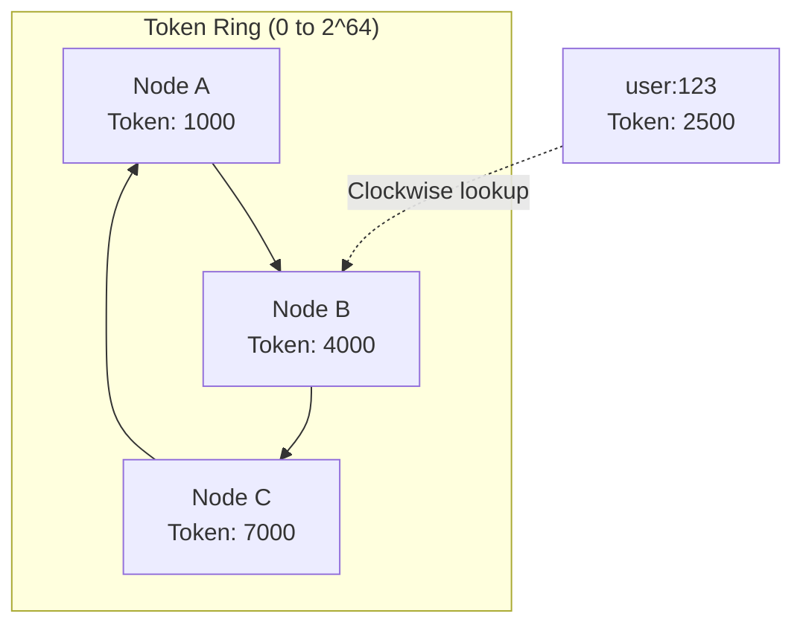

# Partitioning

Partitioning determines how data is distributed across nodes in a Cassandra cluster. Each row is assigned to a node based on its partition key, which is hashed to produce a token value. The token determines which node owns the data.

---

## The Problem with Modulo Hashing

Traditional hash-based distribution uses modulo arithmetic:

```
node = hash(key) % number_of_nodes
```

This approach fails catastrophically when the cluster size changes:

```
Before: 3 nodes
hash("user:123") % 3 = 1 → Node 1
hash("user:456") % 3 = 2 → Node 2
hash("user:789") % 3 = 0 → Node 0

After adding 1 node: 4 nodes
hash("user:123") % 4 = 3 → Node 3  ← MOVED
hash("user:456") % 4 = 2 → Node 2  ← Same
hash("user:789") % 4 = 1 → Node 1  ← MOVED

Result: ~75% of data must move when adding one node
        In a large cluster, this is operationally catastrophic
```

---

## Consistent Hashing

Consistent hashing, introduced by Karger et al. ([Karger, D. et al., 1997, "Consistent Hashing and Random Trees"](https://www.cs.princeton.edu/courses/archive/fall09/cos518/papers/chash.pdf)), solves this problem by mapping both keys and nodes onto a fixed ring:

```
1. Define a fixed hash space (ring): 0 to 2^64

2. Hash each node's identifier to a position on the ring
   Node A → position 1000
   Node B → position 4000
   Node C → position 7000

3. Hash each data key to a position on the ring
   "user:123" → position 2500

4. Walk clockwise to find the first node
   Position 2500 → clockwise → Node B (at 4000)

            0/2^64
              │
          Node A (1000)
             ╱
            │    "user:123" (2500) ─┐
            │                       │
            │              Node B (4000) ← owns this key
            │
             ╲
          Node C (7000)
              │
            (ring continues to 0)
```



**Why consistent hashing minimizes data movement:**

```
Adding Node D at position 5500:

Before: "user:789" (position 6000) → Node C (7000)
After:  "user:789" (position 6000) → Node C (7000)  ← No change

Before: "user:456" (position 5000) → Node C (7000)
After:  "user:456" (position 5000) → Node D (5500)  ← Moved to new node

Only keys between Node B (4000) and Node D (5500) move to Node D.
All other keys stay on their original nodes.

Result: Only ~1/N of data moves when adding one node (where N = nodes)
        With 100 nodes, ~1% moves instead of ~99%
```

---

## The Token Ring

With consistent hashing, Cassandra organizes nodes on a virtual ring of tokens:

```
TOKEN RING (Murmur3Partitioner: tokens from -2^63 to +2^63)

                        Token: 0
                           ┌─┐
                          ╱   ╲
                         │     │
       Token: -3×10^18 ┌─┘     └─┐ Token: +3×10^18
                      ╱           ╲
                     │   TOKEN     │
                     │    RING     │
                      ╲           ╱
       Token: -6×10^18 └─┐     ┌─┘ Token: +6×10^18
                         │     │
                          ╲   ╱
                           └─┘
                   Token: -9×10^18

The ring is continuous: +9×10^18 wraps to -9×10^18
```

### Partition Key to Token

Every row has a partition key that the partitioner hashes to a token:

```sql
-- See the token for a partition key
SELECT token(user_id), user_id, name FROM users;

-- Output:
 system.token(user_id)     | user_id                              | name
---------------------------+--------------------------------------+-------
 -8750879223671532049      | 550e8400-e29b-41d4-a716-446655440000 | Alice
 -3485723948573892001      | 6ba7b810-9dad-11d1-80b4-00c04fd430c8 | Bob
  2749583759385739583      | 7ba7b810-9dad-11d1-80b4-00c04fd430c8 | Carol
```

### Token Ownership

Each node owns a range of tokens. The node that owns a token is the primary replica:

```
TOKEN OWNERSHIP (3 nodes, RF=3)

Node A owns tokens: -∞ to -3×10^18
Node B owns tokens: -3×10^18 to +3×10^18
Node C owns tokens: +3×10^18 to +∞

                        Token: 0
                           ┌─┐
                          ╱ B ╲   ← Node B is primary for token 0
                         │     │
                    A  ┌─┘     └─┐  C
                      ╱           ╲
                     │             │

Partition with token -1×10^18 (in Node B's range):
  - Primary replica: Node B (owns this token range)
  - Replica 2: Node C (next clockwise)
  - Replica 3: Node A (next clockwise after C)

With RF=3, every partition has 3 copies on 3 different nodes.
```

---

## Virtual Nodes (vnodes)

Instead of each node owning one contiguous token range, modern Cassandra uses virtual nodes where each physical node owns many small ranges:

```
Without vnodes (single token):

  Node A: ─────────────────────────────
  Node B: ─────────────────────────────
  Node C: ─────────────────────────────
          └─ Each node owns 1/3 of ring

With vnodes (num_tokens=4):

  Node A: ──── ──── ──── ────
  Node B: ──── ──── ──── ────
  Node C: ──── ──── ──── ────
          └─ Each node owns 4 small ranges, interleaved

The ring looks like: A B C A C B A B C A C B ...
```

### Why vnodes Help

| Benefit | Explanation |
|---------|-------------|
| Better load distribution | Hot partitions spread across more nodes |
| Faster streaming | When a node joins/leaves, data transfers from/to many nodes in parallel |
| No manual token calculation | Tokens are randomly assigned |
| Easier operations | Replacing a node does not require recalculating tokens |

### vnode Configuration

```yaml
# cassandra.yaml

# Number of vnodes per node
# Cassandra 4.0+ default: 16
# Older versions: 256
num_tokens: 16

# For new clusters with Cassandra 4.0+, use the token allocator
allocate_tokens_for_local_replication_factor: 3
```

### num_tokens Trade-offs

| num_tokens | Advantage | Disadvantage |
|------------|-----------|--------------|
| 1 | Simplest, predictable | Uneven load, slow streaming |
| 16 | Good balance (4.0+ default) | Slight overhead |
| 256 | Very even distribution | Memory overhead, gossip traffic |

---

## Partitioners

The partitioner determines how partition keys are mapped to token values on the ring. The choice of partitioner affects data distribution, query capabilities, and cluster behavior.

### Murmur3Partitioner (Default)

The default and recommended partitioner since Cassandra 1.2. It uses the MurmurHash3 algorithm ([Appleby, A., 2008](https://github.com/aappleby/smhasher/wiki/MurmurHash3)), a non-cryptographic hash function designed for high performance and excellent distribution properties.

```
Hash function: MurmurHash3 (128-bit, uses lower 64 bits)
Token range: -2^63 to +2^63 - 1
Distribution: Uniform random distribution
```

| Characteristic | Description |
|----------------|-------------|
| Distribution | Excellent—keys distribute evenly regardless of input patterns |
| Range queries | Not supported across partition keys |
| Hot spots | Rare—even sequential keys distribute randomly |
| Token range | -9,223,372,036,854,775,808 to +9,223,372,036,854,775,807 |

**How Murmur3 distributes data:**

```
Sequential input keys:              Resulting tokens (random distribution):
user:1                      →       -7,509,452,495,886,106,294
user:2                      →        3,248,973,570,287,400,012
user:3                      →       -1,042,345,729,384,756,129
user:4                      →        8,127,364,501,928,374,650

Even though keys are sequential, tokens are randomly distributed
across the entire ring. This prevents hot spots from sequential inserts.
```

### RandomPartitioner (Legacy)

The original default partitioner, now superseded by Murmur3Partitioner.

```
Hash function: MD5
Token range: 0 to 2^127 - 1
Distribution: Uniform random distribution
```

| Characteristic | Description |
|----------------|-------------|
| Distribution | Good—similar to Murmur3 |
| Performance | Slower than Murmur3 (MD5 is cryptographic) |
| Token format | Large integers (harder to read) |
| Status | Legacy—use Murmur3Partitioner for new clusters |

**Why Murmur3 replaced Random:**

| Aspect | RandomPartitioner | Murmur3Partitioner |
|--------|------------------|-------------------|
| Hash function | MD5 (cryptographic) | MurmurHash3 (non-cryptographic) |
| Performance | Slower | 3-5× faster |
| Token size | 128-bit (large numbers) | 64-bit (readable numbers) |
| Purpose | Cryptographic security | Speed and distribution |

Cryptographic properties of MD5 are unnecessary for partitioning—only uniform distribution matters.

### ByteOrderedPartitioner (Special Use Cases)

Preserves the byte ordering of partition keys, enabling range scans across partitions.

```
Hash function: None (uses raw bytes)
Token range: Raw byte sequences
Distribution: Reflects data distribution
```

| Characteristic | Description |
|----------------|-------------|
| Distribution | Reflects input data patterns—can cause severe hot spots |
| Range queries | Supported across partition keys |
| Hot spots | Common—sequential keys go to same node |
| Use cases | Time-series with range scans, ordered data access |

**Warning:** ByteOrderedPartitioner can cause severe operational problems:

```
Sequential writes (e.g., time-series with timestamp keys):

2024-01-15T10:00:00 → Node A
2024-01-15T10:00:01 → Node A
2024-01-15T10:00:02 → Node A
2024-01-15T10:00:03 → Node A
...
2024-01-15T11:00:00 → Node A (still!)

All current writes hit ONE node while others sit idle.
This node becomes a bottleneck and may fail under load.

With Murmur3Partitioner:
2024-01-15T10:00:00 → Node C (random)
2024-01-15T10:00:01 → Node A (random)
2024-01-15T10:00:02 → Node B (random)
2024-01-15T10:00:03 → Node C (random)

Writes distribute evenly across all nodes.
```

**When ByteOrderedPartitioner might be appropriate:**

- Range scans across partition keys are required (rare in Cassandra data models)
- Data is pre-distributed by key design
- Full understanding of operational implications

**Recommendation:** Use Murmur3Partitioner. If range scans are needed, model data with clustering columns instead.

### Partitioner Configuration

The partitioner is set at cluster creation and cannot be changed without rebuilding the cluster.

```yaml
# cassandra.yaml
partitioner: org.apache.cassandra.dht.Murmur3Partitioner
```

| Partitioner Class | Use Case |
|-------------------|----------|
| `org.apache.cassandra.dht.Murmur3Partitioner` | Default, recommended for all new clusters |
| `org.apache.cassandra.dht.RandomPartitioner` | Legacy clusters only |
| `org.apache.cassandra.dht.ByteOrderedPartitioner` | Special cases requiring range scans |

**Partitioner cannot be changed after data is written.** Tokens computed by one partitioner are meaningless to another. Changing partitioners requires:

1. Create new cluster with desired partitioner
2. Migrate all data using `sstableloader` or application-level ETL
3. Switch applications to new cluster
4. Decommission old cluster

---

## Viewing Token Information

### Check Token Distribution

```bash
# View token ring
nodetool ring

# View token ownership for a keyspace
nodetool status my_keyspace

# Describe ring for a keyspace
nodetool describering my_keyspace
```

### Find Replicas for a Key

```bash
# Show which nodes hold replicas for a partition key
nodetool getendpoints my_keyspace my_table 'partition_key_value'

# Output: List of IP addresses that hold this partition
# 10.0.1.1
# 10.0.1.2
# 10.0.1.3
```

### Query Token Values

```sql
-- Get token for a partition key
SELECT token(user_id) FROM users WHERE user_id = 123;

-- Find rows in a token range (advanced use)
SELECT * FROM users WHERE token(user_id) > -1000000 AND token(user_id) < 1000000;
```

---

## Related Documentation

- **[Distributed Data Overview](index.md)** - How partitioning, replication, and consistency work together
- **[Replication](replication.md)** - How partitions are copied across nodes
- **[Data Modeling](../../data-modeling/index.md)** - Designing partition keys for even distribution
