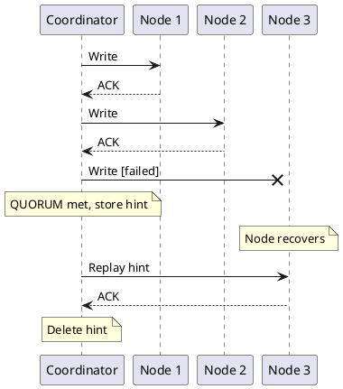
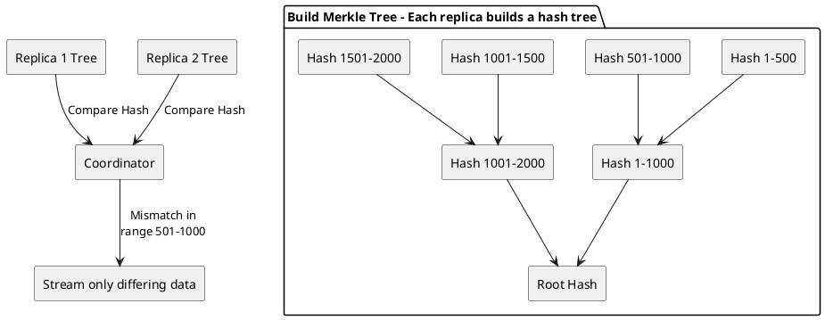

# Replica Synchronization

In distributed systems, replicas can diverge when they receive updates at different times—due to network partitions, node failures, or message ordering. Synchronization mechanisms detect these divergences and propagate missing information to restore convergence.

These mechanisms are sometimes called "anti-entropy" in distributed systems literature. The term originates from thermodynamics, where entropy measures disorder. In Cassandra's context, these processes reduce "disorder" by ensuring all replicas eventually hold identical data.

---

## Overview

Cassandra employs three mechanisms to maintain replica convergence:

| Mechanism | Function | Trigger | Scope |
|-----------|----------|---------|-------|
| Hinted handoff | Deferred write delivery | Write to unavailable replica | Single mutation |
| Read reconciliation | Divergence detection during reads | Query execution | Single partition |
| Merkle tree synchronization | Full dataset comparison | Scheduled maintenance | Token range |

These mechanisms operate at different timescales and granularities, collectively providing eventual consistency while preserving availability during partial failures.

---

## Hinted Handoff

Hinted handoff handles writes to temporarily unavailable replicas by storing the write locally and replaying it when the replica recovers.

### How It Works



### Configuration

```yaml
# cassandra.yaml

# Enable/disable hinted handoff
hinted_handoff_enabled: true

# How long to store hints (default 3 hours)
# Hints older than this are dropped
max_hint_window_in_ms: 10800000

# Throttle hint delivery to avoid overwhelming recovering nodes
hinted_handoff_throttle_in_kb: 1024

# Maximum delivery threads
max_hints_delivery_threads: 2

# Hint storage directory
hints_directory: /var/lib/cassandra/hints
```

### Hint Window

The `max_hint_window_in_ms` setting is critical:

```
Node down for 2 hours:
- Hints accumulated for 2 hours
- Node recovers
- All hints replayed ✓

Node down for 5 hours (default window = 3 hours):
- Hints accumulated for first 3 hours
- After 3 hours, new writes stop generating hints
- Node recovers
- Only 3 hours of hints replayed
- 2 hours of writes are missing ✗

Solution: Run repair to recover missing data
```

### Hints and Consistency Level ANY

```
Consistency level ANY counts hints as acknowledgments:

All replicas down:
- Write cannot reach any replica
- Coordinator stores hint locally
- Returns SUCCESS to client

DANGER:
- If coordinator crashes before hint delivery → DATA LOST
- Hint is only on coordinator, not replicated

ANY should almost never be used for important data.
```

### Monitoring Hints

```bash
# Check hint accumulation
nodetool tpstats | grep Hint

# View hint files
ls -la /var/lib/cassandra/hints/

# Force hint delivery
nodetool handoffwindow
```

**JMX Metrics:**

```
org.apache.cassandra.metrics:type=Storage,name=TotalHints
org.apache.cassandra.metrics:type=HintsService,name=HintsSucceeded
org.apache.cassandra.metrics:type=HintsService,name=HintsFailed
org.apache.cassandra.metrics:type=HintsService,name=HintsTimedOut
```

### Hint Limitations

| Limitation | Implication |
|------------|-------------|
| Hints expire | Long outages require repair |
| Hints use disk | Large hint backlog consumes storage |
| Single copy | Coordinator failure loses hints |
| Not for schema | DDL changes do not use hints |

---

## Read Reconciliation

During read operations, the coordinator may receive different versions of the same data from multiple replicas. When this divergence is detected, the coordinator determines the authoritative version (based on timestamp) and propagates it to replicas holding stale data.

### How It Works

```
QUORUM read discovers inconsistency:

Client reads user_id=123 with QUORUM (2 of 3 replicas):

N1: user_id=123 → name='Alice', timestamp=1000
N2: user_id=123 → name='Alicia', timestamp=2000  ← Newer

Coordinator:
1. Compares timestamps
2. Returns 'Alicia' (newer) to client
3. Sends repair to N1: "update to 'Alicia' with ts=2000"

After repair:
N1: user_id=123 → name='Alicia', timestamp=2000  ← Fixed
N2: user_id=123 → name='Alicia', timestamp=2000
```

### Reconciliation Modes

**Blocking Reconciliation** (pre-Cassandra 4.0 default):

```
Divergence resolution completes BEFORE returning result to client.
- Higher read latency
- Immediate consistency after read
```

**Background Reconciliation** (Cassandra 4.0+):

```
Result returned immediately, propagation occurs asynchronously.
- Lower read latency
- Stale replicas updated after response
```

### Configuration

```sql
-- Per-table reconciliation mode (deprecated in 4.0+)
ALTER TABLE my_table WITH read_repair = 'BLOCKING';
-- or
ALTER TABLE my_table WITH read_repair = 'NONE';
```

```yaml
# cassandra.yaml (Cassandra 4.0+)
# Reconciliation is always attempted when divergence is detected
# No configuration needed
```

### Limitations

| Limitation | Implication |
|------------|-------------|
| Query-driven | Only data that is read undergoes reconciliation |
| Single partition scope | Does not propagate across partition boundaries |
| Requires multiple replicas | CL=ONE reads contact only one replica (no comparison possible) |

---

## Merkle Tree Synchronization

Merkle tree synchronization (`nodetool repair`) is the definitive mechanism for achieving replica convergence across the entire dataset. Unlike hinted handoff and read reconciliation, which operate opportunistically, this process systematically compares and synchronizes all data within a token range.

### Why Scheduled Synchronization Is Necessary

```
Scenarios where hinted handoff and read reconciliation are insufficient:

1. Node down longer than hint window
   - Hints expired
   - Data never written to that replica

2. Data never read
   - Read reconciliation only affects data that is queried
   - Cold data remains divergent

3. Deleted data (tombstones)
   - Tombstones must propagate to all replicas
   - If tombstone doesn't reach a replica before gc_grace_seconds,
     deleted data can resurrect

4. Schema changes during outage
   - Hints do not handle schema changes
   - Synchronization aligns data to current schema
```

### The Merkle Tree Algorithm

Merkle trees, introduced by Ralph Merkle ([Merkle, R., 1987, "A Digital Signature Based on a Conventional Encryption Function"](https://link.springer.com/chapter/10.1007/3-540-48184-2_32)), enable efficient comparison of large datasets by hierarchically hashing data segments. When two replicas exchange only their root hashes, a mismatch indicates divergence somewhere in the dataset. By recursively comparing child hashes, the algorithm identifies exactly which segments differ—requiring only O(log n) comparisons rather than comparing every record.



### Synchronization Modes

**Full Synchronization:**

```bash
nodetool repair -full keyspace_name
```

- Compares all data regardless of previous synchronization state
- Required after topology changes (node additions, removals)
- Most thorough, highest resource consumption

**Incremental Synchronization:**

```bash
nodetool repair keyspace_name
```

- Compares only data written since last synchronization
- SSTables are marked as "repaired" or "unrepaired"
- Lower overhead for regular maintenance

**Subrange Synchronization:**

```bash
nodetool repair -st <start_token> -et <end_token> keyspace_name
```

- Limits comparison to specific token range
- Enables parallelization across nodes

### The gc_grace_seconds Constraint

Tombstones (deletion markers) have a finite lifespan defined by `gc_grace_seconds`. This parameter creates a critical constraint on synchronization frequency.

```
gc_grace_seconds defines tombstone retention period.
Default: 864000 (10 days)

CRITICAL CONSTRAINT:
Synchronization must complete on every node within gc_grace_seconds.

Failure scenario:

Day 0: Application deletes row on N1, N2 (tombstone created)
       N3 is unavailable, does not receive tombstone

Day 11: Tombstones expire on N1, N2 (gc_grace = 10 days)
        Compaction purges tombstones

Day 12: N3 returns to service
        N3 retains the "deleted" row (no tombstone received)
        Reconciliation propagates N3's data to N1, N2
        DELETED DATA REAPPEARS

Prevention: Complete synchronization cycle within gc_grace_seconds
```

### Scheduling Synchronization

```
Recommended schedule:

For gc_grace_seconds = 10 days:
- Complete full cycle every 7 days (provides buffer for failures)
- Synchronization can run in parallel across nodes
- Stagger node synchronization to distribute I/O load

Example rotation for 6-node cluster:
Day 1: Synchronize node 1
Day 2: Synchronize node 2
Day 3: Synchronize node 3
Day 4: Synchronize node 4
Day 5: Synchronize node 5
Day 6: Synchronize node 6
Day 7: Rest
Repeat
```

### Commands

```bash
# Full synchronization of keyspace
nodetool repair -full my_keyspace

# Synchronize single table
nodetool repair my_keyspace my_table

# Parallel mode (multiple nodes simultaneously)
nodetool repair -par my_keyspace

# Sequential mode (one node at a time, lower impact)
nodetool repair -seq my_keyspace

# Check synchronization status
nodetool repair_admin list

# Cancel running synchronization
nodetool repair_admin cancel <repair_id>

# View synchronization history
nodetool repair_admin summary
```

### Monitoring

```bash
# During synchronization
nodetool compactionstats  # Shows validation compaction
nodetool netstats         # Shows data streaming

# Check pending operations
nodetool repair_admin list

# JMX metrics
org.apache.cassandra.metrics:type=Repair,name=*
```

### Resource Impact

| Resource | Cause | Mitigation |
|----------|-------|------------|
| CPU | Merkle tree computation | Schedule during low-traffic periods |
| Disk I/O | Reading data for hashing | Throttle with `-Dcassandra.repair_command_pool_size` |
| Network | Streaming divergent data | Throttle with `nodetool setstreamthroughput` |
| Memory | Merkle tree storage | Reduce `-Dcassandra.repair_session_max_tree_depth` |

---

## Automation Tools

### AxonOps

AxonOps provides automated synchronization scheduling and monitoring, eliminating manual management overhead.

### Reaper (Open Source)

Apache Cassandra Reaper provides:

- Scheduled synchronization campaigns
- Incremental mode support
- Web UI for monitoring
- Segment-level parallelism

### Manual Scheduling

For environments without automation:

```bash
# Cron job example (one node per day)
0 2 * * 0 nodetool repair -full keyspace1  # Sunday
0 2 * * 1 nodetool repair -full keyspace2  # Monday
# etc.
```

---

## Troubleshooting

### Hints Accumulating

```bash
# Check hint backlog
ls -la /var/lib/cassandra/hints/

# If hints are not being delivered:
# 1. Check target node is reachable
nodetool status

# 2. Check hint delivery threads
nodetool tpstats | grep Hint

# 3. Force hint delivery (use with caution)
# Restart the node to trigger hint replay
```

### Synchronization Failures

| Error | Cause | Resolution |
|-------|-------|------------|
| "Repair session failed" | Node unreachable | Ensure all replicas are available |
| "Merkle tree building failed" | Disk/memory pressure | Reduce scope, add resources |
| "Streaming failed" | Network issues | Check connectivity, increase timeouts |
| "Validation compaction stuck" | Large partitions | Increase `compaction_throughput_mb_per_sec` |

### Data Resurrection

```
Symptom: Deleted data reappears

Diagnosis:
1. Check gc_grace_seconds: Is it shorter than synchronization interval?
2. Check synchronization history: Was a cycle missed during outage?
3. Check tombstone count: Are tombstones being purged prematurely?

Resolution:
1. Run full synchronization on affected keyspace
2. Adjust gc_grace_seconds if needed
3. Ensure regular synchronization schedule
```

---

## Best Practices

### Hinted Handoff

| Practice | Rationale |
|----------|-----------|
| Keep enabled | Handles transient failures automatically |
| Set appropriate window | Match to expected outage duration |
| Monitor hint accumulation | Large backlogs indicate availability problems |
| Do not rely solely on hints | Scheduled synchronization is still required |

### Read Reconciliation

| Practice | Rationale |
|----------|-----------|
| Use QUORUM for important reads | Enables divergence detection |
| Monitor reconciliation rate | High rate indicates systemic problems |
| Do not depend solely on reads | Cold data requires scheduled synchronization |

### Merkle Tree Synchronization

| Practice | Rationale |
|----------|-----------|
| Complete within gc_grace_seconds | Prevents data resurrection |
| Use incremental mode for regular maintenance | Lower resource consumption |
| Use full mode after topology changes | Ensures complete convergence |
| Automate with AxonOps or Reaper | Eliminates human error |
| Monitor duration trends | Detects degradation early |

---

## Related Documentation

- **[Distributed Data Overview](index.md)** - How synchronization fits in the distributed architecture
- **[Consistency](consistency.md)** - How consistency levels interact with convergence
- **[Tombstones](../storage-engine/tombstones.md)** - Deletion markers and gc_grace_seconds
- **[Repair Operations](../../operations/repair/index.md)** - Operational procedures for synchronization
