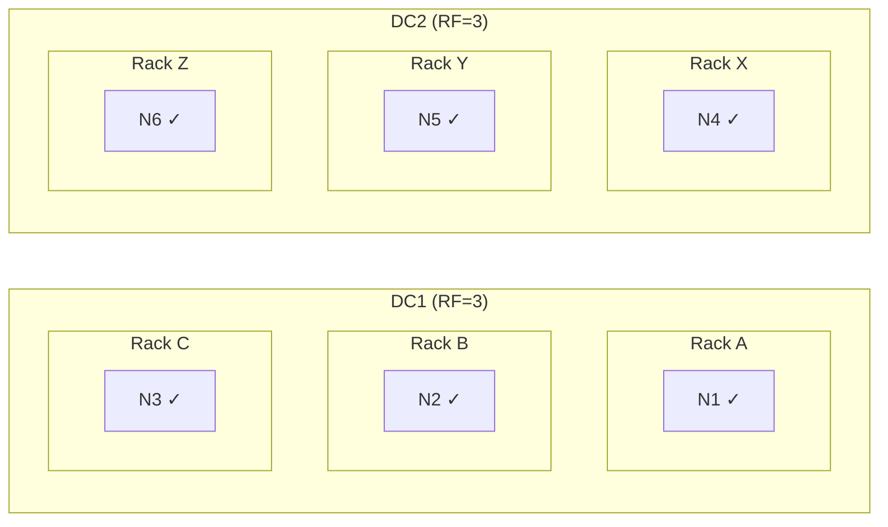

# Replication

Replication copies each partition to multiple nodes for fault tolerance. The replication factor (RF) determines how many copies exist, and the replication strategy determines where those copies are placed.

---

## Replication Factor

The replication factor specifies how many nodes store a copy of each partition.

### Choosing Replication Factor

| RF | Fault Tolerance | Trade-off |
|----|-----------------|-----------|
| 1 | None—any node failure loses data | No redundancy |
| 2 | Single node failure | No quorum possible with one node down |
| 3 | Single node failure with quorum | Production minimum (recommended) |
| 5 | Two node failures with quorum | Critical data requiring extreme durability |
| >5 | Diminishing returns | Rarely justified |

**RF = 3 is the production standard:**

```
RF = 3 with QUORUM:
- One node down: Still have quorum (2 of 3)
- Can run repair with one node down
- Balances durability, availability, and storage cost
```

### RF and Cluster Size

```
Rule: RF ≤ nodes_in_smallest_dc

If DC has 2 nodes, max RF = 2 (each partition on both nodes)
If DC has 3 nodes, RF = 3 means every node has every partition
If DC has 10 nodes, RF = 3 means each partition on 3 of 10 nodes

ANTI-PATTERN:
DC with 3 nodes, RF = 5  ← Cannot place 5 replicas on 3 nodes
Cassandra will place 3 replicas, but report RF=5
This causes Unavailable exceptions for QUORUM (needs 3)
```

---

## Replication Strategies

### SimpleStrategy (Development Only)

SimpleStrategy places replicas on consecutive nodes around the ring with no awareness of racks or datacenters:

```
SIMPLESTRATEGY (RF=3)

Algorithm:
1. Hash partition key → token
2. Find node that owns this token (primary replica)
3. Walk clockwise, place replicas on next (RF-1) nodes

Example: partition token = -1×10^18

          ┌───┐
         ╱ B  ╲  ← Primary (owns token -1×10^18)
        │     │
    A ┌─┘     └─┐ C ← Replica 2 (next clockwise)
     ╱           ╲
    │             │
    └─┐         ┌─┘
      ╲         ╱
       └───────┘
           D
           ↑
      Replica 3 (next clockwise after C)

Problem: B, C, D might all be on the same rack.
If that rack loses power → ALL replicas lost.
```

```sql
-- SimpleStrategy configuration
CREATE KEYSPACE dev_keyspace WITH replication = {
    'class': 'SimpleStrategy',
    'replication_factor': 3
};
```

**Never use SimpleStrategy in production**—it has no rack awareness.

### NetworkTopologyStrategy (Production Standard)

NetworkTopologyStrategy (NTS) places replicas while respecting datacenter and rack boundaries:

```
NETWORKTOPOLOGYSTRATEGY (RF=3 per DC)

Algorithm (for each datacenter):
1. Hash partition key → token
2. Find node in this DC that owns token (primary replica)
3. Walk clockwise, selecting nodes on DIFFERENT racks
4. Continue until RF replicas placed in this DC
5. Repeat for each DC

DC1 (RF=3)                      DC2 (RF=3)
┌─────────────────────────┐    ┌─────────────────────────┐
│ Rack A    Rack B    Rack C│  │ Rack X    Rack Y    Rack Z│
│ ┌───┐    ┌───┐    ┌───┐ │    │ ┌───┐    ┌───┐    ┌───┐ │
│ │N1 │    │N2 │    │N3 │ │    │ │N4 │    │N5 │    │N6 │ │
│ │ ✓ │    │ ✓ │    │ ✓ │ │    │ │ ✓ │    │ ✓ │    │ ✓ │ │
│ └───┘    └───┘    └───┘ │    │ └───┘    └───┘    └───┘ │
│ Replica  Replica Replica │    │ Replica  Replica Replica │
│   1        2       3    │    │   4        5       6    │
└─────────────────────────┘    └─────────────────────────┘

Each DC has replicas on different racks.
Total copies: 6 (3 per DC × 2 DCs)
```



```sql
-- NetworkTopologyStrategy configuration
CREATE KEYSPACE production WITH replication = {
    'class': 'NetworkTopologyStrategy',
    'dc1': 3,
    'dc2': 3
};

-- Single DC with rack awareness
CREATE KEYSPACE single_dc WITH replication = {
    'class': 'NetworkTopologyStrategy',
    'datacenter1': 3
};
```

### NTS Replica Placement Algorithm

```
NTS ALGORITHM (for one DC with RF=3)

Given: Partition with token T, DC has nodes in 3 racks

Step 1: Find first node clockwise from T
        This is Replica 1 (say it is on Rack A)

Step 2: Walk clockwise, find next node on DIFFERENT rack
        This is Replica 2 (must be Rack B or C)

Step 3: Continue clockwise, find node on third different rack
        This is Replica 3

If only 2 racks exist:
        Replica 1: Rack A
        Replica 2: Rack B (different from A)
        Replica 3: Rack A or B (cannot find third unique rack)

If only 1 rack exists:
        All 3 replicas on same rack (no rack diversity possible)
```

**Key insight**: With RF=3, at least 3 racks are needed for full rack diversity. With only 2 racks, 2 replicas will share a rack.

---

## Snitches: Topology Awareness

The snitch tells Cassandra which datacenter and rack each node belongs to.

### How Snitches Work

```
For any node (by IP address), snitch returns:
  - Datacenter name (e.g., "us-east-1")
  - Rack name (e.g., "us-east-1a")

This information is used for:
  1. Replica placement (NTS algorithm)
  2. Request routing (prefer local DC)
  3. Consistency level enforcement (LOCAL_QUORUM)

Topology propagates via gossip to all nodes.
```

### GossipingPropertyFileSnitch (Recommended)

Each node reads its own DC/rack from a local file, then gossips it to others:

```yaml
# cassandra.yaml
endpoint_snitch: GossipingPropertyFileSnitch
```

```properties
# conf/cassandra-rackdc.properties
dc=us-east-1
rack=rack-a
# Optional: prefer_local=true (prefer connecting to local DC)
```

**Why GossipingPropertyFileSnitch is recommended:**

| Advantage | Description |
|-----------|-------------|
| Simple configuration | One file per node |
| Universal | Works anywhere (cloud, on-prem, containers) |
| No dependencies | No external services required |
| Automatic propagation | Topology shared via gossip |

### Cloud Snitches

#### Ec2Snitch (AWS Single Region)

```yaml
# cassandra.yaml
endpoint_snitch: Ec2Snitch
```

Automatically detects:

- **Datacenter**: AWS region (e.g., `us-east-1`)
- **Rack**: Availability zone (e.g., `us-east-1a`)

**Keyspace must use region name:**

```sql
CREATE KEYSPACE my_ks WITH replication = {
    'class': 'NetworkTopologyStrategy',
    'us-east-1': 3  -- Must match EC2 region name
};
```

#### Ec2MultiRegionSnitch (AWS Multi-Region)

```yaml
# cassandra.yaml
endpoint_snitch: Ec2MultiRegionSnitch

# REQUIRED: Node's public IP for cross-region communication
broadcast_address: <public_ip>
broadcast_rpc_address: <public_ip>

# Listen on all interfaces
listen_address: <private_ip>
```

**Critical requirement**: Security groups must allow cross-region traffic on:

- Port 7000 (inter-node)
- Port 7001 (inter-node SSL)
- Port 9042 (native transport, if clients cross regions)

#### GoogleCloudSnitch (GCP)

```yaml
# cassandra.yaml
endpoint_snitch: GoogleCloudSnitch
```

Automatically detects:

- **Datacenter**: `<project>:<region>` (e.g., `myproject:us-central1`)
- **Rack**: Zone (e.g., `us-central1-a`)

### Snitch Configuration Issues

**Problem 1: Changing snitches on existing cluster**

```
WRONG: Simply changing the snitch class

What happens:
- Node restarts with new snitch
- Reports different DC/rack name
- Cassandra thinks it is a NEW node
- Data starts streaming (wrong!)

CORRECT: Change snitch, then change topology step by step
1. Stop node
2. Change snitch in cassandra.yaml
3. Update cassandra-rackdc.properties to SAME DC/rack as before
4. Restart
5. Repeat for all nodes
6. Only then update DC/rack names one at a time
```

**Problem 2: Inconsistent DC/rack names**

```
Node 1: dc=US-EAST, rack=rack1
Node 2: dc=us-east, rack=rack1   ← Different case!
Node 3: dc=us_east, rack=rack1   ← Different format!

Result: Cassandra sees 3 different DCs
        Replication is completely wrong
```

**Always verify topology:**

```bash
nodetool status
# Should show expected DC names and node distribution

nodetool describecluster
# Shows DC info and schema agreement
```

---

## Multi-DC Replication Patterns

### Active-Active

Both datacenters serve traffic with full replication:

```sql
CREATE KEYSPACE active_active WITH replication = {
    'class': 'NetworkTopologyStrategy',
    'us-east': 3,
    'us-west': 3
};
```

| Characteristic | Value |
|----------------|-------|
| Consistency | LOCAL_QUORUM for low latency |
| Total storage | 6× raw data |
| Failure tolerance | Either DC can serve all traffic |

### Active-Passive

One datacenter for production, one for disaster recovery:

```sql
CREATE KEYSPACE active_passive WITH replication = {
    'class': 'NetworkTopologyStrategy',
    'primary': 3,
    'backup': 1
};
```

| Characteristic | Value |
|----------------|-------|
| Consistency | LOCAL_QUORUM in primary, ONE in backup |
| Total storage | 4× raw data |
| Limitation | Cannot serve quorum from backup DC |

### Three-Region Global

Global distribution with local consistency:

```sql
CREATE KEYSPACE global WITH replication = {
    'class': 'NetworkTopologyStrategy',
    'us-east': 3,
    'us-west': 3,
    'eu-west': 3
};
```

| Characteristic | Value |
|----------------|-------|
| Consistency | LOCAL_QUORUM for regional, QUORUM for global |
| Total storage | 9× raw data |
| Use case | Global applications with regional users |

### Analytics Replica

Separate datacenter for analytics workloads:

```sql
CREATE KEYSPACE with_analytics WITH replication = {
    'class': 'NetworkTopologyStrategy',
    'production': 3,
    'analytics': 2
};
```

| Characteristic | Value |
|----------------|-------|
| Analytics DC | Runs Spark jobs, never serves production traffic |
| Lower RF | Acceptable for read-only analytics |

---

## Changing Replication

### Increasing Replication Factor

```sql
-- Current: RF=2, Target: RF=3

-- Step 1: Alter keyspace (changes metadata only)
ALTER KEYSPACE my_keyspace WITH replication = {
    'class': 'NetworkTopologyStrategy',
    'datacenter1': 3
};
```

```bash
# Step 2: Run repair to stream data to new replicas
nodetool repair -full my_keyspace

# This streams data to the third replica for each partition
# Can take hours/days depending on data size
```

### Decreasing Replication Factor

```sql
-- Current: RF=3, Target: RF=2

-- Step 1: Alter keyspace
ALTER KEYSPACE my_keyspace WITH replication = {
    'class': 'NetworkTopologyStrategy',
    'datacenter1': 2
};
```

```bash
# Step 2: Run cleanup to remove extra replicas
nodetool cleanup my_keyspace

# This deletes data that nodes no longer own
# Required on every node
```

### Adding a Datacenter

```bash
# Step 1: Configure new DC nodes
# cassandra.yaml: Same cluster_name, correct seeds
# cassandra-rackdc.properties: Correct DC/rack names

# Step 2: Start new nodes (they join empty)
```

```sql
-- Step 3: Update keyspace to include new DC
ALTER KEYSPACE my_keyspace WITH replication = {
    'class': 'NetworkTopologyStrategy',
    'dc1': 3,
    'dc2': 3  -- New DC
};
```

```bash
# Step 4: Rebuild new DC from existing DC
# Run on EACH node in the new DC:
nodetool rebuild -- dc1

# Streams all data from dc1 to the new node
# Faster than repair (streams only, no comparisons)
```

### Removing a Datacenter

```sql
-- Step 1: Update keyspace to remove DC
ALTER KEYSPACE my_keyspace WITH replication = {
    'class': 'NetworkTopologyStrategy',
    'dc1': 3
    -- dc2 removed
};
```

```bash
# Step 2: Run repair on remaining DC
nodetool repair -full my_keyspace

# Step 3: Decommission nodes in removed DC
nodetool decommission  # On each node in dc2

# Step 4: Update seed list to remove dc2 nodes
```

---

## Monitoring Replication

### Cluster Topology

```bash
# Node status and ownership
nodetool status my_keyspace

# Output:
# Datacenter: dc1
# ==============
# Status=Up/Down
# |/ State=Normal/Leaving/Joining/Moving
# --  Address    Load       Tokens  Owns (effective)  Rack
# UN  10.0.1.1   256 GB     16      33.3%            rack1
# UN  10.0.1.2   248 GB     16      33.3%            rack2
# UN  10.0.1.3   252 GB     16      33.3%            rack3
```

### Streaming Status

```bash
# Current streaming operations
nodetool netstats

# Shows:
# - Receiving streams (from other nodes)
# - Sending streams (to other nodes)
# - Progress percentage
```

### JMX Metrics

```
# Hint accumulation (writes to unavailable replicas)
org.apache.cassandra.metrics:type=Storage,name=TotalHints
org.apache.cassandra.metrics:type=HintsService,name=HintsSucceeded
org.apache.cassandra.metrics:type=HintsService,name=HintsFailed

# Stream throughput
org.apache.cassandra.metrics:type=Streaming,name=TotalIncomingBytes
org.apache.cassandra.metrics:type=Streaming,name=TotalOutgoingBytes
```

---

## Troubleshooting

### Unavailable Exceptions

```
Error: Not enough replicas available for query at consistency QUORUM
       (2 required but only 1 alive)
```

| Cause | Diagnosis | Resolution |
|-------|-----------|------------|
| Nodes down | `nodetool status` shows DN | Restart nodes or lower CL |
| RF > nodes | Keyspace RF higher than DC size | Lower RF or add nodes |
| Network partition | Some nodes unreachable | Fix network |

### Uneven Data Distribution

```
nodetool status shows:
Node 1: 100 GB
Node 2: 500 GB  ← Much larger
Node 3: 120 GB
```

| Cause | Diagnosis | Resolution |
|-------|-----------|------------|
| Hot partitions | Check `nodetool tablestats` | Redesign partition keys |
| Uneven tokens | Check `nodetool ring` | Rebalance or use vnodes |
| Late joiner | Node joined after data loaded | Run repair |

### Missing Data After Node Replacement

```bash
# Check if replacement completed
nodetool netstats  # Look for ongoing streams

# Run repair to ensure data is complete
nodetool repair -full my_keyspace
```

---

## Best Practices

| Area | Recommendation |
|------|----------------|
| Strategy | Always use NetworkTopologyStrategy (even for single DC) |
| Replication factor | RF=3 minimum for production |
| Rack distribution | Distribute nodes across at least RF racks |
| Multi-DC | Same RF across DCs for active-active |
| Snitch | Use GossipingPropertyFileSnitch for portability |
| Naming | Use consistent DC/rack naming (case-sensitive) |
| New DCs | Use `nodetool rebuild` (faster than repair) |

---

## Related Documentation

- **[Distributed Data Overview](index.md)** - How partitioning, replication, and consistency work together
- **[Partitioning](partitioning.md)** - How data is distributed to nodes
- **[Consistency](consistency.md)** - How consistency levels interact with replication
- **[Replica Synchronization](replica-synchronization.md)** - How replicas converge
