# Fault Tolerance and Failure Scenarios

This section examines Cassandra's fault tolerance architecture from both server-side and client-side perspectives. Understanding how failures propagate through the system—and how both the cluster and client drivers respond—is essential for designing resilient applications.

---

## Fault Tolerance Model

Cassandra's fault tolerance derives from three architectural properties:

| Property | Mechanism | Benefit |
|----------|-----------|---------|
| **Replication** | Data copied to RF nodes | No single point of failure for data |
| **Decentralization** | No master node, peer-to-peer | No single point of failure for coordination |
| **Tunable consistency** | Configurable read/write guarantees | Trade-off availability vs consistency |

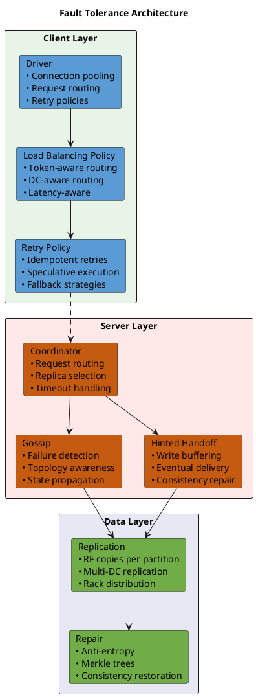

---

## Failure Taxonomy

### Failure Scope Hierarchy

Failures occur at different scopes, each with distinct characteristics and recovery strategies:

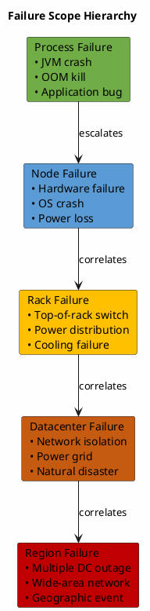

### Failure Characteristics

| Scope | Typical Duration | Detection Time | Recovery Approach |
|-------|------------------|----------------|-------------------|
| **Process** | Seconds-minutes | ~10 seconds (Phi) | Automatic restart |
| **Node** | Minutes-hours | ~10 seconds (Phi) | Replacement or repair |
| **Rack** | Minutes-hours | ~10 seconds (Phi) | Wait or redistribute |
| **Datacenter** | Hours-days | Seconds (network) | Failover to other DC |
| **Region** | Hours-days | Seconds (network) | DR procedures |

---

## Node Failure Scenarios

### Single Node Failure

The most common failure scenario. Cassandra continues operating if sufficient replicas remain:

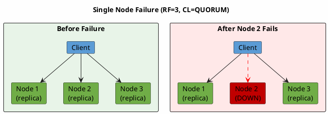

**Impact Analysis:**

| Consistency Level | RF=3, 1 Node Down | Outcome |
|-------------------|-------------------|---------|
| ONE | 2 replicas available | Reads/writes succeed |
| QUORUM | 2 of 3 available | Reads/writes succeed (2 ≥ ⌈3/2⌉ + 1) |
| ALL | Only 2 available | Reads/writes **fail** |
| LOCAL_QUORUM | Depends on DC | Succeeds if local DC unaffected |

### Server-Side Response

When a node fails, the server-side components respond:

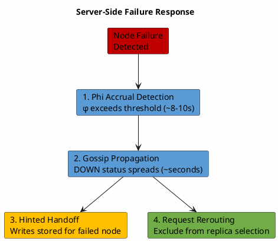

**Timeline:**

| Time | Event |
|------|-------|
| T+0 | Node stops responding |
| T+1-8s | Phi value rises as heartbeats missed |
| T+8-10s | Phi exceeds threshold, node marked DOWN locally |
| T+10-15s | DOWN status propagates via gossip |
| T+10s+ | Hints accumulate on coordinators |
| T+recovery | Node restarts, hints replay |

### Client-Side Response

The driver detects and responds to node failures:

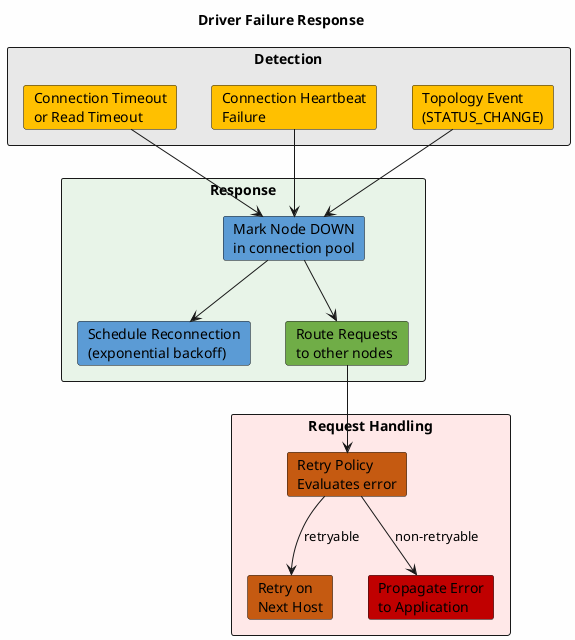

---

## Rack Failure Scenarios

### Rack-Aware Replication

With `NetworkTopologyStrategy` and rack-aware placement, Cassandra distributes replicas across racks:

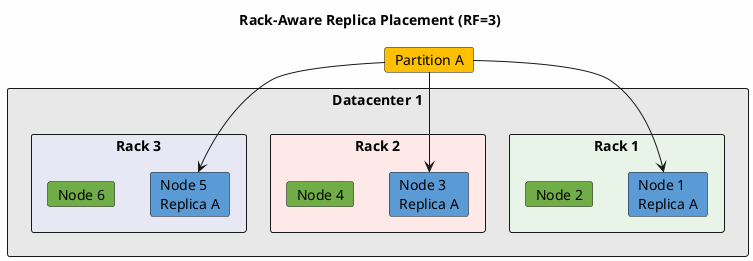

### Rack Failure Impact

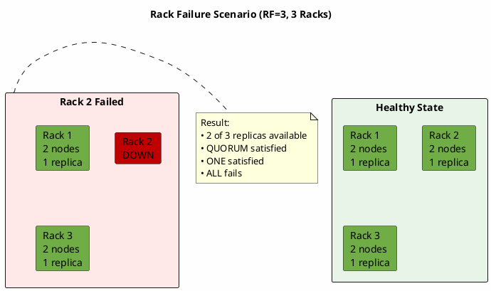

**Rack Failure Tolerance:**

| Configuration | Racks | RF | Rack Failure Tolerance | Notes |
|---------------|-------|----|-----------------------|-------|
| Minimum | 1 | 3 | None | All replicas in same failure domain |
| Standard | 3 | 3 | 1 rack | One replica per rack |
| Enhanced | 3 | 5 | 1 rack | At least 2 replicas survive |
| High | 5 | 5 | 2 racks | Replicas spread across 5 racks |

---

## Datacenter Failure Scenarios

### Multi-Datacenter Topology

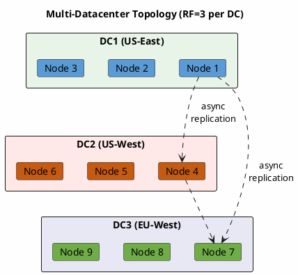

### DC Failure Response

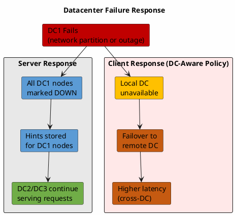

### Consistency Level Behavior During DC Failure

| Consistency Level | DC1 Down | Behavior |
|-------------------|----------|----------|
| LOCAL_ONE | ✗ | Fails for DC1 clients, succeeds for DC2/DC3 |
| LOCAL_QUORUM | ✗ | Fails for DC1 clients, succeeds for DC2/DC3 |
| QUORUM | Depends | May succeed if enough total replicas (e.g., RF=3×3=9, need 5) |
| EACH_QUORUM | ✗ | **Fails** - requires quorum in each DC |
| ONE | ✓ | Succeeds if any replica reachable |
| ALL | ✗ | **Fails** - requires all replicas |

---

## Driver Policies and Failure Handling

### Load Balancing Policy

The load balancing policy determines how requests are routed, including during failures:

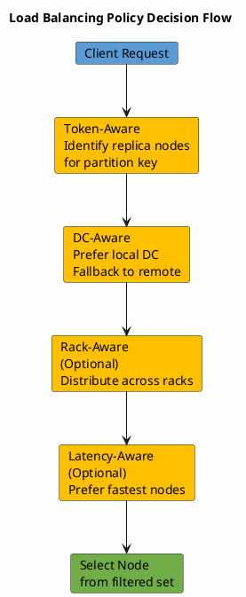

**Policy Configuration for Fault Tolerance:**

```java
// Recommended production configuration
LoadBalancingPolicy policy = new TokenAwarePolicy(
    DCAwareRoundRobinPolicy.builder()
        .withLocalDc("dc1")
        .withUsedHostsPerRemoteDc(2)  // Failover capacity
        .allowRemoteDCsForLocalConsistencyLevel()  // Optional: allow remote DC for LOCAL_*
        .build()
);
```

### Retry Policy

The retry policy determines whether and how to retry failed requests:

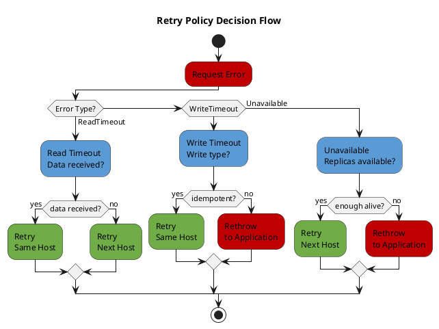

**Error Types and Retry Behavior:**

| Error | Cause | Default Retry Behavior |
|-------|-------|----------------------|
| **ReadTimeoutException** | Coordinator timeout waiting for replicas | Retry same host if data received |
| **WriteTimeoutException** | Coordinator timeout waiting for acks | Retry only if idempotent (BATCH_LOG, UNLOGGED_BATCH) |
| **UnavailableException** | Insufficient replicas known alive | Retry on next host (once) |
| **NoHostAvailableException** | All hosts exhausted | No retry, propagate to application |
| **OperationTimedOutException** | Client-side timeout | No retry, propagate to application |

### Speculative Execution

Speculative execution sends redundant requests to reduce tail latency:

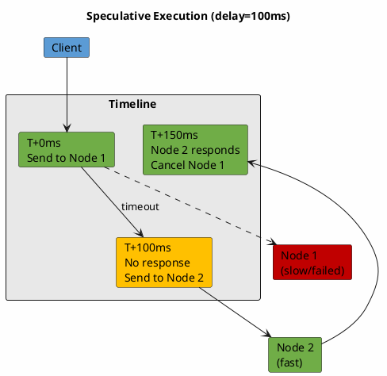

**Speculative Execution Configuration:**

```java
// Speculative execution for read-heavy workloads
SpeculativeExecutionPolicy specPolicy =
    new ConstantSpeculativeExecutionPolicy(
        100,  // Delay before speculation (ms)
        2     // Maximum speculative executions
    );

// Or percentile-based
SpeculativeExecutionPolicy percentilePolicy =
    new PercentileSpeculativeExecutionPolicy(
        tracker,  // PercentileTracker
        99.0,     // Percentile threshold
        2         // Maximum speculative executions
    );
```

---

## Recovery Scenarios

### Node Recovery After Failure

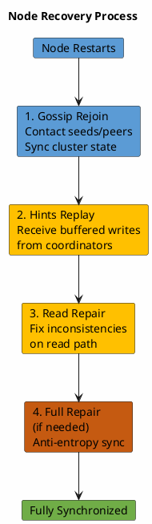

**Recovery Timeline:**

| Phase | Duration | Data Synchronized |
|-------|----------|-------------------|
| Gossip rejoin | Seconds | Cluster topology, schema |
| Hints replay | Minutes-hours | Writes during downtime (if hints available) |
| Read repair | Ongoing | Data accessed by reads |
| Full repair | Hours-days | All data (comprehensive) |

### When Full Repair is Required

Full repair should be run after recovery if:

| Condition | Reason |
|-----------|--------|
| Downtime > `max_hint_window_in_ms` (default 3 hours) | Hints expired, writes lost |
| Hints delivery failed | Check `nodetool tpstats` for dropped hints |
| Multiple node failures | Hints may be incomplete |
| Consistency-critical data | Ensure complete synchronization |

### Datacenter Recovery

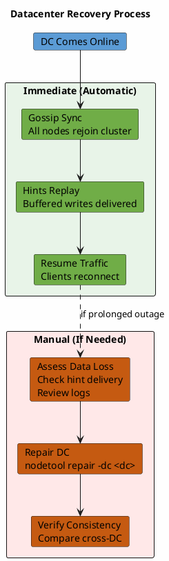

---

## Client Failover Patterns

### Active-Passive DC Failover

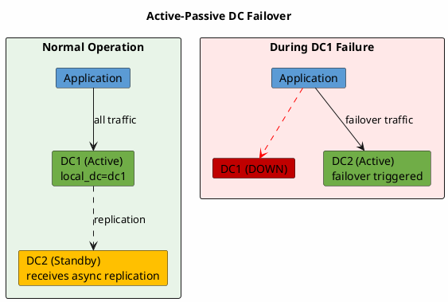

### Active-Active DC Pattern

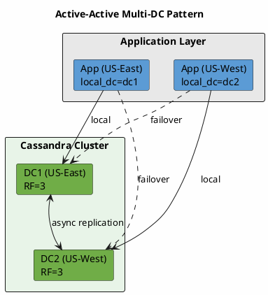

**Active-Active Considerations:**

| Aspect | Recommendation |
|--------|----------------|
| Consistency | Use LOCAL_QUORUM for low latency |
| Conflicts | Last-write-wins (LWW) by default; design for idempotency |
| Failover | Automatic via driver DC-aware policy |
| Capacity | Each DC sized to handle full load |

---

## Monitoring Failure Scenarios

### Key Metrics

| Metric | Source | Failure Indication |
|--------|--------|-------------------|
| `org.apache.cassandra.metrics.ClientRequest.Timeouts` | JMX | Request timeouts increasing |
| `org.apache.cassandra.metrics.ClientRequest.Unavailables` | JMX | Insufficient replicas |
| `org.apache.cassandra.metrics.Storage.Hints` | JMX | Hints accumulating (node down) |
| `org.apache.cassandra.metrics.DroppedMessage.*` | JMX | Messages dropped under load |

### Alert Thresholds

| Condition | Warning | Critical |
|-----------|---------|----------|
| Node DOWN | Any node | Multiple nodes |
| Rack DOWN | N/A | Any rack |
| Hints pending | > 1000 | > 10000 |
| Timeout rate | > 0.1% | > 1% |
| Unavailable rate | > 0 | > 0.1% |

---

## Related Documentation

- **[Gossip Protocol](../cluster-management/gossip.md)** - Failure detection mechanics (Phi Accrual)
- **[Node Replacement](../cluster-management/node-replacement.md)** - Dead node recovery procedures
- **[Consistency](../distributed-data/consistency.md)** - Consistency levels and availability trade-offs
- **[Replication](../distributed-data/replication.md)** - Multi-DC replication configuration
- **[Driver Policies](../../application-development/drivers/policies/index.md)** - Detailed policy configuration
- **[Retry Policy](../../application-development/drivers/policies/retry.md)** - Retry behavior configuration
- **[Load Balancing](../../application-development/drivers/policies/load-balancing.md)** - Routing policy configuration

