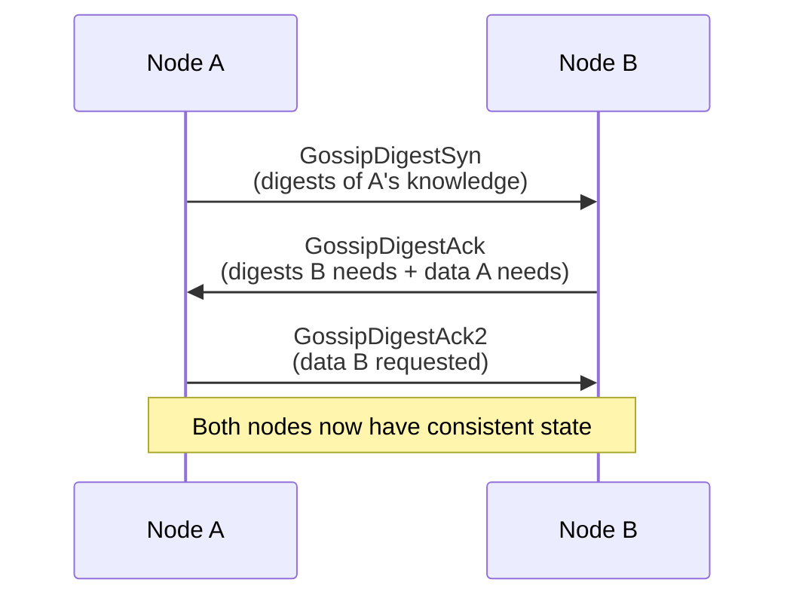
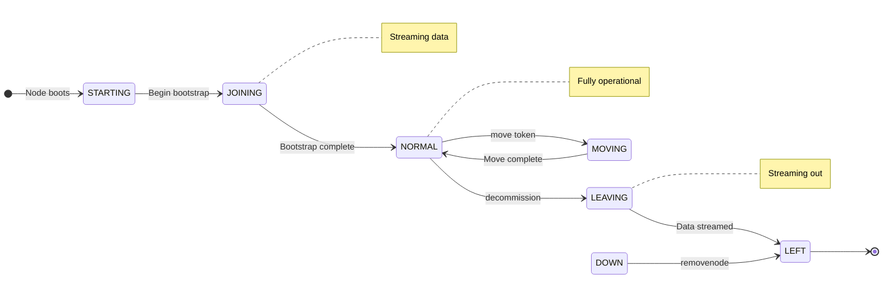

# Gossip Protocol

## Overview

Cassandra uses a peer-to-peer gossip protocol for cluster communication and state management. Unlike systems with centralized coordinators, every Cassandra node communicates directly with other nodes to share cluster state information.

The gossip protocol provides:

| Function | Description |
|----------|-------------|
| Cluster membership | Which nodes belong to the cluster |
| Failure detection | Which nodes are alive or dead |
| State propagation | Sharing node metadata (tokens, schema, load) |
| Decentralization | No single point of failure for cluster coordination |

### Origin and Influences

Cassandra's gossip implementation is based on epidemic protocols described in academic literature:

| Influence | Paper | Cassandra Application |
|-----------|-------|----------------------|
| SWIM Protocol | [Das, A., Gupta, I., & Motivala, A. (2002). "SWIM: Scalable Weakly-consistent Infection-style Process Group Membership Protocol"](https://www.cs.cornell.edu/projects/Quicksilver/public_pdfs/SWIM.pdf) | Membership protocol structure |
| Amazon Dynamo | [DeCandia, G. et al. (2007). "Dynamo: Amazon's Highly Available Key-value Store"](https://www.allthingsdistributed.com/files/amazon-dynamo-sosp2007.pdf) | Gossip-based membership and failure detection |
| Phi Accrual Failure Detector | [Hayashibara, N. et al. (2004). "The φ Accrual Failure Detector"](https://www.researchgate.net/publication/29682135_The_ph_accrual_failure_detector) | Adaptive failure detection |

---

## Gossip Mechanics

### How Gossip Works

Every second, each node performs a gossip round:

1. Select a random live node → send GossipDigestSyn message
2. Possibly gossip to an unreachable node (probability based on cluster size)
3. Possibly gossip to a seed node (if not already gossiping with a seed)
4. Process received gossip messages → update local state with newer information

### The Three-Way Handshake

Gossip uses a three-message exchange to synchronize state efficiently:



**GossipDigestSyn (SYN):**
- Initiates gossip exchange
- Contains digests (summaries) of initiator's knowledge about all nodes
- Digest = (endpoint, generation, version)

**GossipDigestAck (ACK):**
- Response to SYN
- Contains:
  - Digests that receiver needs (older than receiver's knowledge)
  - Full state data that initiator needs (newer than initiator's knowledge)

**GossipDigestAck2 (ACK2):**
- Final message
- Contains full state data that receiver requested

### Why Three Messages?

The three-way handshake minimizes bandwidth by only sending full state data when necessary:

```
Scenario: Node A knows about 100 nodes, Node B knows about 100 nodes

With full state exchange (naive approach):
- A sends 100 node states → B
- B sends 100 node states → A
- Total: 200 state transfers

With digest-based exchange:
- A sends 100 digests (small) → B
- B compares, finds:
  - 5 nodes where A is behind (B sends full state)
  - 3 nodes where B is behind (B requests from A)
- A sends 3 requested states
- Total: 8 state transfers + 100 small digests

In stable clusters, most gossip rounds transfer minimal data.
```

---

## Gossip State

### EndpointState

Each node maintains an EndpointState for every known node in the cluster:

```
EndpointState (for each node)
├── HeartBeatState
│   ├── generation: 1705312800 (epoch timestamp at node start)
│   └── version: 42 (increments each gossip round)
│
└── ApplicationState (map of key-value pairs)
    ├── STATUS: "NORMAL"
    ├── TOKENS: "-9223372036854775808,..."
    ├── SCHEMA: "a1b2c3d4-e5f6-g7h8-i9j0-k1l2m3n4o5p6"
    ├── DC: "datacenter1"
    ├── RACK: "rack1"
    ├── LOAD: "1234567890"
    ├── SEVERITY: "0.0"
    ├── HOST_ID: "a1b2c3d4-..."
    ├── RPC_ADDRESS: "10.0.1.1"
    ├── RELEASE_VERSION: "4.1.0"
    └── NATIVE_TRANSPORT_ADDRESS: "10.0.1.1"
```

### HeartBeatState

The HeartBeatState tracks the "age" of a node's state:

| Field | Description |
|-------|-------------|
| generation | Timestamp (epoch seconds) when node last started |
| version | Counter incremented each gossip round |

**Generation vs Version:**

```
Node A restarts:
Before restart: generation=1705312800, version=50000
After restart:  generation=1705399200, version=1

Higher generation always wins, even with lower version.
This ensures stale information from before restart is discarded.
```

### ApplicationState Keys

| Key | Description | Example |
|-----|-------------|---------|
| STATUS | Node lifecycle state | NORMAL, LEAVING, LEFT, MOVING |
| TOKENS | Token ranges owned | Comma-separated token list |
| SCHEMA | Schema version UUID | UUID of current schema |
| DC | Datacenter name | datacenter1 |
| RACK | Rack name | rack1 |
| LOAD | Data size on disk (bytes) | 1234567890 |
| SEVERITY | Dynamic snitch score | 0.0 to 1.0 |
| HOST_ID | Unique node identifier | UUID |
| RPC_ADDRESS | Client-facing address | IP address |
| RELEASE_VERSION | Cassandra version | 4.1.0 |
| NATIVE_TRANSPORT_ADDRESS | CQL transport address | IP address |
| NET_VERSION | Messaging protocol version | 12 |
| INTERNAL_IP | Internal address | IP address |
| INTERNAL_ADDRESS_AND_PORT | Internal address with port | IP:port |
| NATIVE_TRANSPORT_PORT | CQL port | 9042 |
| NATIVE_TRANSPORT_PORT_SSL | CQL SSL port | 9142 |
| STORAGE_PORT | Internode port | 7000 |
| STORAGE_PORT_SSL | Internode SSL port | 7001 |
| JMX_PORT | JMX port | 7199 |

### State Versioning

Each ApplicationState value has its own version number:

```
ApplicationState changes:
Time T1: LOAD updated → version 100
Time T2: SCHEMA updated → version 101
Time T3: LOAD updated → version 102
Time T4: STATUS updated → version 103

Each key tracks its own version independently.
Gossip merges states by comparing versions per-key.
```

---

## Failure Detection

### Phi Accrual Failure Detector

Cassandra uses the Phi Accrual Failure Detector algorithm ([Hayashibara et al., 2004](https://www.researchgate.net/publication/29682135_The_ph_accrual_failure_detector)) rather than simple heartbeat timeouts. This provides adaptive failure detection that accounts for network variability.

**Problem with fixed timeouts:**

```
Timeout = 5 seconds

Normal network: heartbeats arrive every 1 second
→ Node fails → detected at 5 seconds ✓

Network congestion: heartbeats arrive every 3 seconds
→ Node alive → false positive at 5 seconds ✗

Different conditions require different timeouts,
but fixed timeouts cannot adapt.
```

**Phi Accrual approach:**

Instead of asking "Is the node dead?" (binary yes/no), ask "What is the probability the node is dead?" (continuous 0.0 to ∞)

The "phi" (φ) value represents suspicion level:

| φ Value | Meaning |
|---------|---------|
| 0 | No suspicion (heartbeat just received) |
| 1 | Low suspicion |
| 5 | Moderate suspicion |
| 8 | High suspicion (default threshold for marking dead) |
| ∞ | Certain failure |

### How Phi is Calculated

The algorithm maintains a sliding window of inter-arrival times for heartbeats:

1. **Track heartbeat inter-arrival times**
   - Last 1000 samples: [1.0s, 1.1s, 0.9s, 1.2s, 1.0s, ...]

2. **Calculate mean (μ) and standard deviation (σ)**
   - μ = 1.05s, σ = 0.1s

3. **When checking liveness:**
   - t = time since last heartbeat
   - φ = -log₁₀(1 - CDF(t))

4. **Compare φ to threshold (default: 8)**
   - If φ > threshold → mark node as DOWN

**Examples:**
- t = 1.0s → φ ≈ 0.5 (low suspicion, normal)
- t = 3.0s → φ ≈ 4.0 (moderate suspicion)
- t = 10.0s → φ ≈ 15.0 (high suspicion, marked DOWN)

### Failure Detection Configuration

```yaml
# cassandra.yaml

# Phi threshold for marking node as DOWN
# Higher = more tolerant of latency, slower detection
# Lower = faster detection, more false positives
# Default: 8
phi_convict_threshold: 8
```

| Phi Threshold | Detection Speed | False Positive Risk | Use Case |
|---------------|-----------------|---------------------|----------|
| 5-6 | Faster | Higher | Stable, low-latency networks |
| 8 (default) | Balanced | Balanced | Most deployments |
| 10-12 | Slower | Lower | High-latency or variable networks |

### Node States

| State | Description |
|-------|-------------|
| UP | Node is alive and responding |
| DOWN | Node has failed phi threshold, marked dead |
| UNKNOWN | Initial state before first contact |

State transitions are gossiped to other nodes, propagating failure information cluster-wide.

---

## Seed Nodes

### Purpose of Seeds

Seed nodes serve as initial contact points for cluster discovery:

| Function | Description |
|----------|-------------|
| Bootstrap discovery | New nodes contact seeds to discover cluster |
| Gossip convergence | Seeds help partition recovery if cluster fragments |
| No special data role | Seeds hold same data responsibilities as other nodes |

**Seeds are not special operationally**—they are regular nodes that happen to be listed in the seed configuration.

### Seed Configuration

```yaml
# cassandra.yaml
seed_provider:
  - class_name: org.apache.cassandra.locator.SimpleSeedProvider
    parameters:
      - seeds: "10.0.1.1,10.0.1.2,10.0.1.3"
```

### Seed Selection Guidelines

| Guideline | Reason |
|-----------|--------|
| 2-3 seeds per datacenter | Redundancy without excessive cross-DC traffic |
| Stable, reliable nodes | Seeds should not be frequently replaced |
| Distribute across racks | Survive rack failures |
| All nodes same seed list | Consistent cluster discovery |
| Seeds know about each other | Seeds must be able to reach each other |

**Common mistakes:**

| Mistake | Consequence |
|---------|-------------|
| Only one seed | Single point of failure for new nodes |
| Too many seeds | Excessive gossip traffic |
| Inconsistent seed lists | Cluster may fragment |
| Seed unreachable | New nodes cannot join |

### Seed Behavior During Gossip

Seeds receive preferential treatment in gossip. For non-seed nodes:

1. Pick random live node → gossip
2. Maybe pick unreachable node → gossip (attempt recovery)
3. If didn't gossip with a seed, maybe gossip with a seed

This ensures:
- Seeds stay well-informed about cluster state
- Partition recovery is faster (seeds bridge partitions)
- New nodes can always find the cluster via seeds

---

## Node Lifecycle

### Lifecycle States

Nodes progress through states that are gossiped to the cluster:

**Starting/Joining:**

```
STARTING → JOINING → NORMAL
    │          │         │
    │          │         └── Fully operational, serving requests
    │          └── Streaming data, learning token ranges
    └── Initial startup, not yet joined ring
```

**Leaving (decommission):**

```
NORMAL → LEAVING → LEFT
    │        │        │
    │        │        └── Removed from ring, can shut down
    │        └── Streaming data to remaining nodes
    └── Operator initiated decommission
```

**Moving (token rebalance):**

```
NORMAL → MOVING → NORMAL
    │        │        │
    │        │        └── Move complete, new token ranges
    │        └── Token rebalancing in progress
    └── Operator initiated move
```

**Forced removal (dead node):**

```
DOWN → (removenode) → LEFT
    │                     │
    │                     └── Node removed from cluster
    └── Node is down, operator forces removal
```


**Combined state diagram:**



### Status Values

| STATUS Value | Description |
|--------------|-------------|
| BOOT | Node is bootstrapping |
| NORMAL | Node is operational |
| LEAVING | Node is decommissioning |
| LEFT | Node has left the cluster |
| MOVING | Node is changing token assignment |
| REMOVED | Node was forcefully removed |

### Gossip and Node Join

When a new node joins:

1. **New node starts** → reads seeds from cassandra.yaml
2. **New node contacts seeds** → receives cluster state via gossip
3. **New node announces itself** → STATUS = BOOT, shares HOST_ID and tokens
4. **Cluster learns of new node** → gossip propagates new node's state
5. **New node bootstraps** → streams data for its token ranges
6. **Bootstrap complete** → STATUS = NORMAL, fully operational

---

## Gossip Timing

### Timing Parameters

| Parameter | Default | Description |
|-----------|---------|-------------|
| Gossip interval | 1 second | How often gossip runs |
| Gossip digest timeout | 1 second | Max wait for SYN response |
| Quarantine delay | 60 seconds | Time before considering truly dead |

### Convergence Time

How long until all nodes know about a change:

- Each gossip round, information spreads exponentially
- Expected rounds to full propagation: O(log N)
- With 1-second gossip interval:
  - 10 nodes: ~4 seconds
  - 100 nodes: ~7 seconds
  - 1000 nodes: ~10 seconds

In practice, expect 2-10 seconds for cluster-wide propagation.

### Shadow Round

Before marking a node as DOWN, Cassandra performs a shadow round to avoid premature failure detection:

1. **Node A's phi exceeds threshold for Node X** → Node A suspects Node X is down
2. **Node A asks other nodes** → "When did you last hear from X?"
3. **If others recently heard from X** → Node A was network-partitioned, not X; Node A does not mark X as down
4. **If others also haven't heard** → Consensus that X is down; Node A marks X as down

---

## Configuration

### cassandra.yaml Gossip Settings

```yaml
# Seed nodes for cluster discovery
seed_provider:
  - class_name: org.apache.cassandra.locator.SimpleSeedProvider
    parameters:
      - seeds: "10.0.1.1,10.0.1.2"

# Address to bind for inter-node communication
listen_address: 10.0.1.1

# Address to broadcast to other nodes (if different from listen)
broadcast_address: 10.0.1.1

# Inter-node communication port
storage_port: 7000

# Inter-node communication port (SSL)
ssl_storage_port: 7001

# Failure detector sensitivity
phi_convict_threshold: 8
```

### JVM Options

```bash
# Gossip-related JVM options (jvm.options or jvm-server.options)

# Gossip digest timeout
-Dcassandra.gossip_digest_timeout=1000

# Shadow round timeout
-Dcassandra.shadow_round_timeout_millis=60000
```

---

## Diagnostics and Troubleshooting

### Viewing Gossip State

```bash
# Full gossip state for all known nodes
nodetool gossipinfo

# Example output:
/10.0.1.1
  generation:1705312800
  heartbeat:45231
  STATUS:14:NORMAL,-9223372036854775808
  LOAD:42:1.0734156E10
  SCHEMA:28:a1b2c3d4-e5f6-g7h8-i9j0-k1l2m3n4o5p6
  DC:7:datacenter1
  RACK:9:rack1
  RELEASE_VERSION:5:4.1.0
  HOST_ID:3:a1b2c3d4-e5f6-g7h8-i9j0-k1l2m3n4o5p6
```

### Understanding gossipinfo Output

| Field | Format | Description |
|-------|--------|-------------|
| generation | number | Epoch seconds when node started |
| heartbeat | number | Current version counter |
| STATUS | version:value | Node status and tokens |
| LOAD | version:value | Disk usage in bytes |
| SCHEMA | version:UUID | Schema version |
| DC | version:name | Datacenter |
| RACK | version:name | Rack |

### Common Gossip Issues

**Issue: Schema disagreement**

```bash
nodetool describecluster

# Look for:
# Schema versions:
#     a1b2c3d4-...: [10.0.1.1, 10.0.1.2]
#     e5f6g7h8-...: [10.0.1.3]  ← Different schema!
```

| Cause | Resolution |
|-------|------------|
| Node out of sync | Wait for gossip propagation, or restart node |
| Failed schema migration | Check logs for schema errors |
| Network partition | Resolve network issue |

**Issue: Node shows as DOWN but is running**

```bash
nodetool status

# Shows node as DN (Down Normal)
```

| Cause | Resolution |
|-------|------------|
| Network partition | Check network connectivity |
| Firewall blocking gossip | Open port 7000/7001 |
| High phi (network latency) | Increase phi_convict_threshold |
| Overloaded node (GC pauses) | Tune JVM, reduce load |

**Issue: Node won't join cluster**

| Symptom | Cause | Resolution |
|---------|-------|------------|
| "Unable to contact any seeds" | Seeds unreachable | Check network, verify seed list |
| "Node already exists" | Previous node with same tokens | Remove old node with removenode |
| Hangs at "Joining" | Bootstrap streaming failed | Check logs, verify disk space |

### Forcing Gossip State

In extreme cases, gossip state can be manually manipulated:

```bash
# Force gossip to reconsider a node (use carefully)
nodetool assassinate <node_ip>

# Remove a node from gossip (when node is permanently gone)
nodetool removenode <host_id>
```

**Warning:** These operations can cause data inconsistency if used incorrectly.

---

## Gossip and Performance

### Gossip Overhead

| Metric | Typical Value | Notes |
|--------|---------------|-------|
| Messages per second | 1-3 per node | Each node gossips once per second |
| Bytes per message | 1-10 KB | Depends on cluster size and changes |
| CPU overhead | Minimal | Simple comparisons and updates |

Gossip overhead is negligible in almost all deployments.

### Large Cluster Considerations

In very large clusters (500+ nodes):

| Consideration | Mitigation |
|---------------|------------|
| Gossip state size | Each node stores state for all nodes (~1KB per node) |
| Convergence time | Increases logarithmically, still fast |
| Cross-DC traffic | Seeds in each DC limit cross-DC gossip |

---

## Related Documentation

- **[Replication](../distributed-data/replication.md)** - How gossip enables replica placement
- **[Consistency](../distributed-data/consistency.md)** - How gossip enables consistency guarantees
