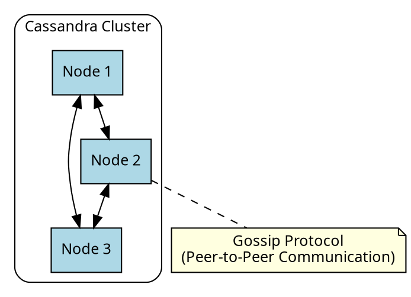
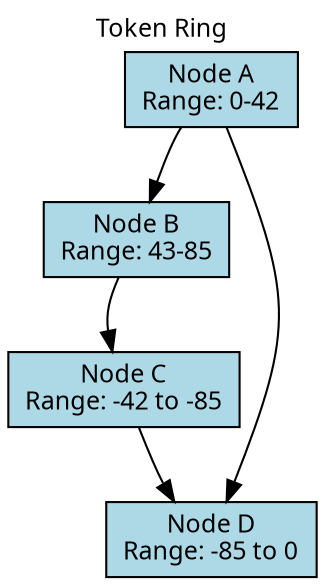
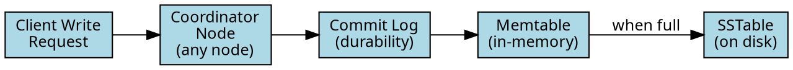
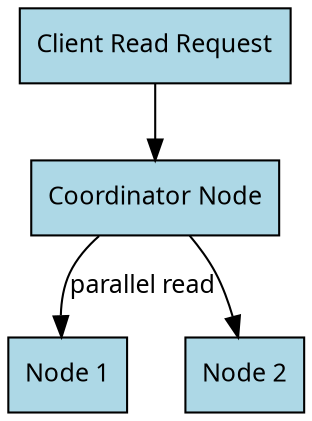
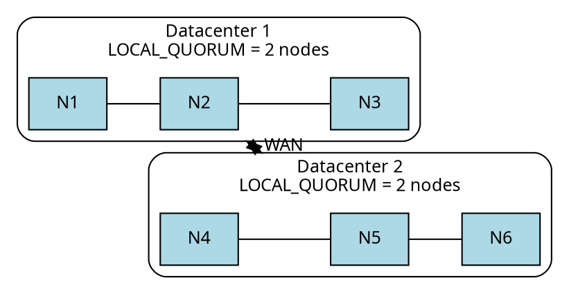

# Cassandra Architecture

Cassandra's architecture explains its behavior. The partition key determines which node stores data—get it wrong, and queries become slow or impossible. Deletes write tombstones instead of removing data immediately—ignore this, and deleted records can reappear. Nodes can disagree on data temporarily—skip repair, and that disagreement becomes permanent.

The design combines Amazon Dynamo's distribution approach (masterless ring, gossip protocol, tunable consistency) with Google BigTable's storage approach (LSM-tree, SSTables, memtables). Understanding both sides leads to better decisions about data modeling and operations.

## Architecture Overview

Apache Cassandra is a distributed, peer-to-peer database designed for:

- **High Availability**: No single point of failure
- **Linear Scalability**: Add nodes to increase capacity
- **Geographic Distribution**: Multi-datacenter replication
- **Tunable Consistency**: Balance between consistency and availability




---

## Core Concepts

### Ring Architecture

Cassandra organizes nodes in a logical ring structure using **consistent hashing**:

1. Each node owns a range of **tokens** on the ring
2. Data is assigned to nodes based on **partition key hash**
3. Data is replicated to multiple nodes for **fault tolerance**



### Partition Key

The **partition key** determines which node stores the data:

```sql
CREATE TABLE users (
    user_id UUID,          -- Partition key
    name TEXT,
    email TEXT,
    PRIMARY KEY (user_id)
);
```

**How it works**:
1. Partition key value is hashed: `hash(user_id)` → token
2. Token maps to a token range
3. Node owning that range stores the data

### Replication

Data is replicated across multiple nodes for fault tolerance:

```sql
CREATE KEYSPACE my_app WITH replication = {
    'class': 'NetworkTopologyStrategy',
    'dc1': 3,   -- 3 copies in dc1
    'dc2': 3    -- 3 copies in dc2
};
```

**Replication Factor (RF)**: Number of copies across the cluster.

---

## Documentation Structure

### Data Distribution

- **[Partitioning](data-distribution.md)** - How data is distributed across nodes
- **[Token Ring](data-distribution.md#token-ring)** - Consistent hashing details
- **[Virtual Nodes (vnodes)](data-distribution.md#virtual-nodes)** - Token distribution

### Replication

- **[Replication Strategies](replication/index.md)** - SimpleStrategy vs NetworkTopologyStrategy
- **[Consistency Levels](consistency/index.md)** - Tuning consistency vs availability
- **[Read/Write Path](read-write-path.md)** - How requests are processed

### Storage Engine

- **[Write Path](storage-engine/write-path.md)** - Memtables and commit log
- **[Read Path](storage-engine/read-path.md)** - How reads are served
- **[SSTables](storage-engine/sstables.md)** - On-disk storage format
- **[Memtables](storage-engine/memtables.md)** - In-memory write buffer
- **[Commit Log](storage-engine/commit-log.md)** - Durability guarantee

### Compaction

- **[Compaction Overview](compaction/index.md)** - Why compaction matters
- **[STCS](compaction/stcs.md)** - Size-Tiered Compaction Strategy
- **[LCS](compaction/lcs.md)** - Leveled Compaction Strategy
- **[TWCS](compaction/twcs.md)** - Time-Window Compaction Strategy
- **[UCS](compaction/ucs.md)** - Unified Compaction Strategy (5.0+)

### Cluster Communication

- **[Gossip Protocol](gossip.md)** - How nodes discover each other
- **[Failure Detection](failure-detection.md)** - Detecting node failures
- **[Hinted Handoff](hinted-handoff.md)** - Handling temporary failures
- **[Anti-Entropy Repair](repair.md)** - Maintaining consistency

---

## Key Architecture Components

### Write Path



1. **Commit Log**: Write-ahead log for durability
2. **Memtable**: In-memory sorted structure
3. **SSTable**: Immutable on-disk file (created when memtable flushes)

### Read Path



### SSTable Structure

```
SSTable Files:
├── data.db         # Actual data
├── index.db        # Partition index
├── filter.db       # Bloom filter
├── summary.db      # Index summary
├── statistics.db   # Table statistics
├── compression.db  # Compression info
└── toc.txt         # Table of contents
```

---

## Consistency Model

Cassandra offers **tunable consistency** per operation:

### Consistency Levels

| Level | Reads | Writes |
|-------|-------|--------|
| `ONE` | 1 replica | 1 replica |
| `QUORUM` | ⌊RF/2⌋ + 1 | ⌊RF/2⌋ + 1 |
| `LOCAL_QUORUM` | Quorum in local DC | Quorum in local DC |
| `ALL` | All replicas | All replicas |

### Strong Consistency Formula

For **strong consistency** (read-your-writes):

```
R + W > RF

Where:
R = Read consistency level (number of replicas)
W = Write consistency level (number of replicas)
RF = Replication factor
```

**Example with RF=3**:
- `QUORUM` reads (2) + `QUORUM` writes (2) = 4 > 3 ✓
- `ONE` reads (1) + `ONE` writes (1) = 2 < 3 ✗

---

## Fault Tolerance

### Node Failure Handling

1. **Detection**: Gossip protocol detects failure
2. **Hinted Handoff**: Coordinator stores hints for failed node
3. **Read Repair**: Fixes inconsistencies during reads
4. **Anti-Entropy Repair**: Background consistency maintenance

### Multi-Datacenter

```
        Datacenter 1                    Datacenter 2
    ┌─────────────────────┐         ┌─────────────────────┐
    │  ┌───┐ ┌───┐ ┌───┐  │  WAN   │  ┌───┐ ┌───┐ ┌───┐  │
    │  │N1 │ │N2 │ │N3 │  │◄─────►│  │N4 │ │N5 │ │N6 │  │
    │  └───┘ └───┘ └───┘  │        │  └───┘ └───┘ └───┘  │
    │                     │        │                     │
    │    LOCAL_QUORUM     │        │    LOCAL_QUORUM     │
    │    = 2 nodes        │        │    = 2 nodes        │
    └─────────────────────┘        └─────────────────────┘
```



Benefits:
- Survives entire datacenter failure
- Low-latency local reads
- Disaster recovery

---

## Performance Characteristics

### Write Performance

| Factor | Impact |
|--------|--------|
| Commit log sync | `periodic` (default) vs `batch` |
| Memtable size | Larger = fewer flushes |
| Compaction | Background CPU/IO |
| Replication | More replicas = more writes |

### Read Performance

| Factor | Impact |
|--------|--------|
| Partition size | Smaller is better |
| SSTable count | Fewer is better |
| Bloom filters | Reduce disk reads |
| Caching | Key/row cache hit rate |
| Data model | Query-driven design |

---

## Further Reading

### Deep Dives

- [Data Distribution Deep Dive](data-distribution.md)
- [Compaction Strategies Explained](compaction/index.md)
- [Consistency Levels Guide](consistency/index.md)
- [Storage Engine Internals](storage-engine/index.md)

### Related Topics

- [Data Modeling](../data-modeling/index.md) - Design for Cassandra
- [Performance Tuning](../performance/index.md) - Optimize your cluster
- [Operations](../operations/index.md) - Day-to-day management
