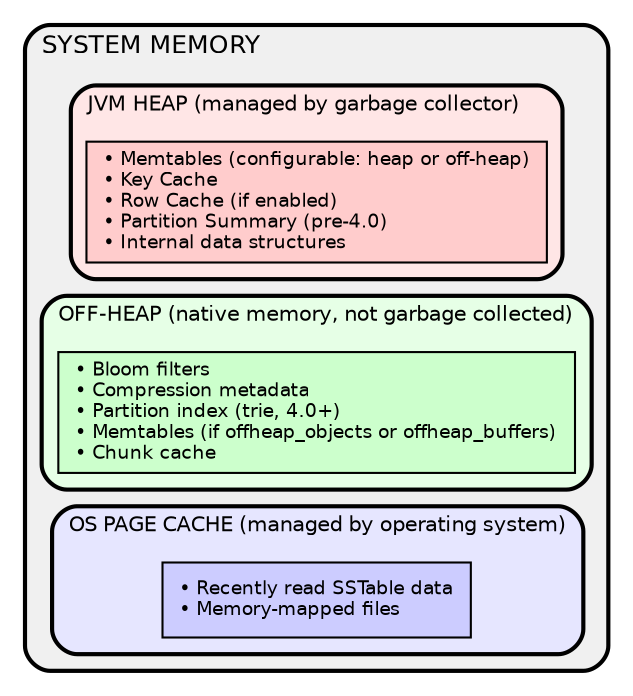
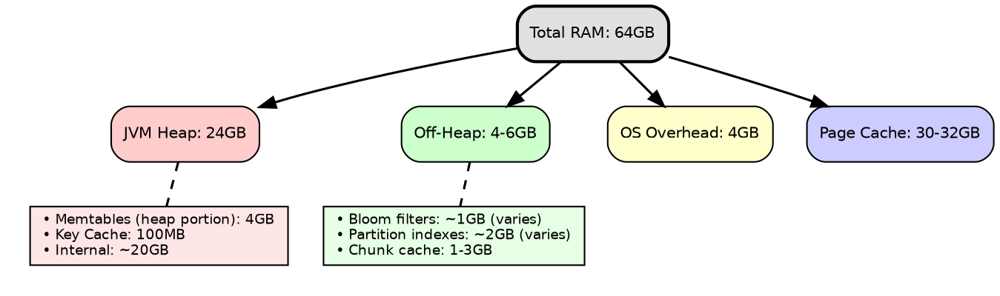

# Memory Management

Cassandra uses multiple memory regions: JVM heap, off-heap native memory, and OS page cache. Understanding how Cassandra allocates memory across these regions is essential for capacity planning and performance tuning.

For JVM configuration and garbage collection tuning, see [JVM](jvm.md).

---

## Memory Architecture



---

## Heap Components

The JVM heap holds Cassandra's managed data structures. These are subject to garbage collection.

| Component | Description | Configuration |
|-----------|-------------|---------------|
| Memtables | In-memory write buffer per table | `memtable_heap_space_in_mb` |
| Key Cache | Maps partition keys to SSTable offsets | `key_cache_size_in_mb` |
| Row Cache | Caches entire rows (use sparingly) | `row_cache_size_in_mb` |
| Partition Summary | Sampled index (pre-4.0 only) | `min_index_interval` |

### Memtables

Memtables buffer writes before flushing to SSTables. Each table has one active memtable.

```yaml
# cassandra.yaml

# Total heap space for memtables across all tables
memtable_heap_space_in_mb: 4096

# Flush threshold (fraction of memtable space)
memtable_cleanup_threshold: 0.11
```

!!! tip "Memtable Sizing"
    Larger memtables reduce flush frequency but increase memory pressure. For write-heavy workloads, consider off-heap memtables.

### Key Cache

The key cache stores partition key to SSTable offset mappings, eliminating partition index lookups for frequently accessed partitions.

```yaml
# cassandra.yaml

# Key cache size (default: min of 5% heap or 100MB)
key_cache_size_in_mb: 100

# Save interval (0 disables saving)
key_cache_save_period: 14400

# Keys to save (empty = all)
key_cache_keys_to_save:
```

### Row Cache

The row cache stores entire rows. It can dramatically improve read performance for frequently accessed rows but consumes significant heap space and can cause GC pressure.

```yaml
# cassandra.yaml

# Disabled by default (0)
row_cache_size_in_mb: 0

# Save interval
row_cache_save_period: 0
```

!!! warning "Row Cache Caution"
    Row cache is disabled by default for good reason. Enable only for specific tables with read-heavy, rarely-updated data. Consider the key cache or OS page cache first.

---

## Off-Heap Memory

Off-heap memory is native memory outside the JVM heap. It is not subject to garbage collection, eliminating GC pauses for these structures.

| Component | Description | Memory Scaling |
|-----------|-------------|----------------|
| Bloom filters | Probabilistic existence checks | ~10 bits per partition key per SSTable |
| Compression metadata | Chunk offset mappings | Proportional to data size |
| Partition index | Trie-based index (4.0+) | Proportional to partition count |
| Memtables | Write buffer (if configured) | `memtable_offheap_space_in_mb` |
| Chunk cache | Compressed SSTable chunks | `file_cache_size_in_mb` |

### Off-Heap Memtables

Moving memtables off-heap reduces GC pressure significantly for write-heavy workloads.

```yaml
# cassandra.yaml

# Off-heap memtable allocation
memtable_allocation_type: offheap_buffers
```

| Type | Heap Usage | Off-Heap Usage | GC Impact |
|------|------------|----------------|-----------|
| `heap_buffers` | High | None | High |
| `offheap_objects` | Medium | High | Medium |
| `offheap_buffers` | Low | High | Low |

!!! tip "Recommended Setting"
    Use `offheap_buffers` for production deployments with high write throughput.

### Chunk Cache

The chunk cache stores decompressed SSTable chunks, reducing CPU overhead for repeated reads.

```yaml
# cassandra.yaml

# Auto-sized by default (1/4 of available memory)
# file_cache_size_in_mb: auto

# Manually set if needed
file_cache_size_in_mb: 2048
```

---

## OS Page Cache

The operating system automatically caches recently accessed file data in unused RAM. This is Cassandra's primary read cache for SSTable data.

### How It Works

- SSTable data cached after first read
- No Cassandra configuration required
- Automatically sized to available RAM
- Shared across all processes
- Evicted under memory pressure (LRU)

### Sizing

```
Page Cache = Total RAM - JVM Heap - Off-Heap - OS Overhead

Example (64GB server):
- JVM Heap: 24GB
- Off-heap: 4-6GB
- OS overhead: 4GB
- Page cache: 30-32GB available
```

### Maximizing Page Cache Effectiveness

- Size heap appropriately (not too large)
- Leave sufficient free RAM
- Avoid memory-hungry co-located processes
- Use SSDs for faster cache misses

---

## Memory Sizing Example

### 64GB Server Configuration



### Configuration

```yaml
# cassandra.yaml

# Memtables
memtable_heap_space_in_mb: 4096
memtable_allocation_type: offheap_buffers

# Key cache
key_cache_size_in_mb: 100

# Row cache (disabled)
row_cache_size_in_mb: 0
```

```bash
# jvm-server.options
-Xms24G
-Xmx24G
```

---

## Monitoring Memory

### Heap and Off-Heap Usage

```bash
# Overall memory status
nodetool info

# Heap memory
nodetool info | grep "Heap Memory"

# Off-heap memory
nodetool info | grep "Off Heap Memory"

# GC statistics
nodetool gcstats
```

### Per-Table Memory

```bash
# Table statistics including bloom filter size
nodetool tablestats keyspace.table

# Bloom filter memory
nodetool tablestats | grep -i bloom
```

### JMX Metrics

```
# Heap
java.lang:type=Memory/HeapMemoryUsage

# Memtables
org.apache.cassandra.metrics:type=Table,name=MemtableOnHeapSize
org.apache.cassandra.metrics:type=Table,name=MemtableOffHeapSize

# Caches
org.apache.cassandra.metrics:type=Cache,scope=KeyCache,name=Size
org.apache.cassandra.metrics:type=Cache,scope=RowCache,name=Size

# Bloom filters
org.apache.cassandra.metrics:type=Table,name=BloomFilterOffHeapMemoryUsed
```

---

## Troubleshooting

### High Heap Usage

**Symptoms:**
- Long GC pauses
- Heap usage consistently >70%
- OutOfMemoryError

**Solutions:**

1. Move memtables off-heap (`memtable_allocation_type: offheap_buffers`)
2. Reduce key cache size
3. Disable row cache if enabled
4. Reduce number of tables (see below)

### Memory Pressure from Many Tables

Each table requires memory for:
- One memtable
- Bloom filters per SSTable
- Index structures per SSTable

!!! warning "Table Count Guideline"
    Avoid more than 200 tables per node. Each table consumes memory regardless of data volume.

### Bloom Filter Memory

Bloom filter memory scales with partition count and SSTable count:

```
Memory ≈ partitions × SSTables × bits_per_key

Example:
- 100 million partitions
- 20 SSTables average
- 10 bits per key
- ≈ 2.5GB bloom filter memory
```

**Reduce bloom filter memory by:**

- Increasing `bloom_filter_fp_chance` (allows more false positives)
- Reducing SSTable count through better compaction
- Using fewer, larger partitions

```sql
-- Increase false positive rate to reduce memory
ALTER TABLE my_table WITH bloom_filter_fp_chance = 0.1;
```

---

## Configuration Reference

### Workload-Specific Settings

**Write-Heavy:**

```yaml
memtable_heap_space_in_mb: 4096
memtable_allocation_type: offheap_buffers
memtable_flush_writers: 4
```

**Read-Heavy:**

```yaml
key_cache_size_in_mb: 200
# Ensure sufficient page cache for working set
```

**Mixed:**

```yaml
memtable_heap_space_in_mb: 2048
memtable_allocation_type: offheap_buffers
key_cache_size_in_mb: 100
```

---

## Related Documentation

- **[JVM](jvm.md)** - JVM configuration and garbage collection
- **[Linux](linux.md)** - Kernel settings, swap, THP, and NUMA
- **[Storage Engine Overview](../storage-engine/index.md)** - Architecture overview
- **[Write Path](../storage-engine/write-path.md)** - Memtable flush process
- **[Read Path](../storage-engine/read-path.md)** - Cache behavior during reads
