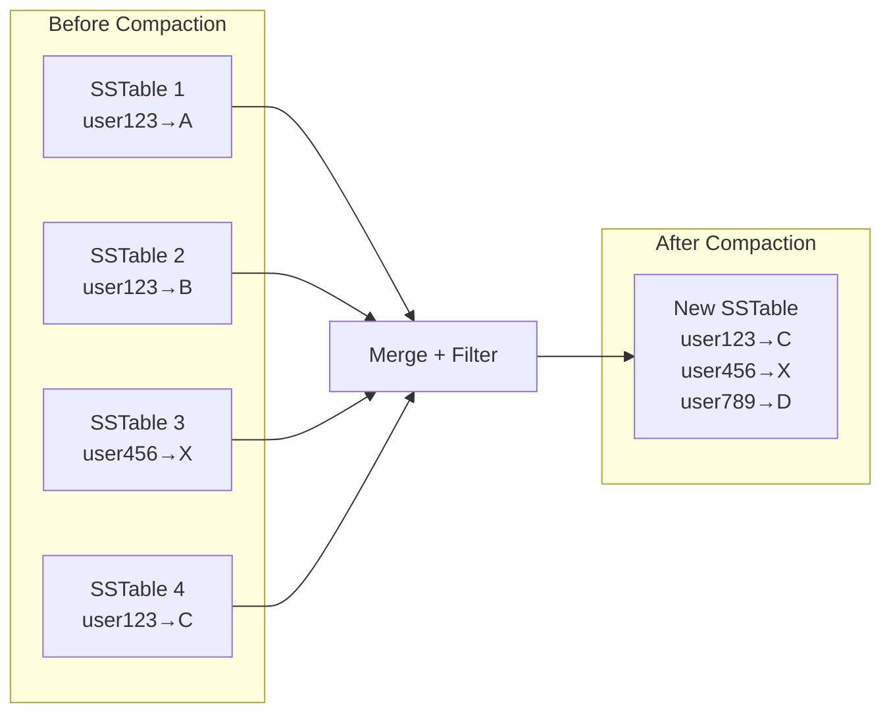

# Compaction

Compaction is the process of merging SSTables to reduce read amplification, reclaim space from tombstones, and maintain manageable file counts. Selecting an appropriate strategy and configuration is critical for cluster performance.

## Why Compaction is Necessary

Every memtable flush creates a new SSTable. Without compaction:

```
Day 1:    [SSTable 1]
Day 2:    [SSTable 1] [SSTable 2]
Day 3:    [SSTable 1] [SSTable 2] [SSTable 3]
...
Day 100:  [SSTable 1] [SSTable 2] ... [SSTable 100]

Read for partition key "user123":
┌─────────────────────────────────────────────────────────────────────┐
│ Must check EVERY SSTable (after bloom filter)                       │
│                                                                     │
│ 1. Check bloom filter: SSTable 1  → Maybe present → Read index/data│
│ 2. Check bloom filter: SSTable 2  → Definitely not present → Skip  │
│ 3. Check bloom filter: SSTable 3  → Maybe present → Read index/data│
│ ...                                                                 │
│ 100. Check bloom filter: SSTable 100 → Maybe present → Read        │
│                                                                     │
│ Result: Potentially 100 disk seeks for a single partition read     │
└─────────────────────────────────────────────────────────────────────┘
```

---

## The Compaction Process

```
Before Compaction:
┌──────────┐ ┌──────────┐ ┌──────────┐ ┌──────────┐
│ SSTable1 │ │ SSTable2 │ │ SSTable3 │ │ SSTable4 │
│ user123→A│ │ user123→B│ │ user456→X│ │ user123→C│
│ user789→D│ │ user456→Y│ │          │ │ (deleted)│
└──────────┘ └──────────┘ └──────────┘ └──────────┘

Compaction Process:
1. Read all input SSTables in merge-sorted order
2. For each partition key:
   - Merge all versions
   - Keep most recent timestamp for each cell
   - Apply tombstones (filter deleted data)
   - If tombstone is old enough, discard both tombstone and data
3. Write merged data to new SSTable(s)
4. Delete old SSTables

After Compaction:
┌─────────────────────────────────────┐
│ New SSTable                          │
│ user123→C (most recent)             │
│ user456→X (merged from Y)           │
│ user789→D                           │
│ (user123 deletion applied)          │
└─────────────────────────────────────┘
```



### Benefits

| Benefit | Description |
|---------|-------------|
| Reduces read amplification | Fewer SSTables to check per read |
| Reclaims space | Removes tombstones after `gc_grace_seconds` |
| Removes obsolete data | Discards old versions of updated cells |
| Improves compression | Larger, consolidated data compresses better |
| Updates statistics | Refreshes min/max values, partition sizes |

---

## Amplification Factors

Every compaction strategy involves trade-offs between three types of amplification.

### Write Amplification

How many times data is written to disk over its lifetime.

```
Write Amplification = Total Bytes Written to Disk / Bytes Received from Client

Example:
- Client writes 1GB of data
- Data is written once to commit log
- Data is written once to SSTable (memtable flush)
- Data is rewritten 3x during compaction
- Write amplification = (1 + 1 + 3) / 1 = 5x
```

**Impact:**

- Higher write amplification increases disk I/O
- SSD lifetime is measured in total bytes written
- Write amplification of 10x means SSD wears 10x faster

### Read Amplification

How many SSTables must be checked per read.

```
Read Amplification = Number of SSTables Touched per Read

Ideal: 1 SSTable per read (data is fully consolidated)
Worst: N SSTables (one per flush, no compaction)
```

**Impact:**

- Higher read amplification increases disk seeks and latency
- With HDDs: Each SSTable check ≈ 10ms seek time
- With SSDs: Each SSTable check ≈ 0.1ms
- Significantly affects P99 latency

### Space Amplification

How much extra disk space is needed beyond raw data size.

```
Space Amplification = Disk Space Used / Actual Data Size

Example:
- Raw data: 100GB
- Tombstones pending cleanup: 10GB
- Old SSTable versions during compaction: 100GB (temporary)
- Space amplification = 210GB / 100GB = 2.1x
```

**Impact:**

- Determines required disk headroom
- Some strategies need 2x space temporarily during compaction
- Running out of disk during compaction causes failures

---

## Strategy Comparison

| Strategy | Write Amp | Read Amp | Space Amp | Best For |
|----------|-----------|----------|-----------|----------|
| [STCS](stcs.md) | Low | High | Medium | Write-heavy workloads |
| [LCS](lcs.md) | High | Low | Low | Read-heavy workloads |
| [TWCS](twcs.md) | Low | Low | Low | Time-series with TTL |
| [UCS](ucs.md) | Varies | Varies | Low | Adaptive (Cassandra 5.0+) |

---

## Strategy Selection

```
┌─────────────────────────────────────────────────────────────────────┐
│ COMPACTION STRATEGY DECISION GUIDE                                   │
├─────────────────────────────────────────────────────────────────────┤
│                                                                      │
│ Is the data time-series with TTL?                                   │
│   YES → TWCS                                                        │
│   NO  → Continue...                                                 │
│                                                                      │
│ Is the workload >70% reads?                                         │
│   YES → Are SSDs available?                                         │
│          YES → LCS                                                  │
│          NO  → STCS                                                 │
│   NO  → STCS                                                        │
│                                                                      │
│ Using Cassandra 5.0+?                                               │
│   Consider UCS for new deployments                                  │
│                                                                      │
└─────────────────────────────────────────────────────────────────────┘
```

### Strategy by Workload Pattern

| Workload | Recommended | Rationale |
|----------|-------------|-----------|
| Write-heavy (>90% writes) | STCS | Low write amplification |
| Read-heavy (>70% reads) | LCS | Low read amplification |
| Time-series with TTL | TWCS | Efficient TTL expiration |
| Mixed workload | STCS or UCS | Balance of trade-offs |
| Frequently updated data | LCS | Consolidates versions quickly |
| Append-only logs | STCS or TWCS | Minimal rewrites |

---

## Monitoring

### Key Metrics

| Metric | Warning | Critical | Action |
|--------|---------|----------|--------|
| Pending compactions | >50 | >200 | Increase throughput |
| SSTable count (STCS) | >20 | >50 | Check compaction progress |
| L0 SSTable count (LCS) | >8 | >32 | Throttle writes or switch strategy |
| Compaction throughput | <50% configured | <25% configured | Check disk I/O |
| Disk space free | <30% | <20% | Add storage or run compaction |

### Commands

```bash
# Current compaction activity
nodetool compactionstats

# Per-table SSTable count and sizes
nodetool tablestats keyspace.table

# Compaction history
nodetool compactionhistory

# SSTable count per level (LCS)
nodetool tablestats keyspace.table | grep "SSTables in each level"
```

### JMX Metrics

```
# Pending compactions
org.apache.cassandra.metrics:type=Compaction,name=PendingTasks

# Compaction throughput (bytes/second)
org.apache.cassandra.metrics:type=Compaction,name=BytesCompacted

# Per-table metrics
org.apache.cassandra.metrics:type=Table,keyspace=*,scope=*,name=LiveSSTableCount
org.apache.cassandra.metrics:type=Table,keyspace=*,scope=*,name=PendingCompactions
```

---

## Best Practices

### General

1. **Never disable auto-compaction** unless there is a specific operational reason
2. **Avoid major compaction** during normal production operations
3. **Monitor pending tasks** - sustained growth indicates a problem
4. **Maintain 30%+ free disk space** for compaction headroom
5. **Run repair regularly** to prevent zombie data after tombstone removal

### Configuration

```yaml
# cassandra.yaml

# Maximum compaction throughput per node (MB/s)
# Higher = faster compaction, more disk I/O competition
# 0 = unlimited
compaction_throughput_mb_per_sec: 64

# Number of concurrent compaction threads
# Default: min(4, number_of_disks)
concurrent_compactors: 4
```

```bash
# Adjust at runtime
nodetool setcompactionthroughput 128
nodetool setconcurrentcompactors 4
```

---

## Related Documentation

- **[Size-Tiered Compaction (STCS)](stcs.md)** - Default strategy for write-heavy workloads
- **[Leveled Compaction (LCS)](lcs.md)** - Optimized for read-heavy workloads
- **[Time-Window Compaction (TWCS)](twcs.md)** - Designed for time-series data
- **[Unified Compaction (UCS)](ucs.md)** - Adaptive strategy in Cassandra 5.0+
- **[Compaction Operations](operations.md)** - Tuning, troubleshooting, and maintenance
- **[Tombstones](../tombstones.md)** - How compaction removes deleted data
- **[SSTable Reference](../sstables.md)** - SSTable file format
