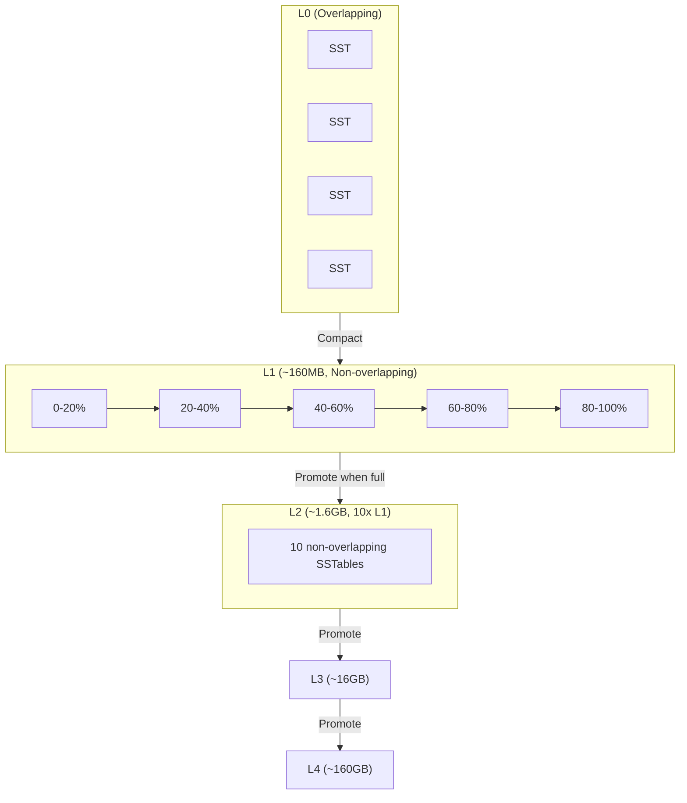

# Leveled Compaction Strategy (LCS)

LCS organizes SSTables into levels where each level is 10x larger than the previous. Within each level (except L0), SSTables have non-overlapping token ranges, providing predictable read performance at the cost of higher write amplification.

## How LCS Works

```
┌─────────────────────────────────────────────────────────────────────┐
│ LEVELED COMPACTION                                                   │
│                                                                      │
│ L0 (memtable flushes, overlapping):                                 │
│ ┌────┐ ┌────┐ ┌────┐ ┌────┐                                        │
│ │    │ │    │ │    │ │    │  Max 4 before compaction to L1         │
│ └────┘ └────┘ └────┘ └────┘                                        │
│      All token ranges overlap                                       │
│      │                                                              │
│      │ Compact L0 → L1                                              │
│      ▼                                                              │
│ L1 (~160MB total, each SSTable ~160MB, non-overlapping):            │
│ ┌──────────┬──────────┬──────────┬──────────┬──────────┐           │
│ │ tokens   │ tokens   │ tokens   │ tokens   │ tokens   │           │
│ │ 0-20%    │ 20-40%   │ 40-60%   │ 60-80%   │ 80-100%  │           │
│ └──────────┴──────────┴──────────┴──────────┴──────────┘           │
│      │                                                              │
│      │ When L1 exceeds size limit, promote to L2                   │
│      ▼                                                              │
│ L2 (~1.6GB total, each SSTable ~160MB, non-overlapping):            │
│ ┌────┬────┬────┬────┬────┬────┬────┬────┬────┬────┐ ... ×10       │
│ │    │    │    │    │    │    │    │    │    │    │                │
│ └────┴────┴────┴────┴────┴────┴────┴────┴────┴────┘                │
│                                                                      │
│ L3 (~16GB total)                                                    │
│ L4 (~160GB total)                                                   │
│ ...                                                                 │
└─────────────────────────────────────────────────────────────────────┘
```



### Non-Overlapping Token Ranges

The key property of LCS is that within each level (L1+), SSTables own exclusive token ranges:

```
L1:  [tokens 0-1000] [tokens 1001-2000] [tokens 2001-3000]
                ↑
     This SSTable contains ALL data for tokens 0-1000

Result: Read for token 500 checks only ONE L1 SSTable
```

This contrasts with STCS where all SSTables might contain any token.

---

## Configuration

```sql
CREATE TABLE my_table (
    id uuid PRIMARY KEY,
    data text
) WITH compaction = {
    'class': 'LeveledCompactionStrategy',

    -- Target size for each SSTable
    -- Smaller = more SSTables, more compaction overhead
    -- Larger = bigger compaction operations
    'sstable_size_in_mb': 160,  -- Default: 160MB

    -- Size multiplier between levels (fanout)
    -- Default 10 means L2 is 10x L1
    'fanout_size': 10  -- Default: 10
};
```

### Configuration Parameters

| Parameter | Default | Description |
|-----------|---------|-------------|
| `sstable_size_in_mb` | 160 | Target size for each SSTable |
| `fanout_size` | 10 | Size multiplier between levels |

### Level Size Calculation

```
With sstable_size_in_mb = 160 and fanout_size = 10:

L0: Variable (memtable flushes, max 4 before compaction)
L1: 160MB × 1 = 160MB total capacity
L2: 160MB × 10 = 1.6GB total capacity
L3: 160MB × 100 = 16GB total capacity
L4: 160MB × 1000 = 160GB total capacity
L5: 160MB × 10000 = 1.6TB total capacity

Maximum data per level = sstable_size × fanout^level
```

---

## Write Amplification Analysis

LCS has high write amplification due to the promotion process:

```
When L0 compacts to L1:
- L0 SSTable overlaps with potentially ALL L1 SSTables
- Must rewrite all overlapping L1 SSTables
- Write amplification at this step: ~10x

When L1 promotes to L2:
- Same process, must rewrite overlapping L2 SSTables
- Write amplification: ~10x

Total write amplification for data reaching deepest level:
~10 × number_of_levels

Example: 100GB dataset with 5 levels
Write amplification: ~10 × 5 = 50x
```

This high write amplification makes LCS unsuitable for write-heavy workloads.

---

## Read Amplification Advantage

LCS provides predictable, low read amplification:

```
For a single partition read:

1. Check L0 (max 4 SSTables, overlapping) → 4 checks
2. Check L1 (non-overlapping) → 1 SSTable
3. Check L2 (non-overlapping) → 1 SSTable
4. Check L3 (non-overlapping) → 1 SSTable
5. Check L4 (non-overlapping) → 1 SSTable

Total: 4 + number_of_levels ≈ 9 SSTables maximum

Compare to STCS: Potentially 50+ SSTables
```

### Read Latency Calculation

```
LCS read path (5 levels):
- L0 bloom checks: 4 × 0.1ms = 0.4ms
- L1-L4 bloom checks: 4 × 0.1ms = 0.4ms
- Index lookups (assume 3 hits): 3 × 0.5ms = 1.5ms
- Data reads: 3 × 1ms = 3ms
- Total: ~5.3ms

STCS with 30 SSTables:
- Bloom checks: 30 × 0.1ms = 3ms
- Index lookups (assume 10 hits): 10 × 0.5ms = 5ms
- Data reads: 10 × 1ms = 10ms
- Total: ~18ms
```

---

## When to Use LCS

### Recommended For

| Use Case | Rationale |
|----------|-----------|
| Read-heavy workloads (>70% reads) | Low read amplification |
| Frequently updated data | Consolidates versions quickly |
| Read latency consistency required | Predictable SSTable count |
| SSD storage | Handles write amplification efficiently |
| Small to medium datasets | Compaction keeps pace with writes |

### Avoid When

| Use Case | Rationale |
|----------|-----------|
| Write-heavy workloads | Write amplification degrades throughput |
| HDD storage | Random I/O from compaction |
| Time-series data | TWCS is more efficient |
| Very large datasets | Compaction may not keep pace |

---

## Production Issues

### Issue 1: L0 Compaction Backlog

**Symptoms:**

- L0 SSTable count growing beyond 4
- Read latency increasing
- Compaction pending tasks growing

**Diagnosis:**

```bash
nodetool tablestats keyspace.table | grep "SSTables in each level"
# Output: [15, 10, 100, 1000, ...]
# 15 L0 SSTables indicates backlog
```

**Causes:**

- Write rate exceeds L0→L1 compaction throughput
- Insufficient compaction threads
- Disk I/O bottleneck

**Solutions:**

1. Increase compaction throughput:
   ```bash
   nodetool setcompactionthroughput 128
   ```

2. Add concurrent compactors:
   ```bash
   nodetool setconcurrentcompactors 4
   ```

3. Reduce write rate temporarily

4. Consider switching to STCS if write-heavy

### Issue 2: Large Partitions Stalling Compaction

**Symptoms:**

- Compaction stuck at same percentage
- One SSTable significantly larger than `sstable_size_in_mb`

**Diagnosis:**

```bash
nodetool tablestats keyspace.table | grep "Compacted partition maximum"
# Output: Compacted partition maximum bytes: 2147483648
# 2GB partition exceeds 160MB target
```

**Cause:**

When a single partition exceeds `sstable_size_in_mb`, the resulting SSTable is "oversized" and may not compact efficiently.

**Solutions:**

1. Fix data model to break up large partitions:
   ```sql
   -- Add time bucket to partition key
   PRIMARY KEY ((user_id, date_bucket), event_time)
   ```

2. Increase SSTable size (affects all compaction):
   ```sql
   ALTER TABLE keyspace.table WITH compaction = {
       'class': 'LeveledCompactionStrategy',
       'sstable_size_in_mb': 320
   };
   ```

### Issue 3: Write Amplification Overwhelming Disks

**Symptoms:**

- Disk throughput at 100%
- High iowait in system metrics
- Write latency increasing

**Diagnosis:**

```bash
iostat -x 1
# Check %util approaching 100%

nodetool compactionstats
# Check bytes compacted vs. bytes written
```

**Solutions:**

1. Switch to STCS for write-heavy tables:
   ```sql
   ALTER TABLE keyspace.table WITH compaction = {
       'class': 'SizeTieredCompactionStrategy'
   };
   ```

2. Throttle compaction to reduce I/O competition:
   ```bash
   nodetool setcompactionthroughput 32
   ```

3. Add more nodes to spread write load

---

## Tuning Recommendations

### Read-Heavy, Low Latency

```sql
ALTER TABLE keyspace.table WITH compaction = {
    'class': 'LeveledCompactionStrategy',
    'sstable_size_in_mb': 160  -- Default, good for most cases
};
```

### Larger Partitions

```sql
ALTER TABLE keyspace.table WITH compaction = {
    'class': 'LeveledCompactionStrategy',
    'sstable_size_in_mb': 320  -- Accommodate larger partitions
};
```

### Reduce Compaction Overhead

```sql
ALTER TABLE keyspace.table WITH compaction = {
    'class': 'LeveledCompactionStrategy',
    'sstable_size_in_mb': 256,
    'fanout_size': 10
};
```

---

## Monitoring LCS

### Key Indicators

| Metric | Healthy | Investigate |
|--------|---------|-------------|
| L0 SSTable count | ≤4 | >8 |
| Pending compactions | <20 | >50 |
| Level distribution | Pyramid shape | L0 growing |
| Write latency | Stable | Increasing |

### Commands

```bash
# SSTable count per level
nodetool tablestats keyspace.table | grep "SSTables in each level"

# Expected output for healthy LCS:
# SSTables in each level: [2, 10, 100, 500, 0, 0, 0]
#                          L0  L1  L2   L3  L4 L5 L6

# Unhealthy (L0 backlog):
# SSTables in each level: [25, 10, 100, 500, 0, 0, 0]
```

### JMX Metrics

```
# Per-level SSTable counts
org.apache.cassandra.metrics:type=Table,keyspace=*,scope=*,name=SSTablesPerLevel

# Compaction bytes written
org.apache.cassandra.metrics:type=Table,keyspace=*,scope=*,name=BytesCompacted
```

---

## Related Documentation

- **[Compaction Overview](index.md)** - Concepts and strategy selection
- **[Size-Tiered Compaction (STCS)](stcs.md)** - Alternative for write-heavy workloads
- **[Compaction Operations](operations.md)** - Tuning and troubleshooting
