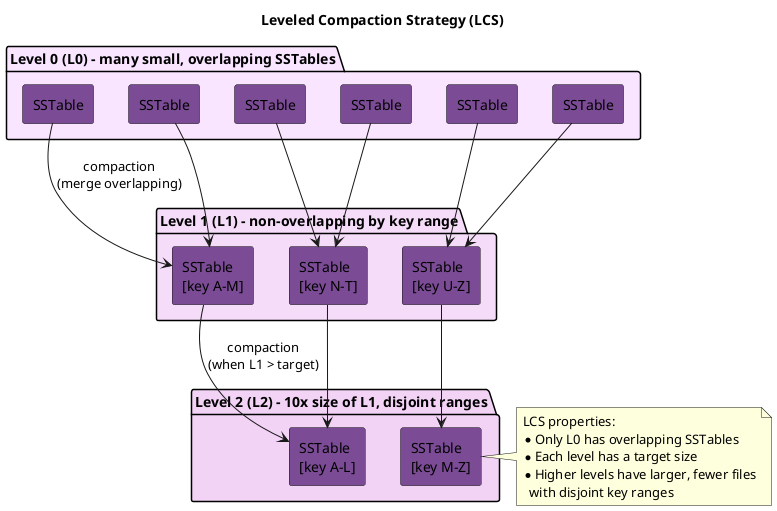

# Leveled Compaction Strategy (LCS)

LCS organizes SSTables into levels where each level is 10x larger than the previous. Within each level (except L0), SSTables have non-overlapping token ranges, providing predictable read performance at the cost of higher write amplification.

---

## Background and History

### Origins

Leveled Compaction Strategy derives from the LSM-tree (Log-Structured Merge-tree) compaction approach pioneered by Google's LevelDB (2011) and later adopted by RocksDB. The strategy was introduced to Cassandra in version 1.0 (October 2011) to address read amplification problems inherent in the original Size-Tiered Compaction Strategy.

The core insight from LevelDB was that organizing SSTables into levels with non-overlapping key ranges within each level dramatically reduces the number of files that must be consulted during reads.

### Design Motivation

STCS groups SSTables by size and compacts similar-sized files together. While this minimizes write amplification, it creates a fundamental problem: any partition key might exist in any SSTable. A point query must potentially check every SSTable.

LCS inverts this trade-off. By ensuring that SSTables within each level (except L0) cover disjoint key ranges, a point query touches at most one SSTable per level. The cost is significantly higher write amplification—data may be rewritten 10× or more as it progresses through levels.

| Aspect | STCS | LCS |
|--------|------|-----|
| SSTable organization | By size similarity | By key range per level |
| Read amplification | High (check many SSTables) | Low (one per level) |
| Write amplification | Low (~4-10×) | High (~10× per level) |
| Space amplification | Medium-High | Low |
| Compaction predictability | Variable | Consistent |

---

## How LCS Works in Theory

### Level Structure

LCS organizes SSTables into numbered levels (L0, L1, L2, ...) with specific properties:

**Level 0 (L0):**

- Receives memtable flushes directly
- SSTables may have overlapping key ranges
- Maximum 4 SSTables before triggering compaction to L1
- Acts as a buffer between memory and the leveled structure

**Level 1+ (L1, L2, L3, ...):**

- SSTables have non-overlapping, contiguous key ranges
- Each level has a target total size: L(n) = L(n-1) × fanout_size
- Default fanout is 10, so L2 is 10× L1, L3 is 10× L2, etc.
- Individual SSTable size is fixed (default 160MB)



### Compaction Mechanics

**L0 → L1 Compaction:**

When L0 accumulates 4 SSTables, compaction selects all L0 files plus all L1 files whose key ranges overlap with any L0 file. These are merged, and the output is written as new L1 SSTables with non-overlapping ranges.

**L(n) → L(n+1) Compaction:**

When a level exceeds its size target, the compaction process:

1. Selects one SSTable from L(n)
2. Finds all overlapping SSTables in L(n+1)
3. Merges and rewrites to L(n+1)
4. Deletes source SSTables

This "promote one, merge with overlapping" approach ensures that each compaction is bounded in scope while maintaining the non-overlapping invariant.

### Write Amplification Calculation

Write amplification in LCS is determined by how many times data is rewritten as it moves through levels:

```
Write path for one piece of data:
1. Written to memtable (memory)
2. Flushed to L0 (1 write)
3. Compacted L0 → L1 (1 write)
4. Compacted L1 → L2 (potentially 10 writes, merging with ~10 L2 files)
5. Compacted L2 → L3 (potentially 10 writes)
...

Worst case: 1 + fanout × number_of_levels
With fanout=10 and 5 levels: ~50× write amplification
```

### Read Amplification Guarantee

The leveled structure provides bounded read amplification:

```
Point query for partition key K:
1. Check all L0 SSTables (max 4)
2. Check exactly 1 SSTable in L1 (non-overlapping ranges)
3. Check exactly 1 SSTable in L2
4. Check exactly 1 SSTable in L3
...

Total: 4 + number_of_levels
With 5 levels: max 9 SSTables per read
```

This is dramatically better than STCS, which may require checking 50+ SSTables.

---

## Benefits

### Predictable Read Latency

The bounded number of SSTables per read provides consistent latency:

- P50 and P99 latencies converge
- No "bad partitions" that require scanning many files
- Read performance does not degrade as data ages

### Low Space Amplification

Unlike STCS, which may temporarily require 2× space during large compactions, LCS operates incrementally:

- Compactions involve small, bounded sets of files
- Temporary space overhead is minimal
- Easier capacity planning

### Efficient Tombstone Removal

Tombstones are garbage collected when the SSTable containing them is compacted. In LCS:

- Data moves through levels predictably
- Tombstones reach deeper levels and are purged
- Less tombstone accumulation than STCS

### Consistent Compaction Load

Compaction work is distributed evenly over time:

- No massive compaction events
- More predictable I/O patterns
- Easier to provision for sustained throughput

---

## Drawbacks

### High Write Amplification

The primary cost of LCS is rewriting data multiple times:

- Each level transition involves merging with existing data
- Write amplification of 10-30× is common
- SSD endurance is consumed faster

### Compaction Throughput Limits

Write rate is bounded by how fast compaction can promote data:

- If writes exceed L0→L1 compaction rate, L0 backs up
- L0 backlog increases read amplification (defeating LCS purpose)
- May require throttling writes

### Inefficient for Write-Heavy Workloads

Workloads with >30% writes may see:

- Compaction unable to keep pace
- Growing pending compaction tasks
- Disk I/O saturated by compaction

### Poor Fit for Time-Series

Time-series data has sequential writes and time-based queries:

- LCS wastes effort organizing by key range
- TWCS is purpose-built for this pattern
- LCS provides no benefit for time-range queries

### Large Partition Problems

Partitions exceeding `sstable_size_in_mb` create "oversized" SSTables:

- Cannot be split across levels properly
- May stall compaction
- Require data model changes to fix

---

## When to Use LCS

### Ideal Use Cases

| Workload Pattern | Why LCS Works |
|------------------|---------------|
| Read-heavy (>70% reads) | Low read amplification pays for write cost |
| Point queries | Bounded SSTable checks per query |
| Frequently updated rows | Versions consolidated quickly |
| Latency-sensitive reads | Predictable, consistent response times |
| SSD storage | Handles write amplification efficiently |

### Avoid LCS When

| Workload Pattern | Why LCS Is Wrong |
|------------------|------------------|
| Write-heavy (>30% writes) | Write amplification overwhelms I/O |
| Time-series data | TWCS is more efficient |
| Append-only logs | STCS or TWCS better suited |
| HDD storage | Random I/O from compaction is slow |
| Very large datasets | Compaction may not keep pace |

---

### Non-Overlapping Token Ranges

The key property of LCS is that within each level (L1+), SSTables own exclusive token ranges:

```
L1:  [tokens 0-1000] [tokens 1001-2000] [tokens 2001-3000]
                ↑
     This SSTable contains ALL data for tokens 0-1000

Result: Read for token 500 checks only ONE L1 SSTable
```

This contrasts with STCS where all SSTables might contain any token.

---

## Configuration

```sql
CREATE TABLE my_table (
    id uuid PRIMARY KEY,
    data text
) WITH compaction = {
    'class': 'LeveledCompactionStrategy',

    -- Target size for each SSTable
    -- Smaller = more SSTables, more compaction overhead
    -- Larger = bigger compaction operations
    'sstable_size_in_mb': 160,  -- Default: 160MB

    -- Size multiplier between levels (fanout)
    -- Default 10 means L2 is 10x L1
    'fanout_size': 10  -- Default: 10
};
```

### Configuration Parameters

| Parameter | Default | Description |
|-----------|---------|-------------|
| `sstable_size_in_mb` | 160 | Target size for each SSTable |
| `fanout_size` | 10 | Size multiplier between levels |

### Level Size Calculation

```
With sstable_size_in_mb = 160 and fanout_size = 10:

L0: Variable (memtable flushes, max 4 before compaction)
L1: 160MB × 1 = 160MB total capacity
L2: 160MB × 10 = 1.6GB total capacity
L3: 160MB × 100 = 16GB total capacity
L4: 160MB × 1000 = 160GB total capacity
L5: 160MB × 10000 = 1.6TB total capacity

Maximum data per level = sstable_size × fanout^level
```

---

## Write Amplification Analysis

LCS has high write amplification due to the promotion process:

```
When L0 compacts to L1:
- L0 SSTable overlaps with potentially ALL L1 SSTables
- Must rewrite all overlapping L1 SSTables
- Write amplification at this step: ~10x

When L1 promotes to L2:
- Same process, must rewrite overlapping L2 SSTables
- Write amplification: ~10x

Total write amplification for data reaching deepest level:
~10 × number_of_levels

Example: 100GB dataset with 5 levels
Write amplification: ~10 × 5 = 50x
```

This high write amplification makes LCS unsuitable for write-heavy workloads.

---

## Read Amplification Advantage

LCS provides predictable, low read amplification:

```
For a single partition read:

1. Check L0 (max 4 SSTables, overlapping) → 4 checks
2. Check L1 (non-overlapping) → 1 SSTable
3. Check L2 (non-overlapping) → 1 SSTable
4. Check L3 (non-overlapping) → 1 SSTable
5. Check L4 (non-overlapping) → 1 SSTable

Total: 4 + number_of_levels ≈ 9 SSTables maximum

Compare to STCS: Potentially 50+ SSTables
```

### Read Latency Calculation

```
LCS read path (5 levels):
- L0 bloom checks: 4 × 0.1ms = 0.4ms
- L1-L4 bloom checks: 4 × 0.1ms = 0.4ms
- Index lookups (assume 3 hits): 3 × 0.5ms = 1.5ms
- Data reads: 3 × 1ms = 3ms
- Total: ~5.3ms

STCS with 30 SSTables:
- Bloom checks: 30 × 0.1ms = 3ms
- Index lookups (assume 10 hits): 10 × 0.5ms = 5ms
- Data reads: 10 × 1ms = 10ms
- Total: ~18ms
```

---

## When to Use LCS

### Recommended For

| Use Case | Rationale |
|----------|-----------|
| Read-heavy workloads (>70% reads) | Low read amplification |
| Frequently updated data | Consolidates versions quickly |
| Read latency consistency required | Predictable SSTable count |
| SSD storage | Handles write amplification efficiently |
| Small to medium datasets | Compaction keeps pace with writes |

### Avoid When

| Use Case | Rationale |
|----------|-----------|
| Write-heavy workloads | Write amplification degrades throughput |
| HDD storage | Random I/O from compaction |
| Time-series data | TWCS is more efficient |
| Very large datasets | Compaction may not keep pace |

---

## Production Issues

### Issue 1: L0 Compaction Backlog

**Symptoms:**

- L0 SSTable count growing beyond 4
- Read latency increasing
- Compaction pending tasks growing

**Diagnosis:**

```bash
nodetool tablestats keyspace.table | grep "SSTables in each level"
# Output: [15, 10, 100, 1000, ...]
# 15 L0 SSTables indicates backlog
```

**Causes:**

- Write rate exceeds L0→L1 compaction throughput
- Insufficient compaction threads
- Disk I/O bottleneck

**Solutions:**

1. Increase compaction throughput:
   ```bash
   nodetool setcompactionthroughput 128
   ```

2. Add concurrent compactors:
   ```bash
   nodetool setconcurrentcompactors 4
   ```

3. Reduce write rate temporarily

4. Consider switching to STCS if write-heavy

### Issue 2: Large Partitions Stalling Compaction

**Symptoms:**

- Compaction stuck at same percentage
- One SSTable significantly larger than `sstable_size_in_mb`

**Diagnosis:**

```bash
nodetool tablestats keyspace.table | grep "Compacted partition maximum"
# Output: Compacted partition maximum bytes: 2147483648
# 2GB partition exceeds 160MB target
```

**Cause:**

When a single partition exceeds `sstable_size_in_mb`, the resulting SSTable is "oversized" and may not compact efficiently.

**Solutions:**

1. Fix data model to break up large partitions:
   ```sql
   -- Add time bucket to partition key
   PRIMARY KEY ((user_id, date_bucket), event_time)
   ```

2. Increase SSTable size (affects all compaction):
   ```sql
   ALTER TABLE keyspace.table WITH compaction = {
       'class': 'LeveledCompactionStrategy',
       'sstable_size_in_mb': 320
   };
   ```

### Issue 3: Write Amplification Overwhelming Disks

**Symptoms:**

- Disk throughput at 100%
- High iowait in system metrics
- Write latency increasing

**Diagnosis:**

```bash
iostat -x 1
# Check %util approaching 100%

nodetool compactionstats
# Check bytes compacted vs. bytes written
```

**Solutions:**

1. Switch to STCS for write-heavy tables:
   ```sql
   ALTER TABLE keyspace.table WITH compaction = {
       'class': 'SizeTieredCompactionStrategy'
   };
   ```

2. Throttle compaction to reduce I/O competition:
   ```bash
   nodetool setcompactionthroughput 32
   ```

3. Add more nodes to spread write load

---

## Tuning Recommendations

### Read-Heavy, Low Latency

```sql
ALTER TABLE keyspace.table WITH compaction = {
    'class': 'LeveledCompactionStrategy',
    'sstable_size_in_mb': 160  -- Default, good for most cases
};
```

### Larger Partitions

```sql
ALTER TABLE keyspace.table WITH compaction = {
    'class': 'LeveledCompactionStrategy',
    'sstable_size_in_mb': 320  -- Accommodate larger partitions
};
```

### Reduce Compaction Overhead

```sql
ALTER TABLE keyspace.table WITH compaction = {
    'class': 'LeveledCompactionStrategy',
    'sstable_size_in_mb': 256,
    'fanout_size': 10
};
```

---

## Monitoring LCS

### Key Indicators

| Metric | Healthy | Investigate |
|--------|---------|-------------|
| L0 SSTable count | ≤4 | >8 |
| Pending compactions | <20 | >50 |
| Level distribution | Pyramid shape | L0 growing |
| Write latency | Stable | Increasing |

### Commands

```bash
# SSTable count per level
nodetool tablestats keyspace.table | grep "SSTables in each level"

# Expected output for healthy LCS:
# SSTables in each level: [2, 10, 100, 500, 0, 0, 0]
#                          L0  L1  L2   L3  L4 L5 L6

# Unhealthy (L0 backlog):
# SSTables in each level: [25, 10, 100, 500, 0, 0, 0]
```

### JMX Metrics

```
# Per-level SSTable counts
org.apache.cassandra.metrics:type=Table,keyspace=*,scope=*,name=SSTablesPerLevel

# Compaction bytes written
org.apache.cassandra.metrics:type=Table,keyspace=*,scope=*,name=BytesCompacted
```

---

## Related Documentation

- **[Compaction Overview](index.md)** - Concepts and strategy selection
- **[Size-Tiered Compaction (STCS)](stcs.md)** - Alternative for write-heavy workloads
- **[Compaction Management](../../../operations/compaction-management/index.md)** - Tuning and troubleshooting
