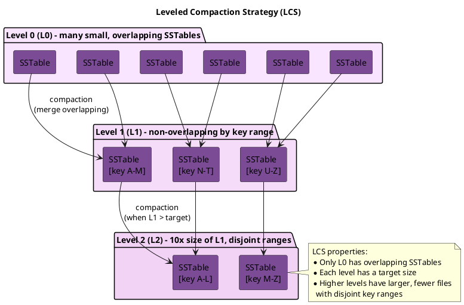
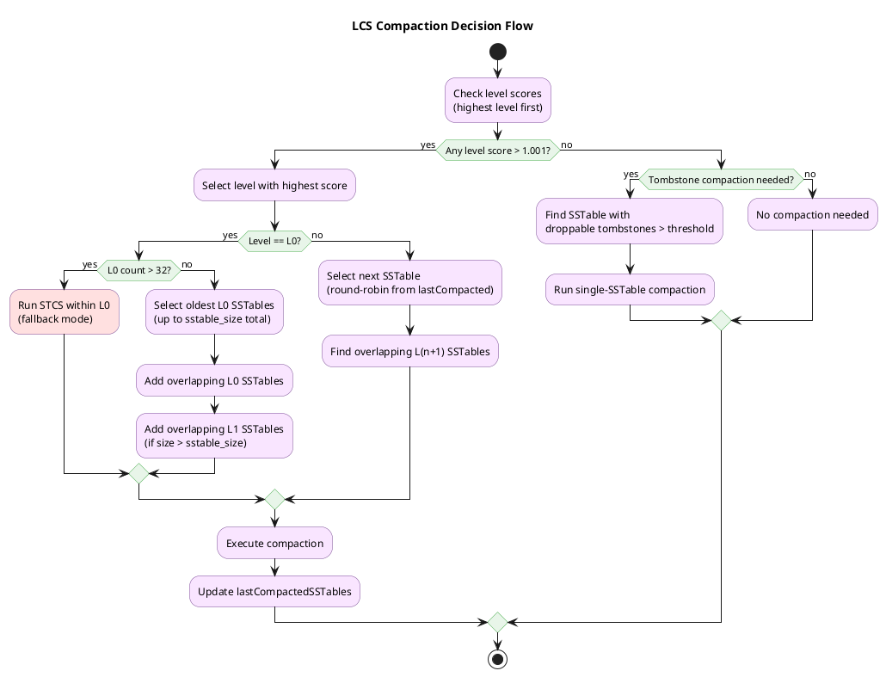

# Leveled Compaction Strategy (LCS)

!!! note "Cassandra 5.0+"
    Starting with Cassandra 5.0, [Unified Compaction Strategy (UCS)](ucs.md) is the recommended compaction strategy for most workloads, including read-heavy patterns traditionally suited to LCS. UCS provides similar read amplification benefits with more adaptive behavior. LCS remains fully supported and is a proven choice for production deployments on earlier versions.

LCS organizes SSTables into levels where each level is 10x larger than the previous. Within each level (except L0), SSTables have non-overlapping token ranges, providing predictable read performance at the cost of higher write amplification.

---

## Background and History

### Origins

Leveled Compaction Strategy derives from the LSM-tree (Log-Structured Merge-tree) compaction approach pioneered by Google's LevelDB (2011) and later adopted by RocksDB. The strategy was introduced to Cassandra in version 1.0 (October 2011) to address read amplification problems inherent in the original Size-Tiered Compaction Strategy.

The core insight from LevelDB was that organizing SSTables into levels with non-overlapping key ranges within each level dramatically reduces the number of files that must be consulted during reads.

### Design Motivation

STCS groups SSTables by size and compacts similar-sized files together. While this minimizes write amplification, it creates a fundamental problem: any partition key might exist in any SSTable. A point query must potentially check every SSTable.

LCS inverts this trade-off. By ensuring that SSTables within each level (except L0) cover disjoint key ranges, a point query touches at most one SSTable per level. The cost is significantly higher write amplification—data may be rewritten 10× or more as it progresses through levels.

| Aspect | STCS | LCS |
|--------|------|-----|
| SSTable organization | By size similarity | By key range per level |
| Read amplification | High (check many SSTables) | Low (one per level) |
| Write amplification | Low (~4-10×) | High (~10× per level) |
| Space amplification | Medium-High | Low |
| Compaction predictability | Variable | Consistent |

---

## How LCS Works in Theory

### Level Structure

LCS organizes SSTables into numbered levels (L0 through L8) with specific properties. The maximum level count is 9 (`MAX_LEVEL_COUNT = 9` in the source code).

**Level 0 (L0):**

- Receives memtable flushes directly
- SSTables may have overlapping key ranges
- Target size: 4 × `sstable_size_in_mb` (default: 640MB)
- Stored in a HashSet (unordered by token range)
- Acts as a buffer between memory and the leveled structure

**Level 1+ (L1, L2, L3, ... L8):**

- SSTables have non-overlapping, contiguous key ranges
- Stored in TreeSets sorted by first token (with SSTable ID as tiebreaker)
- Each level has a target total size calculated as: `fanout_size^level × sstable_size_in_mb`
- Individual SSTable size is fixed (default 160MB)

**Level Size Targets (with defaults):**

| Level | Target Size Formula | Default Size |
|-------|---------------------|--------------|
| L0 | 4 × sstable_size | 640 MB |
| L1 | fanout × sstable_size | 1.6 GB |
| L2 | fanout² × sstable_size | 16 GB |
| L3 | fanout³ × sstable_size | 160 GB |
| L4 | fanout⁴ × sstable_size | 1.6 TB |
| L5 | fanout⁵ × sstable_size | 16 TB |
| L6 | fanout⁶ × sstable_size | 160 TB |
| L7 | fanout⁷ × sstable_size | 1.6 PB |
| L8 | fanout⁸ × sstable_size | 16 PB |



### Compaction Mechanics



#### Level Score and Compaction Triggering

Compaction priority is determined by calculating a score for each level:

$$\text{score} = \frac{\text{current\_bytes\_in\_level}}{\text{max\_bytes\_for\_level}}$$

Compaction is triggered when $\text{score} > 1.001$. The compaction scheduler evaluates levels from highest (L8) to lowest (L0), prioritizing higher levels to maintain the leveled structure's invariants.

#### L0 → L1 Compaction

When L0 exceeds its size target (4 × `sstable_size_in_mb`), the candidate selection algorithm:

1. Sorts L0 SSTables by creation time (oldest first)
2. Adds SSTables until reaching `sstable_size_in_mb` total size
3. Includes any additional L0 SSTables that overlap with already-selected candidates
4. Limits selection to `max_threshold` SSTables (default: 32)
5. Includes overlapping L1 SSTables only if total candidate size exceeds `sstable_size_in_mb`
6. Requires minimum 2 SSTables to proceed with compaction

All selected SSTables are merged, and output is written as new L1 SSTables with non-overlapping ranges.

#### L0 STCS Fallback

When L0 accumulates more than 32 SSTables (`MAX_COMPACTING_L0 = 32`), indicating that L0→L1 compaction cannot keep pace with write rate, Cassandra activates STCS-style compaction within L0. This compacts up to `max_threshold` similarly-sized L0 SSTables together, reducing SSTable count more quickly than waiting for L1 capacity. This behavior can be disabled with `-Dcassandra.disable_stcs_in_l0=true`.

#### L(n) → L(n+1) Compaction

When a level exceeds its size target (score > 1.001), the compaction process:

1. Selects the next SSTable in round-robin order from `lastCompactedSSTables[level]` position
2. Skips SSTables that are currently compacting or marked as suspect
3. Identifies all overlapping SSTables in L(n+1)
4. Merges and rewrites all selected SSTables to L(n+1)
5. Updates `lastCompactedSSTables[level]` to track position for next round

This round-robin approach ensures fair distribution of compaction work across the token range.

#### Starvation Prevention

The manifest tracks rounds without high-level compaction using `NO_COMPACTION_LIMIT = 25`. If 25 consecutive compaction rounds occur without selecting SSTables from higher levels, starved SSTables may be pulled into lower-level compactions to ensure data eventually progresses through levels.

#### Single SSTable Uplevel

When `single_sstable_uplevel` is enabled (default: true), an SSTable from level L can be promoted directly to level L+1 without rewriting if it does not overlap with any existing L+1 SSTables. This optimization reduces unnecessary I/O for workloads with good key distribution.

#### Partial Compactions

Partial compactions (where not all selected candidates complete) are only permitted at L0. Higher levels require complete compaction to maintain the non-overlapping invariant.

#### Disk Space Management

When insufficient disk space is available for L0→L(n) compactions, the `reduceScopeForLimitedSpace` method removes the largest L0 SSTable from the compaction set (if multiple L0 files exist). This allows compaction to proceed with reduced scope rather than failing entirely.

### Write Amplification Calculation

Write amplification in LCS is determined by how many times data is rewritten as it moves through levels:

**Write path for one piece of data:**

1. Written to memtable (memory)
2. Flushed to L0 (1 write)
3. Compacted L0 → L1 (1 write)
4. Compacted L1 → L2 (potentially 10 writes, merging with ~10 L2 files)
5. Compacted L2 → L3 (potentially 10 writes)
6. Continue through higher levels...

$$\text{Worst case WA} = 1 + f \times L$$

Where $f$ = fanout (default 10) and $L$ = number of levels. With fanout=10 and 5 levels: ~50× write amplification.

### Read Amplification Guarantee

The leveled structure provides bounded read amplification:

**Point query for partition key K:**

1. Check all L0 SSTables (variable count, but typically low under normal operation)
2. Check exactly 1 SSTable in L1 (non-overlapping ranges)
3. Check exactly 1 SSTable in L2
4. Check exactly 1 SSTable in L3
5. Continue through L4-L8 (exactly 1 SSTable per level)

| Case | Read Amplification |
|------|-------------------|
| Best case | $\text{L0 count} + 1$ (data only in one level) |
| Worst case | $\text{L0 count} + 8$ (data spread across all levels) |

Under healthy conditions with timely compaction, L0 typically contains only a few SSTables. The bounded nature of L1-L8 (exactly one SSTable per level per query) provides the predictable read latency that distinguishes LCS from STCS. With STCS, a single partition query may need to check 50+ SSTables.

---

## Benefits

### Predictable Read Latency

The bounded number of SSTables per read provides consistent latency:

- P50 and P99 latencies converge
- No "bad partitions" that require scanning many files
- Read performance does not degrade as data ages

### Low Space Amplification

Unlike STCS, which may temporarily require 2× space during large compactions, LCS operates incrementally:

- Compactions involve small, bounded sets of files
- Temporary space overhead is minimal
- Easier capacity planning

### Efficient Tombstone Removal

Tombstones are garbage collected when the SSTable containing them is compacted. In LCS:

- Data moves through levels predictably
- Tombstones reach deeper levels and are purged
- Less tombstone accumulation than STCS

### Consistent Compaction Load

Compaction work is distributed evenly over time:

- No massive compaction events
- More predictable I/O patterns
- Easier to provision for sustained throughput

---

## Drawbacks

### High Write Amplification

The primary cost of LCS is rewriting data multiple times:

- Each level transition involves merging with existing data
- Write amplification of 10-30× is common
- SSD endurance is consumed faster

### Compaction Throughput Limits

Write rate is bounded by how fast compaction can promote data:

- If writes exceed L0→L1 compaction rate, L0 backs up
- L0 backlog increases read amplification (defeating LCS purpose)
- May require throttling writes

### Inefficient for Write-Heavy Workloads

Workloads with >30% writes may see:

- Compaction unable to keep pace
- Growing pending compaction tasks
- Disk I/O saturated by compaction

### Poor Fit for Time-Series

Time-series data has sequential writes and time-based queries:

- LCS wastes effort organizing by key range
- TWCS is purpose-built for this pattern
- LCS provides no benefit for time-range queries

### Large Partition Problems

Partitions exceeding `sstable_size_in_mb` create "oversized" SSTables:

- Cannot be split across levels properly
- May stall compaction
- Require data model changes to fix

---

## When to Use LCS

### Ideal Use Cases

| Workload Pattern | Why LCS Works |
|------------------|---------------|
| Read-heavy (>70% reads) | Low read amplification pays for write cost |
| Point queries | Bounded SSTable checks per query |
| Frequently updated rows | Versions consolidated quickly |
| Latency-sensitive reads | Predictable, consistent response times |
| SSD storage | Handles write amplification efficiently |

### Avoid LCS When

| Workload Pattern | Why LCS Is Wrong |
|------------------|------------------|
| Write-heavy (>30% writes) | Write amplification overwhelms I/O |
| Time-series data | TWCS is more efficient |
| Append-only logs | STCS or TWCS better suited |
| HDD storage | Random I/O from compaction is slow |
| Very large datasets | Compaction may not keep pace |

---

## Configuration

```sql
CREATE TABLE my_table (
    id uuid PRIMARY KEY,
    data text
) WITH compaction = {
    'class': 'LeveledCompactionStrategy',

    -- Target size for each SSTable
    -- Smaller = more SSTables, more compaction overhead
    -- Larger = bigger compaction operations
    'sstable_size_in_mb': 160,  -- Default: 160MB

    -- Size multiplier between levels (fanout)
    -- Default 10 means L2 is 10x L1
    'fanout_size': 10  -- Default: 10
};
```

### Configuration Parameters

#### LCS-Specific Options

| Parameter | Default | Description |
|-----------|---------|-------------|
| `sstable_size_in_mb` | 160 | Target size for individual SSTables in megabytes. Smaller values increase SSTable count and compaction frequency; larger values reduce compaction overhead but increase individual compaction duration. |
| `fanout_size` | 10 | Size multiplier between adjacent levels. Level L(n+1) has a target capacity of fanout_size × L(n). Higher values reduce the number of levels but increase write amplification per level transition. |
| `single_sstable_uplevel` | true | When enabled, allows a single SSTable from level L to be promoted directly to level L+1 without rewriting, provided it does not overlap with any SSTables in L+1. Reduces unnecessary I/O for non-overlapping data. |

#### Common Compaction Options

These options apply to all compaction strategies:

| Parameter | Default | Description |
|-----------|---------|-------------|
| `enabled` | true | Enables background compaction. When set to false, automatic compaction is disabled but the strategy configuration is retained. |
| `tombstone_threshold` | 0.2 | Ratio of garbage-collectable tombstones to total columns that triggers single-SSTable compaction. A value of 0.2 means compaction is triggered when 20% of the SSTable consists of droppable tombstones. |
| `tombstone_compaction_interval` | 86400 | Minimum time in seconds between tombstone compaction attempts for the same SSTable. Prevents continuous recompaction of SSTables that cannot yet drop tombstones. |
| `unchecked_tombstone_compaction` | false | When true, bypasses pre-checking for tombstone compaction eligibility. Tombstones are still only dropped when safe to do so. |
| `only_purge_repaired_tombstones` | false | When true, tombstones are only purged from SSTables that have been marked as repaired. Useful for preventing data resurrection in clusters with inconsistent repair schedules. |
| `log_all` | false | Enables detailed compaction logging to a separate log file in the log directory. Useful for debugging compaction behavior. |

### Startup Options

The following JVM option affects LCS behavior:

| Option | Description |
|--------|-------------|
| `-Dcassandra.disable_stcs_in_l0=true` | Disables STCS-style compaction in L0. By default, when L0 accumulates more than 32 SSTables, Cassandra performs STCS compaction within L0 to reduce the SSTable count more quickly. This option disables that behavior. |

### Level Size Calculation

The target size for each level is calculated using the formula:

$$\text{maxBytesForLevel}(L) = f^L \times s$$

Where:

- $L$ = level number (1-8)
- $f$ = `fanout_size` (default: 10)
- $s$ = `sstable_size_in_mb` (default: 160 MB)

**Special case for L0:**

$$\text{maxBytesForLevel}(0) = 4 \times s$$

**With default values ($s = 160\text{MB}$, $f = 10$):**

| Level | Formula | Target Size |
|-------|---------|-------------|
| L0 | $4 \times 160\text{MB}$ | 640 MB |
| L1 | $10^1 \times 160\text{MB}$ | 1.6 GB |
| L2 | $10^2 \times 160\text{MB}$ | 16 GB |
| L3 | $10^3 \times 160\text{MB}$ | 160 GB |
| L4 | $10^4 \times 160\text{MB}$ | 1.6 TB |
| L5 | $10^5 \times 160\text{MB}$ | 16 TB |
| L6 | $10^6 \times 160\text{MB}$ | 160 TB |
| L7 | $10^7 \times 160\text{MB}$ | 1.6 PB |
| L8 | $10^8 \times 160\text{MB}$ | 16 PB |

The maximum dataset size per table with default settings is theoretically 16+ PB, though practical limits are reached well before this due to compaction throughput constraints.

---

## Write Amplification Analysis

LCS has high write amplification due to the promotion process:

**Per-level amplification:**

- L0 → L1: SSTable overlaps with potentially all L1 SSTables → $\sim 10\times$
- L1 → L2: Same process with L2 overlaps → $\sim 10\times$
- Each subsequent level: $\sim f\times$ where $f$ = fanout

**Total write amplification:**

$$W_{\text{total}} \approx f \times L$$

Where:

- $f$ = fanout (default: 10)
- $L$ = number of levels data traverses

**Example:** 100GB dataset with 5 levels:

$$W = 10 \times 5 = 50\times$$

This high write amplification makes LCS unsuitable for write-heavy workloads.

---

## Read Path Analysis

LCS provides predictable, low read amplification through its non-overlapping level structure:

**For a single partition read:**

1. Check L0 SSTables (overlapping, count varies with write rate)
2. Check at most 1 SSTable per level L1-L8 (non-overlapping)

**Read amplification bounds:**

$$R_{\text{best}} = n_{L0} + 1$$
$$R_{\text{worst}} = n_{L0} + L_{\text{max}}$$

Where:

- $n_{L0}$ = number of L0 SSTables (typically 2-4 when healthy)
- $L_{\text{max}}$ = deepest level containing data (up to 8)

**Comparison:**

| Scenario | LCS | STCS |
|----------|-----|------|
| Healthy system | $\sim 4 + 8 = 12$ SSTables max | 50+ SSTables |
| Backlogged | $20+ n_{L0}$ (STCS fallback at 32) | 100+ SSTables |

### Read Latency Example

**LCS read path** (healthy, 3 L0 SSTables, data in L3):

| Operation | Calculation | Time |
|-----------|-------------|------|
| L0 bloom checks | $3 \times 0.1\text{ms}$ | 0.3 ms |
| L1-L3 bloom checks | $3 \times 0.1\text{ms}$ | 0.3 ms |
| Index lookups (2 hits) | $2 \times 0.5\text{ms}$ | 1.0 ms |
| Data reads | $2 \times 1\text{ms}$ | 2.0 ms |
| **Total** | | **~3.6 ms** |

**STCS with 30 SSTables:**

| Operation | Calculation | Time |
|-----------|-------------|------|
| Bloom checks | $30 \times 0.1\text{ms}$ | 3.0 ms |
| Index lookups (10 hits) | $10 \times 0.5\text{ms}$ | 5.0 ms |
| Data reads | $10 \times 1\text{ms}$ | 10.0 ms |
| **Total** | | **~18 ms** |

The key advantage is predictability: LCS read latency remains stable as the dataset grows, while STCS latency increases with SSTable accumulation.

---

## Production Issues

### Issue 1: L0 Compaction Backlog

**Symptoms:**

- L0 SSTable count growing (warning at 5+, critical at 32+)
- Read latency increasing proportionally to L0 count
- Compaction pending tasks growing
- At 32+ L0 SSTables, STCS fallback activates automatically

**Diagnosis:**

```bash
nodetool tablestats keyspace.table | grep "SSTables in each level"
# Output: [15, 10, 100, 1000, ...]
# 15 L0 SSTables indicates moderate backlog

# Check if L0 size exceeds target (4 × sstable_size = 640MB default)
nodetool tablestats keyspace.table | grep -E "Space used|SSTable"
```

**Causes:**

- Write rate exceeds L0→L1 compaction throughput
- Insufficient compaction threads
- Disk I/O bottleneck
- Large L1 causing extensive overlap during L0→L1 compaction

**Solutions:**

1. Increase compaction throughput:
   ```bash
   nodetool setcompactionthroughput 128  # MB/s
   ```

2. Add concurrent compactors:
   ```bash
   nodetool setconcurrentcompactors 4
   ```

3. Reduce write rate temporarily

4. Consider switching to STCS if write-heavy

5. If L0 exceeds 32 SSTables, STCS fallback is automatic (disable with `-Dcassandra.disable_stcs_in_l0=true` only if necessary)

### Issue 2: Large Partitions Stalling Compaction

**Symptoms:**

- Compaction stuck at same percentage
- One SSTable significantly larger than `sstable_size_in_mb`

**Diagnosis:**

```bash
nodetool tablestats keyspace.table | grep "Compacted partition maximum"
# Output: Compacted partition maximum bytes: 2147483648
# 2GB partition exceeds 160MB target
```

**Cause:**

When a single partition exceeds `sstable_size_in_mb`, the resulting SSTable is "oversized" and may not compact efficiently.

**Solutions:**

1. Fix data model to break up large partitions:
   ```sql
   -- Add time bucket to partition key
   PRIMARY KEY ((user_id, date_bucket), event_time)
   ```

2. Increase SSTable size (affects all compaction):
   ```sql
   ALTER TABLE keyspace.table WITH compaction = {
       'class': 'LeveledCompactionStrategy',
       'sstable_size_in_mb': 320
   };
   ```

### Issue 3: Write Amplification Overwhelming Disks

**Symptoms:**

- Disk throughput at 100%
- High iowait in system metrics
- Write latency increasing

**Diagnosis:**

```bash
iostat -x 1
# Check %util approaching 100%

nodetool compactionstats
# Check bytes compacted vs. bytes written
```

**Solutions:**

1. Switch to STCS for write-heavy tables:
   ```sql
   ALTER TABLE keyspace.table WITH compaction = {
       'class': 'SizeTieredCompactionStrategy'
   };
   ```

2. Throttle compaction to reduce I/O competition:
   ```bash
   nodetool setcompactionthroughput 32
   ```

3. Add more nodes to spread write load

---

## Tuning Recommendations

### Read-Heavy, Low Latency

```sql
ALTER TABLE keyspace.table WITH compaction = {
    'class': 'LeveledCompactionStrategy',
    'sstable_size_in_mb': 160  -- Default, good for most cases
};
```

### Larger Partitions

```sql
ALTER TABLE keyspace.table WITH compaction = {
    'class': 'LeveledCompactionStrategy',
    'sstable_size_in_mb': 320  -- Accommodate larger partitions
};
```

### Reduce Compaction Overhead

```sql
ALTER TABLE keyspace.table WITH compaction = {
    'class': 'LeveledCompactionStrategy',
    'sstable_size_in_mb': 256,
    'fanout_size': 10
};
```

---

## Monitoring LCS

### Key Indicators

| Metric | Healthy | Warning | Critical |
|--------|---------|---------|----------|
| L0 SSTable count | ≤4 | 5-15 | >32 (STCS fallback triggers) |
| Pending compactions | <20 | 20-50 | >50 |
| Level distribution | Pyramid shape | L0 growing | L0 >> L1 |
| Write latency | Stable | Increasing | Spiking |
| Level score (any level) | <1.0 | 1.0-1.5 | >1.5 |

### Commands

```bash
# SSTable count per level
nodetool tablestats keyspace.table | grep "SSTables in each level"

# Expected output for healthy LCS:
# SSTables in each level: [2, 10, 100, 500, 0, 0, 0, 0, 0]
#                          L0  L1  L2   L3  L4 L5 L6 L7 L8

# Warning (L0 building up):
# SSTables in each level: [12, 10, 100, 500, 0, 0, 0, 0, 0]

# Critical (L0 backlog, STCS will kick in):
# SSTables in each level: [45, 10, 100, 500, 0, 0, 0, 0, 0]

# Check compaction pending tasks
nodetool compactionstats

# View detailed level information
nodetool cfstats keyspace.table
```

### JMX Metrics

```
# Per-level SSTable counts
org.apache.cassandra.metrics:type=Table,keyspace=*,scope=*,name=SSTablesPerLevel

# Compaction bytes written
org.apache.cassandra.metrics:type=Table,keyspace=*,scope=*,name=BytesCompacted

# Pending compaction bytes estimate
org.apache.cassandra.metrics:type=Table,keyspace=*,scope=*,name=PendingCompactions

# Compaction throughput
org.apache.cassandra.metrics:type=Compaction,name=BytesCompacted
```

### Level Health Check

A healthy LCS table should show:

1. **L0**: Small count (typically 0-4 SSTables)
2. **L1**: Approximately `fanout_size` SSTables (≈10 with defaults)
3. **Higher levels**: Each level ~10× more SSTables than the previous
4. **Pyramid shape**: SSTable counts increase geometrically with level depth

---

## Implementation Internals

This section documents implementation details from the Cassandra source code that affect operational behavior.

### SSTable Level Assignment

When an SSTable is added to the manifest (e.g., after streaming or compaction), the level assignment follows these rules:

1. **Recorded level check**: Each SSTable stores its intended level in metadata via `getSSTableLevel()`
2. **Overlap verification for L1+**: Before placing an SSTable in L1 or higher, the manifest checks for overlaps with existing SSTables in that level
3. **Demotion to L0**: If overlap is detected (`before.last >= newsstable.first` or `after.first <= newsstable.last`), the SSTable is demoted to L0 regardless of its recorded level

This behavior ensures the non-overlapping invariant is maintained even when SSTables arrive from external sources (streaming, sstableloader).

### Internal Data Structures

```
LeveledGenerations:
├── L0: HashSet<SSTableReader>        // Unordered, overlapping allowed
└── levels[0-7]: TreeSet<SSTableReader>  // L1-L8, sorted by first token
    └── Comparator: firstKey, then SSTableId (tiebreaker)

LeveledManifest:
├── generations: LeveledGenerations
├── lastCompactedSSTables[]: SSTableReader  // Round-robin tracking per level
├── compactionCounter: int                  // For starvation prevention
└── levelFanoutSize: int                    // Default: 10
```

### Compaction Writer Selection

The compaction task selects its writer based on the operation type:

| Condition | Writer | Behavior |
|-----------|--------|----------|
| Major compaction | `MajorLeveledCompactionWriter` | Full reorganization, respects level structure |
| Standard compaction | `MaxSSTableSizeWriter` | Outputs SSTables at target size, assigned to destination level |

### Anti-Compaction Behavior

During streaming operations that require anti-compaction (splitting SSTables by token range), LCS groups SSTables in batches of 2 per level to maintain level-specific guarantees while processing.

### Constants Reference

| Constant | Value | Description |
|----------|-------|-------------|
| `MAX_LEVEL_COUNT` | 9 | L0 through L8 |
| `MAX_COMPACTING_L0` | 32 | Threshold for L0 STCS fallback |
| `NO_COMPACTION_LIMIT` | 25 | Rounds before starvation prevention |
| Minimum SSTable size | 1 MiB | Validation constraint |
| Minimum fanout size | 1 | Validation constraint |
| Default fanout | 10 | Level size multiplier |
| Default SSTable size | 160 MiB | Target per-SSTable size |

---

## Related Documentation

- **[Compaction Overview](index.md)** - Concepts and strategy selection
- **[Size-Tiered Compaction (STCS)](stcs.md)** - Alternative for write-heavy workloads
- **[Time-Window Compaction (TWCS)](twcs.md)** - Optimized for time-series data with TTL
- **[Unified Compaction (UCS)](ucs.md)** - Recommended strategy for Cassandra 5.0+
- **[Compaction Management](../../../operations/compaction-management/index.md)** - Tuning and troubleshooting
