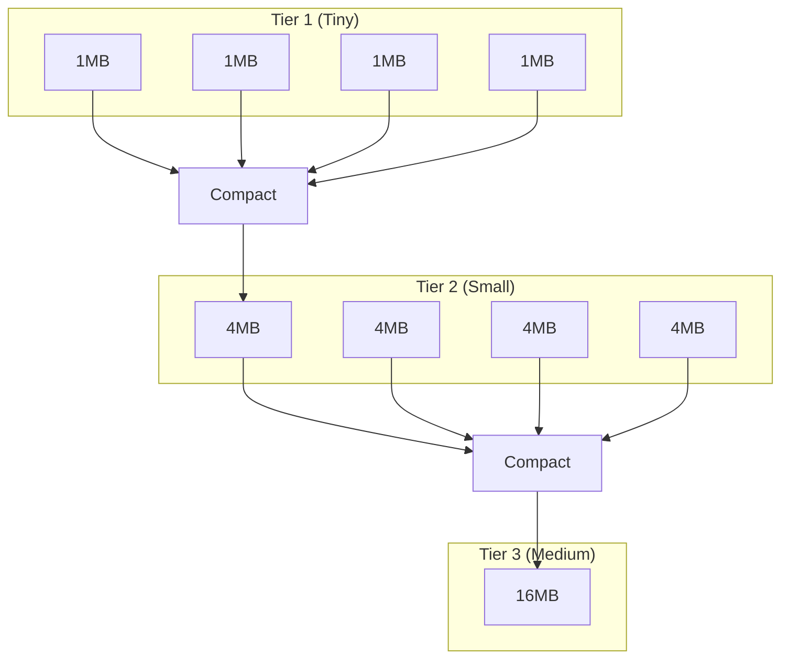

# Size-Tiered Compaction Strategy (STCS)

STCS is the default compaction strategy. It groups SSTables of similar size and compacts them together, optimizing for write throughput at the cost of read amplification.

## How STCS Works

```
┌─────────────────────────────────────────────────────────────────────┐
│ SIZE-TIERED COMPACTION                                               │
│                                                                      │
│ Concept: Group SSTables by size, compact when enough similar sizes  │
│                                                                      │
│ Tier 1 (tiny):    [1MB] [1MB] [1MB] [1MB]  ← 4 SSTables ~1MB each  │
│                          │                                          │
│                          ▼ Compact when 4 similar sizes             │
│                      [4MB]                                          │
│                                                                      │
│ Tier 2 (small):   [4MB] [4MB] [4MB] [4MB]  ← 4 SSTables ~4MB each  │
│                          │                                          │
│                          ▼ Compact when 4 similar sizes             │
│                      [16MB]                                         │
│                                                                      │
│ Tier 3 (medium):  [16MB] [16MB] [16MB] [16MB]                      │
│                          │                                          │
│                          ▼                                          │
│                      [64MB]                                         │
│                                                                      │
│ ... continues growing exponentially ...                             │
│                                                                      │
│ Eventually: [256MB] [1GB] [4GB] [16GB] ← Large SSTables accumulate │
└─────────────────────────────────────────────────────────────────────┘
```



### Bucketing Logic

SSTables are grouped into "buckets" based on size similarity:

```
Bucket boundaries determined by bucket_high and bucket_low:

Average size of bucket: X
- Include SSTables from X × bucket_low to X × bucket_high
- Default: 0.5X to 1.5X

Example with 10MB average:
- Include: 5MB to 15MB SSTables
- Exclude: 4MB (too small), 20MB (too large)

When a bucket reaches min_threshold SSTables, compact them.
```

---

## Configuration

```sql
CREATE TABLE my_table (
    id uuid PRIMARY KEY,
    data text
) WITH compaction = {
    'class': 'SizeTieredCompactionStrategy',

    -- Minimum SSTables to trigger compaction
    -- Lower = more frequent compaction, fewer SSTables
    -- Higher = less compaction, more SSTables
    'min_threshold': 4,  -- Default: 4

    -- Maximum SSTables per compaction
    -- Limits peak I/O and memory usage
    'max_threshold': 32,  -- Default: 32

    -- Size ratio for grouping into buckets
    -- SSTables within bucket_low to bucket_high ratio are grouped
    'bucket_high': 1.5,  -- Default: 1.5
    'bucket_low': 0.5,   -- Default: 0.5

    -- Minimum SSTable size to consider for compaction
    -- Smaller SSTables are grouped together first
    'min_sstable_size': 50  -- Default: 50MB
};
```

### Configuration Parameters

| Parameter | Default | Description |
|-----------|---------|-------------|
| `min_threshold` | 4 | Minimum SSTables in a bucket to trigger compaction |
| `max_threshold` | 32 | Maximum SSTables to compact at once |
| `bucket_high` | 1.5 | Upper bound multiplier for bucket membership |
| `bucket_low` | 0.5 | Lower bound multiplier for bucket membership |
| `min_sstable_size` | 50MB | SSTables below this size are bucketed together |

---

## Write Amplification Analysis

```
With min_threshold = 4 and tiered growth:

Level 0: 4 × 1MB SSTables → compact → 4MB
Level 1: 4 × 4MB SSTables → compact → 16MB
Level 2: 4 × 16MB SSTables → compact → 64MB
Level 3: 4 × 64MB SSTables → compact → 256MB
...

For 1GB of data to reach final state:
- Write to memtable (1x)
- Flush to 1MB SSTables (1x)
- Compact to 4MB (2x)
- Compact to 16MB (3x)
- Compact to 64MB (4x)
- Compact to 256MB (5x)
- Compact to 1GB (6x)

Total write amplification: ~6x (logarithmic in data size)
```

This logarithmic write amplification is significantly lower than LCS, making STCS suitable for write-heavy workloads.

---

## Read Amplification Problem

The primary weakness of STCS is read amplification from large SSTable accumulation:

```
The "big SSTable problem":

After extended operation:
[1MB] [4MB] [16MB] [64MB] [256MB] [1GB] [4GB] [16GB]

Every read must check ALL these SSTables.

Why large SSTables do not compact:
- 4 × 16GB SSTables needed to trigger compaction
- That requires 64GB of SSTables at similar size
- Until then, they remain, degrading read performance
```

### Read Path Impact

```
Single partition read with 8 SSTables:

1. Bloom filter checks: 8 × ~0.1ms = 0.8ms
2. Index lookups for positive blooms: ~4 × 0.5ms = 2ms
3. Data reads: ~4 × 1ms = 4ms
4. Merge results

Total: ~7ms for a single partition

Compare to LCS with ~9 SSTable maximum: More predictable latency
```

---

## When to Use STCS

### Recommended For

| Use Case | Rationale |
|----------|-----------|
| Write-heavy workloads (>90% writes) | Low write amplification |
| Append-only data (logs, events) | Data rarely updated or read |
| Batch ingestion followed by reads | Compaction catches up during read phase |
| HDD storage | Sequential I/O friendly |
| Write latency priority | Minimal write path overhead |

### Avoid When

| Use Case | Rationale |
|----------|-----------|
| Read-heavy workloads | High read amplification |
| Frequently updated data | Multiple versions accumulate |
| Consistent read latency required | SSTable count varies widely |
| SSD storage with read focus | LCS better utilizes SSD characteristics |

---

## Production Issues

### Issue 1: Large SSTable Accumulation

**Symptoms:**

- Read latency increasing over months
- Many large SSTables visible in tablestats
- Bloom filter false positive rate increasing

**Diagnosis:**

```bash
# Check SSTable sizes and counts
nodetool tablestats keyspace.table

# Look for large SSTables with no compaction partners
ls -lhS /var/lib/cassandra/data/keyspace/table-*/
```

**Solutions:**

1. Run major compaction during maintenance window:
   ```bash
   nodetool compact keyspace table
   ```

2. Lower `min_threshold` to trigger compaction sooner:
   ```sql
   ALTER TABLE keyspace.table WITH compaction = {
       'class': 'SizeTieredCompactionStrategy',
       'min_threshold': 2
   };
   ```

3. Consider switching to LCS if reads are important

### Issue 2: Temporary Space During Compaction

STCS can require up to 2x disk space temporarily:

```
Before: [1GB] [1GB] [1GB] [1GB]  = 4GB
During: [1GB] [1GB] [1GB] [1GB] + [4GB being written] = 8GB
After:  [4GB] = 4GB
```

**Guideline:** Maintain at least 50% free disk space with STCS.

**Mitigation:**

```bash
# Check available space before major operations
df -h /var/lib/cassandra/data

# Monitor during compaction
watch 'df -h /var/lib/cassandra/data && nodetool compactionstats'
```

### Issue 3: Uneven SSTable Sizes

**Symptoms:**

- Some tables have many small SSTables that never compact
- Others have few large SSTables

**Causes:**

- Varying write patterns across tables
- `min_sstable_size` preventing small SSTable compaction
- Bucket boundaries excluding certain sizes

**Solutions:**

```sql
-- Adjust bucket boundaries for more inclusive grouping
ALTER TABLE keyspace.table WITH compaction = {
    'class': 'SizeTieredCompactionStrategy',
    'bucket_high': 2.0,
    'bucket_low': 0.33
};

-- Lower minimum size threshold
ALTER TABLE keyspace.table WITH compaction = {
    'class': 'SizeTieredCompactionStrategy',
    'min_sstable_size': 10
};
```

---

## Tuning Recommendations

### High Write Throughput

```sql
ALTER TABLE keyspace.table WITH compaction = {
    'class': 'SizeTieredCompactionStrategy',
    'min_threshold': 4,
    'max_threshold': 64  -- Allow larger compactions
};
```

### Reduce SSTable Count

```sql
ALTER TABLE keyspace.table WITH compaction = {
    'class': 'SizeTieredCompactionStrategy',
    'min_threshold': 2,  -- Compact sooner
    'bucket_high': 2.0,  -- Wider buckets
    'bucket_low': 0.33
};
```

### Large Dataset (Minimize Compaction I/O)

```sql
ALTER TABLE keyspace.table WITH compaction = {
    'class': 'SizeTieredCompactionStrategy',
    'min_threshold': 8,   -- Fewer, larger compactions
    'max_threshold': 16
};
```

---

## Monitoring STCS

### Key Indicators

| Metric | Healthy | Investigate |
|--------|---------|-------------|
| SSTable count | <20 | >30 |
| Largest SSTable | <10% of total | >25% of total |
| Pending compactions | <10 | >50 |
| Read latency P99 | Stable | Increasing over time |

### Commands

```bash
# SSTable count and sizes
nodetool tablestats keyspace.table | grep -E "SSTable count|Space used"

# Check for compaction activity
nodetool compactionstats

# Analyze SSTable size distribution
ls -lh /var/lib/cassandra/data/keyspace/table-*/*-Data.db | \
    awk '{print $5}' | sort | uniq -c
```

---

## Related Documentation

- **[Compaction Overview](index.md)** - Concepts and strategy selection
- **[Leveled Compaction (LCS)](lcs.md)** - Alternative for read-heavy workloads
- **[Compaction Operations](operations.md)** - Tuning and troubleshooting
