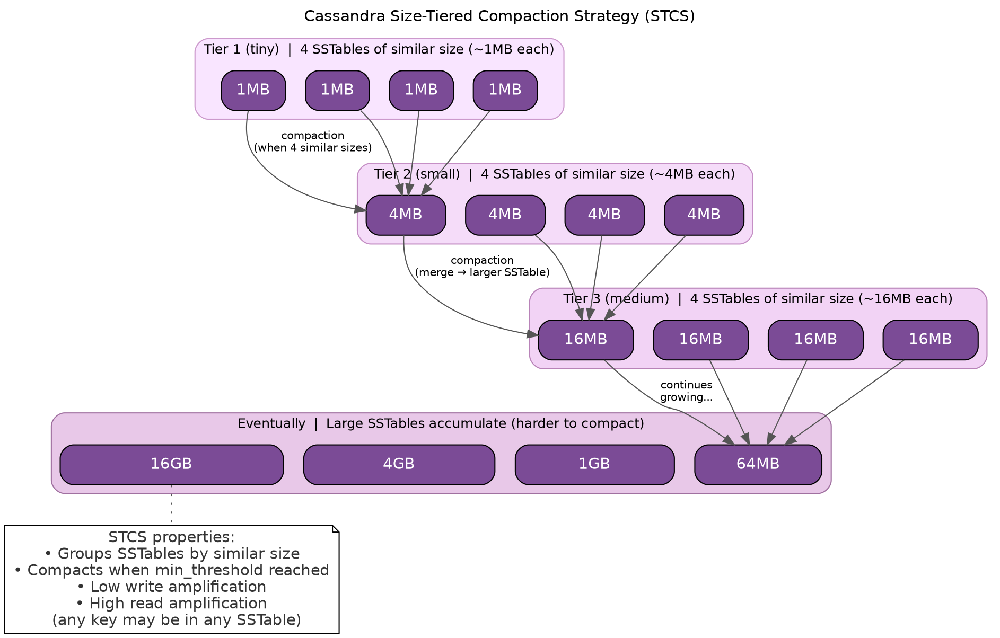

# Size-Tiered Compaction Strategy (STCS)

STCS is the default compaction strategy. It groups SSTables of similar size and compacts them together, optimizing for write throughput at the cost of read amplification.

---

## Background and History

### Origins

Size-Tiered Compaction Strategy is Cassandra's original compaction implementation, present since the earliest versions. It derives from classical LSM-tree (Log-Structured Merge-tree) compaction as described in the 1996 paper by O'Neil et al. The strategy was designed to optimize write throughput—a primary design goal for Cassandra's original use case as a high-volume write store.

STCS remained Cassandra's only compaction strategy until version 1.0 (October 2011), when Leveled Compaction Strategy was introduced to address STCS's read amplification problems.

### Design Philosophy

STCS follows a simple principle: minimize write amplification by only compacting SSTables of similar size together. This approach ensures that:

1. Small SSTables are compacted frequently (low cost per compaction)
2. Large SSTables are compacted infrequently (high cost but rare)
3. Each byte of data is rewritten approximately log(N) times over its lifetime

The trade-off is that partition keys are scattered across many SSTables, requiring reads to check multiple files.

---

## How STCS Works in Theory

### Core Concept

STCS organizes compaction around size similarity rather than key ranges or levels:

1. **Grouping**: SSTables are grouped into "buckets" based on size
2. **Threshold**: When a bucket contains `min_threshold` SSTables (default: 4), compaction is triggered
3. **Merging**: All SSTables in the bucket are merged into a single larger SSTable
4. **Growth**: The output SSTable joins a larger size bucket, and the process repeats



### Size Buckets

SSTables are assigned to buckets based on size similarity:

```
Bucket membership formula:
  average_size × bucket_low ≤ sstable_size ≤ average_size × bucket_high

Default values:
  bucket_low = 0.5
  bucket_high = 1.5

Example bucket with average 10MB:
  5MB ≤ sstable_size ≤ 15MB
```

SSTables outside this range form separate buckets. The `min_sstable_size` parameter (default 50MB) groups all smaller SSTables together, preventing proliferation of tiny SSTable buckets.

### Compaction Trigger

Compaction occurs when:

1. A bucket reaches `min_threshold` SSTables (default: 4)
2. The bucket is selected by the compaction scheduler
3. Up to `max_threshold` SSTables (default: 32) are included

The scheduler prioritizes buckets with more SSTables and considers the ratio of droppable tombstones.

### Write Amplification Calculation

STCS achieves logarithmic write amplification:

```
With min_threshold = 4:

Data progression:
  1MB × 4 → 4MB    (rewrite #1)
  4MB × 4 → 16MB   (rewrite #2)
  16MB × 4 → 64MB  (rewrite #3)
  64MB × 4 → 256MB (rewrite #4)
  ...

For N bytes of data:
  Write amplification ≈ log₄(N / flush_size)

Example: 1GB dataset with 1MB flushes
  log₄(1024) ≈ 5× write amplification
```

This is significantly lower than LCS's 10× per level amplification.

### Read Amplification Problem

The fundamental weakness of STCS is that any partition key may exist in any SSTable:

```
After extended operation, SSTables accumulate:
  [1MB] [4MB] [16MB] [64MB] [256MB] [1GB] [4GB]

Read for partition key K:
  1. Check bloom filter on each SSTable
  2. For positive results, read index and data
  3. Merge all fragments found

Worst case: Every SSTable contains data for K
  → 7+ disk reads for a single partition
```

Large SSTables compound this problem because they take longer to compact together, leading to long periods with many SSTables.

---

## Benefits

### Low Write Amplification

STCS minimizes how often data is rewritten:

- Logarithmic growth: ~5-10× total amplification for typical datasets
- SSD-friendly: Less wear compared to LCS
- Sustained write throughput: Compaction I/O remains bounded

### Simple and Predictable

The bucketing algorithm is straightforward:

- Easy to understand and debug
- Predictable compaction sizes
- No complex level management

### Efficient for Sequential Writes

Append-only and time-series patterns benefit from STCS:

- New data stays in small, recent SSTables
- Old data migrates to large SSTables
- Natural temporal locality

### Handles Variable Write Rates

STCS adapts to changing workloads:

- Burst writes: Small SSTables accumulate, compact later
- Steady writes: Regular compaction cadence
- Idle periods: Compaction catches up

---

## Drawbacks

### High Read Amplification

The primary cost of STCS is read performance:

- Point queries may touch many SSTables
- No upper bound on SSTable count
- P99 latency degrades as data ages

### Large SSTable Accumulation

Over time, large SSTables accumulate without compacting:

```
"The big SSTable problem":

To compact 4GB SSTables, need 4 of them = 16GB similar size
To compact 16GB SSTables, need 4 of them = 64GB similar size

These large SSTables may exist for months without partners,
degrading read performance throughout.
```

### High Space Amplification During Compaction

STCS requires temporary space during compaction:

```
Compacting 4 × 1GB SSTables:
  Before: 4GB used
  During: 4GB old + 4GB new = 8GB peak
  After:  4GB used

Requires 50%+ free space headroom
```

### Unpredictable Read Latency

SSTable count varies widely:

- After compaction: Few SSTables, fast reads
- Before compaction: Many SSTables, slow reads
- P99 latency fluctuates with compaction state

### Tombstone Accumulation

Deleted data persists until the containing SSTable compacts:

- Large SSTables hold tombstones for extended periods
- Space is not reclaimed promptly
- May cause "zombie data" issues if tombstones expire before compaction

---

## When to Use STCS

### Ideal Use Cases

| Workload Pattern | Why STCS Works |
|------------------|----------------|
| Write-heavy (>90% writes) | Low write amplification maximizes throughput |
| Append-only logs | Data rarely read, write cost dominates |
| Time-series ingestion | Natural size tiering as data ages |
| Batch ETL | Bulk writes followed by bulk reads |
| HDD storage | Sequential I/O patterns suit spinning disks |

### Avoid STCS When

| Workload Pattern | Why STCS Is Wrong |
|------------------|-------------------|
| Read-heavy (<30% writes) | Read amplification dominates performance |
| Point query latency matters | Unpredictable SSTable count |
| Frequently updated rows | Multiple versions scatter across SSTables |
| Limited disk space | Requires 50%+ headroom for compaction |
| Consistent latency required | P99 varies with compaction state |

---


digraph CassandraSTCS {
    rankdir=TB;
    labelloc="t";
    label="Cassandra Size-Tiered Compaction Strategy (STCS)";

    bgcolor="transparent";
    fontname="Helvetica";

    // Default SSTable style
    node [
        shape=box
        style="rounded,filled"
        fillcolor="#7B4B96"
        fontcolor="white"
        fontname="Helvetica"
        height=0.5
    ];

    // ----- Tier 1 (Tiny) -----
    subgraph cluster_T1 {
        label="Tier 1 (tiny)  |  4 SSTables of similar size (~1MB each)";
        labelloc="t";
        fontsize=12;
        style="rounded,filled";
        color="#CC99CC";
        fillcolor="#F9E5FF";

        T1_1 [label="1MB", width=0.8];
        T1_2 [label="1MB", width=0.8];
        T1_3 [label="1MB", width=0.8];
        T1_4 [label="1MB", width=0.8];

        { rank = same; T1_1; T1_2; T1_3; T1_4; }
    }

    // ----- Tier 2 (Small) -----
    subgraph cluster_T2 {
        label="Tier 2 (small)  |  4 SSTables of similar size (~4MB each)";
        labelloc="t";
        fontsize=12;
        style="rounded,filled";
        color="#C58FC5";
        fillcolor="#F5DCF9";

        T2_1 [label="4MB", width=1.0];
        T2_2 [label="4MB", width=1.0];
        T2_3 [label="4MB", width=1.0];
        T2_4 [label="4MB", width=1.0];

        { rank = same; T2_1; T2_2; T2_3; T2_4; }
    }

    // ----- Tier 3 (Medium) -----
    subgraph cluster_T3 {
        label="Tier 3 (medium)  |  4 SSTables of similar size (~16MB each)";
        labelloc="t";
        fontsize=12;
        style="rounded,filled";
        color="#B883B8";
        fillcolor="#F2D3F5";

        T3_1 [label="16MB", width=1.2];
        T3_2 [label="16MB", width=1.2];
        T3_3 [label="16MB", width=1.2];
        T3_4 [label="16MB", width=1.2];

        { rank = same; T3_1; T3_2; T3_3; T3_4; }
    }

    // ----- Large SSTables -----
    subgraph cluster_Large {
        label="Eventually  |  Large SSTables accumulate (harder to compact)";
        labelloc="t";
        fontsize=12;
        style="rounded,filled";
        color="#A070A0";
        fillcolor="#E8C8E8";

        L1 [label="64MB", width=1.6];
        L2 [label="1GB", width=2.0];
        L3 [label="4GB", width=2.4];
        L4 [label="16GB", width=2.8];

        { rank = same; L1; L2; L3; L4; }
    }

    // ----- Compaction flow arrows -----
    edge [fontname="Helvetica", fontsize=10, color="#555555"];

    // Tier 1 -> Tier 2 compaction
    T1_1 -> T2_1 [label="compaction\n(when 4 similar sizes)"];
    T1_2 -> T2_1;
    T1_3 -> T2_1;
    T1_4 -> T2_1;

    // Tier 2 -> Tier 3 compaction
    T2_1 -> T3_1 [label="compaction\n(merge → larger SSTable)"];
    T2_2 -> T3_1;
    T2_3 -> T3_1;
    T2_4 -> T3_1;

    // Tier 3 -> Large (exponential growth)
    T3_1 -> L1 [label="continues\ngrowing..."];
    T3_2 -> L1;
    T3_3 -> L1;
    T3_4 -> L1;

    // ----- Side note -----
    Note [shape=note,
          style="filled",
          fillcolor="#FFFFFF",
          fontcolor="#333333",
          label="STCS properties:\n• Groups SSTables by similar size\n• Compacts when min_threshold reached\n• Low write amplification\n• High read amplification\n  (any key may be in any SSTable)"];

    L4 -> Note [style=dotted, arrowhead=none];
}
```

## Bucketing Logic

SSTables are grouped into "buckets" based on size similarity:

```
Bucket boundaries determined by bucket_high and bucket_low:

Average size of bucket: X
- Include SSTables from X × bucket_low to X × bucket_high
- Default: 0.5X to 1.5X

Example with 10MB average:
- Include: 5MB to 15MB SSTables
- Exclude: 4MB (too small), 20MB (too large)

When a bucket reaches min_threshold SSTables, compact them.
```

---

## Configuration

```sql
CREATE TABLE my_table (
    id uuid PRIMARY KEY,
    data text
) WITH compaction = {
    'class': 'SizeTieredCompactionStrategy',

    -- Minimum SSTables to trigger compaction
    -- Lower = more frequent compaction, fewer SSTables
    -- Higher = less compaction, more SSTables
    'min_threshold': 4,  -- Default: 4

    -- Maximum SSTables per compaction
    -- Limits peak I/O and memory usage
    'max_threshold': 32,  -- Default: 32

    -- Size ratio for grouping into buckets
    -- SSTables within bucket_low to bucket_high ratio are grouped
    'bucket_high': 1.5,  -- Default: 1.5
    'bucket_low': 0.5,   -- Default: 0.5

    -- Minimum SSTable size to consider for compaction
    -- Smaller SSTables are grouped together first
    'min_sstable_size': 50  -- Default: 50MB
};
```

### Configuration Parameters

| Parameter | Default | Description |
|-----------|---------|-------------|
| `min_threshold` | 4 | Minimum SSTables in a bucket to trigger compaction |
| `max_threshold` | 32 | Maximum SSTables to compact at once |
| `bucket_high` | 1.5 | Upper bound multiplier for bucket membership |
| `bucket_low` | 0.5 | Lower bound multiplier for bucket membership |
| `min_sstable_size` | 50MB | SSTables below this size are bucketed together |

---

## Write Amplification Analysis

```
With min_threshold = 4 and tiered growth:

Level 0: 4 × 1MB SSTables → compact → 4MB
Level 1: 4 × 4MB SSTables → compact → 16MB
Level 2: 4 × 16MB SSTables → compact → 64MB
Level 3: 4 × 64MB SSTables → compact → 256MB
...

For 1GB of data to reach final state:
- Write to memtable (1x)
- Flush to 1MB SSTables (1x)
- Compact to 4MB (2x)
- Compact to 16MB (3x)
- Compact to 64MB (4x)
- Compact to 256MB (5x)
- Compact to 1GB (6x)

Total write amplification: ~6x (logarithmic in data size)
```

This logarithmic write amplification is significantly lower than LCS, making STCS suitable for write-heavy workloads.

---

## Read Amplification Problem

The primary weakness of STCS is read amplification from large SSTable accumulation:

```
The "big SSTable problem":

After extended operation:
[1MB] [4MB] [16MB] [64MB] [256MB] [1GB] [4GB] [16GB]

Every read must check ALL these SSTables.

Why large SSTables do not compact:
- 4 × 16GB SSTables needed to trigger compaction
- That requires 64GB of SSTables at similar size
- Until then, they remain, degrading read performance
```

### Read Path Impact

```
Single partition read with 8 SSTables:

1. Bloom filter checks: 8 × ~0.1ms = 0.8ms
2. Index lookups for positive blooms: ~4 × 0.5ms = 2ms
3. Data reads: ~4 × 1ms = 4ms
4. Merge results

Total: ~7ms for a single partition

Compare to LCS with ~9 SSTable maximum: More predictable latency
```

---

## When to Use STCS

### Recommended For

| Use Case | Rationale |
|----------|-----------|
| Write-heavy workloads (>90% writes) | Low write amplification |
| Append-only data (logs, events) | Data rarely updated or read |
| Batch ingestion followed by reads | Compaction catches up during read phase |
| HDD storage | Sequential I/O friendly |
| Write latency priority | Minimal write path overhead |

### Avoid When

| Use Case | Rationale |
|----------|-----------|
| Read-heavy workloads | High read amplification |
| Frequently updated data | Multiple versions accumulate |
| Consistent read latency required | SSTable count varies widely |
| SSD storage with read focus | LCS better utilizes SSD characteristics |

---

## Production Issues

### Issue 1: Large SSTable Accumulation

**Symptoms:**

- Read latency increasing over months
- Many large SSTables visible in tablestats
- Bloom filter false positive rate increasing

**Diagnosis:**

```bash
# Check SSTable sizes and counts
nodetool tablestats keyspace.table

# Look for large SSTables with no compaction partners
ls -lhS /var/lib/cassandra/data/keyspace/table-*/
```

**Solutions:**

1. Run major compaction during maintenance window:
   ```bash
   nodetool compact keyspace table
   ```

2. Lower `min_threshold` to trigger compaction sooner:
   ```sql
   ALTER TABLE keyspace.table WITH compaction = {
       'class': 'SizeTieredCompactionStrategy',
       'min_threshold': 2
   };
   ```

3. Consider switching to LCS if reads are important

### Issue 2: Temporary Space During Compaction

STCS can require up to 2x disk space temporarily:

```
Before: [1GB] [1GB] [1GB] [1GB]  = 4GB
During: [1GB] [1GB] [1GB] [1GB] + [4GB being written] = 8GB
After:  [4GB] = 4GB
```

**Guideline:** Maintain at least 50% free disk space with STCS.

**Mitigation:**

```bash
# Check available space before major operations
df -h /var/lib/cassandra/data

# Monitor during compaction
watch 'df -h /var/lib/cassandra/data && nodetool compactionstats'
```

### Issue 3: Uneven SSTable Sizes

**Symptoms:**

- Some tables have many small SSTables that never compact
- Others have few large SSTables

**Causes:**

- Varying write patterns across tables
- `min_sstable_size` preventing small SSTable compaction
- Bucket boundaries excluding certain sizes

**Solutions:**

```sql
-- Adjust bucket boundaries for more inclusive grouping
ALTER TABLE keyspace.table WITH compaction = {
    'class': 'SizeTieredCompactionStrategy',
    'bucket_high': 2.0,
    'bucket_low': 0.33
};

-- Lower minimum size threshold
ALTER TABLE keyspace.table WITH compaction = {
    'class': 'SizeTieredCompactionStrategy',
    'min_sstable_size': 10
};
```

---

## Tuning Recommendations

### High Write Throughput

```sql
ALTER TABLE keyspace.table WITH compaction = {
    'class': 'SizeTieredCompactionStrategy',
    'min_threshold': 4,
    'max_threshold': 64  -- Allow larger compactions
};
```

### Reduce SSTable Count

```sql
ALTER TABLE keyspace.table WITH compaction = {
    'class': 'SizeTieredCompactionStrategy',
    'min_threshold': 2,  -- Compact sooner
    'bucket_high': 2.0,  -- Wider buckets
    'bucket_low': 0.33
};
```

### Large Dataset (Minimize Compaction I/O)

```sql
ALTER TABLE keyspace.table WITH compaction = {
    'class': 'SizeTieredCompactionStrategy',
    'min_threshold': 8,   -- Fewer, larger compactions
    'max_threshold': 16
};
```

---

## Monitoring STCS

### Key Indicators

| Metric | Healthy | Investigate |
|--------|---------|-------------|
| SSTable count | <20 | >30 |
| Largest SSTable | <10% of total | >25% of total |
| Pending compactions | <10 | >50 |
| Read latency P99 | Stable | Increasing over time |

### Commands

```bash
# SSTable count and sizes
nodetool tablestats keyspace.table | grep -E "SSTable count|Space used"

# Check for compaction activity
nodetool compactionstats

# Analyze SSTable size distribution
ls -lh /var/lib/cassandra/data/keyspace/table-*/*-Data.db | \
    awk '{print $5}' | sort | uniq -c
```

---

## Related Documentation

- **[Compaction Overview](index.md)** - Concepts and strategy selection
- **[Leveled Compaction (LCS)](lcs.md)** - Alternative for read-heavy workloads
- **[Compaction Management](../../../operations/compaction-management/index.md)** - Tuning and troubleshooting
