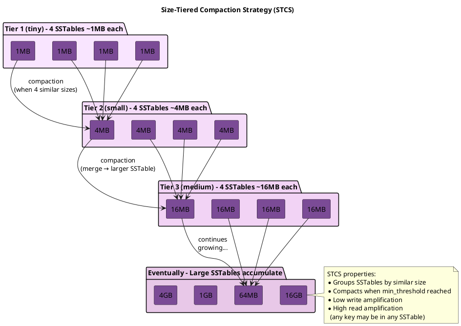

# Size-Tiered Compaction Strategy (STCS)

!!! note "Cassandra 5.0+"
    Starting with Cassandra 5.0, [Unified Compaction Strategy (UCS)](ucs.md) is the recommended compaction strategy for most workloads. UCS provides adaptive behavior that can emulate STCS characteristics when appropriate. STCS remains fully supported and is still the default for tables in earlier versions.

STCS is Cassandra's original and default compaction strategy. It groups SSTables of similar size and compacts them together, optimizing for write throughput at the cost of read amplification.

---

## Background and History

### Origins

Size-Tiered Compaction Strategy is Cassandra's original compaction implementation, present since the earliest versions. It derives from classical LSM-tree (Log-Structured Merge-tree) compaction as described in the 1996 paper by O'Neil et al. The strategy was designed to optimize write throughput—a primary design goal for Cassandra's original use case as a high-volume write store.

STCS remained Cassandra's only compaction strategy until version 1.0 (October 2011), when Leveled Compaction Strategy was introduced to address STCS's read amplification problems.

### Design Philosophy

STCS follows a simple principle: minimize write amplification by only compacting SSTables of similar size together. This approach ensures that:

1. Small SSTables are compacted frequently (low cost per compaction)
2. Large SSTables are compacted infrequently (high cost but rare)
3. Each byte of data is rewritten approximately log(N) times over its lifetime

The trade-off is that partition keys are scattered across many SSTables, requiring reads to check multiple files.

---

## How STCS Works in Theory

### Core Concept

STCS organizes compaction around size similarity rather than key ranges or levels:

1. **Grouping**: SSTables are grouped into "buckets" based on size
2. **Threshold**: When a bucket contains `min_threshold` SSTables (default: 4), compaction is triggered
3. **Merging**: All SSTables in the bucket are merged into a single larger SSTable
4. **Growth**: The output SSTable joins a larger size bucket, and the process repeats



### Size Buckets

SSTables are assigned to buckets based on size similarity:

$$\bar{s} \times b_{\text{low}} \leq s \leq \bar{s} \times b_{\text{high}}$$

Where:

- $s$ = SSTable size
- $\bar{s}$ = average size of SSTables in the bucket
- $b_{\text{low}}$ = `bucket_low` (default: 0.5)
- $b_{\text{high}}$ = `bucket_high` (default: 1.5)

**Example:** Bucket with $\bar{s} = 10\text{MB}$:

$$5\text{MB} \leq s \leq 15\text{MB}$$

SSTables outside this range form separate buckets. The `min_sstable_size` parameter (default 50MB) groups all smaller SSTables together, preventing proliferation of tiny SSTable buckets.

### Compaction Trigger and Bucket Selection

Compaction occurs when:

1. A bucket reaches `min_threshold` SSTables (default: 4)
2. The bucket is selected by the compaction scheduler based on "hotness"
3. Up to `max_threshold` SSTables (default: 32) are included

#### Hotness-Based Bucket Prioritization

When multiple buckets are eligible for compaction, STCS selects the "hottest" bucket using a read-intensity metric:

$$\text{hotness} = \frac{\text{readMeter.twoHourRate()}}{\text{estimatedKeys()}}$$

This formula measures recent read activity (two-hour rate) divided by the number of keys in the SSTable. The bucket with the highest aggregate hotness is selected first, ensuring that frequently-read data is compacted and consolidated sooner.

**Tie-breaking:** When buckets have equal hotness, STCS prioritizes buckets with smaller average file size to reduce compaction I/O.

#### Tombstone Compaction Fallback

If no standard compaction candidates exist (no bucket meets `min_threshold`), STCS falls back to single-SSTable tombstone compaction:

1. Scans SSTables for droppable tombstone ratio exceeding `tombstone_threshold` (default: 0.2)
2. Selects the largest eligible SSTable
3. Rewrites it to purge tombstones

This ensures tombstones are eventually reclaimed even when SSTables lack compaction partners.

### Write Amplification Calculation

STCS achieves logarithmic write amplification:

**Data progression with $t = 4$ (min_threshold):**

| Step | Input | Output |
|------|-------|--------|
| 1 | $4 \times 1\text{MB}$ | 4 MB |
| 2 | $4 \times 4\text{MB}$ | 16 MB |
| 3 | $4 \times 16\text{MB}$ | 64 MB |
| 4 | $4 \times 64\text{MB}$ | 256 MB |

**Write amplification formula:**

$$W \approx \log_t \left( \frac{N}{s_f} \right)$$

Where:

- $W$ = write amplification
- $t$ = `min_threshold` (default: 4)
- $N$ = total data size
- $s_f$ = flush size

**Example:** 1GB dataset with 1MB flushes:

$$W = \log_4(1024) \approx 5\times$$

This is significantly lower than LCS's $10\times$ per level amplification.

### Read Amplification Problem

The fundamental weakness of STCS is that any partition key may exist in any SSTable:

```
After extended operation, SSTables accumulate:
  [1MB] [4MB] [16MB] [64MB] [256MB] [1GB] [4GB]

Read for partition key K:
  1. Check bloom filter on each SSTable
  2. For positive results, read index and data
  3. Merge all fragments found

Worst case: Every SSTable contains data for K
  → 7+ disk reads for a single partition
```

Large SSTables compound this problem because they take longer to compact together, leading to long periods with many SSTables.

---

## Benefits

### Low Write Amplification

STCS minimizes how often data is rewritten:

- Logarithmic growth: ~5-10× total amplification for typical datasets
- SSD-friendly: Less wear compared to LCS
- Sustained write throughput: Compaction I/O remains bounded

### Simple and Predictable

The bucketing algorithm is straightforward:

- Easy to understand and debug
- Predictable compaction sizes
- No complex level management

### Efficient for Sequential Writes

Append-only and time-series patterns benefit from STCS:

- New data stays in small, recent SSTables
- Old data migrates to large SSTables
- Natural temporal locality

### Handles Variable Write Rates

STCS adapts to changing workloads:

- Burst writes: Small SSTables accumulate, compact later
- Steady writes: Regular compaction cadence
- Idle periods: Compaction catches up

---

## Drawbacks

### High Read Amplification

The primary cost of STCS is read performance:

- Point queries may touch many SSTables
- No upper bound on SSTable count
- P99 latency degrades as data ages

### Large SSTable Accumulation

Over time, large SSTables accumulate without compacting:

```
"The big SSTable problem":

To compact 4GB SSTables, need 4 of them = 16GB similar size
To compact 16GB SSTables, need 4 of them = 64GB similar size

These large SSTables may exist for months without partners,
degrading read performance throughout.
```

### High Space Amplification During Compaction

STCS requires temporary space during compaction:

```
Compacting 4 × 1GB SSTables:
  Before: 4GB used
  During: 4GB old + 4GB new = 8GB peak
  After:  4GB used

Requires 50%+ free space headroom
```

### Unpredictable Read Latency

SSTable count varies widely:

- After compaction: Few SSTables, fast reads
- Before compaction: Many SSTables, slow reads
- P99 latency fluctuates with compaction state

### Tombstone Accumulation

Deleted data persists until the containing SSTable compacts:

- Large SSTables hold tombstones for extended periods
- Space is not reclaimed promptly
- May cause "zombie data" issues if tombstones expire before compaction

---

## When to Use STCS

### Ideal Use Cases

| Workload Pattern | Why STCS Works |
|------------------|----------------|
| Write-heavy (>90% writes) | Low write amplification maximizes throughput |
| Append-only logs | Data rarely read, write cost dominates |
| Time-series ingestion | Natural size tiering as data ages |
| Batch ETL | Bulk writes followed by bulk reads |
| HDD storage | Sequential I/O patterns suit spinning disks |

### Avoid STCS When

| Workload Pattern | Why STCS Is Wrong |
|------------------|-------------------|
| Read-heavy (<30% writes) | Read amplification dominates performance |
| Point query latency matters | Unpredictable SSTable count |
| Frequently updated rows | Multiple versions scatter across SSTables |
| Limited disk space | Requires 50%+ headroom for compaction |
| Consistent latency required | P99 varies with compaction state |

---

## Bucketing Logic

SSTables are grouped into "buckets" based on size similarity:

```
Bucket boundaries determined by bucket_high and bucket_low:

Average size of bucket: X
- Include SSTables from X × bucket_low to X × bucket_high
- Default: 0.5X to 1.5X

Example with 10MB average:
- Include: 5MB to 15MB SSTables
- Exclude: 4MB (too small), 20MB (too large)

When a bucket reaches min_threshold SSTables, compact them.
```

---

## Configuration

```sql
CREATE TABLE my_table (
    id uuid PRIMARY KEY,
    data text
) WITH compaction = {
    'class': 'SizeTieredCompactionStrategy',

    -- Minimum SSTables to trigger compaction
    -- Lower = more frequent compaction, fewer SSTables
    -- Higher = less compaction, more SSTables
    'min_threshold': 4,  -- Default: 4

    -- Maximum SSTables per compaction
    -- Limits peak I/O and memory usage
    'max_threshold': 32,  -- Default: 32

    -- Size ratio for grouping into buckets
    -- SSTables within bucket_low to bucket_high ratio are grouped
    'bucket_high': 1.5,  -- Default: 1.5
    'bucket_low': 0.5,   -- Default: 0.5

    -- Minimum SSTable size to consider for compaction
    -- Smaller SSTables are grouped together first
    'min_sstable_size': 50  -- Default: 50MB
};
```

### Configuration Parameters

#### STCS-Specific Options

| Parameter | Default | Description |
|-----------|---------|-------------|
| `min_threshold` | 4 | Minimum SSTables in a bucket to trigger compaction. Lower values reduce SSTable count but increase compaction frequency. |
| `max_threshold` | 32 | Maximum SSTables to compact at once. Limits peak I/O and memory usage during compaction. |
| `bucket_high` | 1.5 | Upper bound multiplier for bucket membership. An SSTable joins a bucket if its size ≤ average × bucket_high. Must be > bucket_low. |
| `bucket_low` | 0.5 | Lower bound multiplier for bucket membership. An SSTable joins a bucket if its size ≥ average × bucket_low. |
| `min_sstable_size` | 50 MB | SSTables below this size are grouped together regardless of the bucket_low/bucket_high ratio. Prevents proliferation of tiny-SSTable buckets. |

#### Common Compaction Options

These options apply to all compaction strategies:

| Parameter | Default | Description |
|-----------|---------|-------------|
| `enabled` | true | Enables background compaction. When false, automatic compaction is disabled but configuration is retained. |
| `tombstone_threshold` | 0.2 | Ratio of droppable tombstones that triggers single-SSTable compaction. Value of 0.2 means 20% tombstones. |
| `tombstone_compaction_interval` | 86400 | Minimum seconds between tombstone compaction attempts for the same SSTable. |
| `unchecked_tombstone_compaction` | false | Bypasses pre-checking for tombstone compaction eligibility. Tombstones are still only dropped when safe. |
| `only_purge_repaired_tombstones` | false | Only purge tombstones from repaired SSTables. Prevents data resurrection in clusters with inconsistent repair. |
| `log_all` | false | Enables detailed compaction logging to a separate log file. |

#### Validation Constraints

The following constraints are enforced during configuration:

- `bucket_high` must be strictly greater than `bucket_low`
- `min_sstable_size` must be non-negative
- `min_threshold` must be ≥ 2
- `max_threshold` must be ≥ `min_threshold`

---

## Write Amplification Analysis

**Tiered growth with $t = 4$ (min_threshold):**

| Tier | Input | Output |
|------|-------|--------|
| 0 | $4 \times 1\text{MB}$ | 4 MB |
| 1 | $4 \times 4\text{MB}$ | 16 MB |
| 2 | $4 \times 16\text{MB}$ | 64 MB |
| 3 | $4 \times 64\text{MB}$ | 256 MB |

**For 1GB of data to reach final state:**

| Step | Operation | Cumulative Writes |
|------|-----------|-------------------|
| 1 | Write to memtable | $1\times$ |
| 2 | Flush to 1MB SSTables | $1\times$ |
| 3 | Compact to 4MB | $2\times$ |
| 4 | Compact to 16MB | $3\times$ |
| 5 | Compact to 64MB | $4\times$ |
| 6 | Compact to 256MB | $5\times$ |
| 7 | Compact to 1GB | $6\times$ |

**Total:** $W \approx 6\times$ (logarithmic in data size)

This logarithmic write amplification is significantly lower than LCS, making STCS suitable for write-heavy workloads.

---

## Read Amplification Problem

The primary weakness of STCS is read amplification from large SSTable accumulation:

**The "big SSTable problem":**

After extended operation, SSTables of various sizes accumulate:

$$\{1\text{MB}, 4\text{MB}, 16\text{MB}, 64\text{MB}, 256\text{MB}, 1\text{GB}, 4\text{GB}, 16\text{GB}\}$$

Every read must check ALL these SSTables.

**Why large SSTables do not compact:**

- $4 \times 16\text{GB}$ SSTables needed to trigger compaction
- That requires 64GB of SSTables at similar size
- Until then, they remain, degrading read performance

### Read Path Impact

**Single partition read with 8 SSTables:**

| Operation | Calculation | Time |
|-----------|-------------|------|
| Bloom filter checks | $8 \times 0.1\text{ms}$ | 0.8 ms |
| Index lookups (4 positive) | $4 \times 0.5\text{ms}$ | 2.0 ms |
| Data reads | $4 \times 1\text{ms}$ | 4.0 ms |
| Merge results | — | — |
| **Total** | | **~7 ms** |

Compare to LCS with $\sim 9$ SSTable maximum: More predictable latency.

---

## Production Issues

### Issue 1: Large SSTable Accumulation

**Symptoms:**

- Read latency increasing over months
- Many large SSTables visible in tablestats
- Bloom filter false positive rate increasing

**Diagnosis:**

```bash
# Check SSTable sizes and counts
nodetool tablestats keyspace.table

# Look for large SSTables with no compaction partners
ls -lhS /var/lib/cassandra/data/keyspace/table-*/
```

**Solutions:**

1. Run major compaction during maintenance window:
   ```bash
   nodetool compact keyspace table
   ```

2. Lower `min_threshold` to trigger compaction sooner:
   ```sql
   ALTER TABLE keyspace.table WITH compaction = {
       'class': 'SizeTieredCompactionStrategy',
       'min_threshold': 2
   };
   ```

3. Consider switching to LCS if reads are important

### Issue 2: Temporary Space During Compaction

STCS can require up to 2x disk space temporarily:

```
Before: [1GB] [1GB] [1GB] [1GB]  = 4GB
During: [1GB] [1GB] [1GB] [1GB] + [4GB being written] = 8GB
After:  [4GB] = 4GB
```

**Guideline:** Maintain at least 50% free disk space with STCS.

**Mitigation:**

```bash
# Check available space before major operations
df -h /var/lib/cassandra/data

# Monitor during compaction
watch 'df -h /var/lib/cassandra/data && nodetool compactionstats'
```

### Issue 3: Uneven SSTable Sizes

**Symptoms:**

- Some tables have many small SSTables that never compact
- Others have few large SSTables

**Causes:**

- Varying write patterns across tables
- `min_sstable_size` preventing small SSTable compaction
- Bucket boundaries excluding certain sizes

**Solutions:**

```sql
-- Adjust bucket boundaries for more inclusive grouping
ALTER TABLE keyspace.table WITH compaction = {
    'class': 'SizeTieredCompactionStrategy',
    'bucket_high': 2.0,
    'bucket_low': 0.33
};

-- Lower minimum size threshold
ALTER TABLE keyspace.table WITH compaction = {
    'class': 'SizeTieredCompactionStrategy',
    'min_sstable_size': 10
};
```

---

## Tuning Recommendations

### High Write Throughput

```sql
ALTER TABLE keyspace.table WITH compaction = {
    'class': 'SizeTieredCompactionStrategy',
    'min_threshold': 4,
    'max_threshold': 64  -- Allow larger compactions
};
```

### Reduce SSTable Count

```sql
ALTER TABLE keyspace.table WITH compaction = {
    'class': 'SizeTieredCompactionStrategy',
    'min_threshold': 2,  -- Compact sooner
    'bucket_high': 2.0,  -- Wider buckets
    'bucket_low': 0.33
};
```

### Large Dataset (Minimize Compaction I/O)

```sql
ALTER TABLE keyspace.table WITH compaction = {
    'class': 'SizeTieredCompactionStrategy',
    'min_threshold': 8,   -- Fewer, larger compactions
    'max_threshold': 16
};
```

---

## Monitoring STCS

### Key Indicators

| Metric | Healthy | Investigate |
|--------|---------|-------------|
| SSTable count | <20 | >30 |
| Largest SSTable | <10% of total | >25% of total |
| Pending compactions | <10 | >50 |
| Read latency P99 | Stable | Increasing over time |

### Commands

```bash
# SSTable count and sizes
nodetool tablestats keyspace.table | grep -E "SSTable count|Space used"

# Check for compaction activity
nodetool compactionstats

# Analyze SSTable size distribution
ls -lh /var/lib/cassandra/data/keyspace/table-*/*-Data.db | \
    awk '{print $5}' | sort | uniq -c
```

---

## Implementation Internals

This section documents implementation details from the Cassandra source code.

### Bucket Formation Algorithm

The bucket formation algorithm processes SSTables in a specific order:

1. **Sort SSTables** by on-disk size in ascending order (for deterministic results)
2. **For each SSTable**, attempt to match to an existing bucket:
   - Match if: `bucket_avg × bucket_low ≤ sstable_size ≤ bucket_avg × bucket_high`
   - OR if both SSTable and bucket average are below `min_sstable_size`
3. **Recalculate bucket average** when adding new SSTables
4. **Create new bucket** for unmatched SSTables

### Task Estimation

The estimated number of pending compaction tasks is calculated as:

```
For each bucket meeting min_threshold:
    tasks += ceil(bucket.size() / max_threshold)
```

### Hotness Calculation Details

SSTable hotness is computed using read meter statistics:

```java
hotness = (readMeter != null)
    ? readMeter.twoHourRate() / estimatedKeys()
    : 0.0
```

SSTables without read meters (e.g., newly flushed) have zero hotness, causing them to be deprioritized unless they form the only eligible bucket.

### Constants Reference

| Constant | Value | Description |
|----------|-------|-------------|
| Default min_threshold | 4 | Minimum SSTables per bucket |
| Default max_threshold | 32 | Maximum SSTables per compaction |
| Default bucket_low | 0.5 | Lower size ratio bound |
| Default bucket_high | 1.5 | Upper size ratio bound |
| Default min_sstable_size | 50 MiB | Small SSTable grouping threshold |

---

## Related Documentation

- **[Compaction Overview](index.md)** - Concepts and strategy selection
- **[Leveled Compaction (LCS)](lcs.md)** - Alternative for read-heavy workloads
- **[Time-Window Compaction (TWCS)](twcs.md)** - Optimized for time-series data with TTL
- **[Unified Compaction (UCS)](ucs.md)** - Recommended strategy for Cassandra 5.0+
- **[Compaction Management](../../../operations/compaction-management/index.md)** - Tuning and troubleshooting
