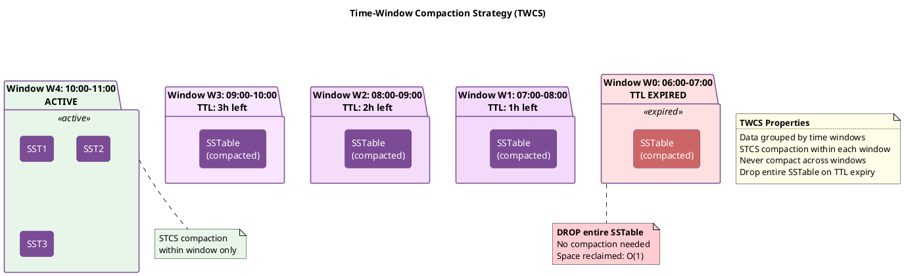
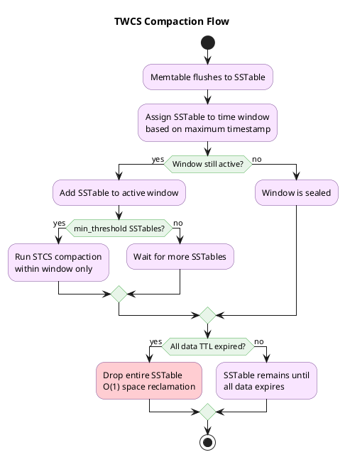

# Time-Window Compaction Strategy (TWCS)

!!! warning "Append-Only Workloads Only"
    TWCS is designed exclusively for **immutable, append-only time-series data**. Once data is written, it must never be updated. Updates to existing rows create new SSTables in the current time window while original data remains in older windows—these versions never merge through compaction, causing read amplification and preventing efficient space reclamation.

!!! danger "Do Not Use DELETE Statements"
    Avoid explicit `DELETE` operations with TWCS. Tombstones are written to the current window while the data they mark for deletion exists in older windows. Since TWCS never compacts across window boundaries, tombstones and their target data never meet, preventing proper space reclamation. Use TTL-based expiration instead.

TWCS is designed for time-series data. It groups SSTables by time window and never compacts across window boundaries, enabling efficient space reclamation when data expires via TTL.

---

## Background and History

### Origins

Time-Window Compaction Strategy was introduced in Cassandra 3.0.8/3.8 (2016) to address the inefficiency of STCS and LCS for time-series workloads with TTL. It evolved from DateTieredCompactionStrategy (DTCS), which was introduced in Cassandra 2.0.11/2.1.1 but proved problematic in production due to complexity and edge cases.

TWCS simplified the time-based approach: rather than complex tiering by age, it uses fixed-size time windows. This design made behavior predictable and eliminated many DTCS edge cases.

### Design Motivation

Time-series data has unique characteristics that STCS and LCS handle poorly:

1. **Append-only writes**: Data is written once and never updated
2. **Time-ordered access**: Queries typically request recent data or specific time ranges
3. **Uniform expiration**: Data often expires after a fixed retention period (TTL)
4. **High volume**: Continuous streams of measurements, events, or logs

With STCS, expired data requires compaction to reclaim space—expensive for large datasets. With LCS, the leveled structure provides no benefit since time-series queries don't need key-range organization.

TWCS addresses these issues by:

- Grouping data into time-based windows
- Never compacting across window boundaries
- Enabling entire SSTables to be dropped when all data expires

| Aspect | STCS | LCS | TWCS |
|--------|------|-----|------|
| Space reclamation | Requires compaction | Requires compaction | Drop entire SSTable |
| TTL efficiency | Poor (scattered data) | Poor (spread across levels) | Excellent (window-aligned) |
| Time-range queries | No optimization | No optimization | Natural data locality |
| Write amplification | Low | High | Low |

---

## How TWCS Works in Theory

### Core Concept

TWCS organizes compaction around time windows:

1. **Window assignment**: Each SSTable is assigned to a window based on its maximum timestamp
2. **Intra-window compaction**: Within each window, STCS-style compaction merges SSTables
3. **No cross-window compaction**: SSTables from different windows are never merged
4. **Window expiration**: When all data in a window's SSTables expires, the entire SSTable is dropped

### Time Window Structure



### Window Assignment Algorithm

Each SSTable is assigned to exactly one window based on its maximum timestamp:

```
SSTable metadata:
  Minimum timestamp: 2024-01-15 10:23:45
  Maximum timestamp: 2024-01-15 10:58:12

Window configuration:
  compaction_window_unit: HOURS
  compaction_window_size: 1

Calculation:
  Window start = floor(max_timestamp / window_size) × window_size
  Window start = floor(10:58:12 / 1 hour) × 1 hour
  Window start = 10:00:00

Result: SSTable assigned to window [10:00:00 - 11:00:00)
```

Using maximum timestamp ensures that all data in the SSTable falls within or before the assigned window.

### Intra-Window Compaction

Within each window, TWCS uses STCS-style compaction:

1. SSTables in the same window are grouped by size
2. When `min_threshold` similar-sized SSTables exist, they compact
3. The compacted SSTable remains in the same window
4. Ideally, each completed window has one large SSTable

### TTL and Space Reclamation

The key advantage of TWCS is efficient space reclamation:

```
Without TWCS (STCS/LCS):
  - Data from Hour 1 is scattered across many SSTables
  - When Hour 1 TTL expires, must compact to remove
  - Compaction rewrites all surviving data
  - Space reclamation: O(n) where n = data size

With TWCS:
  - Hour 1 data is in Hour 1 window's SSTables only
  - When TTL expires, check if all data in SSTable is expired
  - If yes, drop entire SSTable (no compaction)
  - Space reclamation: O(1)
```

---

## Benefits

### Efficient TTL Expiration

TWCS's primary advantage is space reclamation without compaction:

- Expired SSTables are dropped entirely
- No I/O cost for removing old data
- Predictable disk space recovery

### Low Write Amplification

Similar to STCS, TWCS has low write amplification:

- Data is written once to initial SSTable
- Compacted only within its window (typically once)
- Total write amplification: ~2× (initial write + one compaction)

### Time-Based Data Locality

Queries for time ranges benefit from data organization:

- Recent data in recent windows (likely in cache)
- Historical queries touch specific windows
- Reduced SSTable overlap for time-range scans

### Predictable Behavior

Fixed window sizes make operations predictable:

- Know exactly when windows close
- Estimate when space will be reclaimed
- Plan capacity based on retention period

### Reduced Compaction I/O

By avoiding cross-window compaction:

- Less total data movement
- Compaction confined to active window
- Old windows are read-only

---

## Drawbacks

### Requires Append-Only Workload

TWCS assumes data is never updated:

- Updates to old data create new SSTables in current window
- Original data in old window never merges with update
- Both versions persist until TTL expires

### Sensitive to Out-of-Order Writes

Late-arriving data causes problems:

```
Current window: Hour 10
Late write arrives for Hour 5

Result:
  - New SSTable created in Hour 5 window
  - Hour 5 window now has multiple SSTables
  - These may not compact together (different sizes)
  - When Hour 5 TTL expires, some SSTables may not be fully expired
```

### Tombstone Inefficiency

Explicit deletes (DELETE statements) are problematic:

- Tombstone written to current window
- Original data in old window
- Tombstone and data never meet in compaction
- Must wait for both to expire via TTL

### Requires Careful Window Sizing

Window size significantly impacts behavior:

- Too small: Many windows, many SSTables, overhead
- Too large: Less efficient space reclamation timing
- Must match data patterns and TTL

### Not Suitable for All Time-Series

Some time-series patterns don't fit:

- Data without TTL (windows accumulate forever)
- Frequently corrected/updated data
- Heavy delete workloads

---

## When to Use TWCS

### Ideal Use Cases

| Workload Pattern | Why TWCS Works |
|------------------|----------------|
| IoT sensor data | Append-only, TTL-based retention |
| Application metrics | Time-ordered, fixed retention |
| Log aggregation | Immutable events, time-based queries |
| Financial tick data | Sequential writes, regulatory retention |
| Monitoring data | High volume, predictable expiration |

### Avoid TWCS When

| Workload Pattern | Why TWCS Is Wrong |
|------------------|-------------------|
| Mutable data | Updates span windows |
| No TTL defined | Windows accumulate indefinitely |
| Heavy delete workload | Tombstones don't meet data |
| Significant out-of-order writes | Windows never fully compact |
| Non-time-based access patterns | No benefit from time organization |

---

## How TWCS Works



### Window Assignment

Each SSTable is assigned to a time window based on its maximum timestamp:

```
SSTable with data timestamps:
- Min timestamp: 2024-01-15 10:30:00
- Max timestamp: 2024-01-15 10:45:00

With 1-hour windows:
- Window: 2024-01-15 10:00:00 - 11:00:00
- SSTable assigned to this window
```

---

## Configuration

```sql
CREATE TABLE sensor_readings (
    sensor_id text,
    reading_time timestamp,
    value double,
    PRIMARY KEY ((sensor_id), reading_time)
) WITH CLUSTERING ORDER BY (reading_time DESC)
AND compaction = {
    'class': 'TimeWindowCompactionStrategy',

    -- Time window size
    'compaction_window_unit': 'HOURS',  -- MINUTES, HOURS, DAYS
    'compaction_window_size': 1,        -- 1 hour windows

    -- Expired SSTable handling
    'unsafe_aggressive_sstable_expiration': false
}
AND default_time_to_live = 86400  -- 24 hour TTL
AND gc_grace_seconds = 3600;      -- 1 hour (shorter for time-series)
```

### Configuration Parameters

| Parameter | Default | Description |
|-----------|---------|-------------|
| `compaction_window_unit` | DAYS | Time unit: MINUTES, HOURS, DAYS |
| `compaction_window_size` | 1 | Number of units per window |
| `unsafe_aggressive_sstable_expiration` | false | Drop SSTables without checking tombstones |

### Window Size Guidelines

| TTL | Recommended Window | Result |
|-----|-------------------|--------|
| 1 hour | 5-10 minutes | ~6-12 windows |
| 24 hours | 1 hour | 24 windows |
| 7 days | 1 day | 7 windows |
| 30 days | 1 day | 30 windows |
| 90 days | 1 week | ~13 windows |

**Rule of thumb:** Choose window size so that 10-30 windows exist before data expires.

---

## TTL Integration

The primary benefit of TWCS is efficient TTL expiration:

```
Why TWCS + TTL is efficient:

Day 1:
┌────────────┐ ┌────────────┐ ┌────────────┐
│ Window 1   │ │ Window 2   │ │ Window 3   │
│ TTL: 7 days│ │ TTL: 7 days│ │ TTL: 7 days│
└────────────┘ └────────────┘ └────────────┘

Day 8 (Window 1 TTL expires):
┌────────────┐ ┌────────────┐ ┌────────────┐
│ Window 1   │ │ Window 2   │ │ Window 3   │
│ [EXPIRED]  │ │ TTL: 2 more│ │ TTL: 3 more│
└────────────┘ days          │ days
     │
     └── Entire SSTable dropped without compaction

Space reclamation: O(1) vs O(n) with STCS/LCS
```

### gc_grace_seconds Consideration

For time-series with TWCS, `gc_grace_seconds` can often be reduced:

```sql
-- Traditional table: 10 days (default)
gc_grace_seconds = 864000

-- Time-series with frequent repair: 1 hour
gc_grace_seconds = 3600

-- Time-series with very frequent repair: 10 minutes
gc_grace_seconds = 600
```

**Warning:** Reducing `gc_grace_seconds` requires running repair at least that frequently to prevent zombie data resurrection.

---

## When to Use TWCS

### Recommended For

| Use Case | Rationale |
|----------|-----------|
| Time-series data (IoT, metrics, logs) | Natural time-based partitioning |
| Data with TTL | Efficient expiration |
| Append-only workloads | No cross-window updates |
| Time-range queries | Data locality by time |
| Immutable historical data | No modifications after write |

### Avoid When

| Use Case | Rationale |
|----------|-----------|
| Frequently updated data | Updates span windows |
| No TTL | Windows accumulate forever |
| Non-time-ordered data | Window assignment ineffective |
| Explicit deletes common | Tombstones span windows |
| Out-of-order writes | Old windows never fully compact |

---

## Production Issues

### Issue 1: Out-of-Order Writes

**Symptoms:**

- Old windows have multiple SSTables that never compact
- Space not reclaimed when TTL expires
- SSTable count growing unexpectedly

**Diagnosis:**

```bash
# List SSTables with timestamps
for f in /var/lib/cassandra/data/keyspace/table-*/*-Data.db; do
    echo "=== $f ==="
    tools/bin/sstablemetadata "$f" | grep -E "Minimum|Maximum"
done
```

**Cause:**

```
Current window: Hour 10
Write arrives for Hour 5 (5 hours late)

Result:
- Hour 5 window gets new SSTable
- That window cannot fully compact
- When TTL expires, old data persists
```

**Solutions:**

1. Ensure data arrives in order (fix data pipeline)
2. Use larger windows to accommodate expected delays:
   ```sql
   -- If data can arrive up to 2 hours late, use 4-hour windows
   'compaction_window_size': 4
   ```
3. Accept some space inefficiency for late-arriving data

### Issue 2: Updates to Old Data

**Symptoms:**

- Reads merging data across many windows
- Higher read latency than expected
- Multiple versions of same partition key

**Cause:**

TWCS assumes append-only. Updates violate this assumption:

```
Window 1 (old): [sensor1→reading_v1]
Window 5 (new): [sensor1→reading_v2]  ← Update to same key

Problem:
- v1 and v2 are in DIFFERENT windows
- TWCS never compacts across windows
- Both versions persist until TTL expires
- Reads must merge across windows
```

**Solution:**

TWCS is only appropriate for append-only time-series. If updates are required, consider:

1. LCS for frequently updated data
2. Redesign data model to avoid updates

### Issue 3: Tombstone Spread

**Symptoms:**

- Space not reclaimed after deletes
- Tombstones persisting beyond `gc_grace_seconds`

**Cause:**

```
DELETE FROM sensors WHERE sensor_id = 'x' AND reading_time < '2024-01-01';

Result: Range tombstone written to CURRENT window
Problem: Original data is in OLD windows
         Tombstone and data never meet in compaction
         Space not reclaimed efficiently
```

**Solution:**

Avoid explicit deletes with TWCS. Use TTL instead:

```sql
-- Instead of DELETE, let TTL handle expiration
INSERT INTO sensors (sensor_id, reading_time, value)
VALUES ('x', '2024-01-15 10:30:00', 42.5)
USING TTL 604800;  -- 7 days
```

### Issue 4: Window Not Compacting

**Symptoms:**

- Multiple SSTables in completed (old) windows
- Expected single SSTable per window not achieved

**Diagnosis:**

```bash
# Check SSTables per window
nodetool tablestats keyspace.table
```

**Causes:**

1. Insufficient similar-sized SSTables (STCS within window)
2. Out-of-order writes
3. Compaction not keeping pace

**Solutions:**

```sql
-- Lower threshold for intra-window compaction
ALTER TABLE keyspace.table WITH compaction = {
    'class': 'TimeWindowCompactionStrategy',
    'compaction_window_unit': 'HOURS',
    'compaction_window_size': 1,
    'min_threshold': 2  -- Compact with fewer SSTables
};
```

---

## Advanced Configuration

### Aggressive SSTable Expiration

When data has uniform TTL and no deletes, aggressive expiration can drop SSTables without full compaction:

```sql
ALTER TABLE keyspace.table WITH compaction = {
    'class': 'TimeWindowCompactionStrategy',
    'compaction_window_unit': 'HOURS',
    'compaction_window_size': 1,
    'unsafe_aggressive_sstable_expiration': true
};
```

**Warning:** "unsafe" means:

- Does not check for tombstones affecting other SSTables
- Only safe when:
  - All data has the same TTL
  - No explicit deletes
  - No range tombstones

### Window Size Selection

```
Factors to consider:

1. Query patterns:
   - If queries typically span 1 hour → windows ≤ 1 hour
   - If queries span 1 day → windows ≤ 1 day

2. Write rate:
   - High write rate → smaller windows (more SSTables, but manageable size)
   - Low write rate → larger windows (fewer SSTables)

3. TTL duration:
   - Short TTL (hours) → minute/hour windows
   - Long TTL (weeks) → day windows

4. Late-arriving data:
   - Data arrives up to X late → window > X
```

---

## Monitoring TWCS

### Key Indicators

| Metric | Healthy | Investigate |
|--------|---------|-------------|
| SSTables per window | 1-2 (completed) | >4 |
| Total SSTable count | ~windows × 2 | Much higher |
| Pending compactions | Low | Sustained growth |
| Space after TTL expiry | Decreasing | Not changing |

### Commands

```bash
# Check SSTable timestamps
for f in /var/lib/cassandra/data/keyspace/table-*/*-Data.db; do
    tools/bin/sstablemetadata "$f" | grep -E "Minimum|Maximum timestamp"
done

# Monitor space usage over time
watch 'nodetool tablestats keyspace.table | grep "Space used"'
```

---

## Related Documentation

- **[Compaction Overview](index.md)** - Concepts and strategy selection
- **[Tombstones](../tombstones.md)** - gc_grace_seconds and tombstone handling
- **[Compaction Management](../../../operations/compaction-management/index.md)** - Tuning and troubleshooting
