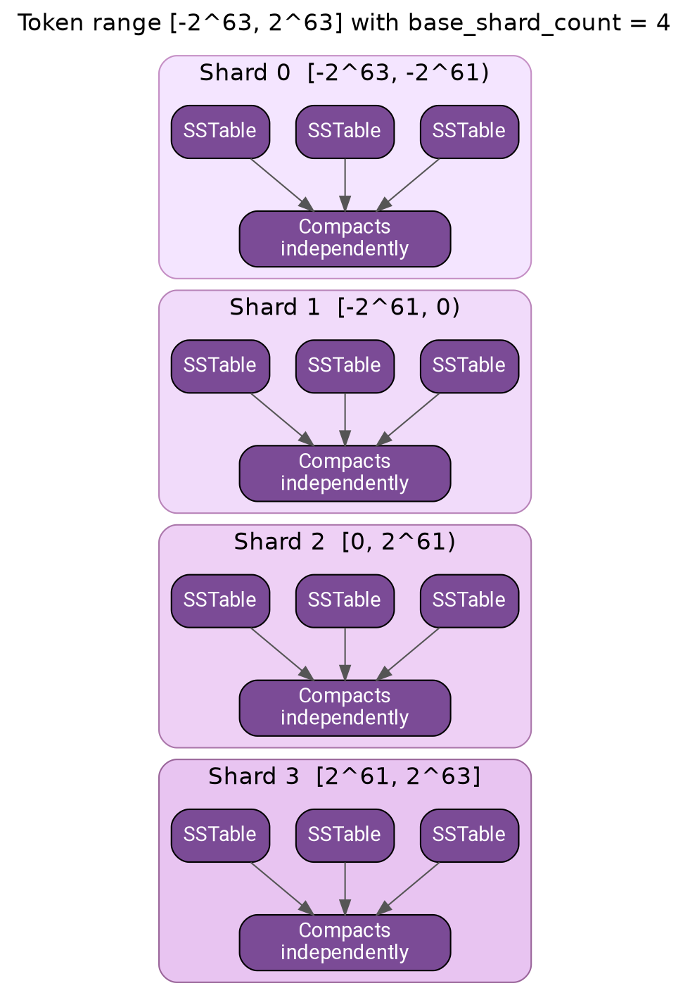
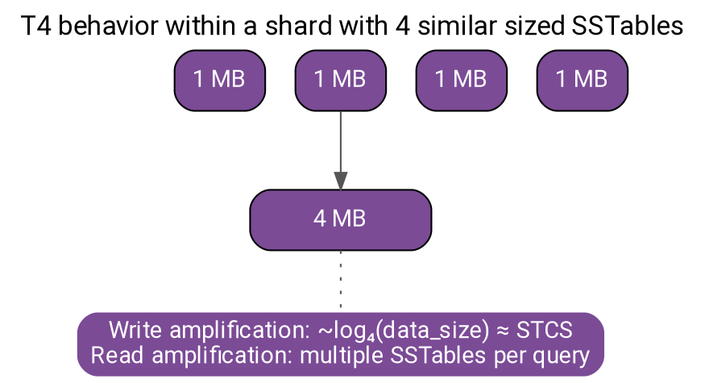
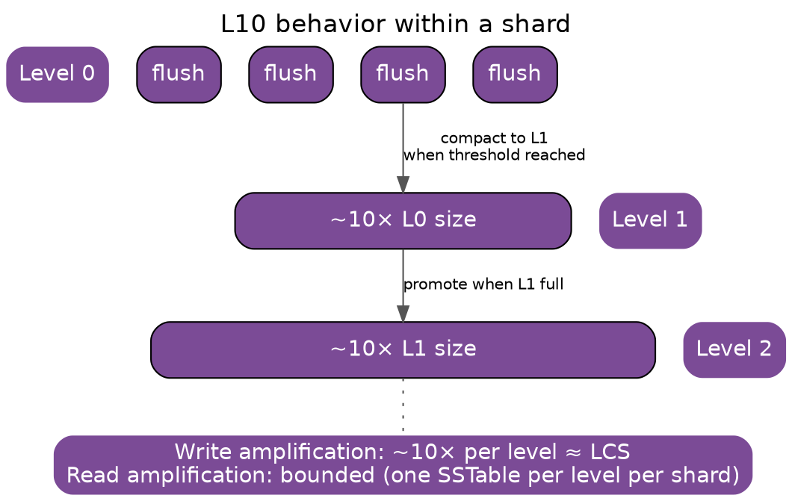

# Unified Compaction Strategy (UCS)

UCS (Cassandra 5.0+) is an adaptive compaction strategy that combines concepts from STCS, LCS, and TWCS. It uses sharding and density-based triggering to provide flexible, efficient compaction across varying workloads.

---

## Background and History

### Origins

Unified Compaction Strategy was introduced in Cassandra 5.0 (2023) as a culmination of years of research into compaction efficiency. It was developed primarily by DataStax engineers, building on academic work around "write-optimized" and "read-optimized" LSM-tree variants and practical experience with STCS, LCS, and TWCS limitations.

The key insight driving UCS was that traditional compaction strategies forced users to choose between write amplification (LCS) and read amplification (STCS), with no middle ground. UCS provides a unified framework where this trade-off is configurable via a single parameter.

### Design Motivation

Each traditional strategy has fundamental limitations:

**STCS limitations:**
- No upper bound on read amplification
- Large SSTables accumulate without compacting
- Space amplification during major compactions

**LCS limitations:**
- High write amplification (~10× per level)
- L0 backlog under write pressure
- Cannot keep pace with write-heavy workloads

**TWCS limitations:**
- Only suitable for append-only time-series
- Breaks with out-of-order writes or updates
- Tombstone handling issues

UCS addresses these by:

1. **Unifying the compaction model**: Single configurable strategy replaces three separate implementations
2. **Sharding**: Token range divided into independent units for parallel compaction
3. **Density-based triggering**: Compaction decisions based on data density, not just counts
4. **Configurable read/write trade-off**: Single parameter (`scaling_parameters`) adjusts behavior

### Academic Foundation

UCS draws from research on LSM-tree optimization:

- **Dostoevsky (2018)**: Demonstrated that tiered and leveled compaction exist on a continuum
- **Monkey (2017)**: Showed how to tune bloom filters and compaction together
- **Lazy Leveling**: Hybrid approach combining tiered and leveled properties

The `scaling_parameters` in UCS directly implements these theoretical insights, allowing operators to position their compaction strategy anywhere on the tiered-to-leveled spectrum.

---

## How UCS Works in Theory

### Core Concepts

UCS introduces several concepts that differ from traditional strategies:

**Shards**: The token range is divided into fixed segments that compact independently. This enables parallelism and bounds the scope of each compaction.

**Runs**: A sequence of SSTables that collectively represent one "generation" of data. Runs replace the concept of levels (LCS) or tiers (STCS).

**Density**: The amount of data per token range unit. UCS triggers compaction when density reaches thresholds, not when SSTable counts reach thresholds.

**Scaling Parameter**: A single value (e.g., T4, L10) that determines whether UCS behaves more like STCS (tiered) or LCS (leveled).


### Shard Structure



Each shard maintains its own set of SSTables and compacts without coordination with other shards. This provides:

- **Parallelism**: Multiple CPU cores compact different shards simultaneously
- **Bounded scope**: Each compaction touches only one shard's data
- **Independent progress**: Slow shards don't block fast shards

### Tiered Mode (T)

When `scaling_parameters` starts with `T` (e.g., T4), UCS behaves similarly to STCS:



The number after `T` specifies the fanout—how many SSTables accumulate before compaction. Higher values (T8, T16) reduce write amplification but increase read amplification.

### Leveled Mode (L)

When `scaling_parameters` starts with `L` (e.g., L10), UCS behaves similarly to LCS:



The number after `L` specifies the size ratio between levels. L10 means each level is 10× larger than the previous, matching classic LCS behavior.

### Density-Based Triggering

Unlike traditional strategies that trigger on SSTable count, UCS uses density:

```
Density = Data size / Token range covered

Traditional (count-based):
  Trigger when: SSTable_count >= min_threshold
  Problem: Doesn't account for SSTable sizes or overlap

UCS (density-based):
  Trigger when: Density exceeds threshold for shard
  Advantage: Considers actual data distribution

Example:
  Shard covers 25% of token range
  Shard contains 10GB of data
  Density = 10GB / 0.25 = 40GB effective

  If target density is 32GB, compaction triggers
```

This approach prevents the "large SSTable accumulation" problem of STCS while avoiding unnecessary compaction of sparse data.

---

## Benefits

### Configurable Trade-offs

The primary advantage of UCS is tunable behavior:

- **T4**: STCS-like, optimize for writes
- **L10**: LCS-like, optimize for reads
- **T8, L4, etc.**: Intermediate points on the spectrum
- Change with ALTER TABLE—no data rewrite needed

### Parallel Compaction

Sharding enables efficient use of modern hardware:

- Multiple compactions run simultaneously
- Different shards progress independently
- Scales with CPU core count
- Reduces wall-clock time for compaction

### Bounded Read Amplification

Even in tiered mode, UCS provides better bounds than STCS:

- Sharding limits SSTable count per token range
- Density-based triggering prevents unbounded accumulation
- More predictable read performance

### Unified Codebase

Single strategy implementation simplifies Cassandra:

- Fewer edge cases than maintaining STCS + LCS + TWCS
- Consistent behavior across configurations
- Easier to test and maintain
- Bug fixes benefit all configurations

### Smooth Migration

Transitioning from traditional strategies is straightforward:

- ALTER TABLE to enable UCS immediately
- Existing SSTables remain valid
- Gradual transition as compaction runs
- No major compaction required

---

## Drawbacks

### Newer Strategy

UCS has less production history than traditional strategies:

- Introduced in Cassandra 5.0 (2023)
- Less community experience with edge cases
- Fewer tuning guides and best practices available
- Some workloads may have undiscovered issues

### Learning Curve

Different conceptual model requires adjustment:

- Shards and runs vs levels and tiers
- Density-based vs count-based triggering
- New configuration parameters to understand
- Existing STCS/LCS expertise doesn't directly transfer

### Time-Series Trade-offs

TWCS may still be preferable for pure time-series:

- TWCS drops entire SSTables on TTL expiry (O(1))
- UCS must compact to remove expired data
- Window-based organization provides better locality

### Shard Overhead

Sharding adds some overhead:

- Minimum SSTable size per shard
- More metadata to track
- Very small tables may not benefit
- Configuration requires understanding data size

### Migration Considerations

While migration is smooth, considerations exist:

- Existing tuning may not transfer directly
- Monitoring dashboards need updates
- Operational procedures may need revision
- Testing required before production migration

---

## When to Use UCS

### Ideal Use Cases

| Workload Pattern | Configuration | Why UCS Works |
|------------------|---------------|---------------|
| New Cassandra 5.0+ clusters | T4 (default) | Modern, unified approach |
| Mixed read/write workloads | T4 | Balanced trade-offs |
| High-core-count servers | base_shard_count=16 | Parallel compaction |
| Workloads that evolve | T4, then adjust | Easy reconfiguration |
| Large datasets | T4, target_sstable_size=5GiB | Efficient compaction |

### Avoid UCS When

| Workload Pattern | Alternative | Rationale |
|------------------|-------------|-----------|
| Pure time-series with TTL | TWCS | More efficient TTL handling |
| Cassandra < 5.0 | STCS/LCS | UCS not available |
| Well-tuned existing cluster | Keep current | Migration has risk |
| Very small tables | STCS | Shard overhead not justified |

---

## Sharding

UCS divides the token range into shards, enabling:

- **Parallel compaction**: Different shards compact independently
- **Reduced compaction scope**: Smaller units of work
- **Better resource utilization**: Multiple CPU cores used effectively

```
Token range: -2^63 to 2^63
With 4 base shards:

Shard 1: tokens -2^63 to -2^61
Shard 2: tokens -2^61 to 0
Shard 3: tokens 0 to 2^61
Shard 4: tokens 2^61 to 2^63

Each shard compacts independently with its own SSTable hierarchy
```

---

## Configuration

```sql
CREATE TABLE my_table (
    id uuid PRIMARY KEY,
    data text
) WITH compaction = {
    'class': 'UnifiedCompactionStrategy',

    -- Scaling parameter (strategy behavior)
    -- T = Tiered (STCS-like), number is fanout
    -- L = Leveled (LCS-like), number is fanout
    -- N = None (no compaction)
    'scaling_parameters': 'T4',

    -- Target SSTable size
    'target_sstable_size': '1GiB',

    -- Base shard count
    'base_shard_count': 4,

    -- Minimum SSTable size (prevents over-sharding small data)
    'min_sstable_size': '100MiB'
};
```

### Configuration Parameters

| Parameter | Default | Description |
|-----------|---------|-------------|
| `scaling_parameters` | T4 | Strategy behavior: T (tiered), L (leveled), N (none) with fanout |
| `target_sstable_size` | 1GiB | Target size for output SSTables |
| `base_shard_count` | 4 | Number of token range shards |
| `min_sstable_size` | 100MiB | Minimum size before sharding applies |
| `max_sstables_to_compact` | 32 | Maximum SSTables per compaction |
| `expired_sstable_check_frequency_seconds` | 600 | TTL expiration check interval |

---

## Scaling Parameters

The `scaling_parameters` option controls compaction behavior:

### Format

```
[T|L|N][number]

T = Tiered (STCS-like behavior)
L = Leveled (LCS-like behavior)
N = None (disable compaction)

number = fanout/threshold
```

### Examples

| Parameter | Behavior | Use Case |
|-----------|----------|----------|
| `T4` | Tiered with 4 SSTables per tier | Write-heavy (like STCS min_threshold=4) |
| `T8` | Tiered with 8 SSTables per tier | Very write-heavy |
| `L4` | Leveled with 4x size between levels | Read-heavy, lower write amp than L10 |
| `L10` | Leveled with 10x size between levels | Read-heavy (like classic LCS) |
| `N` | No compaction | Special cases only |


---

## Migration from Other Strategies

### From STCS

```sql
-- STCS with min_threshold=4 equivalent
ALTER TABLE keyspace.table WITH compaction = {
    'class': 'UnifiedCompactionStrategy',
    'scaling_parameters': 'T4'
};
```

### From LCS

```sql
-- LCS equivalent
ALTER TABLE keyspace.table WITH compaction = {
    'class': 'UnifiedCompactionStrategy',
    'scaling_parameters': 'L10',
    'target_sstable_size': '160MiB'
};
```

### Migration Process

1. UCS takes effect immediately on ALTER
2. Existing SSTables are not rewritten
3. New compactions follow UCS rules
4. Gradual transition as old SSTables compact

```bash
# Monitor migration
watch 'nodetool compactionstats && nodetool tablestats keyspace.table'
```

---

## Tuning UCS

### Write-Heavy Workload

```sql
ALTER TABLE keyspace.table WITH compaction = {
    'class': 'UnifiedCompactionStrategy',
    'scaling_parameters': 'T8',          -- Higher threshold, less frequent compaction
    'target_sstable_size': '2GiB',       -- Larger SSTables
    'base_shard_count': 4
};
```

### Read-Heavy Workload

```sql
ALTER TABLE keyspace.table WITH compaction = {
    'class': 'UnifiedCompactionStrategy',
    'scaling_parameters': 'L10',         -- Leveled for low read amp
    'target_sstable_size': '256MiB',     -- Smaller SSTables for faster compaction
    'base_shard_count': 8                -- More parallelism
};
```

### Large Dataset

```sql
ALTER TABLE keyspace.table WITH compaction = {
    'class': 'UnifiedCompactionStrategy',
    'scaling_parameters': 'T4',
    'target_sstable_size': '5GiB',       -- Larger to reduce SSTable count
    'base_shard_count': 16               -- More shards for parallelism
};
```

### High-Core Server

```sql
ALTER TABLE keyspace.table WITH compaction = {
    'class': 'UnifiedCompactionStrategy',
    'scaling_parameters': 'T4',
    'base_shard_count': 16,              -- Match available cores
    'target_sstable_size': '1GiB'
};
```

---

## Monitoring UCS

### Key Metrics

| Metric | Healthy | Investigate |
|--------|---------|-------------|
| Pending compactions | <20 | >50 |
| SSTable count per shard | Consistent | Highly variable |
| Compaction throughput | Steady | Dropping |

### Commands

```bash
# Compaction activity
nodetool compactionstats

# Table statistics
nodetool tablestats keyspace.table

# JMX metrics for detailed shard info
# org.apache.cassandra.metrics:type=Table,name=*
```

### JMX Metrics

```
# Pending compactions
org.apache.cassandra.metrics:type=Compaction,name=PendingTasks

# Per-table compaction metrics
org.apache.cassandra.metrics:type=Table,keyspace=*,scope=*,name=PendingCompactions
org.apache.cassandra.metrics:type=Table,keyspace=*,scope=*,name=LiveSSTableCount
```

---

## Comparison with Traditional Strategies

| Aspect | STCS | LCS | TWCS | UCS |
|--------|------|-----|------|-----|
| Write amplification | Low | High | Low | Configurable |
| Read amplification | High | Low | Low | Configurable |
| Space amplification | Medium | Low | Low | Low |
| Parallelism | Limited | Limited | Limited | High (sharding) |
| Adaptability | Fixed | Fixed | Fixed | Configurable |
| Cassandra version | All | All | 3.0+ | 5.0+ |

### UCS Advantages

1. **Single strategy for multiple workloads**: Adjust `scaling_parameters` instead of switching strategies
2. **Better parallelism**: Sharding enables multi-core utilization
3. **Density-based triggering**: More intelligent than fixed thresholds
4. **Unified codebase**: Simplified maintenance and fewer edge cases

### UCS Considerations

1. **Newer strategy**: Less production experience than STCS/LCS
2. **Migration complexity**: Existing clusters need careful transition
3. **Learning curve**: Different configuration model

---

## Related Documentation

- **[Compaction Overview](index.md)** - Concepts and strategy selection
- **[Size-Tiered Compaction (STCS)](stcs.md)** - Traditional write-heavy strategy
- **[Leveled Compaction (LCS)](lcs.md)** - Traditional read-heavy strategy
- **[Compaction Management](../../../operations/compaction-management/index.md)** - Tuning and troubleshooting
