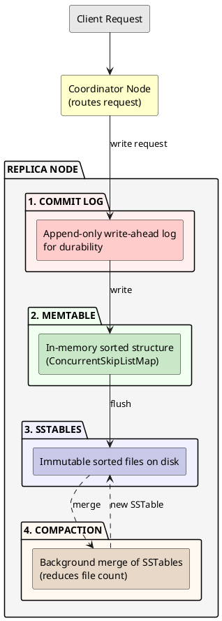

# Storage Engine

This section describes the internal operations of a single Cassandra node. While Cassandra is a distributed database, each node operates an independent storage engine that manages local data persistence and retrieval. The distributed aspects—replication, consistency coordination, and cross-node communication—are covered in [Distributed Data](../distributed-data/index.md).

The storage engine is the core database component responsible for persisting data to disk and retrieving it efficiently. Cassandra's storage engine is based on the Log-Structured Merge-tree (LSM-tree) design described in Google's Bigtable paper ([Chang et al., 2006, "Bigtable: A Distributed Storage System for Structured Data"](https://static.googleusercontent.com/media/research.google.com/en//archive/bigtable-osdi06.pdf)), adapted for Cassandra's requirements.

Unlike traditional relational databases that update data in place, Cassandra's storage engine treats all writes as sequential appends. This design choice optimizes for write throughput and enables consistent performance regardless of dataset size.

!!! note "Node-Local Focus"
    All operations described in this section—commit log writes, memtable management, SSTable creation, compaction, and indexing—occur independently on each node. A write operation arriving at a node is processed entirely by that node's storage engine, with no coordination with other nodes during the local persistence phase.

---

## LSM-Tree Design

The LSM-tree architecture originated from the need to handle write-intensive workloads efficiently. Rather than performing random I/O to update B-tree pages, LSM-trees buffer writes in memory and periodically flush sorted data to immutable files on disk.

### B-tree vs LSM-tree

Traditional databases use B-tree storage with random writes to update pages in place. LSM-tree databases use sequential writes only, appending data to immutable files.

| Characteristic | B-tree (RDBMS) | LSM-tree (Cassandra) |
|----------------|----------------|----------------------|
| Write pattern | Random I/O | Sequential I/O |
| Write performance | Degrades with size | Consistent |
| Read performance | Single seek | Multiple file checks |
| Space efficiency | High | Requires compaction |
| Write amplification | Page splits | Compaction rewrites |

### Design Trade-offs

LSM-tree advantages:

- Write latency remains consistent regardless of data size
- Sequential writes maximize disk throughput
- Horizontal scaling without central index coordination
- Effective on both HDD and SSD storage

LSM-tree costs:

- Reads may check multiple files
- Background compaction required
- Space amplification during compaction

---

## Storage Architecture

---

## Component Overview

### Commit Log

Write-ahead log providing durability. All writes append to the commit log before updating the memtable. Used only for crash recovery.

- Sequential append-only writes
- Segmented into fixed-size files (default 32MB)
- Recycled after referenced memtables flush

See [Write Path](write-path.md) for configuration details.

### Memtable

In-memory sorted data structure holding recent writes. One memtable exists per table per node.

- ConcurrentSkipListMap implementation
- Sorted by partition key token, then clustering columns
- Flushed to SSTable when size threshold reached

See [Write Path](write-path.md) for memory configuration.

### SSTable

Sorted String Table - immutable files on disk containing partition data. Each SSTable consists of multiple component files.

- Immutable after creation
- Contains data, indexes, bloom filter, metadata
- Merged during compaction

See [SSTable Reference](sstables.md) for file format details.

### Compaction

Background process merging SSTables to reclaim space and improve read performance.

- Combines multiple SSTables into fewer, larger files
- Removes obsolete data and expired tombstones
- Multiple strategies available (STCS, LCS, TWCS)

See [Compaction](compaction/index.md) for strategy details.

---

## Documentation Structure

| Section | Description |
|---------|-------------|
| [Write Path](write-path.md) | Commit log, memtable, flush process |
| [Read Path](read-path.md) | Bloom filters, indexes, caching |
| [SSTable Reference](sstables.md) | File components and format |
| [Tombstones](tombstones.md) | Deletion markers and gc_grace |
| [Compaction](compaction/index.md) | SSTable merge strategies and operations |
| [Indexes](indexes/index.md) | Secondary indexes, SASI, and SAI |
| [Materialized Views](materialized-views.md) | Automatic denormalization |

---

## Related Documentation

- **[Compaction](compaction/index.md)** - SSTable merge strategies
- **[Indexes](indexes/index.md)** - Secondary indexes, SASI, and SAI
- **[Materialized Views](materialized-views.md)** - Automatic denormalization
- **[Replication](../distributed-data/replication.md)** - Data distribution
- **[Consistency](../distributed-data/consistency.md)** - Read and write consistency levels
