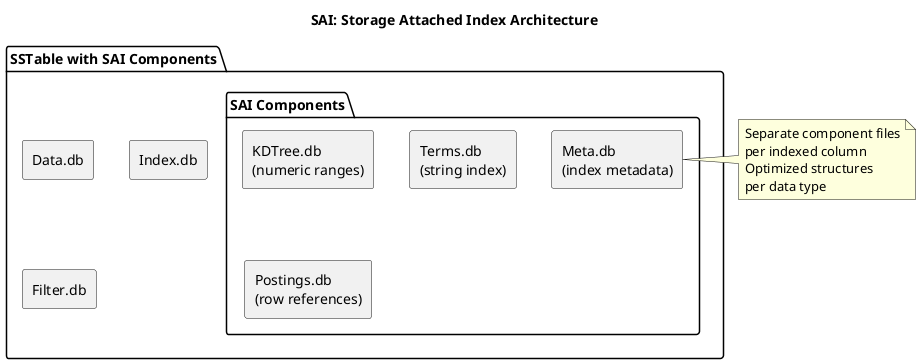
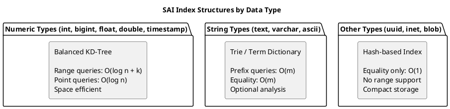
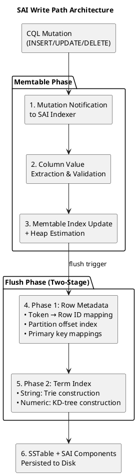

# SAI (Storage Attached Index)

SAI (Storage Attached Index) is Cassandra's modern indexing system introduced in Cassandra 5.0 (2023). It provides production-ready support for equality, range, and text queries with improved performance characteristics compared to legacy indexing approaches.

!!! tip "Recommended Index Type"
    SAI is the recommended indexing solution for Cassandra 5.0+ deployments. It replaces both legacy secondary indexes (2i) and SASI for most use cases.

---

## Background and History

### Origins

SAI was developed by DataStax and contributed to Apache Cassandra for version 5.0. The implementation draws from production experience with DataStax Enterprise (DSE) Search and lessons learned from SASI's experimental deployment.

Key influences on SAI design:

- **DSE Search experience**: Years of production secondary index usage
- **SASI limitations**: Memory management and stability issues
- **Modern storage formats**: Efficient columnar and indexed structures
- **Lucene concepts**: Proven indexing algorithms adapted for Cassandra

### Design Goals

SAI was designed to provide:

1. **Production stability**: Address SASI's experimental status
2. **Low write overhead**: Minimize impact on write path
3. **Efficient reads**: Single-pass query execution
4. **Memory efficiency**: Bounded memory consumption
5. **Operational simplicity**: Standard Cassandra operations

### Relationship to Prior Index Types

SAI represents the third generation of Cassandra secondary indexing:

| Generation | Index Type | Status | Issues Addressed |
|------------|------------|--------|------------------|
| 1st | Secondary Index (2i) | Legacy | - |
| 2nd | SASI | Experimental | Range queries, text search |
| 3rd | SAI | Production | Stability, memory, performance |

---

## Architecture

### SSTable-Attached Design

Like SASI, SAI stores index data alongside SSTable components. However, SAI uses a more sophisticated storage format:



**SAI storage characteristics:**

- Per-column index files within SSTable directory
- Data type-specific storage formats
- Compacts atomically with base SSTable
- Efficient on-disk representation

### On-Disk File Structure

SAI creates multiple component files per indexed column within the SSTable directory:

```
data/
└── keyspace/
    └── users-<table_id>/
        ├── nb-1-big-Data.db                                  # Base table row data
        ├── nb-1-big-Index.db                                 # Primary key partition index
        ├── nb-1-big-Filter.db                                # Bloom filter
        ├── nb-1-big-Summary.db                               # Partition summary
        ├── nb-1-big-Statistics.db                            # SSTable statistics
        ├── nb-1-big-CompressionInfo.db                       # Compression metadata
        ├── nb-1-big-TOC.txt                                  # Table of contents
        │
        │   # SAI components for 'city' column index
        ├── nb-1-big-SAI_city_city_idx_ColumnComplete.db      # Completion marker
        ├── nb-1-big-SAI_city_city_idx_TermsData.db           # Term dictionary
        ├── nb-1-big-SAI_city_city_idx_PostingLists.db        # Row ID lists
        ├── nb-1-big-SAI_city_city_idx_Meta.db                # Index metadata
        │
        │   # SAI components for 'age' column index (numeric)
        ├── nb-1-big-SAI_age_age_idx_ColumnComplete.db
        ├── nb-1-big-SAI_age_age_idx_KDTree.db                # KD-tree for ranges
        ├── nb-1-big-SAI_age_age_idx_KDTreePostingLists.db
        ├── nb-1-big-SAI_age_age_idx_Meta.db
        │
        │   # Per-SSTable completion marker
        └── nb-1-big-SAI_GroupComplete.db
```

| Component | Description |
|-----------|-------------|
| `ColumnComplete.db` | Signals column index fully written; used for crash recovery |
| `TermsData.db` | Term dictionary (trie structure for strings) |
| `KDTree.db` | Balanced KD-tree for numeric range queries |
| `PostingLists.db` | Compressed row ID lists for each indexed term |
| `Meta.db` | Index metadata, statistics, and configuration |
| `GroupComplete.db` | Marks all SAI indexes for this SSTable as complete |

#### Vector Index Files

Vector columns generate specialized graph-based components:

```
data/
└── keyspace/
    └── documents-<table_id>/
        ├── nb-1-big-Data.db
        │
        │   # Vector SAI components
        ├── nb-1-big-SAI_embedding_embedding_idx_ColumnComplete.db
        ├── nb-1-big-SAI_embedding_embedding_idx_Meta.db
        ├── nb-1-big-SAI_embedding_embedding_idx_VectorPostings.db
        ├── nb-1-big-SAI_embedding_embedding_idx_VectorPQ.db
        └── nb-1-big-SAI_embedding_embedding_idx_VectorGraph.db
```

| Component | Description |
|-----------|-------------|
| `VectorPostings.db` | Maps HNSW graph node IDs to row IDs |
| `VectorPQ.db` | Product quantization codebook for vector compression |
| `VectorGraph.db` | HNSW (Hierarchical Navigable Small World) graph for ANN search |

#### Size Estimation

| Index Type | Size Relative to Indexed Column | Notes |
|------------|--------------------------------|-------|
| String (trie) | 5-30% | Depends on string length and cardinality |
| Numeric (KD-tree) | 10-25% | Fixed overhead per value |
| Vector | 100-200% | Graph structures and quantization add significant overhead |

!!! tip "Monitoring Index Size"
    Use `nodetool tablestats keyspace.table` to view actual index sizes. The SAI components are included in the SSTable size metrics.

### Index Structures

SAI uses different internal structures based on data type:



| Data Type | Structure | Query Types |
|-----------|-----------|-------------|
| Numeric | KD-Tree | Equality, range, comparison |
| String | Trie/Term Dictionary | Equality, prefix, analyzed |
| UUID | Hash-based | Equality |
| Boolean | Bitmap | Equality |
| Collection | Per-element | Equality on elements |


### Write Path

SAI implements a notification-based architecture that receives mutation events from the storage engine, maintaining synchronized index state throughout the write lifecycle.

#### Mutation Processing

Upon table mutation, SAI receives notification callbacks for all write operations. The system processes inserts and updates uniformly, and supports partition-level deletions, range tombstones, and individual row removals.



#### Memtable Indexing

For each mutation containing valid indexed column content, SAI performs the following operations:

1. **Value extraction**: Indexed column values extracted from the mutation
2. **Primary key association**: Row's primary key associated with indexed value
3. **Heap estimation**: Incremental heap consumption calculated for memory pressure monitoring
4. **In-memory structure update**: Value added to type-appropriate in-memory index structure

| Data Type | Memtable Structure | Memory Characteristics |
|-----------|-------------------|----------------------|
| String | In-memory trie | Prefix-compressed, O(m) insertion |
| Numeric | Balanced tree | O(log n) insertion |
| Collection | Per-element structures | Linear in collection size |

The memtable index enables immediate query visibility (read-your-writes semantics) for recently written data without requiring flush to disk.

#### Flush Process

When memtable flush is triggered, SAI executes a two-phase serialization process that minimizes memory overhead by streaming directly to disk rather than constructing intermediate in-memory representations.

**Phase 1: Row Metadata Construction**

During row serialization, SAI generates row identifiers and constructs three index components:

| Component | Purpose | Structure |
|-----------|---------|-----------|
| Token-to-Row-ID mapping | Maps partition tokens to row identifiers | Supports Murmur3Partitioner token ordering |
| Partition offset index | Records SSTable byte offsets for partitions | Enables direct partition access |
| Primary key mappings | Temporary PK-to-Row-ID associations | Used during Phase 2, discarded after |

**Phase 2: Term Index Construction**

Following row metadata generation, SAI iterates over the memtable index contents, producing term-and-row-ID pairs for persistence.

For **string columns**, the construction process:

1. Iterates over unique terms in lexicographic order
2. Writes posting lists (row ID sets) to disk sequentially
3. Records term-to-offset mappings in byte-ordered trie structure
4. Finalizes trie with prefix compression

For **numeric columns**, the construction process:

1. Constructs balanced KD-tree from value-row-ID pairs
2. Writes tree nodes to disk during construction
3. Buffers leaf block postings temporarily in memory
4. Builds final posting structures at leaf and internal node levels

```
String Index Construction:
┌─────────────────────────────────────────────────────────┐
│ Terms (sorted)     Postings File        Trie Structure  │
│ ────────────────   ─────────────────    ──────────────  │
│ "alice"    ──────► [row_1, row_5]  ◄─── offset_0        │
│ "bob"      ──────► [row_2]         ◄─── offset_1        │
│ "charlie"  ──────► [row_3, row_4]  ◄─── offset_2        │
└─────────────────────────────────────────────────────────┘

Numeric Index Construction (KD-Tree):
┌─────────────────────────────────────────────────────────┐
│           [pivot: 50]                                   │
│           /          \                                  │
│    [pivot: 25]    [pivot: 75]                           │
│       /    \         /    \                             │
│   [10,20] [30,40] [60,70] [80,90]  ← leaf postings      │
└─────────────────────────────────────────────────────────┘
```

#### Compaction Integration

During SSTable compaction, SAI coordinates index merging with the following mechanism:

1. **Buffered accumulation**: Indexed values and row IDs buffered in token order
2. **Segment-based flushing**: Accumulated segment buffer flushed to disk synchronously upon reaching size threshold
3. **Heap pressure management**: Synchronous flushing prevents unbounded heap growth during large compactions
4. **Atomic completion**: SAI components finalized atomically with SSTable output

| Compaction Parameter | Effect on SAI |
|---------------------|---------------|
| Concurrent compactors | Parallel SAI index construction |
| SSTable size target | Determines index segment sizes |
| Compaction throughput | Bounds index construction rate |

!!! note "Write Amplification"
    SAI introduces minimal write amplification compared to legacy secondary indexes. The append-only design and direct-to-disk flush process avoid the separate table mutations required by 2i implementations.

This architecture enables read-your-writes consistency for indexed queries while maintaining bounded memory consumption during high-throughput write workloads.

---

## Configuration

### Creating SAI Indexes

```sql
-- Basic SAI index
CREATE INDEX ON users (city) USING 'sai';

-- Named index
CREATE INDEX users_city_idx ON users (city) USING 'sai';

-- Index with options
CREATE INDEX ON users (email) USING 'sai'
WITH OPTIONS = { 'case_sensitive': 'false' };

-- Numeric index (auto-detected)
CREATE INDEX ON events (timestamp) USING 'sai';

-- Index on collection values
CREATE INDEX ON users (tags) USING 'sai';
```

### Index Options

| Option | Values | Default | Description |
|--------|--------|---------|-------------|
| `case_sensitive` | true, false | true | Case sensitivity for string columns |
| `normalize` | true, false | false | Unicode normalization |
| `ascii` | true, false | false | ASCII folding for accented characters |
| `index_analyzer` | analyzer name | none | Text analyzer for tokenization |

### Text Analysis Options

```sql
-- Standard analyzer (tokenization, lowercase)
CREATE INDEX ON articles (content) USING 'sai'
WITH OPTIONS = {
    'index_analyzer': 'standard'
};

-- Whitespace analyzer (tokenize on whitespace only)
CREATE INDEX ON logs (message) USING 'sai'
WITH OPTIONS = {
    'index_analyzer': 'whitespace'
};

-- Case insensitive without tokenization
CREATE INDEX ON users (email) USING 'sai'
WITH OPTIONS = {
    'case_sensitive': 'false',
    'normalize': 'true'
};
```

### Managing Indexes

```sql
-- Drop index
DROP INDEX IF EXISTS users_city_idx;

-- View indexes
SELECT * FROM system_schema.indexes
WHERE keyspace_name = 'my_keyspace';

-- Describe table shows indexes
DESCRIBE TABLE my_keyspace.users;
```

---

## Query Capabilities

### Equality Queries

```sql
-- String equality
SELECT * FROM users WHERE city = 'NYC';

-- Numeric equality
SELECT * FROM sensors WHERE reading = 100.0;

-- UUID equality
SELECT * FROM events WHERE event_id = 123e4567-e89b-12d3-a456-426614174000;
```

### Range Queries

```sql
-- Greater than
SELECT * FROM events WHERE timestamp > '2024-01-01';

-- Less than or equal
SELECT * FROM sensors WHERE temperature <= 30.0;

-- Between (two conditions)
SELECT * FROM orders
WHERE created_at >= '2024-01-01'
AND created_at < '2024-02-01';

-- Numeric ranges
SELECT * FROM products WHERE price > 10.0 AND price < 100.0;
```

### Text Queries

```sql
-- Prefix matching (with case_sensitive: false)
SELECT * FROM users WHERE name LIKE 'John%';

-- With analyzer: tokenized search
SELECT * FROM articles WHERE content : 'database';

-- Multiple terms (AND semantics with analyzer)
SELECT * FROM articles WHERE content : 'distributed database';
```

### Collection Queries

```sql
-- Contains value in set/list
SELECT * FROM users WHERE tags CONTAINS 'premium';

-- Contains key in map
SELECT * FROM users WHERE attributes CONTAINS KEY 'verified';

-- Contains entry in map
SELECT * FROM users WHERE attributes['status'] = 'active';
```

---

## Vector Search (ANN)

!!! warning "Vector Search is Fundamentally Different"
    Vector search uses SAI infrastructure but operates completely differently from scalar indexes. It is **not** "just another column type"—it introduces approximate results, different query semantics, and significant storage overhead.

### What Vector Search Is

Vector search enables Approximate Nearest Neighbor (ANN) queries on high-dimensional embedding vectors. This supports semantic similarity search for AI/ML applications like:

- Document similarity
- Image search
- Recommendation systems
- RAG (Retrieval-Augmented Generation) pipelines

### What Vector Search Is NOT

| Expectation | Reality |
|------------|---------|
| Exact results | **Approximate** - may miss true nearest neighbors |
| Fast like scalar indexes | **Slower** - graph traversal, not B-tree lookup |
| Low storage overhead | **100-200%** overhead vs indexed column |
| Works with all predicates | **Only** `ORDER BY ... ANN OF` syntax |
| Scales linearly | **Sub-linear** but memory-intensive |

### Creating Vector Indexes

```sql
-- Create table with vector column (Cassandra 5.0+)
CREATE TABLE documents (
    doc_id uuid PRIMARY KEY,
    title text,
    content text,
    embedding vector<float, 1536>  -- OpenAI ada-002 dimension
);

-- Create SAI index on vector column
CREATE INDEX ON documents (embedding) USING 'sai';
```

### Vector Query Syntax

!!! danger "Vector Queries Use Different Syntax"
    Vector queries use `ORDER BY ... ANN OF`, not `WHERE`. The query returns approximate nearest neighbors, not exact matches.

```sql
-- Find 10 most similar documents to query vector
SELECT doc_id, title, similarity_cosine(embedding, [0.1, 0.2, ...]) AS score
FROM documents
ORDER BY embedding ANN OF [0.1, 0.2, ...]
LIMIT 10;
```

### Vector Search Operators

| Operator | Syntax | Description |
|----------|--------|-------------|
| ANN search | `ORDER BY col ANN OF [...]` | Approximate nearest neighbor |
| Cosine similarity | `similarity_cosine(col, [...])` | Returns similarity score (0-1) |
| Euclidean distance | `similarity_euclidean(col, [...])` | Returns distance score |
| Dot product | `similarity_dot_product(col, [...])` | Returns dot product score |

### Vector Index Limitations

!!! danger "Hard Constraints"
    - **No filtering before ANN**: Cannot use `WHERE` with vector queries (except partition key)
    - **No exact search**: ANN is always approximate
    - **Fixed dimensions**: Vector dimension set at table creation, cannot change
    - **No nulls**: Vector columns cannot contain null values
    - **Memory intensive**: HNSW graph loaded during queries

### Vector Search Configuration

```sql
CREATE INDEX ON documents (embedding) USING 'sai'
WITH OPTIONS = {
    'similarity_function': 'cosine'  -- cosine, euclidean, dot_product
};
```

| Option | Values | Default | Description |
|--------|--------|---------|-------------|
| `similarity_function` | cosine, euclidean, dot_product | cosine | Distance metric for ANN |

### Storage Overhead

Vector indexes create specialized graph structures that significantly increase storage:

| Component | Description | Size Impact |
|-----------|-------------|-------------|
| HNSW Graph | Navigable small world graph for ANN | 50-100% of vector data |
| Product Quantization | Compressed vector representations | 20-50% of vector data |
| Postings | Row ID mappings | 10-20% overhead |

**Total overhead: 100-200%** of the vector column size.

For a table with 1M rows and 1536-dimension float vectors (~6KB per row):
- Vector data: ~6GB
- Vector index: ~6-12GB additional

### Vector Search Anti-Patterns

!!! danger "Do Not Use Vector Search For"
    - **Exact matching**: Use equality index instead
    - **Small datasets** (<10K rows): Full scan may be faster
    - **Frequently updated vectors**: Index rebuild overhead
    - **High-throughput queries**: ANN is computationally expensive

### Combined Queries

```sql
-- Multiple SAI indexes (intersected)
SELECT * FROM users
WHERE age > 25
AND city = 'NYC'
AND status = 'active';

-- SAI with partition key (most efficient)
SELECT * FROM events
WHERE sensor_id = ?
AND timestamp > '2024-01-01'
AND level = 'ERROR';
```

---

## Benefits

### Production Stability

SAI addresses SASI's experimental issues:

- Bounded memory consumption during queries
- No known memory leaks
- Consistent behavior across workloads
- Extensive production testing

### Low Write Overhead

SAI minimizes write path impact:

```
Benchmark comparison (relative overhead):
- Secondary Index (2i): ~15-20% write overhead
- SASI: ~10-15% write overhead
- SAI: ~5-10% write overhead

Reasons:
- Efficient memtable index structures
- Optimized flush process
- Minimal synchronization
```

### Efficient Multi-Predicate Queries

Single-pass intersection within each SSTable:

```sql
-- Query with three predicates
SELECT * FROM users
WHERE age > 25 AND city = 'NYC' AND status = 'active';

-- Execution:
-- For each SSTable:
--   1. Query age index → bitmap of matching rows
--   2. Query city index → bitmap of matching rows
--   3. Query status index → bitmap of matching rows
--   4. AND bitmaps together
--   5. Fetch only intersected rows
```

### Memory Efficiency

SAI uses streaming and bounded buffers:

- Query results streamed, not fully materialized
- Per-SSTable memory bounds
- Configurable memory limits
- No unbounded allocations

### Read-Your-Writes

Memtable indexing provides immediate visibility:

```sql
-- Write
INSERT INTO users (id, city) VALUES (uuid(), 'NYC');

-- Immediately queryable via SAI
SELECT * FROM users WHERE city = 'NYC';
-- Returns the just-inserted row
```

---

## Limitations and Anti-Patterns

!!! danger "SAI Is Not a Silver Bullet"
    While SAI is significantly better than legacy indexes, it still has fundamental limitations. These are not soft recommendations—violating them will cause problems.

### Unsupported Query Patterns

| Query Pattern | Supported | Alternative |
|--------------|:---------:|-------------|
| `=` (equality) | ✅ | - |
| `>`, `>=`, `<`, `<=` | ✅ | - |
| `LIKE 'prefix%'` | ✅ | - |
| `IN (...)` | ✅ | - |
| `CONTAINS` | ✅ | - |
| `LIKE '%suffix'` | ❌ | Reverse the string in a separate column |
| `LIKE '%substring%'` | ⚠️ | Requires analyzer; consider external search |
| `!=` (not equal) | ❌ | Application-level filtering |
| `OR` across columns | ❌ | Union multiple queries in application |
| `NOT` predicates | ❌ | Application-level filtering |

### No Full-Text Search

!!! warning "SAI Is Not Elasticsearch"
    SAI provides basic text analysis, not full-text search. For advanced search, use a dedicated search engine.

| Feature | SAI | Elasticsearch/Solr |
|---------|:---:|:------------------:|
| Tokenization | ✅ | ✅ |
| Case normalization | ✅ | ✅ |
| Prefix matching | ✅ | ✅ |
| Fuzzy matching | ❌ | ✅ |
| Phonetic search | ❌ | ✅ |
| Synonyms | ❌ | ✅ |
| Relevance scoring | ❌ | ✅ |
| Faceted search | ❌ | ✅ |
| Highlighting | ❌ | ✅ |

### Anti-Pattern: High Cardinality Columns

!!! danger "Do Not Index UUIDs or Unique Identifiers"
    **Problem:** Index size equals data size. Query must contact all nodes to find one row.

    **Symptoms:** Query latency exceeds full table scan, disk usage doubles.

    ```sql
    -- DO NOT DO THIS
    CREATE INDEX ON events (event_id) USING 'sai';

    -- INSTEAD: Make it the partition key
    CREATE TABLE events (event_id uuid PRIMARY KEY, ...);
    ```

### Anti-Pattern: Low Cardinality Without Partition Key

!!! danger "Do Not Query Low-Cardinality Indexes Globally"
    **Problem:** Query returns unbounded results, potentially millions of rows.

    **Safe:** Combined with partition key restriction.

    **Dangerous:** Global query on boolean/enum column.

    ```sql
    -- DANGEROUS: Returns 50% of all rows across all nodes
    SELECT * FROM users WHERE is_active = true;

    -- SAFE: Restricted to one partition
    SELECT * FROM users WHERE region = 'us-east' AND is_active = true;
    ```

### Anti-Pattern: Frequently Updated Columns

!!! warning "Avoid Indexing Volatile Columns"
    Every update creates index maintenance. For columns updated frequently (e.g., `last_seen`, `session_count`), the index overhead may exceed benefits.

    ```sql
    -- PROBLEMATIC: Updated on every request
    CREATE INDEX ON sessions (last_activity) USING 'sai';

    -- CONSIDER: Store in separate table without index, or accept staleness
    ```

### Anti-Pattern: Expecting Index-Only Reads

!!! info "SAI Always Reads Base Table"
    Unlike some databases, SAI cannot return results from index alone. Every match requires a base table read.

    ```sql
    -- WRONG expectation: "Index-only scan"
    SELECT city FROM users WHERE city = 'NYC';
    -- Reality: Reads full row from base table, returns city column

    -- This is fine for filtering, but not for avoiding base table reads
    ```

### Global Queries

Queries without partition key restriction contact all nodes:

```sql
-- Global query: contacts all replicas
SELECT * FROM users WHERE city = 'NYC';

-- Partition-restricted: contacts specific replicas
SELECT * FROM users WHERE user_id = ? AND city = 'NYC';
```

!!! warning "Global Query Impact"
    - Latency = slowest responding node
    - Load distributed across entire cluster
    - Acceptable for low-frequency queries
    - Problematic for high-throughput workloads

---

## Performance Tuning

### Index Selection

Create indexes strategically:

```sql
-- Good: Frequently queried column with medium cardinality
CREATE INDEX ON orders (status) USING 'sai';

-- Good: Range queries on timestamp
CREATE INDEX ON events (created_at) USING 'sai';

-- Consider carefully: Very high cardinality
CREATE INDEX ON logs (request_id) USING 'sai';
-- May be better as partition key

-- Avoid: Frequently updated columns
CREATE INDEX ON sessions (last_activity) USING 'sai';
-- Every update requires index update
```

### Query Patterns

Optimize queries for SAI:

```sql
-- Best: Include partition key
SELECT * FROM events
WHERE device_id = ?
AND timestamp > '2024-01-01';

-- Good: Selective predicates first
SELECT * FROM users
WHERE rare_status = 'suspended'
AND common_city = 'NYC';

-- Add LIMIT for large result sets
SELECT * FROM logs
WHERE level = 'ERROR'
LIMIT 1000;
```

### Configuration Tuning

```yaml
# cassandra.yaml SAI settings

# Memory limit for SAI queries (per query)
sai_query_cache_size_in_mb: 256

# Concurrent SAI index builds
sai_concurrent_index_builders: 2
```

---

## When to Use SAI

### Ideal Use Cases

| Scenario | Configuration | Why SAI Works |
|----------|---------------|---------------|
| Query on non-key columns | Default | Production-ready secondary access |
| Range queries on timestamps | Default | Efficient KD-tree for ranges |
| Filter by status/category | Default | Handles medium cardinality well |
| Multi-predicate queries | Multiple indexes | Single-pass intersection |
| Combined with partition key | Default | Restricts scope efficiently |

### Avoid SAI When

| Scenario | Alternative |
|----------|-------------|
| Full-text search needs | Elasticsearch, Solr |
| Very high cardinality column | Include in partition key |
| Frequently updated column | Data model redesign |
| OR queries across columns | Application-level union |
| High-throughput analytics | Purpose-built analytics DB |

---

## Migration from Legacy Indexes

### From Secondary Index (2i)

```sql
-- Drop legacy index
DROP INDEX IF EXISTS users_city_idx;

-- Create SAI index (same syntax with USING clause)
CREATE INDEX users_city_idx ON users (city) USING 'sai';
```

### From SASI

```sql
-- Drop SASI index
DROP INDEX IF EXISTS users_email_idx;

-- Create SAI index
CREATE INDEX users_email_idx ON users (email) USING 'sai'
WITH OPTIONS = { 'case_sensitive': 'false' };

-- Note: Some SASI analyzers need adjustment
-- SASI CONTAINS mode → SAI with analyzer
-- SASI SPARSE mode → SAI (automatic for numeric)
```

### Migration Considerations

| Aspect | Legacy/SASI | SAI |
|--------|-------------|-----|
| Query syntax | Same | Same |
| LIKE queries | Depends on mode | Prefix only (without analyzer) |
| Range queries | SASI only | Supported |
| Build time | Varies | Generally faster |
| Storage overhead | Varies | Generally lower |

---

## Monitoring

### Index Status

```bash
# View index build progress
nodetool describecluster

# Table statistics including SAI
nodetool tablestats keyspace.table

# Compaction (includes SAI components)
nodetool compactionstats
```

### JMX Metrics

```
# SAI-specific metrics
org.apache.cassandra.metrics:type=StorageAttachedIndex,*

# Per-index metrics
org.apache.cassandra.metrics:type=Index,scope=<index_name>,name=*

# Query latency
org.apache.cassandra.metrics:type=Table,keyspace=*,scope=*,name=SAIQueryLatency
```

### Health Indicators

| Metric | Healthy | Investigate |
|--------|---------|-------------|
| SAI query latency P99 | <100ms | >500ms |
| Index build pending | 0 | >0 for extended time |
| Index size vs data size | <50% | >100% |

---

## Related Documentation

- **[Index Overview](index.md)** - Index type comparison
- **[Secondary Indexes (2i)](secondary-indexes.md)** - Legacy indexes
- **[SASI](sasi.md)** - Experimental predecessor
- **[Read Path](../read-path.md)** - Query execution details
- **[Compaction](../compaction/index.md)** - SSTable and index lifecycle
