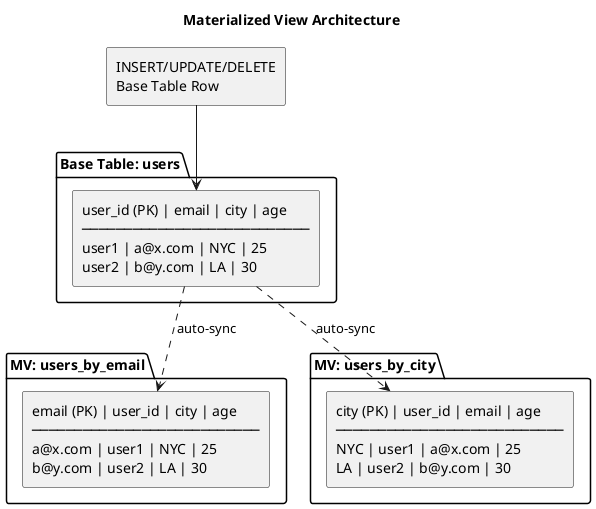
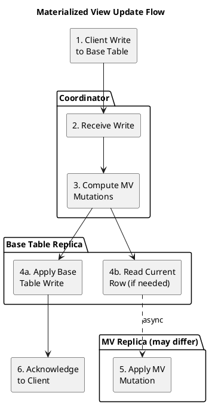

# Materialized Views

Materialized Views (MVs) provide automatic denormalization in Cassandra, maintaining synchronized copies of data with different primary keys. While offering query flexibility, MVs have significant operational considerations that require careful evaluation.

!!! warning "Production Considerations"
    Materialized Views have known consistency and performance limitations. Evaluate carefully before production use. Many deployments prefer application-managed denormalization.

---

## Background and History

### Origins

Materialized Views were introduced in Cassandra 3.0 (2015) to address a common challenge: Cassandra's data model requires designing tables around query patterns, often leading to manual denormalization where the same data is written to multiple tables.

MVs automate this denormalization by having Cassandra maintain additional tables that are synchronized with a base table.

### Design Goals

The MV implementation aimed to provide:

1. **Automatic synchronization**: Base table changes propagate to views
2. **Query flexibility**: Different primary key for alternate access patterns
3. **Consistency**: View data eventually consistent with base table
4. **Reduced application complexity**: No manual multi-table writes

### Evolution and Status

MVs have had a complex production history:

| Version | Status | Notes |
|---------|--------|-------|
| 3.0 (2015) | Introduced | Initial implementation |
| 3.x | Experimental | Known consistency issues discovered |
| 4.0 | Improved | Bug fixes, but still has caveats |
| 4.1+ | Stable with caveats | Production use requires understanding limitations |

The feature remains supported but is not recommended for all use cases.

---

## Architecture

### How Materialized Views Work

When a base table row is modified, Cassandra automatically updates corresponding rows in all materialized views:



### View Update Mechanism

The MV update process involves several steps:



**Key points:**

1. Write arrives at coordinator
2. Coordinator computes what MV rows need to change
3. Base table mutation applied
4. For updates/deletes: current row read to determine old MV key
5. MV mutations sent asynchronously to MV replicas
6. Client acknowledgment based on base table consistency level

### Partition Key Mapping

MVs require that the base table's partition key be part of the view's primary key:

```sql
-- Base table
CREATE TABLE users (
    user_id uuid PRIMARY KEY,
    email text,
    city text,
    age int
);

-- Valid MV: email as partition key, user_id as clustering
CREATE MATERIALIZED VIEW users_by_email AS
    SELECT * FROM users
    WHERE email IS NOT NULL AND user_id IS NOT NULL
    PRIMARY KEY (email, user_id);

-- Valid MV: city as partition key, user_id as clustering
CREATE MATERIALIZED VIEW users_by_city AS
    SELECT * FROM users
    WHERE city IS NOT NULL AND user_id IS NOT NULL
    PRIMARY KEY (city, user_id);

-- INVALID: base table PK not in view PK
CREATE MATERIALIZED VIEW invalid_view AS
    SELECT * FROM users
    WHERE city IS NOT NULL
    PRIMARY KEY (city);  -- Missing user_id
```

This constraint ensures Cassandra can:
- Locate MV rows from base table rows
- Delete MV rows when base rows are deleted
- Maintain referential integrity

---

## Creating Materialized Views

### Basic Syntax

```sql
CREATE MATERIALIZED VIEW [IF NOT EXISTS] keyspace.view_name AS
    SELECT column1, column2, ...
    FROM keyspace.base_table
    WHERE column1 IS NOT NULL [AND column2 IS NOT NULL ...]
    PRIMARY KEY (new_partition_key, clustering_columns);
```

### Examples

```sql
-- View for querying users by email
CREATE MATERIALIZED VIEW users_by_email AS
    SELECT user_id, email, name, city, created_at
    FROM users
    WHERE email IS NOT NULL AND user_id IS NOT NULL
    PRIMARY KEY (email, user_id);

-- View with compound partition key
CREATE MATERIALIZED VIEW orders_by_status_date AS
    SELECT *
    FROM orders
    WHERE status IS NOT NULL
      AND order_date IS NOT NULL
      AND order_id IS NOT NULL
    PRIMARY KEY ((status, order_date), order_id);

-- View with different clustering order
CREATE MATERIALIZED VIEW events_by_type_desc AS
    SELECT *
    FROM events
    WHERE event_type IS NOT NULL
      AND event_time IS NOT NULL
      AND event_id IS NOT NULL
    PRIMARY KEY (event_type, event_time, event_id)
    WITH CLUSTERING ORDER BY (event_time DESC, event_id ASC);
```

### WHERE Clause Requirements

The WHERE clause must include `IS NOT NULL` for all primary key columns:

```sql
-- All PK columns must have IS NOT NULL
CREATE MATERIALIZED VIEW mv AS
    SELECT * FROM base
    WHERE pk_col1 IS NOT NULL      -- Required
      AND pk_col2 IS NOT NULL      -- Required
      AND ck_col1 IS NOT NULL      -- Required
    PRIMARY KEY (pk_col1, pk_col2, ck_col1);

-- Additional filtering allowed (but use cautiously)
CREATE MATERIALIZED VIEW active_users AS
    SELECT * FROM users
    WHERE status IS NOT NULL
      AND user_id IS NOT NULL
      AND status = 'active'        -- Additional filter
    PRIMARY KEY (status, user_id);
```

### View Options

```sql
CREATE MATERIALIZED VIEW mv AS
    SELECT * FROM base_table
    WHERE ...
    PRIMARY KEY (...)
    WITH
        -- Clustering order
        CLUSTERING ORDER BY (col DESC)
        -- Compaction strategy
        AND compaction = {'class': 'LeveledCompactionStrategy'}
        -- Other table properties
        AND gc_grace_seconds = 864000
        AND bloom_filter_fp_chance = 0.01;
```

---

## Querying Materialized Views

MVs are queried like regular tables:

```sql
-- Query view by its partition key
SELECT * FROM users_by_email WHERE email = 'alice@example.com';

-- Range query on clustering column
SELECT * FROM events_by_type
WHERE event_type = 'error'
  AND event_time > '2024-01-01';

-- All standard CQL query capabilities apply
SELECT user_id, name FROM users_by_city
WHERE city = 'NYC'
LIMIT 100;
```

---

## Benefits

### Automatic Synchronization

Primary advantage: Cassandra handles denormalization automatically.

```sql
-- Single write to base table
INSERT INTO users (user_id, email, city) VALUES (uuid(), 'a@x.com', 'NYC');

-- Automatically visible in all views
SELECT * FROM users_by_email WHERE email = 'a@x.com';  -- Returns row
SELECT * FROM users_by_city WHERE city = 'NYC';        -- Returns row
```

### Query Flexibility

Enable queries on non-partition-key columns:

```sql
-- Base table: query by user_id only
SELECT * FROM users WHERE user_id = ?;

-- MV: query by email
SELECT * FROM users_by_email WHERE email = ?;

-- MV: query by city
SELECT * FROM users_by_city WHERE city = ?;
```

### Reduced Application Complexity

Application code writes once; Cassandra maintains consistency:

```python
# Without MV: application manages multiple tables
session.execute("INSERT INTO users ...")
session.execute("INSERT INTO users_by_email ...")
session.execute("INSERT INTO users_by_city ...")
# Must handle partial failures

# With MV: single write
session.execute("INSERT INTO users ...")
# Cassandra propagates to views
```

---

## Limitations and Drawbacks

### Consistency Challenges

MVs provide **eventual consistency**, not strong consistency:

```
Scenario: Write to base table, immediately query view

Timeline:
T0: INSERT INTO users (user_id=X, email='a@x.com')
T1: Client receives acknowledgment (base table written)
T2: SELECT * FROM users_by_email WHERE email='a@x.com'
T3: MV mutation arrives at replica

Problem: If T2 < T3, query returns empty result
```

**Known consistency issues:**

- View may temporarily lag base table
- In rare cases, view and base table may diverge
- Repair needed to reconcile inconsistencies

### Write Amplification

Each base table write generates additional writes:

```
Base table write: 1 mutation
+ 1 MV: 2 mutations total
+ 2 MVs: 3 mutations total
+ N MVs: N+1 mutations total

For updates (not inserts):
- Read-before-write required
- Old row read to compute old MV key
- Delete old MV row + insert new MV row
```

**Impact:**

- Increased write latency
- Higher disk I/O
- More network traffic

### Performance Overhead

MVs add overhead to both reads and writes:

| Operation | Overhead |
|-----------|----------|
| Insert | 1 additional mutation per MV |
| Update | Read-before-write + 2 mutations per MV |
| Delete | Read-before-write + 1 delete per MV |
| Base table read | None |
| View read | None (same as table read) |

### Repair Complexity

MVs complicate repair operations:

```bash
# Repair base table AND views
nodetool repair keyspace base_table
nodetool repair keyspace view_name

# Views should be repaired after base table
# Order matters for consistency
```

### Tombstone Interactions

Tombstones in MVs have unique challenges:

- Deleting base row creates tombstones in all MVs
- gc_grace_seconds applies independently
- Tombstone scan issues can affect views

### Limited Schema Flexibility

MV schema is constrained:

- Cannot add columns to existing MV
- Cannot change MV primary key
- Must drop and recreate for schema changes

---

## When to Use Materialized Views

### Acceptable Use Cases

| Scenario | Rationale |
|----------|-----------|
| Low write volume | Write amplification acceptable |
| Strong eventual consistency acceptable | Read-your-writes not required |
| Simple alternate access pattern | Single column lookup |
| Development/prototyping | Faster iteration |

### Avoid Materialized Views When

| Scenario | Alternative |
|----------|-------------|
| High write throughput | Application-managed denormalization |
| Strong consistency required | Application-managed with logged batches |
| Complex query patterns | Secondary indexes (SAI) |
| Frequent schema changes | Separate tables |
| Many views per table | Reconsider data model |

---

## Alternatives

### Application-Managed Denormalization

Write to multiple tables in application code:

```python
# Write to both tables explicitly
batch = BatchStatement()
batch.add(insert_user_stmt, [user_id, email, city])
batch.add(insert_user_by_email_stmt, [email, user_id, city])
session.execute(batch)
```

**Trade-offs:**

| Aspect | MV | Application-Managed |
|--------|-----|---------------------|
| Consistency | Eventual | Configurable |
| Complexity | Lower | Higher |
| Control | Less | Full |
| Performance | Overhead | Optimizable |
| Schema changes | Difficult | Flexible |

### Secondary Indexes (SAI)

For Cassandra 5.0+, SAI often provides better alternative:

```sql
-- Instead of MV for email lookup
CREATE INDEX ON users (email) USING 'sai';

-- Query directly
SELECT * FROM users WHERE email = 'a@x.com';
```

**SAI advantages over MV:**

- No write amplification
- Simpler operations
- Better consistency
- Lower storage overhead

**MV advantages over SAI:**

- Full partition key control
- Different clustering order
- Wider query patterns

---

## Operations

### Creating Views on Existing Tables

When creating a view on a table with data:

```sql
-- View creation triggers build process
CREATE MATERIALIZED VIEW users_by_email AS ...;

-- Monitor build progress
nodetool viewbuildstatus
```

The build process:
1. Scans base table
2. Populates view incrementally
3. View queries return partial results during build

### Monitoring View Health

```bash
# View build status
nodetool viewbuildstatus

# View metrics
nodetool tablestats keyspace.view_name

# Check for inconsistencies (requires repair)
nodetool repair keyspace base_table
nodetool repair keyspace view_name
```

### Dropping Views

```sql
-- Drop view (does not affect base table)
DROP MATERIALIZED VIEW IF EXISTS users_by_email;
```

### Repair Procedure

Maintain view consistency with regular repair:

```bash
# 1. Repair base table first
nodetool repair keyspace base_table

# 2. Repair each view
nodetool repair keyspace view_name

# For full cluster repair
nodetool repair -pr keyspace base_table
nodetool repair -pr keyspace view_name
```

---

## Best Practices

### Design Guidelines

1. **Limit views per table**: 1-2 views maximum
2. **Consider SAI first**: For Cassandra 5.0+
3. **Understand consistency model**: Accept eventual consistency
4. **Plan for repair**: Include views in repair schedule
5. **Monitor build times**: Large tables take time to build

### Schema Design

```sql
-- Good: Simple alternate lookup
CREATE MATERIALIZED VIEW users_by_email AS
    SELECT user_id, email, name FROM users
    WHERE email IS NOT NULL AND user_id IS NOT NULL
    PRIMARY KEY (email, user_id);

-- Consider carefully: Compound partition key
CREATE MATERIALIZED VIEW orders_by_status_date AS
    SELECT * FROM orders
    WHERE status IS NOT NULL AND ...
    PRIMARY KEY ((status, order_date), order_id);
-- May create hot partitions

-- Avoid: Many columns that change
-- Each column change = view update
```

### Operational Guidelines

| Practice | Rationale |
|----------|-----------|
| Regular repair | Maintain consistency |
| Monitor build status | Track view population |
| Test failover scenarios | Understand consistency during failures |
| Benchmark write impact | Quantify overhead |
| Have rollback plan | Know how to disable if issues arise |

---

## Related Documentation

- **[Index Overview](indexes/index.md)** - Alternative query patterns
- **[SAI](indexes/sai.md)** - Recommended for Cassandra 5.0+
- **[Secondary Indexes](indexes/secondary-indexes.md)** - Legacy indexing
- **[Write Path](write-path.md)** - How writes propagate
- **[Compaction](compaction/index.md)** - View compaction
