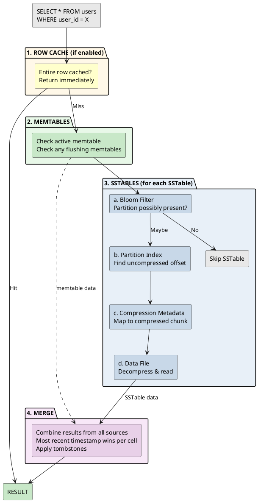
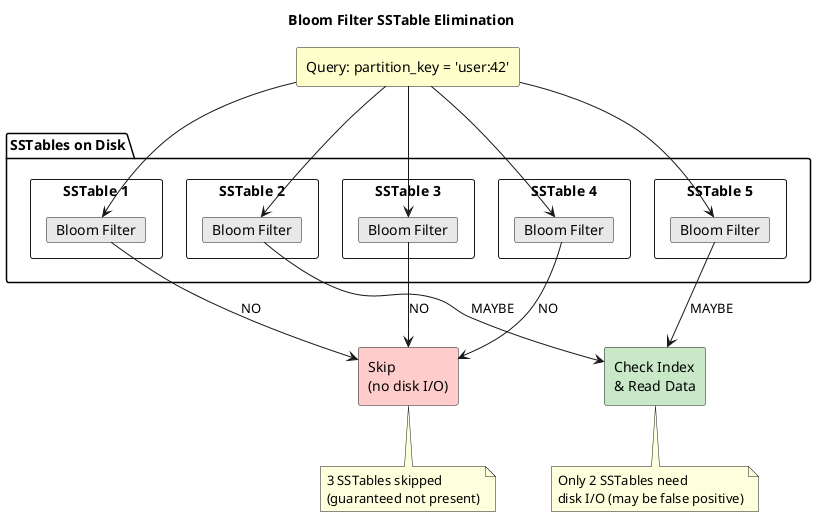
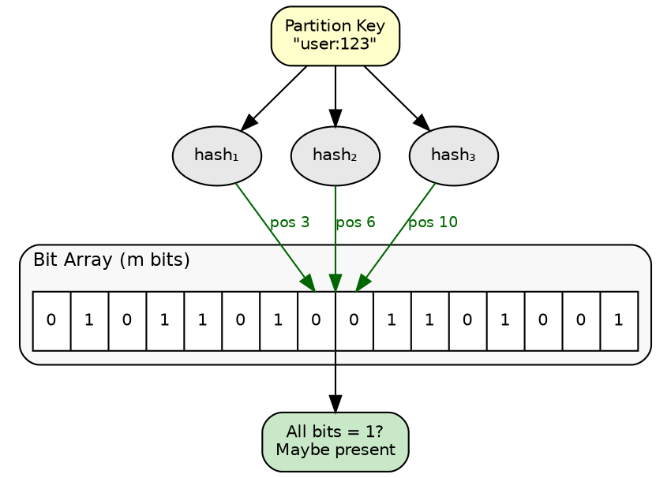
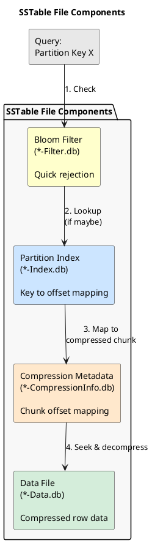
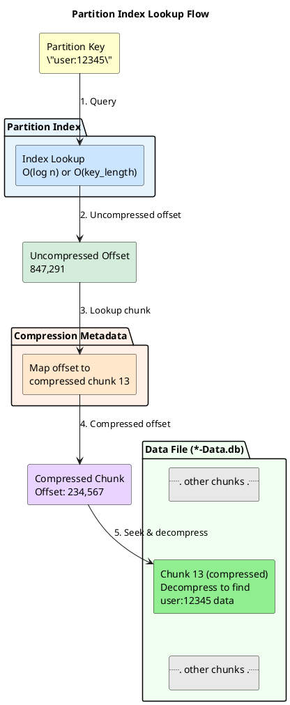
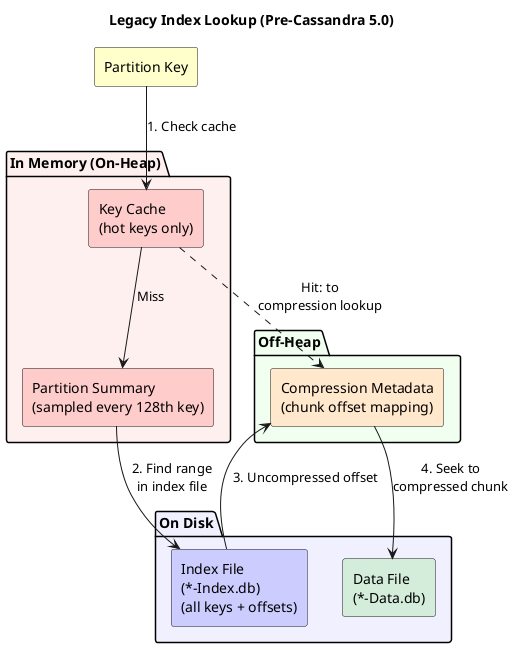
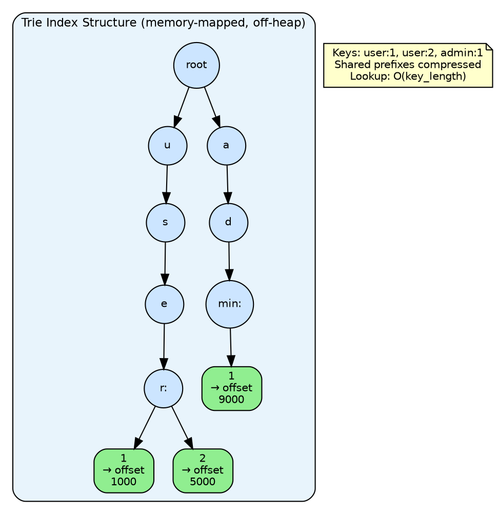

# Read Path

In an LSM-tree storage engine, data for a single partition may exist in multiple locations: the active memtable, any flushing memtables, and numerous SSTables on disk. Unlike B-tree databases where a row exists in exactly one location, Cassandra must check all potential sources and merge results to reconstruct the current state of the data.

This design creates a fundamental trade-off. Writes are fast because they simply append to the memtable, but reads must potentially examine many files. The read path employs several optimization techniques—bloom filters, partition indexes, and row caches—to minimize disk I/O and maintain acceptable read latency despite this multi-source architecture. The BTI (Big Trie Index) format introduced in Cassandra 5.0 uses memory-mapped off-heap indexes, eliminating the need for the key cache used by the legacy index format.

---

## Read Path Overview

When a read request arrives, Cassandra locates and assembles data from multiple storage locations using a tiered approach. Each stage is optimized to either satisfy the query immediately or efficiently narrow down where to search next.

### How the Read Path Achieves High Performance

The LSM-tree architecture enables Cassandra's exceptional write throughput by appending data sequentially rather than updating in place. The read path complements this design with a series of optimizations that efficiently locate and assemble data from multiple sources.

| Location | Contents | Why Data Exists Here |
|----------|----------|---------------------|
| **Active memtable** | Most recent writes | Writes go to memtable first; not yet flushed |
| **Flushing memtables** | Recent writes | Memtable being written to disk; still in memory |
| **SSTable 1** | Older writes | Flushed yesterday |
| **SSTable 2** | Even older writes | Flushed last week |
| **SSTable N** | Historical writes | Flushed months ago, not yet compacted away |

The read path intelligently searches these locations using a layered optimization strategy—bloom filters eliminate unnecessary disk access, indexes enable direct seeks, and caches accelerate repeated access patterns. The result is predictable, low-latency reads even with data distributed across many SSTables.

### The Four Stages (BTI Format)

!!! info "This describes Cassandra 5.0+ with BTI (Big Trie Index)"
    The legacy index format (pre-5.0) includes an additional key cache lookup between the bloom filter and partition index steps. See the [Partition Index](#partition-index) section for details on both formats.

**Stage 1: Row Cache (optional fast path)**

If row caching is enabled for the table and the entire partition is cached in memory, return it immediately. This is the fastest possible path—no memtable or SSTable access required. However, row cache is rarely beneficial (see Row Cache section) and is disabled by default.

**Stage 2: Memtables**

Check the active memtable and any memtables currently being flushed to disk. Memtables are in-memory sorted structures, so lookups are fast (O(log n)). Data found here represents the most recent writes that have not yet been persisted to SSTables.

**Stage 3: SSTables**

For each SSTable that might contain the partition:

1. **Bloom filter check**: A probabilistic filter answers "Is this partition possibly in this SSTable?" If the answer is "definitely no," skip this SSTable entirely—no disk I/O required. If "maybe yes," proceed to the next step.

2. **Partition index lookup**: Find the uncompressed byte offset where this partition's data begins in the data file. This is an O(log n) or O(key_length) operation depending on the index format.

3. **Compression metadata lookup**: If the SSTable is compressed (default), translate the uncompressed offset to the actual compressed chunk position on disk. The compression metadata maps uncompressed offsets to compressed chunk boundaries.

4. **Data file read**: Seek to the compressed chunk, decompress it, and read the partition's data.

This four-step process is repeated for each SSTable. Bloom filters make this scalable—they eliminate the vast majority of SSTables from consideration with a simple memory lookup, keeping read latency consistent even as SSTable count grows.

**Stage 4: Merge**

Data fragments from memtables and SSTables are merged into a single result:

- **Timestamp comparison**: For each cell (column value), the version with the highest timestamp wins
- **Tombstone application**: Deleted data (marked with tombstones) is filtered out
- **TTL expiration**: Expired data is excluded from the result

The merge process reconstructs the current state of the partition from its distributed fragments.

### Why This Order?

The stages are ordered by cost and likelihood of success:

| Stage | Cost | Rationale |
|-------|------|-----------|
| Row cache | Lowest (memory lookup) | If hit, avoids all other work; checked first |
| Memtables | Low (memory, sorted structure) | Contains newest data; must be checked before SSTables |
| SSTables | High (disk I/O) | Bloom filters minimize unnecessary disk access |
| Merge | CPU-bound | Only performed after all data is collected |

Memtables must be checked before SSTables because they contain more recent writes. If an SSTable contains `column=A, value=1, timestamp=100` and the memtable contains `column=A, value=2, timestamp=200`, the memtable's value must win—but both must be read to make this determination.



---

## Bloom Filters

Bloom filters are probabilistic data structures that quickly determine if a partition key is **possibly** present in an SSTable. They were introduced by Burton Howard Bloom in 1970 ([Bloom, B.H., 1970, "Space/Time Trade-offs in Hash Coding with Allowable Errors"](https://dl.acm.org/doi/10.1145/362686.362692)).

### Why Bloom Filters Are Essential in Cassandra

The LSM-tree architecture creates a fundamental read challenge: data for a single partition may be spread across dozens or hundreds of SSTables. Without optimization, reading a single row could require checking every SSTable on disk.

| Scenario | SSTables to Check | Disk I/O Without Bloom Filters |
|----------|-------------------|-------------------------------|
| New table | 5-10 | 5-10 disk seeks per read |
| Mature table | 50-100 | 50-100 disk seeks per read |
| Write-heavy workload | 200+ | 200+ disk seeks per read |

Bloom filters solve this by providing a **space-efficient probabilistic test** for set membership. For each SSTable, Cassandra maintains a bloom filter in memory that can answer: "Is partition key X possibly in this SSTable?"

- **"Definitely NO"** → Skip this SSTable entirely (no disk I/O)
- **"Maybe YES"** → Check the index and data files (may be a false positive)

The critical property: **false negatives are impossible**. If the bloom filter says "no," the partition is guaranteed not to be in that SSTable. This allows Cassandra to eliminate most SSTables from consideration without any disk access.



### How Bloom Filters Work

A bloom filter consists of a bit array of *m* bits and *k* independent hash functions. Both insertion and lookup are O(k) operations—constant time regardless of how many elements are stored.

**Insertion:**

When a partition key is added to the SSTable, it is hashed with *k* different hash functions. Each hash function produces a position in the bit array, and those *k* bits are set to 1.

**Lookup:**

To check if a key exists, hash it with the same *k* functions and check the corresponding bits:

- If **all** *k* bits are 1 → the key is **possibly** present (could be a false positive)
- If **any** bit is 0 → the key is **definitely not** present (guaranteed)



### False Positive Probability

False positives occur when different keys happen to set the same bit positions. The probability of a false positive depends on:

- *m* = number of bits in the array
- *n* = number of elements inserted
- *k* = number of hash functions

The optimal number of hash functions and the false positive probability are:

$$
k_{\text{optimal}} = \frac{m}{n} \ln 2
$$

$$
P_{\text{false positive}} \approx \left(1 - e^{-kn/m}\right)^k
$$

In practice, Cassandra uses the `bloom_filter_fp_chance` setting to configure the desired false positive rate, and calculates the required bit array size accordingly.

### Impact on Read Performance

Consider a read that must check 100 SSTables:

| Bloom Filter FP Rate | Expected False Positives | Disk Reads Avoided |
|---------------------|-------------------------|-------------------|
| 1% (default) | 1 | 99 |
| 0.1% | 0.1 | 99.9 |
| 10% | 10 | 90 |

With the default 1% false positive rate, bloom filters eliminate approximately 99% of unnecessary SSTable reads. The trade-off is memory: lower false positive rates require larger bit arrays.

### Configuration

```sql
-- Default false positive rate: 1%
-- Lower = more accurate, more memory
-- Higher = less accurate, less memory

-- Read-heavy table with many SSTables
ALTER TABLE hot_reads WITH bloom_filter_fp_chance = 0.001;

-- Write-heavy table where reads are rare
ALTER TABLE write_heavy WITH bloom_filter_fp_chance = 0.1;

-- Check current setting
SELECT bloom_filter_fp_chance FROM system_schema.tables
WHERE keyspace_name = 'ks' AND table_name = 'table';
```

### Memory Usage

```
Bloom filter size ≈ -1.44 × log2(fp_chance) × partition_count

Example for 10 million partitions:
- fp_chance = 0.01:  ~10 bits/key = 12.5 MB per SSTable
- fp_chance = 0.001: ~14 bits/key = 17.5 MB per SSTable
- fp_chance = 0.1:   ~5 bits/key = 6.25 MB per SSTable
```

### Monitoring

```bash
# Check bloom filter effectiveness
nodetool tablestats keyspace.table | grep -i bloom

# JMX metrics
# BloomFilterFalsePositives - count of false positives
# BloomFilterFalseRatio - false positive rate
```

---

## Partition Index

Once a bloom filter indicates that a partition key is **possibly** present in an SSTable, the next step is to find the exact byte offset where that partition's data begins in the data file. This is the role of the partition index.

### The Problem: Finding Data on Disk

Each SSTable consists of multiple files. The data file (`*-Data.db`) contains the actual row data, but it may be gigabytes in size. Without an index, finding a specific partition would require scanning the entire file sequentially—an O(n) operation that would make reads impossibly slow.



The partition index provides an O(log n) or O(key_length) lookup to translate a partition key into a byte offset, enabling direct disk seeks to the data location.

### How the Index Lookup Works

After the bloom filter returns "maybe present," the read path consults the partition index:

1. **Look up the partition key** in the index structure
2. **Retrieve the uncompressed byte offset** where the partition begins
3. **Look up compression metadata** to find the compressed chunk containing that offset
4. **Seek to the compressed chunk**, decompress it, and read the partition data



### Index Evolution

Cassandra's partition index implementation has evolved significantly to improve memory efficiency and lookup performance.

#### Pre-Cassandra 5.0: Legacy Index

The original index architecture used a three-tier system:



**How the legacy index worked:**

1. **Key Cache** (heap): Stores recently accessed partition key → offset mappings. Cache hit = skip to compression metadata lookup.
2. **Partition Summary** (heap): A sampled index that stores every Nth key (default: every 128th). Provides a starting point for binary search in the index file.
3. **Index File** (disk): Contains all partition keys and their data file offsets, sorted by token order.
4. **Compression Metadata** (off-heap): Maps uncompressed offsets to compressed chunk positions.

**Lookup process for cache miss:**

1. Binary search the partition summary to find the range containing the key
2. Seek to that position in the index file
3. Scan/binary search within the index file to find the exact key
4. Read the uncompressed data file offset
5. Look up compression metadata to find the compressed chunk
6. Seek to the compressed chunk and decompress

**Problems with the legacy approach:**

| Issue | Impact |
|-------|--------|
| Heap memory consumption | Partition summary grows with partition count; causes GC pressure |
| Multiple disk seeks | Summary → Index File → Data File = 2-3 seeks per read |
| Memory scales with data | More partitions = more heap required |
| Index file size | Full copy of every partition key on disk |

#### Cassandra 5.0+: Trie-Based Index (BTI)

Cassandra 5.0 introduced a new index format based on tries (prefix trees), implemented in [CASSANDRA-18398](https://issues.apache.org/jira/browse/CASSANDRA-18398). This approach was inspired by research on succinct data structures and space-efficient tries.



**How the trie index works:**

1. Partition keys are stored in a trie structure where common prefixes are shared
2. The trie is serialized to disk and memory-mapped (off-heap)
3. Lookup traverses the trie character by character: O(key_length)
4. Leaf nodes contain the byte offset into the data file

**Advantages of the trie index:**

| Improvement | Benefit |
|-------------|---------|
| **Off-heap** | No GC pressure; memory-mapped from disk |
| **Prefix compression** | Keys sharing prefixes stored once; 50-80% smaller |
| **O(key_length) lookup** | Consistent performance regardless of partition count |
| **Single disk read** | Trie traversal finds offset directly; no summary + index two-step |
| **Better for long keys** | Prefix sharing particularly effective for UUIDs, paths |

**Size comparison:**

| Index Type | 10M Partitions (UUID keys) | Memory Type |
|------------|---------------------------|-------------|
| Legacy (summary) | ~200-400 MB heap | On-heap |
| Trie | ~50-100 MB | Off-heap (mmap) |

### Key Cache (Legacy Index Only)

!!! warning "BTI Format Does Not Use Key Cache"
    Starting with Cassandra 5.0, the default BTI (Big Trie Index) format does not use the key cache. The trie-based index is already memory-mapped and provides efficient O(key_length) lookups without caching. Key cache settings are only relevant for SSTables using the legacy index format (Cassandra 4.x and earlier).

The key cache stores partition key → SSTable offset mappings in memory, bypassing index lookups entirely for frequently accessed partitions. This optimization is only relevant for the legacy index format.

```yaml
# cassandra.yaml (legacy index only)

# Global key cache size
key_cache_size_in_mb: 100

# Keys to save when flushing cache to disk
key_cache_keys_to_save: 10000

# How often to save key cache (seconds)
key_cache_save_period: 14400  # 4 hours
```

```sql
-- Per-table key cache settings (legacy index only)
ALTER TABLE hot_table WITH caching = {'keys': 'ALL'};
ALTER TABLE cold_table WITH caching = {'keys': 'NONE'};
```

**When key cache helps (legacy index):**

- Tables with hot partitions accessed repeatedly
- Read-heavy workloads with temporal locality
- Partitions that are read more often than they are written

**Key cache lookup flow (legacy index):**

1. Hash the partition key
2. Check key cache for (SSTable ID, partition key) → offset mapping
3. **Hit**: Seek directly to data file offset (skip bloom filter and index)
4. **Miss**: Fall back to bloom filter → index lookup path

---

## Row Cache

Row cache stores entire rows in memory. Use with caution—it is rarely beneficial.

### Configuration

```yaml
# cassandra.yaml (disabled by default)
row_cache_size_in_mb: 0
```

```sql
-- Enable per-table
ALTER TABLE hot_config WITH caching = {
    'keys': 'ALL',
    'rows_per_partition': 10
};

-- Cache all rows
ALTER TABLE tiny_lookup WITH caching = {
    'keys': 'ALL',
    'rows_per_partition': 'ALL'
};
```

### When Row Cache Helps

- Very small number of extremely hot rows
- Rows that rarely change
- Read latency is critical

### When Row Cache Hurts

- High cardinality (many unique partitions)
- Write-heavy tables (invalidation overhead)
- Large rows (memory waste)
- Random access patterns (low hit rate)

---

## SSTable Read Performance

Read latency scales with the number of SSTables that must be checked.

### Latency Calculation

```
Read Latency ≈ (SSTables_checked × lookup_time) + merge_time

Well-compacted table (2 SSTables):
- Bloom filter checks: 2 × 0.1ms = 0.2ms
- Index lookups: 2 × 0.5ms = 1ms
- Data reads: 2 × 1ms = 2ms
- Total: ~3.2ms

Poorly compacted table (50 SSTables):
- Bloom filter checks: 50 × 0.1ms = 5ms
- Index lookups (10 pass bloom): 10 × 0.5ms = 5ms
- Data reads: 10 × 1ms = 10ms
- Merge time: ~2ms
- Total: ~22ms
```

### Monitoring SSTable Count

```bash
# SSTable count per table
nodetool tablestats keyspace.table | grep "SSTable count"

# SSTables accessed per read
nodetool tablehistograms keyspace.table
# Look for "SSTable Count per Read"
```

### Reducing SSTable Count

- Ensure compaction keeps pace with writes
- Use appropriate compaction strategy
- Run `nodetool compact` for immediate compaction (use sparingly)

---

## Read Consistency

The coordinator waits for responses from replicas based on consistency level.

| Consistency Level | Replicas Contacted | Replicas Required |
|-------------------|-------------------|-------------------|
| ONE | 1 | 1 |
| QUORUM | (RF/2)+1 | (RF/2)+1 |
| LOCAL_QUORUM | (local RF/2)+1 | (local RF/2)+1 |
| ALL | RF | RF |

### Read Repair

When replicas return different data, read repair synchronizes them:

- **Blocking read repair**: Repair before returning result (slower, stronger consistency)
- **Background read repair**: Repair after returning result (faster, eventual consistency)

```sql
-- Configure read repair chance
ALTER TABLE my_table WITH read_repair_chance = 0.1;
ALTER TABLE my_table WITH dclocal_read_repair_chance = 0.1;
```

---

## Read Performance Tuning

### Optimize for Read-Heavy Workloads

```yaml
# More concurrent reads
concurrent_reads: 64

# Larger key cache (legacy index only - not used with BTI format)
# key_cache_size_in_mb: 200
```

```sql
-- Lower bloom filter false positive rate
ALTER TABLE hot_reads WITH bloom_filter_fp_chance = 0.001;

-- Use LCS for fewer SSTables
ALTER TABLE hot_reads WITH compaction = {
    'class': 'LeveledCompactionStrategy',
    'sstable_size_in_mb': 160
};
```

### Monitoring Read Performance

```bash
# Read latency
nodetool proxyhistograms
nodetool tablehistograms keyspace.table

# JMX metrics
# ClientRequest.Read.Latency
# Table.ReadLatency
# Table.SSTablesPerReadHistogram
```

---

## Troubleshooting

### High Read Latency

**Diagnosis:**

```bash
nodetool proxyhistograms          # Coordinator latency
nodetool tablehistograms ks.table # Local latency
nodetool tablestats ks.table      # SSTable count, bloom filter stats
```

**Common Causes:**

| Symptom | Cause | Solution |
|---------|-------|----------|
| High SSTable count | Compaction behind | Check compaction stats |
| High bloom filter false positives | fp_chance too high | Lower fp_chance |
| Many tombstones scanned | Delete-heavy workload | Review data model |
| High index lookup time | Large partitions, disk I/O | Ensure SSDs, check partition sizes |

### Tombstone Warnings

```
"Read X live rows and Y tombstone cells"
```

See [Tombstones](tombstones.md) for diagnosis and resolution.

---

## Related Documentation

- **[Storage Engine Overview](index.md)** - Architecture overview
- **[Write Path](write-path.md)** - How writes work
- **[SSTable Reference](sstables.md)** - SSTable file format
- **[Tombstones](tombstones.md)** - Deletion markers
