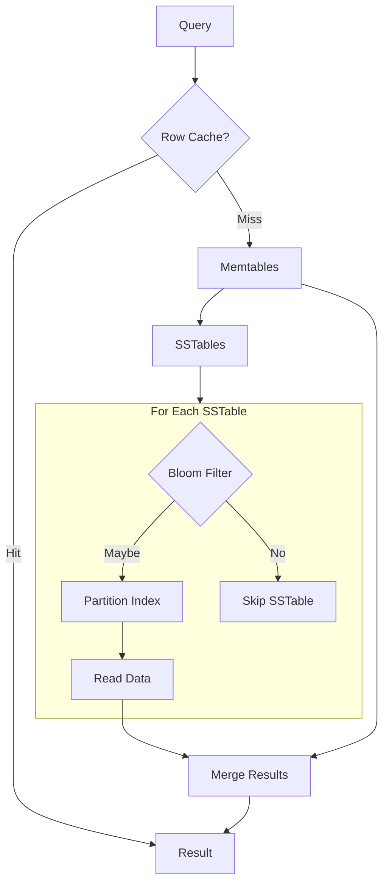

# Read Path

In an LSM-tree storage engine, data for a single partition may exist in multiple locations: the active memtable, any flushing memtables, and numerous SSTables on disk. Unlike B-tree databases where a row exists in exactly one location, Cassandra must check all potential sources and merge results to reconstruct the current state of the data.

This design creates a fundamental trade-off. Writes are fast because they simply append to the memtable, but reads must potentially examine many files. The read path employs several optimization techniques—bloom filters, partition indexes, key caches, and row caches—to minimize disk I/O and maintain acceptable read latency despite this multi-source architecture.

---

## Read Path Overview

```
┌─────────────────────────────────────────────────────────────────┐
│ READ PATH: SELECT * FROM users WHERE user_id = X                 │
│                                                                  │
│ ┌──────────────────────────────────────────────────────────────┐ │
│ │ 1. ROW CACHE (if enabled)                                    │ │
│ │    Entire row cached? Return immediately.                    │ │
│ └──────────────────────────────────────────────────────────────┘ │
│                         │ Miss                                   │
│                         v                                        │
│ ┌──────────────────────────────────────────────────────────────┐ │
│ │ 2. MEMTABLE(S)                                               │ │
│ │    Check active memtable                                     │ │
│ │    Check any flushing memtables                              │ │
│ └──────────────────────────────────────────────────────────────┘ │
│                         │                                        │
│                         v                                        │
│ ┌──────────────────────────────────────────────────────────────┐ │
│ │ 3. SSTABLES (for each SSTable):                              │ │
│ │    a. Bloom Filter - partition possibly present?             │ │
│ │    b. Partition Index - find data offset                     │ │
│ │    c. Data File - read partition data                        │ │
│ └──────────────────────────────────────────────────────────────┘ │
│                         │                                        │
│                         v                                        │
│ ┌──────────────────────────────────────────────────────────────┐ │
│ │ 4. MERGE                                                     │ │
│ │    Combine results from all sources                          │ │
│ │    Most recent timestamp wins per cell                       │ │
│ │    Apply tombstones                                          │ │
│ └──────────────────────────────────────────────────────────────┘ │
│                         │                                        │
│                         v                                        │
│                      RESULT                                      │
└─────────────────────────────────────────────────────────────────┘
```



---

## Bloom Filters

Bloom filters are probabilistic data structures that quickly determine if a partition key is **possibly** present in an SSTable.

### How Bloom Filters Work

```
Query: "Is partition key X in this SSTable?"

Bloom filter response:
- "Definitely NO"  → Skip this SSTable (no disk I/O)
- "Maybe YES"      → Check index and data (may be false positive)

False positives possible, false negatives impossible.
```

### Bloom Filter Structure

```
Bit array: [0,1,0,1,1,0,1,0,0,1,1,0,1,0,0,1]

For each partition key:
- Hash with K functions → K bit positions
- Set those bits to 1

Query key X:
- Hash with same K functions → K bit positions
- If ALL bits are 1 → "Maybe present"
- If ANY bit is 0 → "Definitely not present"
```

### Configuration

```sql
-- Default false positive rate: 1%
-- Lower = more accurate, more memory
-- Higher = less accurate, less memory

-- Read-heavy table with many SSTables
ALTER TABLE hot_reads WITH bloom_filter_fp_chance = 0.001;

-- Write-heavy table where reads are rare
ALTER TABLE write_heavy WITH bloom_filter_fp_chance = 0.1;

-- Check current setting
SELECT bloom_filter_fp_chance FROM system_schema.tables
WHERE keyspace_name = 'ks' AND table_name = 'table';
```

### Memory Usage

```
Bloom filter size ≈ -1.44 × log2(fp_chance) × partition_count

Example for 10 million partitions:
- fp_chance = 0.01:  ~10 bits/key = 12.5 MB per SSTable
- fp_chance = 0.001: ~14 bits/key = 17.5 MB per SSTable
- fp_chance = 0.1:   ~5 bits/key = 6.25 MB per SSTable
```

### Monitoring

```bash
# Check bloom filter effectiveness
nodetool tablestats keyspace.table | grep -i bloom

# JMX metrics
# BloomFilterFalsePositives - count of false positives
# BloomFilterFalseRatio - false positive rate
```

---

## Partition Index

The partition index maps partition keys to byte offsets in the data file.

### Index Evolution

**Pre-Cassandra 4.0 (Legacy Index):**

```
┌─────────────┐     ┌─────────────┐     ┌─────────────┐
│ Key Cache   │────>│ Partition   │────>│ Partition   │
│ (in memory) │     │ Summary     │     │ Index File  │
│             │     │ (sampled)   │     │ (all keys)  │
└─────────────┘     └─────────────┘     └─────────────┘

Problems:
- Summary consumes heap
- Index file requires disk seek
- Memory scales with partition count
```

**Cassandra 4.0+ (Trie Index):**

```
┌─────────────────────────────────────┐
│ Trie Index                          │
│ - Off-heap, memory-mapped           │
│ - Shared prefixes = compression     │
│ - O(key_length) lookup              │
└─────────────────────────────────────┘

Benefits:
- 50-80% smaller than legacy
- No heap usage
- Single disk read to find partition
```

### Key Cache

The key cache stores partition key to SSTable offset mappings, avoiding index lookups for hot partitions.

```yaml
# cassandra.yaml

key_cache_size_in_mb: 100
key_cache_keys_to_save: 10000
key_cache_save_period: 14400  # 4 hours
```

```sql
-- Per-table key cache settings
ALTER TABLE hot_table WITH caching = {'keys': 'ALL'};
ALTER TABLE cold_table WITH caching = {'keys': 'NONE'};
```

---

## Row Cache

Row cache stores entire rows in memory. Use with caution—it is rarely beneficial.

### Configuration

```yaml
# cassandra.yaml (disabled by default)
row_cache_size_in_mb: 0
```

```sql
-- Enable per-table
ALTER TABLE hot_config WITH caching = {
    'keys': 'ALL',
    'rows_per_partition': 10
};

-- Cache all rows
ALTER TABLE tiny_lookup WITH caching = {
    'keys': 'ALL',
    'rows_per_partition': 'ALL'
};
```

### When Row Cache Helps

- Very small number of extremely hot rows
- Rows that rarely change
- Read latency is critical

### When Row Cache Hurts

- High cardinality (many unique partitions)
- Write-heavy tables (invalidation overhead)
- Large rows (memory waste)
- Random access patterns (low hit rate)

---

## SSTable Read Performance

Read latency scales with the number of SSTables that must be checked.

### Latency Calculation

```
Read Latency ≈ (SSTables_checked × lookup_time) + merge_time

Well-compacted table (2 SSTables):
- Bloom filter checks: 2 × 0.1ms = 0.2ms
- Index lookups: 2 × 0.5ms = 1ms
- Data reads: 2 × 1ms = 2ms
- Total: ~3.2ms

Poorly compacted table (50 SSTables):
- Bloom filter checks: 50 × 0.1ms = 5ms
- Index lookups (10 pass bloom): 10 × 0.5ms = 5ms
- Data reads: 10 × 1ms = 10ms
- Merge time: ~2ms
- Total: ~22ms
```

### Monitoring SSTable Count

```bash
# SSTable count per table
nodetool tablestats keyspace.table | grep "SSTable count"

# SSTables accessed per read
nodetool tablehistograms keyspace.table
# Look for "SSTable Count per Read"
```

### Reducing SSTable Count

- Ensure compaction keeps pace with writes
- Use appropriate compaction strategy
- Run `nodetool compact` for immediate compaction (use sparingly)

---

## Read Consistency

The coordinator waits for responses from replicas based on consistency level.

| Consistency Level | Replicas Contacted | Replicas Required |
|-------------------|-------------------|-------------------|
| ONE | 1 | 1 |
| QUORUM | (RF/2)+1 | (RF/2)+1 |
| LOCAL_QUORUM | (local RF/2)+1 | (local RF/2)+1 |
| ALL | RF | RF |

### Read Repair

When replicas return different data, read repair synchronizes them:

- **Blocking read repair**: Repair before returning result (slower, stronger consistency)
- **Background read repair**: Repair after returning result (faster, eventual consistency)

```sql
-- Configure read repair chance
ALTER TABLE my_table WITH read_repair_chance = 0.1;
ALTER TABLE my_table WITH dclocal_read_repair_chance = 0.1;
```

---

## Read Performance Tuning

### Optimize for Read-Heavy Workloads

```yaml
# Larger key cache
key_cache_size_in_mb: 200

# More concurrent reads
concurrent_reads: 64
```

```sql
-- Lower bloom filter false positive rate
ALTER TABLE hot_reads WITH bloom_filter_fp_chance = 0.001;

-- Use LCS for fewer SSTables
ALTER TABLE hot_reads WITH compaction = {
    'class': 'LeveledCompactionStrategy',
    'sstable_size_in_mb': 160
};
```

### Monitoring Read Performance

```bash
# Read latency
nodetool proxyhistograms
nodetool tablehistograms keyspace.table

# JMX metrics
# ClientRequest.Read.Latency
# Table.ReadLatency
# Table.SSTablesPerReadHistogram
```

---

## Troubleshooting

### High Read Latency

**Diagnosis:**

```bash
nodetool proxyhistograms          # Coordinator latency
nodetool tablehistograms ks.table # Local latency
nodetool tablestats ks.table      # SSTable count, bloom filter stats
```

**Common Causes:**

| Symptom | Cause | Solution |
|---------|-------|----------|
| High SSTable count | Compaction behind | Check compaction stats |
| High bloom filter false positives | fp_chance too high | Lower fp_chance |
| Many tombstones scanned | Delete-heavy workload | Review data model |
| Low key cache hit rate | Cache too small | Increase cache size |

### Tombstone Warnings

```
"Read X live rows and Y tombstone cells"
```

See [Tombstones](tombstones.md) for diagnosis and resolution.

---

## Related Documentation

- **[Storage Engine Overview](index.md)** - Architecture overview
- **[Write Path](write-path.md)** - How writes work
- **[SSTable Reference](sstables.md)** - SSTable file format
- **[Tombstones](tombstones.md)** - Deletion markers
