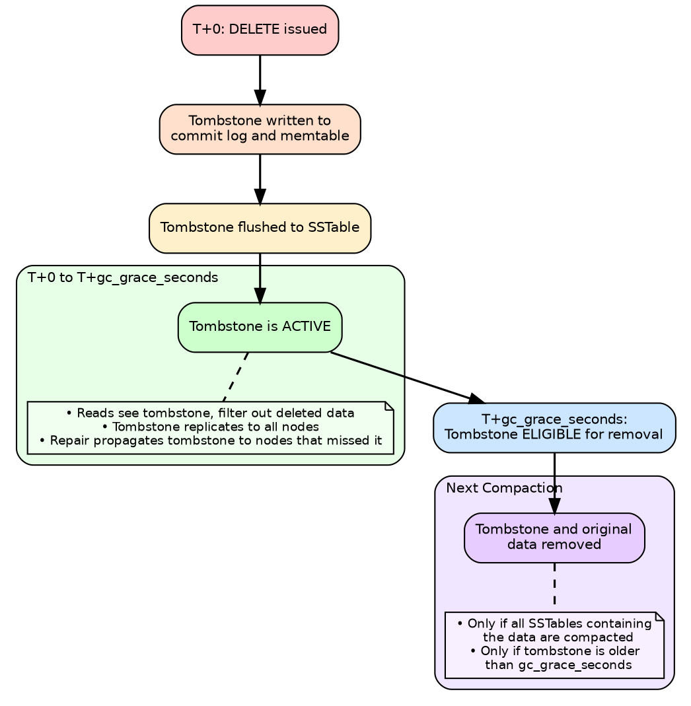

# Tombstones

Tombstones are deletion markers in Cassandra. Because SSTables are immutable, deleted data cannot be removed immediately—a tombstone is written to mark data as deleted, which is applied during reads and removed during compaction.

## Tombstone Types

### Cell Tombstone

Deletes a single column value.

```sql
DELETE email FROM users WHERE user_id = 123;
```

Creates a tombstone for the `email` column in the specified row.

### Row Tombstone

Deletes an entire row (all columns for a clustering key).

```sql
DELETE FROM events WHERE user_id = 123 AND event_id = 456;
```

Creates a tombstone for the entire row identified by the clustering key.

### Range Tombstone

Deletes a range of rows within a partition.

```sql
DELETE FROM messages
WHERE conversation_id = 'abc'
  AND sent_at >= '2024-01-01'
  AND sent_at < '2024-02-01';
```

Creates a single tombstone covering all rows in the specified clustering key range.

### Partition Tombstone

Deletes an entire partition.

```sql
DELETE FROM users WHERE user_id = 123;
```

If `user_id` is the partition key, this creates a partition tombstone affecting all rows in the partition.

### TTL Tombstone

Created automatically when a TTL expires.

```sql
INSERT INTO sessions (id, data) VALUES ('xyz', '...') USING TTL 3600;
```

After 3600 seconds, each cell becomes a tombstone.

---

## Tombstone Lifecycle



---

## GC Grace Period

The `gc_grace_seconds` setting determines how long tombstones are preserved before removal.

### Default Value

```sql
-- Default: 10 days (864000 seconds)
SELECT gc_grace_seconds FROM system_schema.tables
WHERE keyspace_name = 'ks' AND table_name = 'table';
```

### Why GC Grace Matters

```
Scenario: Node C is down during a DELETE (RF=3)

Before DELETE:
  Node A: user_id=123 → "Alice"
  Node B: user_id=123 → "Alice"
  Node C: user_id=123 → "Alice"  [OFFLINE]

DELETE user WHERE user_id = 123 (CL=QUORUM)

After DELETE:
  Node A: user_id=123 → TOMBSTONE
  Node B: user_id=123 → TOMBSTONE
  Node C: user_id=123 → "Alice"  [Still has old data]

If Node C returns AFTER gc_grace_seconds:
  - Tombstones on A and B may have been compacted away
  - Node C still has "Alice"
  - Read repair sees Node C has data, A and B do not
  - "Alice" gets RESURRECTED (zombie data)
```

### Configuration Guidelines

| Scenario | gc_grace_seconds | Repair Frequency |
|----------|------------------|------------------|
| Default | 864000 (10 days) | Weekly |
| Frequent repair | 172800 (2 days) | Daily |
| Time-series with TTL | 86400 (1 day) | Daily |
| High churn (careful) | 3600 (1 hour) | Hourly |

```sql
-- Adjust per table
ALTER TABLE my_table WITH gc_grace_seconds = 172800;
```

**Rule:** `gc_grace_seconds` must exceed maximum expected node downtime plus repair interval.

---

## Tombstone Configuration

### Warning and Failure Thresholds

```yaml
# cassandra.yaml

# Warn when query scans this many tombstones
tombstone_warn_threshold: 1000

# Fail query when this many tombstones scanned
tombstone_failure_threshold: 100000
```

When exceeded:

```
WARN: Read X live rows and Y tombstone cells for query...
ERROR: Scanned over 100000 tombstones; query aborted
```

---

## Tombstone Problems

### Problem 1: Tombstone Accumulation

**Symptoms:**

- Read latency increasing over time
- "Read X live rows and Y tombstone cells" warnings
- Query timeouts on specific partitions

**Causes:**

- Deleting many rows without compaction
- Wide partitions with frequent deletes
- Range deletes creating overlapping tombstones

**Investigation:**

```bash
# Check tombstone warnings
grep "tombstone" /var/log/cassandra/system.log

# Table statistics
nodetool tablestats keyspace.table | grep -i tombstone

# Per-SSTable tombstone analysis
tools/bin/sstablemetadata /path/to/na-*-Data.db | grep -i tombstone
```

### Problem 2: Query Failures

**Error:**

```
Scanned over 100000 tombstones; query aborted
```

**Solutions (in order of preference):**

1. Fix data model to avoid tombstone accumulation
2. Force compaction to remove eligible tombstones
3. Add time-based partitioning to limit partition size
4. Increase threshold (last resort—hides the problem)

### Problem 3: Partition Tombstones with Wide Partitions

**Bad pattern:**

```
Partition: user_id=123
├── Row: event_1 → data
├── Row: event_2 → data
├── ... 100,000 rows ...
└── Row: event_100000 → data

DELETE FROM events WHERE user_id = 123;

Creates ONE partition tombstone, but on read, must check
against ALL rows in all SSTables = massive read amplification
```

**Better pattern:**

```sql
-- Partition by user_id AND date
-- Delete smaller partitions
DELETE FROM events
WHERE user_id = 123 AND event_date = '2024-01-15';
```

---

## Monitoring Tombstones

### nodetool Commands

```bash
# Table statistics including tombstone info
nodetool tablestats keyspace.table

# Tombstones per read histogram
nodetool tablehistograms keyspace.table
```

### JMX Metrics

```
org.apache.cassandra.metrics:type=Table,name=TombstoneScannedHistogram
org.apache.cassandra.metrics:type=Table,name=LiveScannedHistogram
```

### SSTable Analysis

```bash
# Check tombstone counts per SSTable
for f in /var/lib/cassandra/data/ks/table-*/*-Data.db; do
    echo "=== $f ==="
    tools/bin/sstablemetadata "$f" | grep -i tombstone
done
```

---

## Reducing Tombstones

### Data Model Changes

1. **Avoid wide partitions with deletes**
   - Add time bucketing to partition key
   - Limit partition size

2. **Use TTL instead of explicit deletes**
   - TTL tombstones are more predictable
   - Easier to reason about cleanup

3. **Avoid range deletes on large ranges**
   - Delete smaller ranges
   - Use time-based partitioning

### Compaction Strategies

**TWCS (Time-Window Compaction Strategy):**

Best for time-series data with TTL. Entire SSTables drop when all data expires.

```sql
ALTER TABLE metrics WITH compaction = {
    'class': 'TimeWindowCompactionStrategy',
    'compaction_window_size': 1,
    'compaction_window_unit': 'DAYS'
};
```

**LCS (Leveled Compaction Strategy):**

Keeps SSTable count low, improving tombstone cleanup.

```sql
ALTER TABLE events WITH compaction = {
    'class': 'LeveledCompactionStrategy'
};
```

### Manual Compaction

Force compaction to remove eligible tombstones:

```bash
# Compact specific table
nodetool compact keyspace table

# Major compaction (use sparingly)
nodetool compact --user-defined /path/to/sstables
```

---

## Tombstone Best Practices

### Design

- Partition by time for time-series data
- Keep partitions bounded in size
- Prefer TTL over explicit deletes when possible

### Operations

- Run repair within gc_grace_seconds
- Monitor tombstone counts per read
- Investigate tables with high tombstone warnings

### Configuration

- Set gc_grace_seconds based on repair frequency
- Set tombstone thresholds appropriately
- Use TWCS for TTL-heavy workloads

---

## Related Documentation

- **[Storage Engine Overview](index.md)** - Architecture overview
- **[Read Path](read-path.md)** - How tombstones affect reads
- **[Compaction](../compaction/index.md)** - Tombstone removal
