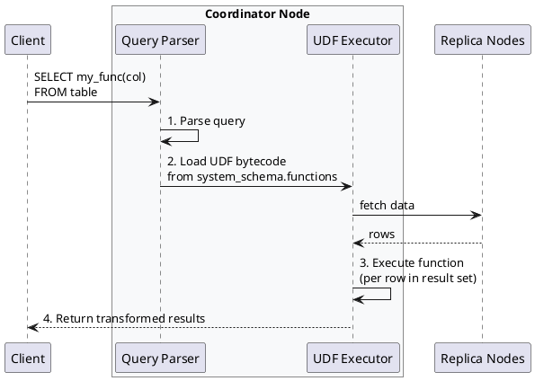

# Function Commands

User-Defined Functions (UDFs) extend CQL with custom scalar operations written in Java or JavaScript. UDFs can be used in SELECT clauses, WHERE conditions, and as building blocks for user-defined aggregates.

---

## Behavioral Guarantees

### What UDF Operations Guarantee

- CREATE FUNCTION creates schema metadata that propagates to all nodes via gossip
- UDF bytecode is stored in `system_schema.functions` and loaded on demand
- Functions execute in a sandboxed environment with resource limits
- OR REPLACE atomically updates an existing function definition
- IF NOT EXISTS provides idempotent function creation
- Functions are deterministic by default (same input produces same output)

### What UDF Operations Do NOT Guarantee

!!! warning "Undefined Behavior"
    The following behaviors are undefined and must not be relied upon:

    - **Execution locality**: UDFs execute on the coordinator, not on replica nodes; data locality is not preserved
    - **Timeout behavior**: Functions exceeding `user_defined_function_fail_timeout` are terminated; partial results may exist
    - **Memory limits**: Functions exceeding heap limits are terminated; cluster stability may be impacted
    - **Concurrent execution**: Functions may execute concurrently for different rows; shared state is not supported
    - **Side effects**: Functions with side effects (logging, external calls) have undefined behavior

### Execution Contract

| Property | Guarantee |
|----------|-----------|
| Execution location | Coordinator node only |
| Execution count | Once per row in result set |
| Null handling | Controlled by `CALLED ON NULL INPUT` or `RETURNS NULL ON NULL INPUT` |
| Timeout enforcement | Function terminated after `user_defined_function_fail_timeout` |
| Resource isolation | Sandboxed with configurable heap and CPU limits |

### Language Support Contract

| Language | Availability | Security |
|----------|--------------|----------|
| Java | Always (when UDFs enabled) | Bytecode-level sandboxing |
| JavaScript | `enable_scripted_user_defined_functions: true` | Nashorn sandbox (deprecated in Java 11+) |

### Failure Semantics

| Failure Mode | Outcome | Client Action |
|--------------|---------|---------------|
| Function throws exception | Query fails with `FunctionExecutionException` | Fix function or handle exception |
| Function exceeds timeout | Query fails, function terminated | Optimize function or increase timeout |
| Function exceeds heap | Query fails, function terminated | Reduce memory usage or increase limit |
| Schema disagreement | Function may not be available on all nodes | Wait for schema agreement |

### Version-Specific Behavior

| Version | Behavior |
|---------|----------|
| 2.2+ | Java UDFs introduced (CASSANDRA-7395) |
| 2.2+ | JavaScript UDFs via Nashorn |
| 3.0+ | Improved UDF sandboxing |
| 4.0+ | UDF heap tracking, JavaScript deprecated |
| 5.0+ | WASM UDFs under consideration |

---

## UDF Architecture

### How UDFs Work

UDFs execute on the coordinator node during query processing:



UDFs are:

- **Coordinator-bound**: Execute only on the coordinator, not on replica nodes
- **Row-level**: Called once per row (for scalar functions)
- **Sandboxed**: Run in a restricted environment with resource limits

### Security Model

UDFs execute in a sandboxed environment with restrictions:

| Allowed | Prohibited |
|---------|------------|
| Pure computations | File system access |
| String manipulation | Network operations |
| Math operations | System property access |
| Type conversions | Thread creation |
| Collection operations | Reflection (limited) |

!!! danger "Security Consideration"
    UDFs can consume CPU and memory resources. Malicious or poorly written functions may impact cluster performance. Restrict UDF creation permissions to trusted users.

### Configuration

UDFs must be enabled in `cassandra.yaml`:

```yaml
# Enable Java UDFs
enable_user_defined_functions: true

# Enable JavaScript UDFs (requires additional security consideration)
enable_scripted_user_defined_functions: true

# Timeout for UDF execution (default 10 seconds)
user_defined_function_warn_timeout: 500ms
user_defined_function_fail_timeout: 10000ms

# Memory limits
user_defined_function_warn_heap: 200MB
user_defined_function_fail_heap: 500MB
```

---

## CREATE FUNCTION

Create a user-defined scalar function.

### Synopsis

```cqlsyntax
CREATE [ OR REPLACE ] FUNCTION [ IF NOT EXISTS ]
    [ *keyspace_name*. ] *function_name*
    ( [ *arg_name* *arg_type* [, *arg_name* *arg_type* ... ] ] )
    { CALLED ON NULL INPUT | RETURNS NULL ON NULL INPUT }
    RETURNS *return_type*
    LANGUAGE { java | javascript }
    AS '*function_body*'
```

### Description

`CREATE FUNCTION` defines a scalar UDF that processes input arguments and returns a single value. Functions are scoped to keyspaces and can be overloaded (same name, different argument types).

### Parameters

#### OR REPLACE

Replace existing function with same signature. Useful for updating function implementations without dropping first.

```sql
CREATE OR REPLACE FUNCTION my_func(x INT) ...
```

#### IF NOT EXISTS

Prevent error if function already exists. Cannot be combined with `OR REPLACE`.

#### *function_name*

Identifier for the function. Can be qualified with keyspace.

```sql
-- In current keyspace
CREATE FUNCTION double_it(x INT) ...

-- Fully qualified
CREATE FUNCTION my_keyspace.double_it(x INT) ...
```

#### Arguments

Function parameters with names and types:

```sql
-- No arguments
CREATE FUNCTION get_timestamp() ...

-- Single argument
CREATE FUNCTION double_it(input INT) ...

-- Multiple arguments
CREATE FUNCTION concat_strings(a TEXT, b TEXT, separator TEXT) ...
```

Supported argument types:

- All native CQL types
- Collection types (`LIST`, `SET`, `MAP`)
- User-defined types
- Tuples

#### NULL Handling

Specifies behavior when arguments are null:

##### CALLED ON NULL INPUT

Function is invoked even when arguments are null. Function body must handle null cases:

```sql
CREATE FUNCTION safe_length(s TEXT)
    CALLED ON NULL INPUT
    RETURNS INT
    LANGUAGE java
    AS 'return s == null ? 0 : s.length();';
```

##### RETURNS NULL ON NULL INPUT

Function returns null immediately if any argument is null, without executing:

```sql
CREATE FUNCTION string_length(s TEXT)
    RETURNS NULL ON NULL INPUT
    RETURNS INT
    LANGUAGE java
    AS 'return s.length();';  -- Safe: s is never null here
```

!!! tip "NULL Handling Choice"
    - Use `RETURNS NULL ON NULL INPUT` when null inputs should produce null output
    - Use `CALLED ON NULL INPUT` when function needs to handle nulls specially (e.g., default values, special logic)

#### RETURNS *return_type*

The data type of the function's return value. Must match what the function body returns.

#### LANGUAGE

Programming language for the function body:

##### Java

```sql
LANGUAGE java
AS 'return input * 2;';
```

- Always available
- Best performance
- Full Java syntax within sandbox restrictions

##### JavaScript

```sql
LANGUAGE javascript
AS 'input * 2';
```

- Requires `enable_scripted_user_defined_functions: true`
- Simpler syntax for basic operations
- Uses Nashorn JavaScript engine (deprecated in newer Java versions)

!!! warning "JavaScript Deprecation"
    JavaScript UDFs use the Nashorn engine, which is deprecated in Java 11+ and removed in Java 15+. For new functions, prefer Java.

#### Function Body

The function implementation as a string:

**Java functions:**

```sql
AS 'return argument_expression;';

-- Multi-statement
AS '
    int result = 0;
    for (int i = 0; i < n; i++) {
        result += i;
    }
    return result;
';
```

**JavaScript functions:**

```sql
AS 'a + b';  -- Expression returned implicitly

AS 'var result = a + b; result;';  -- Last expression returned
```

### Examples

#### Simple Transformation

```sql
CREATE FUNCTION double_value(input INT)
    RETURNS NULL ON NULL INPUT
    RETURNS INT
    LANGUAGE java
    AS 'return input * 2;';

-- Usage
SELECT double_value(count) FROM metrics;
```

#### String Manipulation

```sql
CREATE FUNCTION normalize_email(email TEXT)
    RETURNS NULL ON NULL INPUT
    RETURNS TEXT
    LANGUAGE java
    AS 'return email.toLowerCase().trim();';

-- Usage
SELECT normalize_email(email) FROM users;
```

#### Null-Safe Function

```sql
CREATE FUNCTION coalesce_text(a TEXT, b TEXT)
    CALLED ON NULL INPUT
    RETURNS TEXT
    LANGUAGE java
    AS 'return a != null ? a : b;';

-- Usage
SELECT coalesce_text(nickname, username) FROM users;
```

#### Mathematical Function

```sql
CREATE FUNCTION haversine_distance(
    lat1 DOUBLE, lon1 DOUBLE,
    lat2 DOUBLE, lon2 DOUBLE
)
    RETURNS NULL ON NULL INPUT
    RETURNS DOUBLE
    LANGUAGE java
    AS '
        double R = 6371; // Earth radius in km
        double dLat = Math.toRadians(lat2 - lat1);
        double dLon = Math.toRadians(lon2 - lon1);
        double a = Math.sin(dLat/2) * Math.sin(dLat/2) +
                   Math.cos(Math.toRadians(lat1)) * Math.cos(Math.toRadians(lat2)) *
                   Math.sin(dLon/2) * Math.sin(dLon/2);
        double c = 2 * Math.atan2(Math.sqrt(a), Math.sqrt(1-a));
        return R * c;
    ';

-- Usage
SELECT name, haversine_distance(lat, lon, 40.7128, -74.0060) AS distance_from_nyc
FROM locations;
```

#### JSON Parsing

```sql
CREATE FUNCTION extract_json_field(json_text TEXT, field_name TEXT)
    RETURNS NULL ON NULL INPUT
    RETURNS TEXT
    LANGUAGE java
    AS '
        // Simple JSON field extraction (for demonstration)
        String search = "\"" + field_name + "\":\"";
        int start = json_text.indexOf(search);
        if (start == -1) return null;
        start += search.length();
        int end = json_text.indexOf("\"", start);
        return json_text.substring(start, end);
    ';
```

#### Collection Function

```sql
CREATE FUNCTION list_contains(items LIST<TEXT>, search TEXT)
    RETURNS NULL ON NULL INPUT
    RETURNS BOOLEAN
    LANGUAGE java
    AS 'return items.contains(search);';

-- Usage
SELECT * FROM products WHERE list_contains(tags, 'electronics');
```

#### JavaScript Function

```sql
CREATE FUNCTION js_double(input INT)
    RETURNS NULL ON NULL INPUT
    RETURNS INT
    LANGUAGE javascript
    AS 'input * 2';

CREATE FUNCTION js_concat(a TEXT, b TEXT)
    RETURNS NULL ON NULL INPUT
    RETURNS TEXT
    LANGUAGE javascript
    AS 'a + b';
```

### Restrictions

!!! danger "Restrictions"
    **Language Restrictions:**

    - Java: Limited sandbox, no file/network/thread access
    - JavaScript: Nashorn engine limitations, deprecated in newer Java

    **Type Restrictions:**

    - Return type must match declared type exactly
    - Counter types not supported
    - Some nested collection types may have limitations

    **Execution Restrictions:**

    - Functions timeout after configured limit
    - Memory usage limited by configuration
    - No persistent state between calls

!!! warning "Performance Considerations"
    - UDFs add CPU overhead per row
    - Complex functions on large result sets impact query latency
    - Consider pre-computing values when possible

### Notes

- Functions are stored in `system_schema.functions`
- Use `DESCRIBE FUNCTION` to view definitions
- Functions with same name but different argument types are distinct (overloading)
- Changing function logic: use `CREATE OR REPLACE`

---

## DROP FUNCTION

Remove a user-defined function.

### Synopsis

```cqlsyntax
DROP FUNCTION [ IF EXISTS ] [ *keyspace_name*. ] *function_name*
    [ ( [ *arg_type* [, *arg_type* ... ] ] ) ]
```

### Description

`DROP FUNCTION` removes a UDF. If the function is overloaded, specify argument types to identify which overload to drop.

### Parameters

#### IF EXISTS

Prevent error if function does not exist.

#### Argument Types

Required when multiple overloads exist:

```sql
-- Function with single overload
DROP FUNCTION double_value;

-- Function with multiple overloads - specify which one
DROP FUNCTION my_func(INT);
DROP FUNCTION my_func(TEXT);
DROP FUNCTION my_func(INT, INT);
```

### Examples

#### Drop Simple Function

```sql
DROP FUNCTION normalize_email;
```

#### Drop with Keyspace

```sql
DROP FUNCTION my_keyspace.haversine_distance;
```

#### Drop Specific Overload

```sql
-- If concat exists for (TEXT, TEXT) and (TEXT, TEXT, TEXT)
DROP FUNCTION concat(TEXT, TEXT);
```

#### Safe Drop

```sql
DROP FUNCTION IF EXISTS temp_function;
```

### Restrictions

!!! warning "Restrictions"
    - Cannot drop functions used by aggregates (drop aggregate first)
    - Requires DROP permission on the function
    - Dropping non-existent function without IF EXISTS causes error

### Finding Functions

```sql
-- List all functions in keyspace
SELECT function_name, argument_types, return_type
FROM system_schema.functions
WHERE keyspace_name = 'my_keyspace';

-- Describe specific function
DESCRIBE FUNCTION my_keyspace.double_value;
```

---

## Best Practices

### When to Use UDFs

!!! tip "Good Use Cases"
    - Data transformation during queries (formatting, normalization)
    - Complex calculations not available in built-in functions
    - Business logic encapsulation
    - Building blocks for custom aggregates

### When to Avoid UDFs

!!! warning "Avoid When"
    - Simple operations available as built-in functions
    - High-throughput scenarios where overhead matters
    - Operations needing external resources (files, network)
    - Security-sensitive environments without proper controls

### Development Guidelines

1. **Keep functions simple** - Complex logic increases maintenance burden
2. **Handle nulls explicitly** - Choose appropriate null handling strategy
3. **Test thoroughly** - UDFs can't be easily debugged in Cassandra
4. **Document behavior** - Add comments explaining function purpose
5. **Consider performance** - Profile functions on realistic data volumes

### Testing Functions

```sql
-- Test function directly
SELECT double_value(5);
SELECT normalize_email('  USER@EXAMPLE.COM  ');

-- Test with table data
SELECT id, double_value(value) FROM test_table LIMIT 10;
```

---

## Related Documentation

- **[CREATE AGGREGATE](aggregate.md)** - Building aggregates with UDFs
- **[Functions Reference](../functions/index.md)** - Built-in functions
- **[SELECT](../dml/select.md)** - Using functions in queries
