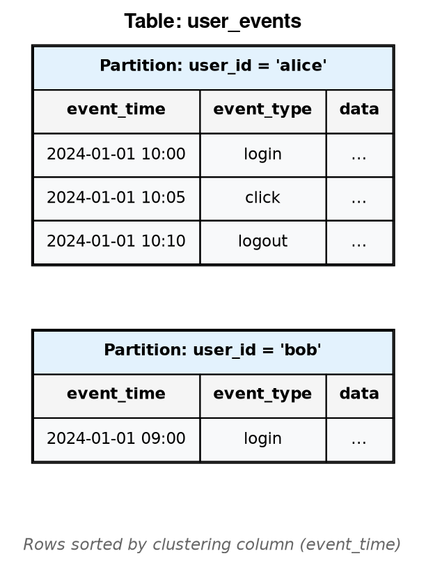

# Table Commands

Tables are the primary data storage structures in Cassandra. Each table belongs to a keyspace and defines columns, a primary key for data distribution and access, and various storage options.

---

## Overview

### What is a Table?

In Cassandra, a table is a collection of rows organized by a primary key. While CQL presents a familiar relational-style interface with rows and columns, the underlying storage model differs significantly from traditional databases.

### Historical Context

Cassandra's data model derives from Google's **Bigtable** paper (2006), which introduced the concept of a "column family" - a sparse, distributed, persistent multi-dimensional sorted map. Amazon's **Dynamo** paper (2007) contributed the distributed systems architecture: consistent hashing, eventual consistency, and decentralized coordination.

In early Cassandra versions (pre-CQL), the primary data structure was called a **column family**, reflecting its Bigtable heritage. The Thrift API used terms like `ColumnFamily`, `SuperColumn`, and `Column` directly.

With the introduction of **CQL (Cassandra Query Language)** in version 0.8 and its maturation in version 2.0, the terminology shifted to the more familiar **table** to ease adoption for developers with SQL backgrounds. The underlying storage model remained the same.

| Era | API | Terminology | Data Access |
|-----|-----|-------------|-------------|
| 2008-2012 | Thrift | Column Family, SuperColumn | Programmatic, verbose |
| 2012-present | CQL | Table, Row, Column | SQL-like syntax |

!!! note "Legacy Terminology"
    Internal components, JMX metrics, log messages, and older documentation may still reference "column family" or "CF". For example:

    - `ColumnFamilyStore` in JMX beans
    - `cf` in nodetool output
    - `CFMetaData` in source code

    These terms are synonymous with "table" in modern Cassandra.

### Storage Model

Cassandra stores data in a **partition-oriented** structure optimized for distributed access:



**Partitions** are the fundamental unit of data distribution:

- Each partition is identified by a **partition key** (hashed to determine node placement)
- All rows within a partition are stored together on the same nodes
- A partition can contain millions of rows (though smaller is better for performance)
- Partitions are replicated as a unit according to the keyspace replication factor

**Rows** within a partition are sorted by **clustering columns**:

- Rows are stored contiguously on disk in clustering order
- Range queries within a partition are efficient sequential reads
- Each row is uniquely identified by partition key + clustering columns


Each SSTable is immutable once written. Updates and deletes create new entries; old versions are removed during compaction.

### Sparse Columns

Cassandra uses a **sparse column** model:

- Columns with `null` values consume no storage space
- Each row can have different columns populated
- Adding columns to a table is a metadata-only operation
- Wide tables with many columns are efficient when most values are null

```sql
-- Sparse data is storage-efficient
INSERT INTO sensors (id, temp) VALUES ('s1', 25.5);        -- Only temp stored
INSERT INTO sensors (id, humidity) VALUES ('s2', 60.0);    -- Only humidity stored
INSERT INTO sensors (id, temp, humidity) VALUES ('s3', 22.0, 55.0);  -- Both stored
```

### Tables vs Traditional RDBMS

| Aspect | RDBMS | Cassandra |
|--------|-------|-----------|
| Data distribution | Single node (or sharded) | Partitioned across cluster |
| Schema | Fixed columns per row | Sparse columns |
| Joins | Native support | Not supported (denormalize instead) |
| Indexes | B-tree on any column | Primary key + optional secondary |
| Transactions | ACID | Single-partition atomic, LWT for conditional |
| Query flexibility | Ad-hoc queries | Query patterns defined by primary key |
| Storage | Row-oriented or columnar | Partition-oriented, sorted by clustering key |

!!! tip "Design Philosophy"
    In Cassandra, tables are designed for specific query patterns. Rather than normalizing data and joining at query time, data is denormalized into tables that directly support each access pattern. One conceptual entity may be stored in multiple tables.

---

## CREATE TABLE

Define a new table with columns, primary key structure, and storage options.

### Synopsis

```cqlsyntax
CREATE TABLE [ IF NOT EXISTS ] [ *keyspace_name*. ] *table_name*
    ( *column_definition* [, *column_definition* ... ] ,
      PRIMARY KEY ( *primary_key* ) )
    [ WITH *table_options* ]
```

**column_definition**:

```cqlsyntax
*column_name* *data_type* [ STATIC ] [ PRIMARY KEY ]
```

**primary_key**:

```cqlsyntax
*partition_key*
| ( *partition_key* [, *clustering_column* ... ] )
```

**partition_key**:

```cqlsyntax
*column_name*
| ( *column_name* [, *column_name* ... ] )
```

**table_options**:

```cqlsyntax
*option* = *value* [ AND *option* = *value* ... ]
| CLUSTERING ORDER BY ( *column_name* [ ASC | DESC ] [, ... ] )
| COMPACT STORAGE
| ID = *table_id*
```

### Description

`CREATE TABLE` defines a new table schema including column definitions, primary key structure, and storage configuration. The primary key design is critical as it determines:

- **Data distribution**: Which nodes store each row
- **Data locality**: Which rows are stored together
- **Query capabilities**: What queries can execute efficiently
- **Sort order**: How data is ordered within partitions

!!! note "Primary Key Immutability"
    The primary key structure cannot be modified after table creation. Careful upfront design is essential. Changing the primary key requires creating a new table and migrating data.

### Parameters

#### *table_name*

The identifier for the new table. Can be qualified with keyspace name.

```sql
-- In current keyspace
CREATE TABLE users (...);

-- Fully qualified
CREATE TABLE my_keyspace.users (...);
```

#### IF NOT EXISTS

Prevents error if table already exists. The existing table is not modified.

#### *column_definition*

Defines a column with name and data type.

```sql
user_id UUID,
username TEXT,
email TEXT,
created_at TIMESTAMP
```

Supported data types include:

| Category | Types |
|----------|-------|
| Numeric | `TINYINT`, `SMALLINT`, `INT`, `BIGINT`, `VARINT`, `FLOAT`, `DOUBLE`, `DECIMAL` |
| Text | `TEXT`, `VARCHAR`, `ASCII` |
| Binary | `BLOB` |
| Boolean | `BOOLEAN` |
| Temporal | `TIMESTAMP`, `DATE`, `TIME`, `DURATION` |
| Identifiers | `UUID`, `TIMEUUID` |
| Network | `INET` |
| Collections | `LIST<T>`, `SET<T>`, `MAP<K,V>` |
| Complex | `TUPLE<...>`, `FROZEN<T>`, User-defined types |
| Vector | `VECTOR<T, N>` (Cassandra 5.0+) |

##### Vector Type (Cassandra 5.0+)

The `VECTOR` type stores fixed-dimension numerical arrays for machine learning embeddings and similarity search applications. Vector columns enable approximate nearest neighbor (ANN) queries when indexed with SAI.

**Syntax:**

```sql
VECTOR<element_type, dimension>
```

| Parameter | Description |
|-----------|-------------|
| `element_type` | Numeric type for vector elements (`FLOAT` recommended) |
| `dimension` | Fixed number of elements (must match embedding model output) |

**Declaration examples:**

```sql
CREATE TABLE documents (
    doc_id UUID PRIMARY KEY,
    title TEXT,
    content TEXT,
    embedding VECTOR<FLOAT, 1536>  -- OpenAI ada-002 dimension
);

CREATE TABLE images (
    image_id UUID PRIMARY KEY,
    filename TEXT,
    feature_vector VECTOR<FLOAT, 512>  -- ResNet feature dimension
);
```

**Vector indexing with SAI:**

Vector columns require SAI indexes for similarity search queries:

```sql
CREATE CUSTOM INDEX ON documents (embedding)
    USING 'StorageAttachedIndex'
    WITH OPTIONS = {
        'similarity_function': 'cosine'
    };
```

| Similarity Function | Description | Use Case |
|---------------------|-------------|----------|
| `cosine` | Cosine similarity (default) | Text embeddings, normalized vectors |
| `euclidean` | Euclidean (L2) distance | Image features, spatial data |
| `dot_product` | Dot product similarity | Normalized vectors, performance-critical |

**Similarity search queries:**

```sql
-- Find 10 most similar documents
SELECT doc_id, title, similarity_cosine(embedding, ?) AS similarity
FROM documents
ORDER BY embedding ANN OF ?
LIMIT 10;

-- Combined filtering with vector search
SELECT doc_id, title
FROM documents
WHERE category = 'technical'
ORDER BY embedding ANN OF ?
LIMIT 5;
```

**Inserting vector data:**

```sql
-- Insert with vector literal
INSERT INTO documents (doc_id, title, embedding)
VALUES (uuid(), 'Document Title', [0.1, 0.2, 0.3, ...]);

-- Insert with parameterized vector
INSERT INTO documents (doc_id, title, embedding)
VALUES (?, ?, ?);  -- Pass vector as array from application
```

!!! note "Vector Design Considerations"
    - **Dimension immutability**: Vector dimension cannot change after table creation; changing embedding models requires schema migration
    - **Storage overhead**: Each vector element consumes 4 bytes (FLOAT); 1536-dimension vectors use ~6KB per row
    - **Index memory**: SAI vector indexes require significant memory for graph structures
    - **Query latency**: ANN queries trade precision for speed; results are approximate

#### STATIC

Marks a column as static. Static columns:

- Have one value per partition, shared by all rows
- Are useful for data that applies to the entire partition
- Cannot be part of the primary key
- Are stored once per partition, not per row

```sql
CREATE TABLE user_posts (
    user_id UUID,
    post_id TIMEUUID,
    username TEXT STATIC,     -- Same for all posts by user
    user_email TEXT STATIC,   -- Same for all posts by user
    post_content TEXT,
    PRIMARY KEY ((user_id), post_id)
);
```

!!! tip "Static Column Use Cases"
    - User profile data in a table partitioned by user
    - Configuration data shared across rows
    - Counters or aggregates for a partition
    - Denormalized parent entity data

#### PRIMARY KEY

The primary key determines data distribution and query capabilities.

##### Single-Column Primary Key

```sql
CREATE TABLE users (
    user_id UUID PRIMARY KEY,
    username TEXT
);
```

Equivalent to:

```sql
CREATE TABLE users (
    user_id UUID,
    username TEXT,
    PRIMARY KEY (user_id)
);
```

##### Compound Primary Key

Partition key + clustering columns:

```sql
CREATE TABLE messages (
    user_id UUID,           -- Partition key
    sent_at TIMESTAMP,      -- Clustering column
    message_id UUID,        -- Clustering column
    content TEXT,
    PRIMARY KEY ((user_id), sent_at, message_id)
);
```

- **Partition key** (`user_id`): Determines node placement
- **Clustering columns** (`sent_at`, `message_id`): Determine sort order within partition

##### Composite Partition Key

Multiple columns form the partition key:

```sql
CREATE TABLE events (
    tenant_id TEXT,
    event_date DATE,
    event_time TIMESTAMP,
    event_id UUID,
    PRIMARY KEY ((tenant_id, event_date), event_time, event_id)
);
```

All composite partition key columns must be provided for any query.

!!! warning "Partition Key Design"
    - Partition keys determine data distribution—ensure even distribution
    - All partition key columns are required in queries
    - Composite keys can prevent hot spots but require all components for queries

#### CLUSTERING ORDER BY

Specifies sort order for clustering columns. Default is ascending (`ASC`).

```sql
CREATE TABLE sensor_readings (
    sensor_id TEXT,
    reading_time TIMESTAMP,
    value DOUBLE,
    PRIMARY KEY ((sensor_id), reading_time)
) WITH CLUSTERING ORDER BY (reading_time DESC);
```

Multiple clustering columns:

```sql
CREATE TABLE events (
    tenant_id TEXT,
    priority INT,
    event_time TIMESTAMP,
    event_id UUID,
    PRIMARY KEY ((tenant_id), priority, event_time)
) WITH CLUSTERING ORDER BY (priority DESC, event_time DESC);
```

!!! tip "Clustering Order Performance"
    Choose clustering order based on the most common query pattern:

    - **Time-series data**: `DESC` for most recent first
    - **Ranked data**: `DESC` for highest priority first
    - **Sequential processing**: `ASC` for chronological order

    Queries against the natural clustering order are more efficient than reversed queries.

#### Table Options

| Option | Default | Description |
|--------|---------|-------------|
| `bloom_filter_fp_chance` | 0.01 | Bloom filter false positive probability (0.0-1.0) |
| `caching` | `{'keys': 'ALL', 'rows_per_partition': 'NONE'}` | Key and row caching behavior |
| `comment` | `''` | Human-readable table description |
| `compaction` | SizeTiered | Compaction strategy configuration |
| `compression` | LZ4 | Compression algorithm configuration |
| `crc_check_chance` | 1.0 | Probability of CRC verification on reads |
| `default_time_to_live` | 0 | Default TTL in seconds (0 = no expiration) |
| `gc_grace_seconds` | 864000 (10 days) | Time to retain tombstones |
| `max_index_interval` | 2048 | Maximum gap between index entries |
| `memtable_flush_period_in_ms` | 0 | Automatic memtable flush interval (0 = disabled) |
| `min_index_interval` | 128 | Minimum gap between index entries |
| `read_repair` | `BLOCKING` | Read repair behavior |
| `speculative_retry` | `99p` | Speculative retry threshold |

##### Compaction Strategies

Compaction merges SSTables to reclaim space from overwrites and deletes, and to optimize read performance by reducing the number of SSTables to scan. Choose a strategy based on workload characteristics:

| Strategy | Best For | Write Amp | Read Amp | Space Amp | Cassandra Version |
|----------|----------|-----------|----------|-----------|-------------------|
| **SizeTieredCompactionStrategy (STCS)** | Write-heavy, general purpose | Low | High | High (2x) | All |
| **LeveledCompactionStrategy (LCS)** | Read-heavy, update-heavy | High | Low | Low (1.1x) | All |
| **TimeWindowCompactionStrategy (TWCS)** | Time-series, TTL data | Low | Medium | Low | 3.0.8+ |
| **UnifiedCompactionStrategy (UCS)** | Adaptive, general purpose | Adaptive | Adaptive | Configurable | 5.0+ |

**Size-Tiered Compaction (STCS)** - Default strategy

Groups SSTables of similar size and compacts them together when enough accumulate. Optimized for write throughput but requires ~50% free disk space for compaction.

```sql
WITH compaction = {
    'class': 'SizeTieredCompactionStrategy',
    'min_threshold': 4,              -- Min SSTables to trigger compaction
    'max_threshold': 32,             -- Max SSTables to compact at once
    'min_sstable_size': 50          -- Min size (MB) to consider for bucketing
}
```

**Leveled Compaction (LCS)** - Read-optimized

Organizes SSTables into levels with size limits. Level 0 contains flushed memtables; each subsequent level is 10x larger. Guarantees at most ~10% of rows exist in multiple SSTables.

```sql
WITH compaction = {
    'class': 'LeveledCompactionStrategy',
    'sstable_size_in_mb': 160,       -- Target SSTable size per level
    'fanout_size': 10                -- Size multiplier between levels
}
```

!!! tip "LCS Use Cases"
    - Read-heavy workloads (high read:write ratio)
    - Frequent updates to existing rows
    - When predictable disk usage is important
    - NOT recommended for time-series or append-only workloads

**Time-Window Compaction (TWCS)** - Time-series optimized

Groups SSTables by time window. Data within each window is compacted using STCS. Once a window closes, its SSTables are never compacted with newer data. Ideal for time-series with TTL.

```sql
WITH compaction = {
    'class': 'TimeWindowCompactionStrategy',
    'compaction_window_unit': 'DAYS',    -- MINUTES, HOURS, DAYS
    'compaction_window_size': 1,         -- Window duration
    'expired_sstable_check_frequency_seconds': 600
}
```

!!! warning "TWCS Requirements"
    - Data should be written in roughly time order
    - All data should have TTL set (ideally consistent TTL values)
    - Avoid out-of-order writes spanning multiple windows
    - Avoid deletes and updates to old data

**Unified Compaction (UCS)** - Cassandra 5.0+

Adaptive strategy that combines benefits of STCS, LCS, and TWCS. Automatically adjusts behavior based on workload patterns. Recommended for new deployments on Cassandra 5.0+.

```sql
WITH compaction = {
    'class': 'UnifiedCompactionStrategy',
    'scaling_parameters': 'T4',          -- Tiered (T) or Leveled (L) with fan factor
    'target_sstable_size': '1GiB',       -- Target SSTable size
    'base_shard_count': 4                -- Parallelism for compaction
}
```

| UCS Parameter | Values | Description |
|---------------|--------|-------------|
| `scaling_parameters` | `T4`, `L10`, `N` | T=tiered, L=leveled, N=none; number is fan factor |
| `target_sstable_size` | Size string | Target size for SSTables (e.g., `1GiB`) |
| `base_shard_count` | Integer | Concurrent compaction shards |

For detailed compaction tuning, see [Compaction Architecture](../../architecture/storage-engine/compaction/index.md).

##### Compression Options

```sql
-- LZ4 (default, fast)
WITH compression = {'class': 'LZ4Compressor'}

-- Zstd (better ratio, Cassandra 4.0+)
WITH compression = {
    'class': 'ZstdCompressor',
    'compression_level': 3
}

-- Snappy (balanced)
WITH compression = {'class': 'SnappyCompressor'}

-- Disabled
WITH compression = {'enabled': false}
```

### Examples

#### Basic Table

```sql
CREATE TABLE users (
    user_id UUID PRIMARY KEY,
    username TEXT,
    email TEXT,
    created_at TIMESTAMP
);
```

#### Time-Series Table

```sql
CREATE TABLE sensor_data (
    sensor_id TEXT,
    bucket DATE,
    reading_time TIMESTAMP,
    temperature DOUBLE,
    humidity DOUBLE,
    PRIMARY KEY ((sensor_id, bucket), reading_time)
) WITH CLUSTERING ORDER BY (reading_time DESC)
    AND compaction = {
        'class': 'TimeWindowCompactionStrategy',
        'compaction_window_unit': 'DAYS',
        'compaction_window_size': 1
    }
    AND default_time_to_live = 7776000  -- 90 days
    AND gc_grace_seconds = 86400;       -- 1 day
```

#### Table with Collections

```sql
CREATE TABLE user_profiles (
    user_id UUID PRIMARY KEY,
    email TEXT,
    phone_numbers LIST<TEXT>,
    tags SET<TEXT>,
    preferences MAP<TEXT, TEXT>,
    addresses LIST<FROZEN<address_type>>
);
```

#### Table with Static Columns

```sql
CREATE TABLE orders (
    customer_id UUID,
    order_id TIMEUUID,
    customer_name TEXT STATIC,
    customer_email TEXT STATIC,
    order_total DECIMAL,
    order_status TEXT,
    PRIMARY KEY ((customer_id), order_id)
) WITH CLUSTERING ORDER BY (order_id DESC);
```

#### High-Performance Table

```sql
CREATE TABLE hot_data (
    partition_key TEXT,
    cluster_key TIMESTAMP,
    data BLOB,
    PRIMARY KEY ((partition_key), cluster_key)
) WITH CLUSTERING ORDER BY (cluster_key DESC)
    AND bloom_filter_fp_chance = 0.001
    AND caching = {'keys': 'ALL', 'rows_per_partition': '100'}
    AND compression = {'class': 'LZ4Compressor'}
    AND compaction = {'class': 'LeveledCompactionStrategy'}
    AND speculative_retry = '95p';
```

### Restrictions

!!! danger "Restrictions"
    - Primary key columns cannot be modified after creation
    - Collection types (`LIST`, `SET`, `MAP`) cannot be primary key components unless `FROZEN`
    - `COUNTER` columns require dedicated tables (only counter and primary key columns allowed)
    - Maximum 2 billion cells per partition (practical limit is much lower)
    - `COMPACT STORAGE` is deprecated and should not be used for new tables

### Notes

- Table creation is a metadata operation; no data files are created until data is written
- Choose primary key based on query patterns, not data relationships
- Monitor partition sizes; keep under 100MB for optimal performance
- Use `DESCRIBE TABLE` to view the complete table definition

---

## ALTER TABLE

Modify an existing table's columns or options.

### Synopsis

```cqlsyntax
ALTER TABLE [ *keyspace_name*. ] *table_name* *alter_instruction*
```

**alter_instruction**:

```cqlsyntax
ADD *column_name* *data_type* [ STATIC ] [, *column_name* *data_type* ... ]
| DROP *column_name* [, *column_name* ... ]
| RENAME *column_name* TO *new_name* [ AND *column_name* TO *new_name* ... ]
| WITH *table_options*
```

### Description

`ALTER TABLE` modifies table schema or options. Column additions are metadata-only operations. Column drops mark data for removal during compaction.

### Parameters

#### ADD

Add one or more columns to the table.

```sql
ALTER TABLE users ADD phone TEXT;
ALTER TABLE users ADD phone TEXT, address TEXT, age INT;
ALTER TABLE users ADD profile_data TEXT STATIC;
```

New columns have `null` values for existing rows. No data migration occurs.

!!! note "Adding Columns"
    Adding columns is instantaneous regardless of table size because Cassandra does not rewrite existing data. New columns simply return `null` for rows written before the column existed.

#### DROP

Remove columns from the table schema.

```sql
ALTER TABLE users DROP phone;
ALTER TABLE users DROP phone, address, temporary_field;
```

!!! warning "Dropped Column Data"
    Dropping a column:

    - Immediately prevents reading the column
    - Does **not** immediately delete data from disk
    - Data is removed during compaction
    - To reclaim space immediately: `nodetool compact keyspace table`

#### RENAME

Rename clustering columns only.

```sql
ALTER TABLE events RENAME event_time TO occurred_at;
ALTER TABLE data RENAME col1 TO column_one AND col2 TO column_two;
```

!!! danger "Rename Restrictions"
    - Only clustering columns can be renamed
    - Partition key columns cannot be renamed
    - Regular (non-primary-key) columns cannot be renamed
    - To rename regular columns: add new column, migrate data, drop old column

#### WITH

Modify table options.

```sql
-- Change compaction strategy
ALTER TABLE logs WITH compaction = {
    'class': 'LeveledCompactionStrategy',
    'sstable_size_in_mb': 160
};

-- Change compression
ALTER TABLE data WITH compression = {
    'class': 'ZstdCompressor',
    'compression_level': 3
};

-- Change TTL
ALTER TABLE sessions WITH default_time_to_live = 3600;

-- Change multiple options
ALTER TABLE events WITH
    compaction = {'class': 'LeveledCompactionStrategy'}
    AND compression = {'class': 'ZstdCompressor'}
    AND gc_grace_seconds = 172800;
```

### Examples

#### Add Columns for New Feature

```sql
ALTER TABLE users
    ADD last_login TIMESTAMP,
    ADD login_count INT,
    ADD preferences MAP<TEXT, TEXT>;
```

#### Optimize for Read Performance

```sql
ALTER TABLE hot_table WITH
    compaction = {'class': 'LeveledCompactionStrategy'}
    AND caching = {'keys': 'ALL', 'rows_per_partition': '1000'}
    AND bloom_filter_fp_chance = 0.001;
```

#### Configure for Time-Series

```sql
ALTER TABLE sensor_data WITH
    compaction = {
        'class': 'TimeWindowCompactionStrategy',
        'compaction_window_unit': 'HOURS',
        'compaction_window_size': 1
    }
    AND default_time_to_live = 604800;  -- 7 days
```

### Restrictions

!!! danger "Restrictions"
    - Cannot add primary key columns
    - Cannot drop primary key columns
    - Cannot change column data types (except compatible widening)
    - Cannot rename partition key or regular columns
    - Cannot change primary key structure
    - Cannot alter tables with `COMPACT STORAGE` to add collections

### Notes

- Schema changes propagate via gossip; verify schema agreement
- Dropped column names cannot be reused with different types until fully compacted
- Option changes take effect immediately for new writes
- Some option changes (like compaction) trigger background operations

---

## DROP TABLE

Remove a table and all its data permanently.

### Synopsis

```cqlsyntax
DROP TABLE [ IF EXISTS ] [ *keyspace_name*. ] *table_name*
```

### Description

`DROP TABLE` permanently removes a table, all its data, all indexes on the table, and all materialized views based on the table.

!!! danger "Irreversible Operation"
    Dropping a table **cannot be undone**. All data is permanently deleted.

!!! note "Automatic Snapshots"
    If `auto_snapshot: true` is set in `cassandra.yaml` (enabled by default), Cassandra automatically creates a snapshot before deleting data. Verify this setting before relying on automatic snapshots:

    ```yaml
    # cassandra.yaml
    auto_snapshot: true  # Default: true
    ```

    Automatic snapshots are stored in `<data_directory>/<keyspace>/<table>/snapshots/dropped-<timestamp>/`. To create a manual snapshot before dropping:

    ```bash
    nodetool snapshot -t backup keyspace_name table_name
    ```

### Parameters

#### IF EXISTS

Prevents error if table does not exist.

### Examples

```sql
-- Basic drop
DROP TABLE users;

-- With keyspace
DROP TABLE my_keyspace.old_table;

-- Safe drop
DROP TABLE IF EXISTS temp_data;
```

### Restrictions

!!! warning "Restrictions"
    - Cannot drop system tables
    - Dropping a table also drops all indexes and materialized views on it
    - Requires DROP permission on the table

### Notes

- Drop is a metadata operation; data files are deleted asynchronously
- Snapshots taken before drop preserve data for potential recovery
- If the table has materialized views, they are automatically dropped

---

## TRUNCATE

Remove all data from a table while preserving the schema.

### Synopsis

```cqlsyntax
TRUNCATE [ TABLE ] [ *keyspace_name*. ] *table_name*
```

### Description

`TRUNCATE` removes all rows from a table. The table schema, indexes, and materialized views remain intact. A snapshot is created before truncation by default.

### Parameters

#### TABLE

Optional keyword for clarity.

### Examples

```sql
TRUNCATE users;
TRUNCATE TABLE my_keyspace.events;
```

### Restrictions

!!! danger "Restrictions"
    - Requires all nodes to be available and responding
    - Cannot truncate system tables
    - Cannot truncate if any node is down (use DELETE with partition key instead)
    - May timeout on very large tables

!!! warning "Node Availability"
    TRUNCATE requires acknowledgment from all replicas. If any node holding replicas is unavailable, the operation fails. For partial data removal when nodes are down, use DELETE statements targeting specific partitions.

### Notes

- Creates automatic snapshot (configurable via `auto_snapshot` in cassandra.yaml)
- Truncates associated materialized views
- Resets table to empty state; TTL timestamps are lost
- Faster than DELETE for removing all data
- Does not generate tombstones (unlike DELETE)

!!! tip "Truncate vs Delete"
    | Aspect | TRUNCATE | DELETE (all rows) |
    |--------|----------|-------------------|
    | Tombstones | None | Creates tombstones |
    | Node requirement | All nodes | Based on consistency |
    | Performance | Fast | Slow for large tables |
    | Snapshot | Automatic | None |

---

## Related Documentation

- **[Data Types](../data-types/index.md)** - Column data types
- **[CREATE INDEX](create-index.md)** - Indexing table columns
- **[Materialized Views](materialized-view.md)** - Denormalized views of tables
- **[Data Modeling](../../data-modeling/index.md)** - Table design principles
