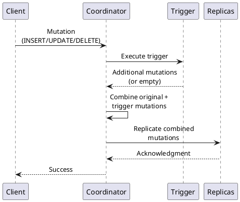

# Triggers

Triggers execute custom server-side code in response to data mutations (INSERT, UPDATE, DELETE). Triggers are implemented as Java classes and deployed to each node in the cluster.

!!! warning "Limited Use Cases"
    Triggers add operational complexity and are rarely used in production. Consider alternatives:

    - **Change Data Capture (CDC)** - For event streaming and audit logging
    - **Materialized Views** - For denormalized query tables
    - **Application logic** - For business rules validation

---

## Behavioral Guarantees

### What Trigger Operations Guarantee

- Triggers execute on the coordinator node before the mutation is applied
- Trigger code runs in the same thread as the mutation processing
- Mutations generated by triggers are combined with the original mutation atomically
- Trigger exceptions cause the entire mutation to be rejected
- IF NOT EXISTS provides idempotent trigger creation

### What Trigger Operations Do NOT Guarantee

!!! warning "Undefined Behavior"
    The following behaviors are undefined and must not be relied upon:

    - **Execution order**: When multiple triggers are attached to a table, execution order is undefined
    - **Idempotency**: Triggers may execute multiple times for retried mutations
    - **Cross-node consistency**: Trigger JAR versions may differ between nodes during rolling deployments
    - **Performance isolation**: Slow triggers block mutation processing and can cause timeouts
    - **Resource limits**: Triggers run without memory or CPU isolation; misbehaving triggers affect cluster stability
    - **Distributed transactions**: Triggers cannot participate in cross-partition or cross-table transactions

### Execution Contract

| Aspect | Guarantee |
|--------|-----------|
| Execution timing | Before mutation is applied to memtable |
| Execution location | Coordinator node only |
| Thread context | Same thread as mutation processing |
| Exception handling | Exception aborts the entire mutation |
| Return value | Collection of additional mutations to apply |

### Deployment Contract

| Requirement | Description |
|-------------|-------------|
| JAR location | `$CASSANDRA_HOME/conf/triggers/` directory |
| Class loading | Loaded on first trigger invocation |
| Node coverage | JAR must be deployed to all nodes |
| Hot reload | Not supported; requires node restart |

### Failure Semantics

| Failure Mode | Outcome | Client Action |
|--------------|---------|---------------|
| Trigger throws exception | Mutation rejected | Fix trigger code or data |
| Trigger JAR missing on coordinator | Mutation fails | Deploy JAR to all nodes |
| Trigger returns invalid mutation | Undefined behavior | Fix trigger implementation |
| Trigger timeout (blocking) | Mutation times out | Optimize trigger or increase timeout |

### Version-Specific Behavior

| Version | Behavior |
|---------|----------|
| 2.0+ | Basic trigger support (CASSANDRA-1311) |
| 2.1+ | Improved trigger lifecycle |
| 3.0+ | Better error messages for trigger failures |

---

## Overview

| Aspect | Description |
|--------|-------------|
| **Execution** | Runs on the coordinator node for each mutation |
| **Implementation** | Java class implementing `ITrigger` interface |
| **Deployment** | JAR file in `triggers/` directory on each node |
| **Scope** | Per-table configuration |
| **Timing** | Executes before the mutation is applied |

### How Triggers Work



Triggers can:

- Validate data before write
- Generate additional mutations (e.g., audit records)
- Transform data before storage
- Reject mutations by throwing exceptions

---

## CREATE TRIGGER

Attach a trigger to a table.

### Syntax

```cql
CREATE TRIGGER [ IF NOT EXISTS ] trigger_name
    ON [keyspace_name.]table_name
    USING 'fully.qualified.ClassName'
```

### Parameters

| Parameter | Description |
|-----------|-------------|
| `trigger_name` | Identifier for the trigger |
| `table_name` | Table to attach trigger to |
| `ClassName` | Fully qualified Java class name |

### Examples

```sql
-- Create audit trigger
CREATE TRIGGER audit_trigger
    ON users
    USING 'com.example.triggers.AuditTrigger';

-- With keyspace qualification
CREATE TRIGGER validation_trigger
    ON production.orders
    USING 'com.example.triggers.OrderValidationTrigger';

-- Idempotent creation
CREATE TRIGGER IF NOT EXISTS sync_trigger
    ON products
    USING 'com.example.triggers.ProductSyncTrigger';
```

### Requirements

- Superuser privileges required
- Trigger class must be deployed to all nodes
- Table must exist

---

## DROP TRIGGER

Remove a trigger from a table.

### Syntax

```cql
DROP TRIGGER [ IF EXISTS ] trigger_name
    ON [keyspace_name.]table_name
```

### Examples

```sql
-- Drop trigger
DROP TRIGGER audit_trigger ON users;

-- Idempotent drop
DROP TRIGGER IF EXISTS old_trigger ON orders;
```

---

## Implementing Triggers

Triggers implement the `org.apache.cassandra.triggers.ITrigger` interface.

### ITrigger Interface

```java
package org.apache.cassandra.triggers;

import java.util.Collection;
import org.apache.cassandra.db.Mutation;
import org.apache.cassandra.db.partitions.Partition;

public interface ITrigger {
    /**
     * Called for each partition affected by a mutation.
     *
     * @param partition The partition data being mutated
     * @return Additional mutations to apply, or null/empty
     */
    Collection<Mutation> augment(Partition partition);
}
```

### Example: Audit Trigger

```java
package com.example.triggers;

import java.util.Collection;
import java.util.Collections;
import java.nio.ByteBuffer;
import java.util.UUID;

import org.apache.cassandra.db.Mutation;
import org.apache.cassandra.db.partitions.Partition;
import org.apache.cassandra.db.rows.Row;
import org.apache.cassandra.schema.Schema;
import org.apache.cassandra.schema.TableMetadata;
import org.apache.cassandra.triggers.ITrigger;

public class AuditTrigger implements ITrigger {

    @Override
    public Collection<Mutation> augment(Partition partition) {
        // Get audit table metadata
        TableMetadata auditTable = Schema.instance
            .getTableMetadata("audit_ks", "audit_log");

        if (auditTable == null) {
            return Collections.emptyList();
        }

        // Create audit record mutation
        // Implementation details depend on schema

        return Collections.emptyList(); // Return mutations or empty
    }
}
```

### Example: Validation Trigger

```java
package com.example.triggers;

import java.util.Collection;
import java.util.Collections;

import org.apache.cassandra.db.Mutation;
import org.apache.cassandra.db.partitions.Partition;
import org.apache.cassandra.db.rows.Row;
import org.apache.cassandra.db.rows.Unfiltered;
import org.apache.cassandra.db.rows.UnfilteredRowIterator;
import org.apache.cassandra.triggers.ITrigger;

public class ValidationTrigger implements ITrigger {

    @Override
    public Collection<Mutation> augment(Partition partition) {
        try (UnfilteredRowIterator iterator =
                partition.unfilteredIterator()) {

            while (iterator.hasNext()) {
                Unfiltered unfiltered = iterator.next();
                if (unfiltered instanceof Row) {
                    Row row = (Row) unfiltered;
                    // Validate row data
                    // Throw exception to reject mutation
                }
            }
        }

        return Collections.emptyList();
    }
}
```

---

## Deployment

### Building the Trigger

```bash
# Compile with Cassandra dependencies
javac -cp "/path/to/cassandra/lib/*" \
    -d target/classes \
    src/com/example/triggers/*.java

# Package as JAR
jar cf my-triggers.jar -C target/classes .
```

### Installing on Nodes

Deploy the JAR to each Cassandra node:

```bash
# Copy to triggers directory
cp my-triggers.jar $CASSANDRA_HOME/conf/triggers/

# Restart not required - triggers are loaded dynamically
# But a restart ensures clean class loading
```

The `triggers/` directory location:

| Installation | Path |
|--------------|------|
| Tarball | `$CASSANDRA_HOME/conf/triggers/` |
| Package | `/etc/cassandra/triggers/` |
| Docker | `/etc/cassandra/triggers/` |

### Verifying Deployment

```sql
-- List triggers on a table
DESCRIBE TABLE my_keyspace.my_table;

-- Query system schema
SELECT * FROM system_schema.triggers
WHERE keyspace_name = 'my_keyspace'
  AND table_name = 'my_table';
```

---

## Operational Considerations

### Performance Impact

| Factor | Impact |
|--------|--------|
| Execution overhead | Adds latency to every mutation |
| Additional mutations | Increases write amplification |
| Synchronous execution | Blocks until trigger completes |
| No parallelism | Single-threaded per partition |

### Limitations

| Limitation | Description |
|------------|-------------|
| No BATCH support | Triggers fire per-statement, not per-batch |
| Coordinator only | Executes only on coordinator node |
| No read access | Cannot query other tables |
| Class loading | Requires JAR on all nodes |
| No hot reload | Class changes require restart |
| Limited error handling | Exceptions fail the mutation |

### Best Practices

!!! tip "Trigger Guidelines"
    1. **Keep triggers lightweight** - Avoid complex logic
    2. **Handle exceptions** - Uncaught exceptions fail mutations
    3. **Test thoroughly** - Triggers affect all mutations
    4. **Monitor performance** - Track trigger execution time
    5. **Version control** - Manage trigger JARs with deployment tools
    6. **Document** - Maintain clear documentation of trigger behavior

### Alternatives to Triggers

| Use Case | Alternative |
|----------|-------------|
| Audit logging | Change Data Capture (CDC) |
| Denormalization | Materialized Views |
| Validation | Application-layer checks |
| Event streaming | CDC + Kafka/Pulsar |
| Derived data | Application writes to multiple tables |

---

## System Schema

Trigger metadata is stored in `system_schema.triggers`:

```sql
SELECT * FROM system_schema.triggers;
```

| Column | Description |
|--------|-------------|
| `keyspace_name` | Keyspace containing the table |
| `table_name` | Table with the trigger |
| `trigger_name` | Trigger identifier |
| `options` | Trigger class and configuration |

---

## Troubleshooting

### Trigger Not Firing

1. Verify trigger is attached:
   ```sql
   SELECT * FROM system_schema.triggers
   WHERE keyspace_name = 'ks' AND table_name = 'tbl';
   ```

2. Check JAR is deployed on all nodes

3. Verify class name is correct and fully qualified

### ClassNotFoundException

```
ERROR - Failed to execute trigger: ClassNotFoundException
```

- Ensure JAR is in `triggers/` directory on the coordinator node
- Verify fully qualified class name matches

### Trigger Exceptions

```
ERROR - Trigger execution failed: [exception message]
```

- Check Cassandra logs for stack trace
- Review trigger implementation for bugs
- Ensure returned mutations are valid

---

## Related Documentation

| Topic | Description |
|-------|-------------|
| [DDL Overview](index.md) | Schema definition commands |
| [Table](table.md) | Table creation and modification |
| [Materialized Views](materialized-view.md) | Automatic denormalization |
