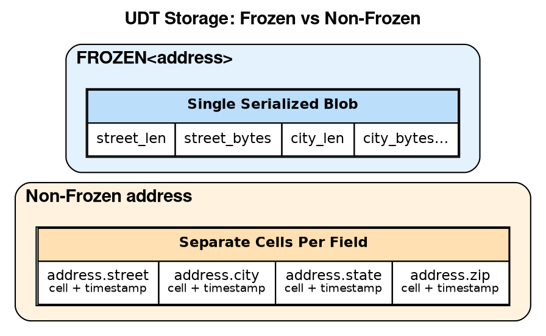
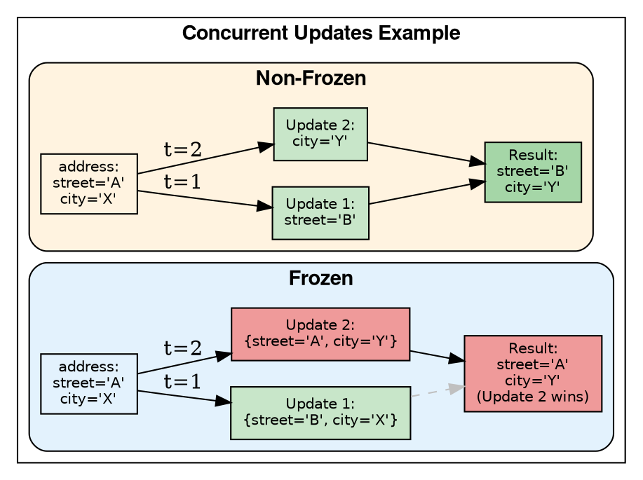

# User-Defined Type Commands

User-Defined Types (UDTs) allow grouping multiple fields into a single column value. UDTs are useful for representing complex data structures like addresses, coordinates, or any logical grouping of related fields.

---

## Overview

### What are UDTs?

User-Defined Types provide a way to create composite data structures with named fields, similar to structs in C or classes in object-oriented languages. Instead of storing related data across multiple columns, a UDT groups them into a single logical unit.

```sql
-- Without UDT: multiple columns
CREATE TABLE customers (
    id UUID PRIMARY KEY,
    billing_street TEXT,
    billing_city TEXT,
    billing_state TEXT,
    billing_zip TEXT,
    shipping_street TEXT,
    shipping_city TEXT,
    shipping_state TEXT,
    shipping_zip TEXT
);

-- With UDT: cleaner schema
CREATE TYPE address (street TEXT, city TEXT, state TEXT, zip TEXT);
CREATE TABLE customers (
    id UUID PRIMARY KEY,
    billing_address FROZEN<address>,
    shipping_address FROZEN<address>
);
```

### Why UDTs Exist

UDTs were introduced in Cassandra 2.1 to address several data modeling challenges:

| Challenge | UDT Solution |
|-----------|--------------|
| Schema verbosity | Group related fields into reusable types |
| Data locality | Keep related data together in a single column |
| Type safety | Named fields with defined types |
| Reusability | Same type used across multiple tables |
| Nested structures | Support for hierarchical data |

### Advantages

!!! tip "Benefits of UDTs"
    - **Schema clarity**: Self-documenting field names and types
    - **Reusability**: Define once, use in multiple tables
    - **Data locality**: All fields stored and retrieved together
    - **Nesting support**: UDTs can contain other UDTs
    - **Collection compatibility**: Can be used in LIST, SET, MAP
    - **Atomic reads**: Entire structure read in single operation

### Limitations

!!! warning "UDT Limitations"
    - **Schema evolution**: Cannot remove fields, only add or rename
    - **Frozen requirement**: Must be frozen in collections and primary keys
    - **No partial reads**: Cannot retrieve single field without reading entire UDT
    - **Keyspace-scoped**: Cannot share types across keyspaces
    - **No self-reference**: Types cannot be recursive
    - **Query restrictions**: Cannot filter by UDT field values (no WHERE on UDT fields)
    - **Index limitations**: Can only index entire frozen UDT, not individual fields

---

## UDT Architecture

### Storage Model

UDTs can be stored in two ways depending on whether they are frozen:



### Why FROZEN Exists

The `FROZEN` modifier was introduced to solve a fundamental problem: **how to store complex types in a distributed database with cell-level conflict resolution**.

**The Problem:**

Cassandra uses timestamps for conflict resolution at the cell level. Without freezing:

- Each UDT field becomes a separate cell with its own timestamp
- Concurrent updates to different fields can be merged
- This creates complexity for comparisons, indexing, and primary keys

**The Solution:**

`FROZEN` serializes the entire UDT as a single blob:

- Single timestamp for the whole structure
- Enables comparison operations (equality, ordering)
- Can be used in primary keys and indexes
- Simpler conflict resolution (last write wins for entire UDT)



### Frozen vs Non-Frozen

| Aspect | Frozen UDT | Non-Frozen UDT |
|--------|------------|----------------|
| **Storage** | Single serialized blob | Separate cell per field |
| **Field updates** | Must replace entire UDT | Can update individual fields |
| **Timestamps** | One timestamp for entire UDT | Per-field timestamps |
| **Concurrent updates** | Last write wins (entire UDT) | Field-level merge |
| **Primary key** | Allowed | Not allowed |
| **Secondary index** | Supported (FULL) | Not supported |
| **Collection usage** | Required | Not allowed |
| **Comparison** | Equality and ordering | Not comparable |
| **Read performance** | Single deserialization | Multiple cell reads |
| **Write performance** | Must write all fields | Can write single field |

### When to Use Each

!!! tip "Use FROZEN when:"
    - UDT is in a collection (LIST, SET, MAP) - **required**
    - UDT is part of primary key - **required**
    - UDT needs to be indexed - **required**
    - UDT is typically read/written as a whole
    - Schema simplicity is preferred over partial update capability

!!! tip "Use Non-Frozen when:"
    - Individual fields are frequently updated independently
    - Field-level conflict resolution is desired
    - Write amplification from full UDT rewrites is a concern
    - Only available as top-level column (not in collections)

!!! note "Practical Reality"
    In practice, **most UDTs are frozen** because:

    - Collections require frozen UDTs
    - Non-frozen UDTs have limited driver support
    - The partial update benefit rarely outweighs the complexity
    - Many use cases involve reading/writing the entire structure

---

## CREATE TYPE

Define a user-defined type with named fields.

### Synopsis

```cqlsyntax
CREATE TYPE [ IF NOT EXISTS ] [ *keyspace_name*. ] *type_name*
    ( *field_name* *data_type* [, *field_name* *data_type* ... ] )
```

### Description

`CREATE TYPE` defines a composite type containing multiple named fields. Each field has a name and data type. UDTs are scoped to a keyspace.

### Parameters

#### *type_name*

Identifier for the new type. Must be unique within the keyspace.

- Unquoted names are case-insensitive
- Maximum length: 48 characters
- Cannot use reserved CQL keywords without quoting

#### *field_name*

Name of a field within the type. Field names must be unique within the type.

#### *data_type*

Data type for the field. Supports:

- Native types: `TEXT`, `INT`, `UUID`, `TIMESTAMP`, etc.
- Collections: `LIST<T>`, `SET<T>`, `MAP<K,V>` (must be frozen in fields)
- Other UDTs: `FROZEN<other_type>`
- Tuples: `TUPLE<T1, T2, ...>`

### Examples

#### Simple Address Type

```sql
CREATE TYPE address (
    street TEXT,
    city TEXT,
    state TEXT,
    postal_code TEXT,
    country TEXT
);
```

#### Contact Information

```sql
CREATE TYPE phone (
    country_code TEXT,
    area_code TEXT,
    number TEXT,
    type TEXT  -- 'mobile', 'home', 'work'
);

CREATE TYPE contact_info (
    email TEXT,
    phones FROZEN<LIST<FROZEN<phone>>>,
    preferred_contact TEXT
);
```

#### Nested UDTs

```sql
CREATE TYPE coordinate (
    latitude DOUBLE,
    longitude DOUBLE
);

CREATE TYPE location (
    name TEXT,
    address FROZEN<address>,
    coordinates FROZEN<coordinate>
);
```

#### Type with Collections

```sql
CREATE TYPE user_preferences (
    theme TEXT,
    language TEXT,
    notifications SET<TEXT>,
    settings MAP<TEXT, TEXT>
);
```

#### Using UDTs in Tables

```sql
CREATE TABLE customers (
    customer_id UUID PRIMARY KEY,
    name TEXT,
    billing_address FROZEN<address>,
    shipping_addresses LIST<FROZEN<address>>,
    contact FROZEN<contact_info>
);
```

### Restrictions

!!! danger "Restrictions"
    - UDTs must be `FROZEN` when used in:
        - Collection types (`LIST`, `SET`, `MAP`)
        - Primary key columns
        - Index columns
    - UDTs cannot reference themselves (no recursive types)
    - Maximum nesting depth is limited by Cassandra configuration
    - Field names cannot be changed after creation (only added or renamed via ALTER)

!!! warning "Cross-Keyspace Usage"
    - UDTs are keyspace-scoped
    - Cannot use a UDT from another keyspace directly
    - To share types across keyspaces, create identical types in each keyspace

### Notes

- UDT creation is a metadata operation
- Types must be created before tables that reference them
- Dropping a type requires dropping all dependent tables first
- Field order matters for serialization but not for queries

---

## ALTER TYPE

Modify an existing user-defined type.

### Synopsis

```cqlsyntax
ALTER TYPE [ *keyspace_name*. ] *type_name* *alter_instruction*
```

**alter_instruction**:

```cqlsyntax
ADD *field_name* *data_type*
| RENAME *field_name* TO *new_name* [ AND *field_name* TO *new_name* ... ]
```

### Description

`ALTER TYPE` adds new fields or renames existing fields in a UDT. Fields cannot be removed or have their types changed.

### Parameters

#### ADD

Add one or more fields to the type:

```sql
ALTER TYPE address ADD apartment TEXT;
ALTER TYPE address ADD floor INT;
```

New fields:

- Are added at the end of the type definition
- Have `null` values in existing data
- Do not require data migration

#### RENAME

Rename existing fields:

```sql
ALTER TYPE address RENAME postal_code TO zip_code;
ALTER TYPE location
    RENAME lat TO latitude
    AND lng TO longitude;
```

Renaming:

- Does not modify stored data (field names are metadata)
- Takes effect immediately for all queries
- Affects all tables using the type

### Examples

#### Add Field to Address

```sql
ALTER TYPE address ADD county TEXT;
```

#### Add Multiple Fields

```sql
ALTER TYPE contact_info ADD twitter_handle TEXT;
ALTER TYPE contact_info ADD linkedin_url TEXT;
```

#### Rename for Clarity

```sql
ALTER TYPE phone RENAME type TO phone_type;
```

#### Rename Multiple Fields

```sql
ALTER TYPE coordinate
    RENAME latitude TO lat
    AND longitude TO lng;
```

### Restrictions

!!! danger "Restrictions"
    - Cannot remove fields (would break existing data)
    - Cannot change field data types
    - Cannot reorder fields
    - Renamed fields must not conflict with existing names
    - Cannot alter system types

!!! warning "Schema Evolution"
    When evolving UDT schemas:

    - Plan field additions carefully; fields cannot be removed
    - Consider adding new types instead of extensively modifying existing ones
    - Coordinate type changes with application deployments

### Notes

- Changes propagate to all tables using the type
- Adding fields is backward compatible; old data returns `null`
- Renaming fields is transparent to stored data
- Applications must be updated to use new field names after RENAME

---

## DROP TYPE

Remove a user-defined type.

### Synopsis

```cqlsyntax
DROP TYPE [ IF EXISTS ] [ *keyspace_name*. ] *type_name*
```

### Description

`DROP TYPE` removes a UDT definition. The type must not be in use by any table, materialized view, or other type.

### Parameters

#### IF EXISTS

Prevents error if type does not exist.

### Examples

```sql
-- Basic drop
DROP TYPE address;

-- With keyspace
DROP TYPE my_keyspace.phone;

-- Safe drop
DROP TYPE IF EXISTS temp_type;
```

### Restrictions

!!! danger "Restrictions"
    - Cannot drop types in use by:
        - Table columns
        - Materialized views
        - Other UDT definitions
    - Must drop dependent objects first
    - Cannot drop system types

### Finding Type Dependencies

```sql
-- Find tables using a type
SELECT keyspace_name, table_name, column_name, type
FROM system_schema.columns
WHERE keyspace_name = 'my_keyspace'
  AND type LIKE '%address%';

-- Describe type definition
DESCRIBE TYPE my_keyspace.address;
```

### Notes

- Check dependencies before dropping
- Dropping a type does not affect stored data (already serialized)
- Recreating a type with different structure after drop will cause issues with backup restoration

---

## Working with UDTs

### Inserting UDT Data

```sql
-- Insert with type literal
INSERT INTO customers (customer_id, name, billing_address)
VALUES (
    uuid(),
    'John Doe',
    {street: '123 Main St', city: 'Springfield', state: 'IL', postal_code: '62701', country: 'USA'}
);

-- Using named fields (order doesn't matter)
INSERT INTO customers (customer_id, name, billing_address)
VALUES (
    uuid(),
    'Jane Smith',
    {city: 'Chicago', street: '456 Oak Ave', postal_code: '60601', state: 'IL', country: 'USA'}
);
```

### Querying UDT Fields

```sql
-- Select entire UDT
SELECT billing_address FROM customers WHERE customer_id = ?;

-- Select specific field
SELECT billing_address.city FROM customers WHERE customer_id = ?;

-- Select multiple fields
SELECT billing_address.street, billing_address.city, billing_address.postal_code
FROM customers
WHERE customer_id = ?;
```

### Updating UDT Data

```sql
-- Replace entire UDT (FROZEN)
UPDATE customers
SET billing_address = {
    street: '789 New St',
    city: 'Springfield',
    state: 'IL',
    postal_code: '62702',
    country: 'USA'
}
WHERE customer_id = ?;

-- Update individual field (non-frozen only)
UPDATE customers
SET billing_address.postal_code = '62703'
WHERE customer_id = ?;
```

!!! warning "Frozen UDT Updates"
    Frozen UDTs must be replaced entirely. To update one field:
    1. Read the current value
    2. Modify the field in application code
    3. Write back the complete UDT

### UDTs in Collections

```sql
-- Insert list of addresses
INSERT INTO customers (customer_id, name, shipping_addresses)
VALUES (
    uuid(),
    'John Doe',
    [
        {street: '123 Main St', city: 'Springfield', state: 'IL', postal_code: '62701', country: 'USA'},
        {street: '456 Work Ave', city: 'Chicago', state: 'IL', postal_code: '60601', country: 'USA'}
    ]
);

-- Append to list
UPDATE customers
SET shipping_addresses = shipping_addresses + [{street: '789 New St', city: 'Boston', state: 'MA', postal_code: '02101', country: 'USA'}]
WHERE customer_id = ?;
```

---

## Best Practices

### When to Use UDTs

!!! tip "Good Use Cases"
    - Grouping logically related fields (address, coordinate, contact)
    - Avoiding wide rows with many columns
    - Representing nested or hierarchical data
    - Creating reusable field groups across tables

### When to Avoid UDTs

!!! warning "Avoid When"
    - Individual fields need frequent updates (use separate columns)
    - Fields need to be indexed separately (use columns)
    - Type structure is likely to change significantly
    - Simple key-value data (use MAP instead)

### Design Guidelines

1. **Keep UDTs focused** - Group only closely related fields
2. **Plan for evolution** - Fields cannot be removed
3. **Use FROZEN consistently** - Required for collections and primary keys
4. **Consider query patterns** - Individual field queries require reading entire UDT
5. **Document field semantics** - Add comments to type definitions

```sql
-- Well-documented type
CREATE TYPE address (
    street TEXT,       -- Street address including number
    unit TEXT,         -- Apartment, suite, or unit number
    city TEXT,         -- City name
    state TEXT,        -- State/province code
    postal_code TEXT,  -- ZIP or postal code
    country TEXT       -- ISO 3166-1 alpha-2 country code
);
```

---

## Related Documentation

- **[Data Types](../data-types/index.md)** - Native types and collections
- **[CREATE TABLE](table.md)** - Using UDTs in tables
- **[Data Modeling](../../data-modeling/index.md)** - Schema design patterns
