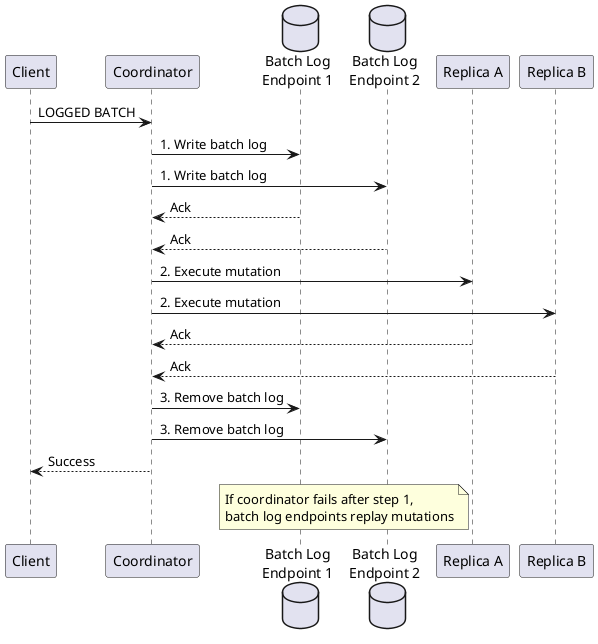
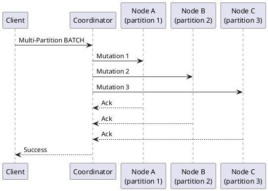
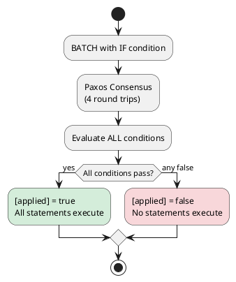

# BATCH

The BATCH statement groups multiple INSERT, UPDATE, and DELETE statements into a single atomic operation. Batches ensure that all statements either complete or none do, providing atomicity guarantees. However, batches are frequently misused as a performance optimization—they are not.

---

## Behavioral Guarantees

### What BATCH Guarantees

- All statements in a logged batch eventually execute or none execute
- Statements to the same partition are atomic at the storage layer
- Logged batches write to batch log before executing mutations
- USING TIMESTAMP applies the same timestamp to all statements
- If any IF condition fails, no statements in the batch execute

### What BATCH Does NOT Guarantee

!!! warning "Undefined Behavior"
    The following behaviors are undefined and must not be relied upon:

    - **Isolation**: Other reads may see partial batch results before completion
    - **Performance improvement**: Batches do not improve throughput over parallel writes
    - **Cross-datacenter atomicity**: Logged batches provide atomicity within a datacenter, not globally
    - **Unlogged batch atomicity**: UNLOGGED batches have no atomicity guarantee on coordinator failure
    - **Order of execution**: Statements within a batch may execute in any order

### Logged vs Unlogged Contracts

| Aspect | Logged Batch | Unlogged Batch |
|--------|--------------|----------------|
| Coordinator failure | Recovers via batch log | Undefined - partial execution possible |
| Multi-partition | Atomic (via batch log) | Not atomic |
| Same-partition | Atomic | Atomic (storage layer) |
| Performance | Higher latency (batch log overhead) | Lower latency |

### Failure Semantics

| Failure Mode | Logged Batch | Unlogged Batch |
|--------------|--------------|----------------|
| Coordinator fails after batch log write | Batch log replays mutations | Partial execution possible |
| Coordinator fails before batch log write | Not applied | Not applied |
| `WriteTimeoutException` | May have been logged for replay | Undefined |
| `UnavailableException` | Not applied | Not applied |

### Version-Specific Behavior

| Version | Behavior |
|---------|----------|
| 1.2+ | Basic BATCH support |
| 2.0+ | UNLOGGED BATCH, improved batch log (CASSANDRA-4542) |
| 2.1+ | COUNTER BATCH separated from regular batches |
| 3.0+ | Improved batch log performance (CASSANDRA-9673) |
| 4.0+ | Enhanced multi-partition batch handling |

---

## Overview

### What BATCH Is For

BATCH provides **atomicity**, not performance:

| Use Case | Example | Result |
|----------|---------|--------|
| **Correct: Atomicity** | `INSERT INTO users ...`<br>`INSERT INTO users_by_email ...` | Both succeed or both fail ✓ |
| **Wrong: 'Performance'** | `INSERT INTO table_a ...`<br>`INSERT INTO table_b ...`<br>`INSERT INTO table_c ...` | Slower than individual inserts! ✗ |

### Historical Context

BATCH was introduced in CQL 3.0 (Cassandra 1.2) to address the problem of maintaining consistency across denormalized tables:

| Version | Feature |
|---------|---------|
| 1.2 | Basic BATCH with atomicity |
| 2.0 | UNLOGGED BATCH, batch log improvements |
| 2.1 | COUNTER BATCH separated |
| 3.0 | Improved batch log efficiency |
| 4.0 | Better multi-partition batch handling |

---

## Synopsis

```cqlsyntax
BEGIN [ UNLOGGED | COUNTER ] BATCH
    [ USING TIMESTAMP *microseconds* ]
    *dml_statement* ;
    [ *dml_statement* ; ... ]
APPLY BATCH
```

**dml_statement:**

```cqlsyntax
INSERT ... | UPDATE ... | DELETE ...
```

---

## Batch Types

### Logged Batch (Default)

```sql
BEGIN BATCH
    INSERT INTO users (user_id, username) VALUES (?, 'alice');
    INSERT INTO usernames (username, user_id) VALUES ('alice', ?);
APPLY BATCH;
```

**Execution:**



### Batch Log Architecture

The batch log ensures durability by writing to multiple nodes **before** executing mutations:

1. **Coordinator selects batch log endpoints**: Two nodes in the local datacenter (chosen to minimize latency)
2. **Batch log written**: The serialized batch is written to each endpoint's local batch log table
3. **Mutations executed**: After batch log is durable, mutations are sent to replicas
4. **Batch log removed**: After all mutations acknowledged, batch log entries are deleted

!!! note "Batch Log Storage"
    The batch log uses `LocalStrategy` (RF=1), meaning each node stores only its own batch log entries. Durability comes from writing to **multiple endpoints**, not from replication.

### Batch Log Table Versions

The batch log implementation has evolved across Cassandra versions:

| Version | Table | Key Changes |
|---------|-------|-------------|
| < 2.2 | `system.batchlog` | Original implementation |
| 2.2+ | `system.batches` | New table format, improved performance |
| 3.0+ | `system.batches` | Batch log replay improvements |
| 4.0+ | `system.batches` | Enhanced timeout handling |

```sql
-- View pending batches (should normally be empty)
SELECT * FROM system.batches;

-- Columns vary by version, but typically include:
-- id (timeuuid), version (int), written_at (timestamp), data (blob)
```

### Batch Log Replay

Batch log entries are replayed automatically:

- Each node periodically scans its local batch log
- Entries older than `batchlog_replay_throttle` are candidates for replay
- Mutations are re-executed to ensure completion
- Successfully replayed entries are removed

```yaml
# cassandra.yaml
batchlog_replay_throttle_in_kb: 1024  # Throttle replay bandwidth
```

**Guarantees:**

- All statements eventually execute or none do
- Coordinator failure doesn't lose the batch (batch log on other nodes)
- Batch log written to 2 endpoints for redundancy

**Cost:**

- Additional writes to 2 batch log endpoints
- Higher latency than unlogged (must wait for batch log durability)
- Increased coordinator memory usage

### Unlogged Batch

```sql
BEGIN UNLOGGED BATCH
    UPDATE user_profile SET name = 'Alice' WHERE user_id = ?;
    UPDATE user_profile SET email = 'alice@new.com' WHERE user_id = ?;
    UPDATE user_profile SET updated_at = toTimestamp(now()) WHERE user_id = ?;
APPLY BATCH;
```

**Execution:**

- No batch log write
- Statements sent directly to replicas
- No recovery if coordinator fails

**Use when:**

- All statements target the same partition
- Atomicity across coordinator failure not required
- Lower latency needed

### Counter Batch

```sql
BEGIN COUNTER BATCH
    UPDATE page_stats SET views = views + 1 WHERE page_id = 'home';
    UPDATE page_stats SET views = views + 1 WHERE page_id = 'about';
    UPDATE daily_stats SET requests = requests + 2 WHERE date = '2024-01-15';
APPLY BATCH;
```

**Restrictions:**

- Can only contain counter updates
- Cannot mix counter and non-counter statements
- No TTL allowed

---

## Parameters

### USING TIMESTAMP

Applies a single timestamp to all statements:

```sql
BEGIN BATCH USING TIMESTAMP 1705315800000000
    INSERT INTO table1 (id, data) VALUES (1, 'a');
    INSERT INTO table2 (id, data) VALUES (2, 'b');
APPLY BATCH;
```

**Behavior:**

- All mutations share the same timestamp
- Individual statements cannot override
- Cannot be used with LWT (IF conditions)

---

## Same-Partition vs Multi-Partition Batches

### Same-Partition Batch (Recommended)

All statements target the same partition:

```sql
-- Good: Single partition batch
BEGIN UNLOGGED BATCH
    INSERT INTO user_events (user_id, event_id, type) VALUES (123, uuid(), 'login');
    INSERT INTO user_events (user_id, event_id, type) VALUES (123, uuid(), 'page_view');
    INSERT INTO user_events (user_id, event_id, type) VALUES (123, uuid(), 'click');
APPLY BATCH;
```

**Benefits:**

- Single coordinator to single replica set
- Atomic at storage layer (same SSTable)
- Minimal coordination overhead

### Multi-Partition Batch (Use Carefully)

Statements target different partitions:

```sql
-- Acceptable: Denormalized tables that must stay consistent
BEGIN BATCH
    INSERT INTO users (user_id, email) VALUES (?, 'alice@example.com');
    INSERT INTO users_by_email (email, user_id) VALUES ('alice@example.com', ?);
APPLY BATCH;
```



**Costs:**

- Coordinator must contact multiple nodes
- Batch log adds latency
- Memory pressure on coordinator

---

## Batch Anti-Patterns

### Anti-Pattern 1: Batching for Performance

```sql
-- WRONG: Batching unrelated writes doesn't improve performance
BEGIN BATCH
    INSERT INTO users (user_id, name) VALUES (1, 'Alice');
    INSERT INTO users (user_id, name) VALUES (2, 'Bob');
    INSERT INTO users (user_id, name) VALUES (3, 'Charlie');
    -- ... 100 more unrelated inserts
APPLY BATCH;
```

**Why it's slow:**

- Coordinator must track all mutations in memory
- Single point of coordination
- Larger network payload than parallel requests

**Better approach:**

```java
// Parallel async inserts
List<CompletionStage<AsyncResultSet>> futures = new ArrayList<>();
for (User user : users) {
    futures.add(session.executeAsync(insertStmt.bind(user)));
}
CompletableFuture.allOf(futures.toArray()).join();
```

### Anti-Pattern 2: Large Batches

```sql
-- WRONG: Batch too large
BEGIN BATCH
    -- 1000 INSERT statements
APPLY BATCH;
```

**Problems:**

- Exceeds batch size thresholds
- Coordinator memory exhaustion
- Timeout likelihood increases

**Thresholds (cassandra.yaml):**

```yaml
batch_size_warn_threshold_in_kb: 5
batch_size_fail_threshold_in_kb: 50
```

### Anti-Pattern 3: Batching Different Tables Without Need

```sql
-- WRONG: No atomicity requirement
BEGIN BATCH
    INSERT INTO audit_log (id, action) VALUES (uuid(), 'user_created');
    INSERT INTO metrics (id, count) VALUES ('users', 1);
    INSERT INTO notifications (id, message) VALUES (uuid(), 'Welcome!');
APPLY BATCH;
```

**Better approach:**

Execute independently—if one fails, others can still succeed.

---

## Conditional Batches (LWT)

Batches can include lightweight transaction conditions:

```sql
BEGIN BATCH
    INSERT INTO users (user_id, username) VALUES (?, 'alice') IF NOT EXISTS;
    INSERT INTO usernames (username, user_id) VALUES ('alice', ?) IF NOT EXISTS;
APPLY BATCH;
```

### LWT Batch Behavior

**Important:** When ANY statement has an IF condition, ALL statements use Paxos:



**Key points:**

- Entire batch is all-or-nothing
- One failed condition aborts all statements
- Significant performance impact

### Restrictions

- Cannot mix conditional and unconditional statements
- All conditions must be on same partition
- Cannot use USING TIMESTAMP with IF

---

## Batch Size Limits

### Configuration

```yaml
# cassandra.yaml
batch_size_warn_threshold_in_kb: 5     # Log warning
batch_size_fail_threshold_in_kb: 50    # Reject batch
```

### Monitoring

```bash
# Check for batch size warnings
grep "Batch" /var/log/cassandra/system.log

# Metrics
nodetool tablestats system.batches
```

### Calculating Batch Size

Approximate formula:
```
batch_size ≈ sum(mutation_sizes) + overhead
mutation_size ≈ key_size + sum(column_sizes) + metadata
```

---

## Best Practices

### Do Use Batches For

!!! tip "Good Batch Use Cases"
    1. **Denormalized table consistency**: Keep related tables in sync
    2. **Same-partition atomicity**: Multiple writes to one partition
    3. **Conditional group operations**: LWT across related rows

### Don't Use Batches For

!!! warning "Batch Anti-Patterns"
    1. **Performance optimization**: Use async parallel writes instead
    2. **Large bulk loads**: Use SSTable loader or async writes
    3. **Unrelated writes**: No atomicity needed
    4. **Cross-datacenter atomicity**: Batches don't provide this

### Sizing Guidelines

| Batch Type | Recommended Size |
|------------|------------------|
| Same-partition | Up to 100 statements |
| Multi-partition | 2-5 partitions |
| With LWT | 2-3 statements |

### Monitoring

```sql
-- Check batch log table
SELECT * FROM system.batches;

-- Should typically be empty (batches complete quickly)
```

---

## Restrictions

!!! danger "Restrictions"
    **Statement Types:**

    - Only INSERT, UPDATE, DELETE allowed
    - Cannot include SELECT statements
    - Cannot include DDL statements

    **Counter Batches:**

    - Must use COUNTER keyword
    - Cannot mix counter and non-counter statements
    - No TTL allowed
    - No IF conditions allowed

    **Conditional Batches:**

    - All IF conditions must be on same partition
    - Cannot use USING TIMESTAMP
    - Cannot mix conditional and unconditional statements

    **General:**

    - Maximum batch size enforced by configuration
    - Batch log adds overhead to logged batches
    - Multi-partition batches not atomic if using UNLOGGED

---

## Examples

### Denormalized Table Insert

```sql
-- Maintain consistency between users and users_by_email
BEGIN BATCH
    INSERT INTO users (user_id, email, username, created_at)
    VALUES (?, 'alice@example.com', 'alice', toTimestamp(now()));

    INSERT INTO users_by_email (email, user_id, username)
    VALUES ('alice@example.com', ?, 'alice');
APPLY BATCH;
```

### Same-Partition Event Logging

```sql
BEGIN UNLOGGED BATCH
    INSERT INTO user_events (user_id, event_time, event_type, data)
    VALUES (123, toTimestamp(now()), 'login', '{"ip": "192.168.1.1"}');

    UPDATE user_stats SET login_count = login_count + 1
    WHERE user_id = 123;
APPLY BATCH;
```

### Conditional User Registration

```sql
BEGIN BATCH
    INSERT INTO users (user_id, username, email)
    VALUES (?, 'desired_username', 'user@example.com')
    IF NOT EXISTS;

    INSERT INTO usernames (username, user_id)
    VALUES ('desired_username', ?)
    IF NOT EXISTS;
APPLY BATCH;
```

### Counter Aggregation

```sql
BEGIN COUNTER BATCH
    UPDATE daily_metrics SET page_views = page_views + 1
    WHERE date = '2024-01-15' AND page = 'home';

    UPDATE daily_metrics SET page_views = page_views + 1
    WHERE date = '2024-01-15' AND page = 'about';

    UPDATE total_metrics SET total_views = total_views + 2
    WHERE metric_id = 'all_time';
APPLY BATCH;
```

### Batch with Timestamp

```sql
BEGIN BATCH USING TIMESTAMP 1705315800000000
    INSERT INTO events (event_id, type) VALUES (uuid(), 'imported');
    INSERT INTO audit_log (log_id, action) VALUES (uuid(), 'data_import');
APPLY BATCH;
```

---

## Related Documentation

- **[INSERT](insert.md)** - Single row inserts
- **[UPDATE](update.md)** - Single row updates
- **[DELETE](delete.md)** - Single row deletes
- **[Lightweight Transactions](lightweight-transactions.md)** - Conditional batch details
