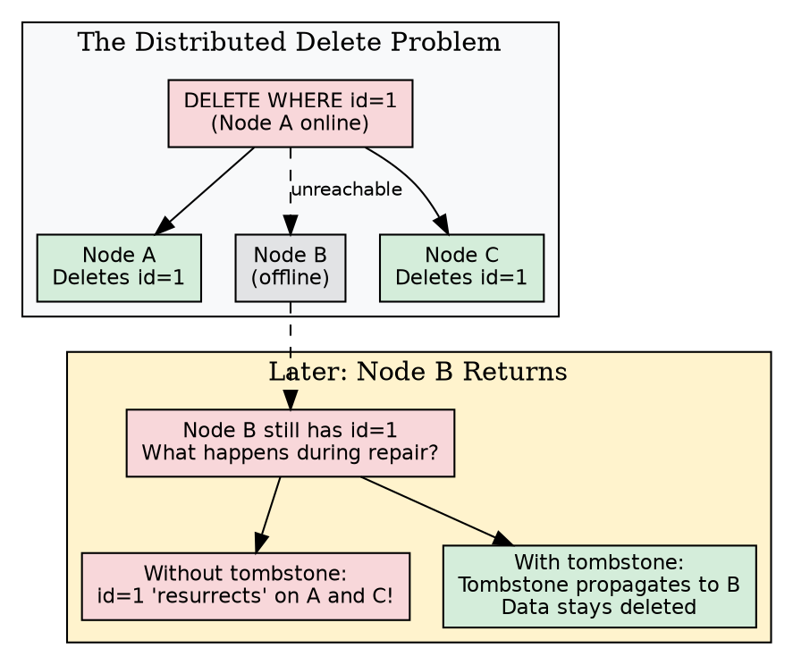
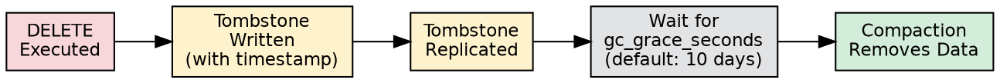
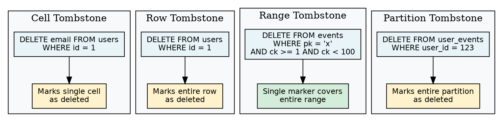
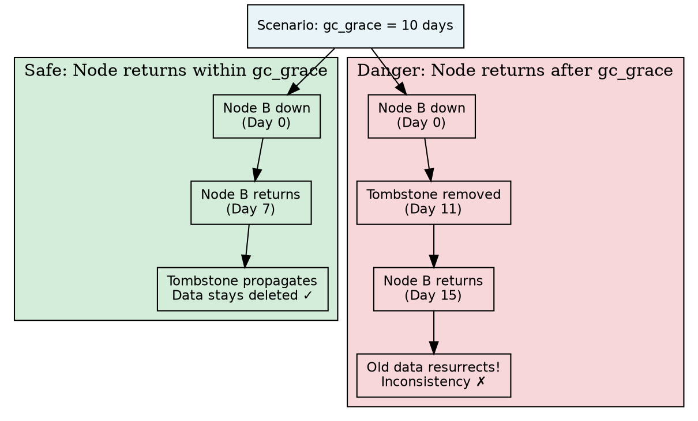
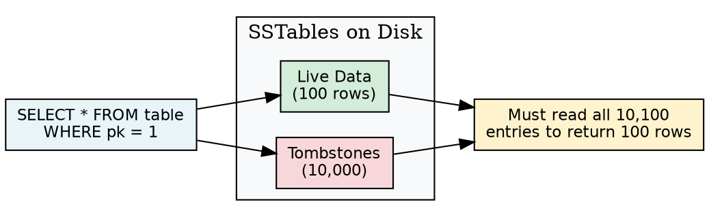

# DELETE

The DELETE statement removes rows or column values from Cassandra tables. Unlike traditional databases that immediately remove data, Cassandra writes **tombstones**—markers indicating data has been deleted. Understanding tombstones is essential for maintaining cluster performance.

---

## Overview

### Why Cassandra Uses Tombstones

In a distributed system without central coordination, immediate deletion is impossible:



**Tombstones solve:**

1. **Resurrection prevention**: Deleted data doesn't reappear when offline nodes return
2. **Consistency during repair**: Tombstones propagate like regular data
3. **Timestamp-based resolution**: Tombstone with higher timestamp wins

### Tombstone Lifecycle



---

## Synopsis

```cqlsyntax
DELETE [ *column_name* [ , *column_name* ... ] ]
    FROM [ *keyspace_name*. ] *table_name*
    [ USING TIMESTAMP *microseconds* ]
    WHERE *where_clause*
    [ IF *condition* [ AND *condition* ... ] | IF EXISTS ]
```

**column_name** (optional):

```cqlsyntax
*column_name*
| *column_name* [ *list_index* ]
| *column_name* [ *map_key* ]
```

---

## Parameters

### Column Selection

#### Delete Entire Row

When no columns specified, the entire row is deleted:

```sql
DELETE FROM users WHERE user_id = 123;
```

#### Delete Specific Columns

Target individual columns (creates cell tombstones):

```sql
DELETE email, phone FROM users WHERE user_id = 123;
```

#### Delete List Element

```sql
-- Delete by index
DELETE phone_numbers[0] FROM users WHERE user_id = 123;
DELETE phone_numbers[2] FROM users WHERE user_id = 123;
```

!!! warning "List Index Deletion"
    Deleting by index requires reading the list first. This is a read-before-write operation with potential race conditions.

#### Delete Map Entry

```sql
-- Delete by key
DELETE preferences['deprecated_setting'] FROM users WHERE user_id = 123;
DELETE preferences['old_key'] FROM users WHERE user_id = 123;
```

### USING TIMESTAMP

Specifies the deletion timestamp:

```sql
DELETE FROM users
USING TIMESTAMP 1705315800000000
WHERE user_id = 123;
```

**Timestamp effects:**

- Only data with timestamps ≤ specified timestamp is deleted
- Data written after this timestamp remains visible
- Useful for replaying deletions from external systems

### WHERE Clause

#### Single Row Delete

```sql
DELETE FROM users WHERE user_id = 123;
```

#### Range Delete (within partition)

```sql
DELETE FROM events
WHERE tenant_id = 'acme'
  AND event_time >= '2024-01-01'
  AND event_time < '2024-02-01';
```

#### Multi-Partition Delete

```sql
DELETE FROM users WHERE user_id IN (123, 456, 789);
```

#### Partition Delete (all rows)

```sql
-- Deletes all rows with this partition key
DELETE FROM user_events WHERE user_id = 123;
```

### IF EXISTS / IF Condition

Conditional deletes using lightweight transactions:

```sql
-- Delete only if row exists
DELETE FROM sessions WHERE session_id = ? IF EXISTS;

-- Delete with condition
DELETE FROM users
WHERE user_id = ?
IF status = 'inactive' AND last_login < '2023-01-01';
```

---

## Tombstone Types

Different DELETE operations create different tombstone types:



### Cell Tombstone

```sql
DELETE email FROM users WHERE user_id = 123;
```

- Marks single column value as deleted
- Smallest tombstone type
- Created per-cell

### Row Tombstone

```sql
DELETE FROM users WHERE user_id = 123 AND account_type = 'premium';
```

- Marks entire row (all columns) as deleted
- Single tombstone regardless of column count
- Created when full primary key specified

### Range Tombstone

```sql
DELETE FROM events
WHERE partition_key = 'x'
  AND clustering_col >= 100
  AND clustering_col < 200;
```

- Single marker covers entire range
- Efficient for bulk deletes within partition
- Introduced in Cassandra 3.0+

### Partition Tombstone

```sql
DELETE FROM user_events WHERE user_id = 123;
```

- Deletes all rows in partition
- Single tombstone regardless of row count
- Most efficient for clearing partition

### TTL Tombstone

Created automatically when TTL expires:

```sql
INSERT INTO sessions (id, token) VALUES (1, 'abc') USING TTL 3600;
-- After 3600 seconds, tombstone created automatically
```

---

## gc_grace_seconds

The `gc_grace_seconds` table property controls how long tombstones persist:

```sql
CREATE TABLE events (
    ...
) WITH gc_grace_seconds = 864000;  -- 10 days (default)

ALTER TABLE events WITH gc_grace_seconds = 86400;  -- 1 day
```

### Why gc_grace_seconds Matters



### Configuring gc_grace_seconds

| Scenario | Recommended Value | Requirements |
|----------|-------------------|--------------|
| Default | 864000 (10 days) | Repair within 10 days |
| Fast cleanup | 86400 (1 day) | Repair runs daily |
| Single DC, RF=1 | 0 | No replication needed |
| High availability | 864000+ | Conservative approach |

!!! danger "Reducing gc_grace_seconds"
    Before reducing:

    1. **Ensure repairs run more frequently** than the new value
    2. **No nodes stay down** longer than gc_grace_seconds
    3. **Monitor node health** proactively
    4. **Have alerting** for extended node outages

---

## Tombstone Performance Impact

### Read Performance

Tombstones must be read and filtered during queries:



**Performance implications:**

- All tombstones in query range must be read
- Memory consumed holding tombstones
- Can trigger `TombstoneOverwhelmingException`

### Tombstone Thresholds

Cassandra warns or fails when too many tombstones are encountered:

```yaml
# cassandra.yaml
tombstone_warn_threshold: 1000
tombstone_failure_threshold: 100000
```

```
WARN  - Read 5000 live rows and 50000 tombstone cells for query...
ERROR - Scanned over 100000 tombstones; query aborted
```

### Monitoring Tombstones

```bash
# Table-level tombstone stats
nodetool tablestats keyspace.table

# Per-SSTable tombstone info
nodetool cfstats keyspace.table
```

---

## Tombstone-Heavy Patterns to Avoid

### Pattern 1: Queue-Like Tables

```sql
-- Anti-pattern: Using Cassandra as a queue
CREATE TABLE job_queue (
    queue_id TEXT,
    job_id TIMEUUID,
    payload TEXT,
    PRIMARY KEY (queue_id, job_id)
);

-- Process job, then delete
DELETE FROM job_queue WHERE queue_id = 'main' AND job_id = ?;
```

**Problem:** Accumulates tombstones at high rate

**Solution:** Use TTL instead, or dedicated queue system

### Pattern 2: Sparse Time-Series

```sql
-- Anti-pattern: Deleting old time-series data
DELETE FROM metrics
WHERE sensor_id = 'temp-1'
  AND timestamp < '2024-01-01';
```

**Problem:** Creates massive range tombstone

**Solution:** Use separate tables per time window (e.g., metrics_2024_01)

### Pattern 3: Frequent Column Updates to Null

```sql
-- Anti-pattern: Setting columns to null repeatedly
UPDATE users SET temp_flag = null WHERE user_id = ?;
```

**Problem:** Each null creates tombstone

**Solution:** Use separate table or UNSET instead of null

---

## Best Practices

### Use TTL Instead of DELETE

Let data expire naturally:

```sql
-- Good: Data auto-expires
INSERT INTO sessions (id, token) VALUES (?, ?)
USING TTL 86400;

-- Avoid: Manual cleanup creates tombstones
DELETE FROM sessions WHERE created_at < ?;
```

### Use Range Tombstones

Single range tombstone is more efficient than many row tombstones:

```sql
-- Good: Single range tombstone
DELETE FROM events
WHERE tenant_id = 'acme'
  AND event_date = '2024-01-15';

-- Avoid: Many individual tombstones
-- for row in rows_to_delete:
--     DELETE FROM events WHERE tenant_id = 'acme' AND event_id = row.id;
```

### Partition Per Time Window

Design tables to drop entire partitions:

```sql
-- Table design: partition by day
CREATE TABLE events_by_day (
    tenant_id TEXT,
    event_date DATE,
    event_id TIMEUUID,
    data TEXT,
    PRIMARY KEY ((tenant_id, event_date), event_id)
);

-- Clean deletion: entire partition
DELETE FROM events_by_day
WHERE tenant_id = 'acme' AND event_date = '2024-01-15';
```

### Monitor and Repair

```bash
# Regular repair ensures tombstone propagation
nodetool repair keyspace table

# Check for tombstone warnings
grep -i tombstone /var/log/cassandra/system.log
```

---

## Restrictions

!!! danger "Restrictions"
    **WHERE Clause:**

    - Partition key required
    - Cannot use ALLOW FILTERING
    - Range deletes only on clustering columns

    **Columns:**

    - Cannot delete primary key columns
    - Cannot delete counter columns (use TRUNCATE for counter tables)
    - List index deletion requires read-before-write

    **Conditional Deletes:**

    - IF cannot be used with USING TIMESTAMP
    - IF conditions add Paxos overhead

    **Counter Tables:**

    - DELETE not supported for counter columns
    - Use TRUNCATE to reset counter table

---

## Examples

### Delete User Account

```sql
-- Delete user and all related data (multiple tables)
BEGIN BATCH
    DELETE FROM users WHERE user_id = ?;
    DELETE FROM user_emails WHERE user_id = ?;
    DELETE FROM user_sessions WHERE user_id = ?;
APPLY BATCH;
```

### Archive and Delete Old Events

```sql
-- First: Copy to archive (application code)
-- Then: Delete from active table
DELETE FROM active_events
WHERE tenant_id = 'acme'
  AND event_time < '2024-01-01';
```

### Conditional Session Cleanup

```sql
DELETE FROM sessions
WHERE session_id = ?
IF user_id = ?;  -- Verify ownership before delete
```

### Remove Map Entry

```sql
DELETE preferences['deprecated_feature'] FROM user_settings
WHERE user_id = ?;
```

### Clean Expired Data Partition

```sql
-- If table is partitioned by month
DELETE FROM metrics_2024_01
WHERE sensor_id = 'temp-001';
```

---

## Related Documentation

- **[INSERT](insert.md)** - TTL as alternative to DELETE
- **[UPDATE](update.md)** - Null assignments create tombstones
- **[BATCH](batch.md)** - Atomic multi-table deletes
- **[Table Options](../ddl/table.md)** - gc_grace_seconds configuration
