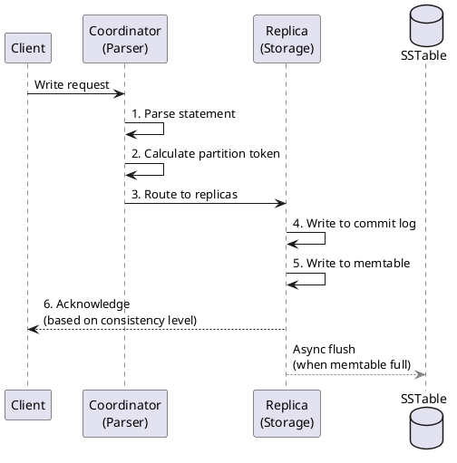
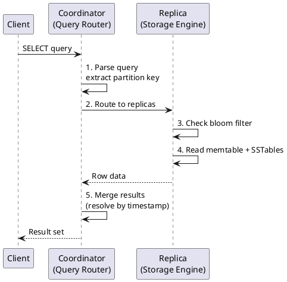
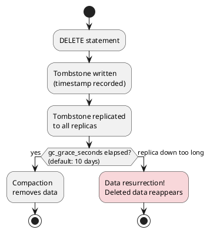

# Data Manipulation Language (DML)

Data Manipulation Language (DML) commands retrieve and modify data in Cassandra tables. Unlike traditional SQL databases, Cassandra's DML operations are designed for distributed, eventually consistent storage with specific semantics around timestamps, tombstones, and partition-aware queries.

---

## Overview

### DML in Cassandra vs SQL

Cassandra's DML differs fundamentally from SQL databases:

| Aspect | SQL Databases | Cassandra |
|--------|---------------|-----------|
| INSERT semantics | Fails if row exists | Upsert (insert or update) |
| UPDATE semantics | Fails if row doesn't exist | Upsert (insert or update) |
| DELETE behavior | Immediate removal | Tombstone marker |
| Query flexibility | Any column in WHERE | Partition key required |
| Consistency | ACID transactions | Tunable consistency |
| Conflict resolution | Locks | Last-write-wins (timestamp) |

### Historical Context

CQL (Cassandra Query Language) was introduced in Cassandra 0.8 (2011) as a SQL-like interface to replace the Thrift API. The language evolved significantly:

| Version | CQL Version | Key DML Features |
|---------|-------------|------------------|
| 0.8 | CQL 1.0 | Basic SELECT, INSERT, UPDATE, DELETE |
| 1.2 | CQL 3.0 | Compound primary keys, collections, prepared statements |
| 2.0 | CQL 3.1 | Lightweight transactions (IF NOT EXISTS/IF condition) |
| 2.1 | CQL 3.2 | User-defined functions, JSON support |
| 2.2 | CQL 3.3 | User-defined aggregates, GROUP BY |
| 3.0 | CQL 3.4 | Materialized views, SASI indexes |
| 4.0 | CQL 3.4.5 | Virtual tables, audit logging |
| 5.0 | CQL 3.4.7 | SAI indexes, vector search |

---

## Write Path Architecture

Understanding how writes flow through Cassandra is essential for effective DML usage.



### Write Path Steps

1. **Client sends request** to any node (coordinator)
2. **Coordinator parses** the CQL statement
3. **Partition key hashed** to determine token and replica nodes
4. **Request forwarded** to replica nodes based on replication factor
5. **Each replica writes** to commit log (durability) then memtable (speed)
6. **Coordinator waits** for acknowledgments based on consistency level
7. **Response returned** when sufficient replicas acknowledge

### Write Timestamps

Every write in Cassandra carries a timestamp (microseconds since Unix epoch):

```sql
-- Cassandra assigns current time if not specified
INSERT INTO users (id, name) VALUES (1, 'Alice');

-- Explicit timestamp
INSERT INTO users (id, name) VALUES (1, 'Alice')
USING TIMESTAMP 1705315800000000;
```

Timestamps serve critical functions:

- **Conflict resolution**: Higher timestamp wins (last-write-wins)
- **Tombstone expiration**: Determines when deleted data can be purged
- **Read repair**: Identifies which value is most recent

!!! warning "Clock Synchronization"
    Cassandra relies on synchronized clocks across nodes. Use NTP to keep clocks synchronized within milliseconds. Clock skew can cause:

    - Unexpected conflict resolution results
    - Data appearing to "come back" after deletion
    - Inconsistent reads

---

## Read Path Architecture

Reads in Cassandra follow a different path optimized for distributed data retrieval.



### Read Path Steps

1. **Client sends query** to coordinator
2. **Coordinator extracts partition key** and calculates token
3. **Request sent** to replicas based on consistency level
4. **Each replica checks**:
   - Bloom filter (may contain partition?)
   - Partition key cache
   - Memtable (in-memory recent writes)
   - SSTables (on-disk, newest to oldest)
5. **Coordinator merges** results, resolving conflicts by timestamp
6. **Optional read repair** if inconsistencies detected

### Partition Key Requirement

Cassandra requires the partition key in most queries because it determines which nodes hold the data:

```sql
-- Efficient: partition key specified
SELECT * FROM users WHERE user_id = 123;

-- Inefficient: full cluster scan
SELECT * FROM users WHERE name = 'Alice' ALLOW FILTERING;
```

!!! danger "ALLOW FILTERING"
    The `ALLOW FILTERING` clause forces Cassandra to scan all partitions. This operation:

    - Contacts every node in the cluster
    - Does not scale with cluster size
    - Can cause timeouts on large tables
    - Should never be used in production application queries

---

## Consistency Levels

Consistency levels control how many replicas must respond before a query succeeds.

### Write Consistency Levels

| Level | Replicas Required | Use Case |
|-------|-------------------|----------|
| `ANY` | 1 (including hints) | Maximum availability, risk of data loss |
| `ONE` | 1 | Low latency, eventual consistency |
| `TWO` | 2 | Slightly stronger consistency |
| `THREE` | 3 | Stronger consistency |
| `QUORUM` | (RF/2) + 1 | Balance of consistency and availability |
| `LOCAL_QUORUM` | Quorum in local DC | Multi-DC with local consistency |
| `EACH_QUORUM` | Quorum in each DC | Strong multi-DC consistency |
| `ALL` | All replicas | Maximum consistency, lowest availability |

### Read Consistency Levels

| Level | Replicas Contacted | Use Case |
|-------|-------------------|----------|
| `ONE` | 1 | Low latency reads |
| `TWO` | 2 | Slightly stronger consistency |
| `THREE` | 3 | Stronger consistency |
| `QUORUM` | (RF/2) + 1 | Strong consistency |
| `LOCAL_QUORUM` | Quorum in local DC | Multi-DC with local reads |
| `EACH_QUORUM` | Quorum in each DC | Not typically used for reads |
| `ALL` | All replicas | Maximum consistency |
| `LOCAL_ONE` | 1 in local DC | Low latency local reads |
| `SERIAL` | Paxos quorum | Linearizable reads (LWT) |
| `LOCAL_SERIAL` | Local Paxos quorum | Local linearizable reads |

### Strong Consistency Formula

To achieve strong consistency (read-your-writes):

```
READ_CL + WRITE_CL > REPLICATION_FACTOR
```

Common patterns:

| Write CL | Read CL | RF=3 | Guarantee |
|----------|---------|------|-----------|
| QUORUM | QUORUM | ✓ | 2 + 2 > 3 |
| ONE | ALL | ✓ | 1 + 3 > 3 |
| ALL | ONE | ✓ | 3 + 1 > 3 |
| ONE | ONE | ✗ | 1 + 1 ≤ 3 |

---

## Tombstones and Deletion

Cassandra does not immediately delete data. Instead, it writes tombstones—markers indicating data should be considered deleted.



### Why Tombstones Exist

In a distributed system without central coordination:

1. **No global delete propagation**: DELETE cannot contact offline nodes
2. **Prevents resurrection**: Tombstones override older data when replicas sync
3. **Eventually consistent**: All replicas eventually see the deletion

### Tombstone Types

| Type | Created By | Scope |
|------|------------|-------|
| Cell tombstone | `DELETE column FROM table` | Single column value |
| Row tombstone | `DELETE FROM table WHERE pk = x` | Entire row |
| Range tombstone | `DELETE FROM table WHERE pk = x AND ck > y` | Range of clustering keys |
| Partition tombstone | `DELETE FROM table WHERE pk = x` (all rows) | Entire partition |
| TTL tombstone | Automatic when TTL expires | Column or row |

### gc_grace_seconds

The `gc_grace_seconds` table property (default: 864000 = 10 days) determines how long tombstones persist before compaction can remove them:

```sql
CREATE TABLE events (
    ...
) WITH gc_grace_seconds = 86400;  -- 1 day
```

!!! danger "Reducing gc_grace_seconds"
    Before reducing `gc_grace_seconds`:

    1. Ensure repairs run more frequently than the new value
    2. Verify no nodes stay down longer than the new value
    3. Understand that nodes down longer than gc_grace_seconds may resurrect deleted data

---

## DML Statement Categories

| Statement | Purpose | Documentation |
|-----------|---------|---------------|
| [SELECT](select.md) | Retrieve rows and columns | Query syntax, filtering, paging |
| [INSERT](insert.md) | Add or replace rows | Upsert semantics, TTL, JSON |
| [UPDATE](update.md) | Modify column values | Collection operations, counters |
| [DELETE](delete.md) | Remove rows or columns | Tombstones, range deletes |
| [BATCH](batch.md) | Atomic multi-statement operations | Logged vs unlogged, anti-patterns |
| [Secondary Index Queries](secondary-index-queries.md) | Query non-primary-key columns | Index types, performance, anti-patterns |
| [Vector Search](vector-search.md) | Similarity search on embeddings | ANN queries, similarity functions |
| [Lightweight Transactions](lightweight-transactions.md) | Compare-and-set operations | Paxos, serial consistency |

---

## Best Practices

### Write Optimization

!!! tip "Write Best Practices"
    1. **Batch by partition**: Group writes to the same partition for efficiency
    2. **Avoid large batches**: Keep batches under 5KB (warn threshold)
    3. **Use UNSET for nulls**: Avoid creating tombstones with null values
    4. **Prepare statements**: Reuse prepared statements for repeated queries
    5. **Appropriate TTL**: Set TTL at write time, not retroactively

### Read Optimization

!!! tip "Read Best Practices"
    1. **Include partition key**: Every query should specify partition key
    2. **Avoid ALLOW FILTERING**: Design data model for query patterns
    3. **Use token-aware drivers**: Route queries directly to replicas
    4. **Limit result sets**: Use LIMIT and paging for large results
    5. **Consider LOCAL_* consistency**: For multi-DC deployments

### Delete Considerations

!!! warning "Delete Best Practices"
    1. **Minimize deletes**: Design data model to avoid frequent deletes
    2. **Use TTL instead**: Let data expire naturally when possible
    3. **Range deletes**: More efficient than many row deletes
    4. **Monitor tombstones**: Use `nodetool tablestats` to track tombstone counts
    5. **Regular repairs**: Ensure tombstones propagate before gc_grace expires

---

## Related Documentation

- **[DDL Commands](../ddl/index.md)** - Schema management
- **[Data Types](../data-types/index.md)** - CQL type reference
- **[Functions](../functions/index.md)** - Built-in and user-defined functions
- **[Data Modeling](../../data-modeling/index.md)** - Query-driven design patterns
